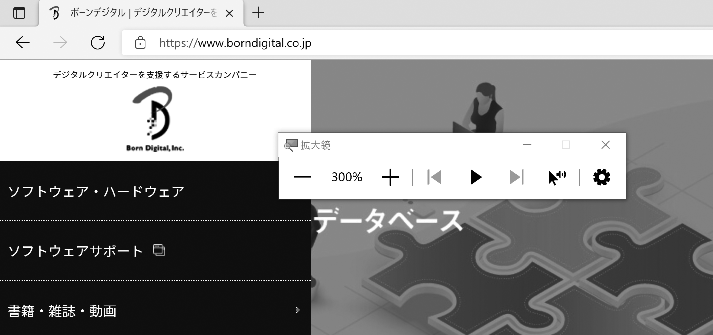

# ウェブアクセシビリティの基礎

HTML4の仕様で大きくクローズアップされた概念がアクセシビリティであり、これは現在のHTMLにも受け継がれています。ここでは、ウェブアクセシビリティの基礎について説明します。

## アクセシビリティとは

「アクセシビリティ(accessibility)」とは、アクセス可能な度合い、アクセスのしやすさを指す言葉です。より多くの人がアクセスできる状態を「アクセシブル(accessible)」であるといいます。たとえば、「車椅子のユーザーにとって、階段はアクセシブルではない」となります。

ウェブにおいては、障害の有無などにかかわらず誰もが利用できることを指します。これはウェブの大きな理念の1つです。2012年のロンドンオリンピックの開会式にはバーナーズ=リーが登場し、「This is For Everyone」というメッセージを掲げました。またバーナーズ=リーは、以下のような言葉も述べています。

>The power of the Web is in its universality. Access by everyone regardless of disability is an essential aspect.
>ウェブの力はその普遍性にあります。障害の有無にかかわらず誰もがアクセスできるというのがウェブの本質的な側面なのです。

これはアクセシビリティの理念そのものであり、ウェブは常にアクセシビリティの理念とともにあるといえます。

## さまざまな支援技術

ウェブがアクセシブルである理由の1つに、ユーザーエージェントの存在があります。ユーザーエージェントの設定を変更すると、表示される文字の大きさや色合いなどが簡単に変更できます。障害のあるユーザーでも、自分にあった受け取り方にできるのです。

ユーザーエージェントの設定だけで対応できない場合、支援技術を利用できます。支援技術についてはCHAPTER 1-2でも簡単に触れましたが、ここでもあらためていくつか紹介します。

なお、支援技術はユーザーの状態にあわせてカスタマイズされることも多く、ときには専用のハードウェアが作られることもあります。ソフトウェアだけでなく、カスタマイズされたハードウェアの数だけ支援技術があると考えてよいでしょう。

### 画面拡大ソフト

「画面拡大ソフト(screen magnifier)」は、画面や文字を拡大して表示するソフトウェアで、「拡大ツール」と呼ばれることもあります[01]。主に*ロービジョン*[^1]のユーザーが利用しますが、そうでないユーザーにも利用されます。特に、スマートフォンやタブレットではピンチ操作で簡単に画面を拡大できることが多く、多数のユーザーが日常的に利用しています。

[^1]: WORD: ロービジョン
弱視とも呼ばれ、見えにくさにより、生活に不自由を感じている状態をいう。WHOでは眼鏡などを用いても視力が0.05以上、0.3未満と定義される。

[01]画面拡大ソフトの例

近年では、*ほとんどのOSやブラウザーが拡大機能を標準で持っています*が、ロービジョンのユーザーには拡大率が不足する場合もあります。その場合、さらに拡大するために専用のソフトウェアを導入することがあります。

画面拡大ソフトの多くは、色を変更する機能も備えています。ロービジョンのユーザーには白背景に黒文字の画面が見づらいと感じる人も多く、この機能で画面を白黒反転して利用することがあります。

### スクリーンリーダー

「スクリーンリーダー(screen reader)」は、画面上のテキストを音声で読み上げるソフトウェアで、主に視覚障害のあるユーザーが利用します。音声だけでなく、点字ディスプレイへの出力ができるものもあります。

PCのソフトウェアとしては、PC-Talker、JAWS、NVDAなどがよく利用されます。また、スマートフォンではiOSのVoiceOver、AndroidのTalkBackが利用できます[^2]。

[^2]: 日本におけるスクリーンリーダーの利用率は、JBICTによる2021年の調査が参考になります。
<https://jbict.net/survey/at-survey-01>

*スクリーンリーダーはブラウザーに限らず、OSやアプリケーションの画面全般を音声で読み上げます。*ウェブを利用する場合は一般的なブラウザーと組み合わせて使用し、ブラウザーが表示したコンテンツを読み上げます。

スクリーンリーダーには、ユーザーの操作を補助する機能もあります。たとえば、見出しやリスト、リンクに飛ぶといったナビゲーション操作が可能です。

### 代替ポインティングデバイス

「代替ポインティングデバイス(alternative pointing devices)」[^3]は、マウスポインターの操作を他の操作で代替するもので、主に肢体不自由のユーザーが利用します。ポインターの移動、クリック、ドラッグといった操作ができ、ポインターを精密に動かす機能を持つこともあります。

[^3]: 代替ポインティングデバイスは、代替マウスと呼ばれることもあります。

キーボードを利用してマウスを動かすものは*「マウスキー」*とも呼ばれます。*多くのOSはマウスキーの機能を持ち*、キーボードのテンキーや、その他の任意のキーでマウスポインターを操作できます。

スティックや視線入力などの専用ハードウェアもあります。また、単一のボタンだけで操作する方法もあります。たとえばiOSには「スイッチコントロール」という機能があり、これを利用すると、すべての操作を単一のタップ操作だけで行えるようになります。

## アクセシビリティの問題が起きるケース

HTMLは本質的にアクセシブルなものです。それは、ユーザーエージェントがコンテンツを読み取り、個々のユーザーにとって使いやすい形にカスタマイズできるからです。しかし、HTMLの書き方によっては、ユーザーエージェントがコンテンツを適切に処理できず、アクセシビリティの問題が起きることがあります。

### テキスト情報が不足しているケース

スクリーンリーダーでは、画像の内容を音声で読み上げることは困難で
す。画像認識技術で解析する方法もありますが[^4]、現状ではまだ精度が高いとはいえません。つまり、*画像はマシンリーダブルではないのです。*

[^4]: たとえば、Facebookには自動代替テキストの機能があります。
<https://ja-jp.facebook.com/help/216219865403298>

そこでHTML仕様では、画像に対して*「代替テキスト(alternativetext)」*と呼ばれるテキスト情報を与える仕組みを用意しています。代替テキストはマシンリーダブルであり、スクリーンリーダーは画像の代わりに代替テキストを読み上げることができます。

逆に、代替テキストが用意されていなければ、スクリーンリーダーは画
像の内容を適切に伝えることができなくなってしまいます。

### HTMLの要素を本来と異なる意味で使用するケース

HTMLの要素を本来と異なる意味で用いると、ユーザーには不適切な意
味が伝わり混乱します。以下はそのような例です。

- 文字を大きくするために見出しの要素を使う
- 単なる字下げのために引用の要素を使う
- レイアウトを調整するために表の要素を使う

この場合、支援技術は、これらの要素が見た目のために利用されていると判断できず、それぞれを見出し、引用、表として扱ってしまいます。

### 特定の環境で操作が困難になるケース

HTMLのマークアップが適切で、ユーザーエージェントに理解できても、現実的な理由からアクセスが難しくなる場合があります。

たとえば、本文の前に大量のテキストがあると、スクリーンリーダーのユーザーは本文を読み始めるまで時間がかかります。同様に、本文の前に大量のリンクがあると、キーボード操作を行うユーザーは、Tabキーを何度も押さなければ本文内のリンクにたどり着けません。

別の例として、画面の激しい点滅があります。人によっては、激しい点
滅を見ると気分が悪くなり、操作を継続できなくなることがあります。このようなケースもアクセシビリティの問題といえます。

## アクセシビリティガイドライン

ウェブは本来アクセシブルなものですが、コンテンツの作り方によってアクセシビリティの問題が起きることがあります。そこで、HTML仕様とは別に、アクセシビリティガイドラインが標準化されています。

### WCAG 1.0

1997年、W3Cの内部組織として、ウェブアクセシビリティを推進する*「Web Accessibility Initiative(WAI)」*[^5]が発足しました。

[^5]: WAIは「ワイ」や「ウェイ」などと発音します。英語圏でも発音は一定ではないようです。
<https://www.w3.org/WAI/>

WAI は、ウェブコンテンツで起きるアクセシビリティの問題をまとめ、その問題に対応するためのガイドラインを*「WebContent Accessibility Guidelines(WCAG)」*として発行しています。1999年、最初のバージョンであるWCAG 1.0がW3C勧告となりました[^6]。

[^6]: WCAG 1.0は、2021年にSuperseded Recommendationのステータスになっており、現在では廃止された扱いになっています。

### WCAG 2.0

2008年に勧告として発行されたWCAG 2.0[^7]は、現在広く普及しているメジャーバージョンです。4つの原則[^8]に分類された12のガイドラインの下に、実際に守るべき要件にあたる「達成基準(success criterion)」が列挙されています。

[^7]: WCAG 2 Overview
<https://www.w3.org/WAI/standards-guidelines/wcag/>

[^8]: WCAG 2.0の4つの原則は以下のとおりです。
1. 知覚可能(Perceivable)
2. 操作可能(Operable)
3. 理解可能(Understandable)
4. 堅牢(robust)

*それぞれの達成基準には3つの適合レベルが設定されており、レベルが低い順にレベルA、レベルAA、レベルAAAとなっています[^9]。*

[^9]: レベルAは最低限のアクセシビリティを確保するために必須のもの、レベルAAは一般的なアクセシビリティの確保に有用なもの、レベルAAAはさらにレベルが高い発展的なものと捉えられています。

WCAG 2.0は、FlashやPDFなどといったHTML以外の技術にも適用できるように、特定の技術に依存しない記述になっています。同時に記述が抽象的になったため、詳しい説明や具体例は別のサポート文書として整備することになりました。そのサポート文書が、Understanding WCAG 2.0とTechniques for WCAG 2.0です。

#### Understanding WCAG 2.0

Understanding WCAG 2.0[^10]は、達成基準の意図や背景について解説しています。また、達成基準を満たすための考え方についても説明されており、文字通りWCAG 2.0を理解するための鍵となる文書です。

[^10]: Understanding WCAG 2.0
<https://www.w3.org/TR/UNDERSTANDING-WCAG20/>

#### Techniques for WCAG 2.0

Techniques for WCAG 2.0[^11]は、達成基準を満たす具体的な方法を紹介しています。HTMLのコード例も示され、実際の実装時の参考として利用できます。ただし、これはあくまで参考情報であり、必ずこの方法を採用しなければならないものではありません。

[^11]: Techniques for WCAG 2.0
<https://www.w3.org/TR/WCAG20-TECHS/>

Techniques for WCAG 2.0のコード例には、古いものも含まれます。現在のHTML仕様では廃止された要素が使われているものや、現在ではより適切な手段が存在するものもあります。

### WCAG 2.0とJIS X 8341-3:2016

日本では、ウェブアクセシビリティの規格としてJIS X 8341-3が存在
します。2016年に改定・発行されたJIS X 8341-3:2016は、WCAG 2.0と技術的に同等な内容です[^12]。

[^12]: JIS X 8341-3の普及を目的とする「ウェブアクセシビリティ基盤委員会 (Web Accessibility Infrastructure
Committee、WAIC)」は、WCAG 2.0と関連文書の日本語訳を公開しています。
ウェブアクセシビリティ基盤委員会
<https://waic.jp/>
WCAG 2.0(日本語訳)
<https://waic.jp/docs/WCAG20/Overview.html>
WCAG 2.0 解説書
<https://waic.jp/docs/UNDERSTANDING-WCAG20/Overview.html>
WCAG 2.0 達成方法集
<https://waic.jp/docs/WCAG-TECHS/Overview.html>

日本の公共サイトでは「JIS X 8341-3:2016のレベルAAに準拠」のような表記がよく見られますが、これは、WCAG 2.0のレベルAAの達成基準をすべて満たすのと同じ意味です。

### WCAG 2.1

WCAG 2.0は広く受け入れられましたが、時間が経つにつれて問題点も浮き彫りになってきました。急速に普及したモバイルデバイスとタッチデバイスへの対応が十分でない点、認知障害や学習障害、ロービジョンのユーザーへの対応が不十分だった点です。

2018年、*前述の問題に対処するマイナーアップデート版となるWCAG 2.1[^13]が勧告となりました。*WCAG 2.0から1つのガイドラインと17の達成基準が追加されていますが、削除された達成基準はありません。そのため、WCAG 2.1の基準を満たすコンテンツを制作すれば、WCAG 2.0の基準も満たすことができます。

[^13]: WCAG 2.1
<https://www.w3.org/TR/WCAG21/>

#### 本書における達成基準の表記

*本書ではWCAGの達成基準について、2021年10月時点での最新の勧告であるWCAG 2.1を参照しています。*ただし、わかりやすさのために、達成基準の名称はウェブアクセシビリティ基盤委員会の日本語訳[^14]を参照しています。

[^14]: 2021年現在、WCAG 2.1はISO規格やJIS規格にはなっていませんが、ウェブアクセシビリティ基盤委員会は参考情報としてWCAG 2.1の日本語訳を公開しています。
WCAG 2.1(日本語訳)
<https://waic.jp/docs/WCAG21/>

### WCAG の今後

WCAGの次のマイナーアップデートとなるWCAG 2.2[^15]の策定作業も
進んでおり、2021年現在、Working Draftになっています。この作業と並行して、メジャーアップデートであるW3C Accessibility Guidelines (WCAG) 3.0[^16]の策定も進められています。

[^15]: WCAG 2.2
<https://www.w3.org/TR/WCAG22/>

[^16]: W3C Accessibility Guidelines (WCAG) 3.0
略称はWCAGのままですが、正式名称はWebがW3Cに変更されています。
<https://www.w3.org/TR/wcag-3.0/>

WCAG 2.0は抽象的で、文章も難解だという批判があります。WCAG 3.0ではこれを受け、平易な内容の記述を目指しています。これが勧告となるまでにはまだ時間がかかると考えられますが、将来的にはWCAG 3.0が段階的に普及し、主流になっていくと筆者は予想しています。

## WAI-ARIA

WAIが発行している文書は、WCAGだけではありません。ウェブアクセシビリティを考慮する上でもう1つの重要なものとして、*WAI-ARIA*[^17]が挙げられます。ARIAは、Accessible Rich Internet Applicationsの略称です。

[^17]: WAI-ARIA Overview
<https://www.w3.org/WAI/standards-guidelines/aria/>

CHAPTER 1-3でも触れたように、ウェブアプリケーションはリッチインターネットアプリケーションへと進化し、動的に変化するユーザーインターフェイスを実現するようになってきました。

これにより、アクセシビリティ上の問題も増えてきました。独自に作られたインターフェイスが支援技術に十分な情報を提供できなかったり、動的なインタラクションがユーザーに伝わらない場合などが多く見られるようになったのです。

WAI-ARIAは、この問題を解決する技術仕様で、*HTMLの要素に対し、支援技術に伝えるべき情報を追加できます。*たとえば、`role`属性を追加して要素の役割の情報を、`aria-`で始まる属性を追加して要素の状態に関する情報を伝えます。

WAI-ARIAも非常に大きな仕様であり、複数の関連文書を伴った構成になっています。WAI-ARIAの詳細はCHAPTER 4-2で説明します。

## コラム: Web サイト側のアクセシビリティ機能
文字の拡大、色合いの変更、音声での読み上げといった機能がウェブサイト側の機能として提供されることもあります。

しかし、これらの機能は、特定のウェブサイトを閲覧する時だけに必要とされるわけではありません。ウェブサイト側の機能としてこれらを提供しても、活用されることは稀です。このような機能の提供はは、本質的なウェブアクセシビリティの向上とはなりません。

このことは「みんなの公共サイト運用ガイドライン(2016年版)」でも言及されています。
<https://www.soumu.go.jp/main_content/000439213.pdf#page=24>
