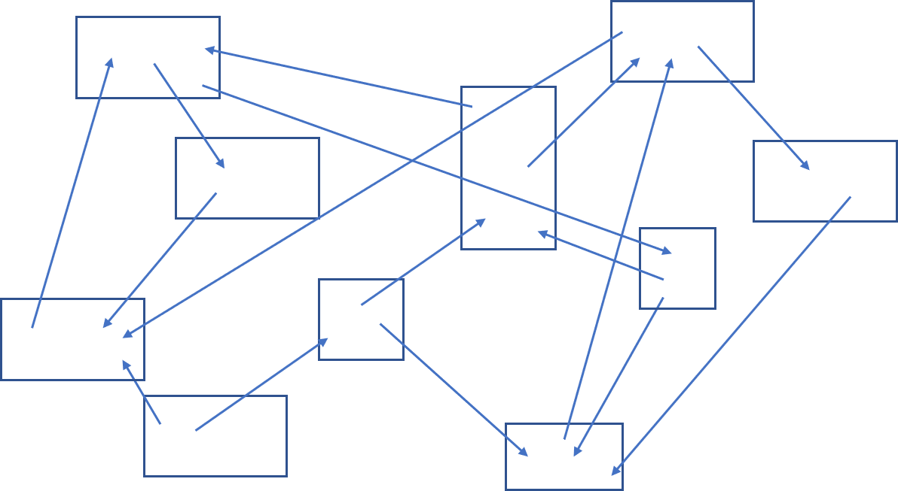

<!-- たぶん、この節を書くのが一番難しいと思うので、最後に後回しにしておく -->
# HTMLとは

HTMLは、ウェブの構成要素のひとつです。このHTMLについて、その背景と周辺情報を紐解いてみます。

<!--
https://developer.mozilla.org/ja/docs/Web/HTML
-->

## HTMLの正式名称

HTML (HyperText Markup Language)は、「マークアップ言語」（Markup Language）の一種です。マークアップ言語には、HTMLのほかに、XMLやSGML、TeXなど、いくつか種類があります。マークアップ言語とは何か、については本書の後の節で取り上げます。

<!--HTMLはプログラミング言語か? はコラムとして末尾に移動-->

HTMLの名前は、「ハイパーテキスト」（HyperText）という単語で始まります。このハイパーテキストこそが、HTMLを特徴付けているものになります。

## ハイパーテキスト

そもそもハイパーテキストとは何でしょうか。この言葉はテッド・ネルソン（Theodor H. Nelson）によって造られ、1965年に発表されたものです。テッド・ネルソンは、単に順序どおりに書かなくてもよい文章をハイパーテキストとしています。言い換えるならば、いくつかの違った道筋を読者に提供するために「リンク」された文章が並んだものです。

図 1-1-01 ハイパーテキスト

このハイパーテキストの概念は、ある論文の影響を強く受けています。「As We May Think」というタイトル[^1]で、第二次世界大戦が収束しつつあった1945年7月に、マンハッタン計画で重要な役割を担った科学技術管理者のヴァネヴァー・ブッシュ（Vannevar Bush）により、Atlantic Monthly誌上で発表されたものです。

この論文の中でブッシュは、情報はますます増える一方であるにもかかわらず、情報を探すのには索引をたどっていくしか手段がないが、そうではなく「連想」によって関連付られけた情報の経路をたどっていけば、必要な情報を見つけ出せることができる――と考えました。

また、ブッシュはそのような「連想」によって情報を得られる機械装置をmemex（メメックス）と名付けました。この機械装置は簡単に言えば、個人の所有する本や記録などを圧縮して、マイクロフィルムとして蓄積できる、図書館のようなものとされました。

この「連想」という考え方がまさに「リンク」であり、ここにハイパーテキストの源流を見ることができるのです。

ブッシュの論文では、memexはあくまで機械装置として描かれていましたが、これをコンピューター上で実現して見せたのが、ダグラス・エンゲルバート（Douglas C. Engelbart）です。エンゲルバートはマウスの発明で有名ですが、彼の率いた研究者チームが1960年代に開発したNLS（oN-Line System）によって、グラフィカルユーザーインターフェイスやハイパーテキストリンクなどが初めて実用化されました。

[^1]: 日本語では、「私たちが思考するように」などと訳されます。書籍やウェブ上で日本語訳を読むことができます。

## ワールド・ワイド・ウェブ

ハイパーテキストとインターネットを結びつけて、ワールド・ワイド・ウェブ（World Wide Web、単にウェブとも呼ばれます）を生み出したのがティム・バーナーズ＝リー（Sir Tim Berners-Lee）その人です。ワールド・ワイド・ウェブとは世界中にはりめぐらされた蜘蛛の巣という意味です。

ウェブの起源は、1980年にバーナーズ＝リーが構築したENQUIRE（エンクワイア）に端を発します。しかしこれは、一般に公開されることはありませんでした。その後の1989年3月12日にバーナーズ＝リーはロバート・カイリュー（Robert Cailliau）とともに「Information Management: A Proposal」（情報管理: 提案）を執筆し、ENQUIREを参照しつつさらに進んだ情報管理システムを提案しました。ディレクターとしてバーナーズ＝リーが率いるW3Cは、この日がウェブの誕生日としています。

ウェブは、リソースの場所を示す「URL」(Uniform Resource Locator[^2])、ウェブサーバーとクライアント間の通信の取り決めである「HTTP」(Hypertext Transfer Protocol)、そしてコンテンツを記載するHTMLで構成される、ハイパーテキストシステムです。ウェブコンテンツを閲覧するクライアントとしては通常、ウェブブラウザーを用います。

<!--マスタリングTCP/IP入門編第4版 P.265より借り物-->

図 1-1-02 ウェブシステムの概略

ウェブ以前に実現されていたハイパーテキストシステムとは大きく異なっていたのは、ネットワーク上に存在する別のコンピュータの文書にもリンクをマウスでクリックさえすれば[^3]、その文書にジャンプすることができるという点です。これにより、世界中の情報を相互に参照できるようになりました。

これは見方を変えれば、ウェブは世界中のウェブサーバーに蓄積されている情報共有システムであり、仮想的なマルチメディアの巨大データベースを提供するものとも言えます。この巨大なシステムで鍵を握るHTMLについて、これから本書で検討していきます。

[^2]: 当時のURLの仕様であるIETF RFC 1738ではこのように記載されていましたが、一方で、現在の仕様であるWHATWG URLでは“URL”が何の略であるのかは定義されていません。URLについては、2-3節でも取り上げています。

[^3]: 今日では、タッチデバイスでタップして、のほうが読者には馴染みがあるかもしれません（が、ウェブが誕生した当時はスマートフォンはありませんでした）。

## コラム: HTMLはプログラミング言語か?

一般に、マークアップ言語はプログラミング言語ではありません。HTMLも、マークアップ言語であり、プログラミンク言語ではありません。

しかし世間では、「HTMLでプログラミング学習をする」のような言い方がされることもあります。この場合、HTML単独ではなく、プログラミング言語であるJavaScriptと合わせて使うことでプログラミングを学ぶ、という意味で言っていることが多いようです。JavaScriptはHTMLと関わりが深く、JavaScriptを学ぼうとするとHTMLも学ぶ必要があることが多いため、両者をまとめて暑うことが多いのでしょう。

なお、マークアップ言語の中には、XSLTのように、分岐やループといったプログラミング的処理を表現するものも存在します。
