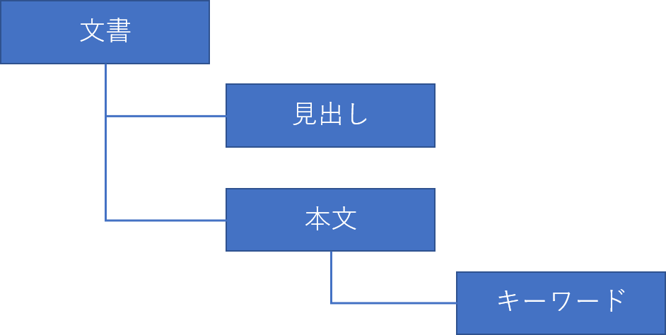

<!---->
# 要素とマークアップ

<!-- 要素とは何か、マークアップとは何か。HTML、DOMツリー、アクセシビリティツリーなどの話。Markdownとの対比なども。
 ※IDLの話は仕様の読み方のところで扱う想定。-->
この節では、マークアップとは何か、どのようにマークアップが機械に読み込まれて解釈されるのかについて説明します。

## マークアップとは

人間が文書を読むとき、文書の見た目について無意識のうちに注目しています。大きい文字があれば見出しと解釈したり、フォントや色を変えてあれば目立たせたいキーワードだろうと解釈します。つまり、見た目の情報から、構造上の意味を読み取っているのです。

しかし機械[^1]は、単に文字が大きいという見た目の情報から、それが見出しであるという構造の情報を理解することはできません。

[^1]: ここで言う機械とは、主にコンピューターを指します。

### プレーンテキスト - 人間は文脈で読める

たとえば、次のような文章があるとします。

```plaintext
これは見出しのテキストのかたまりです
これは本文です。このキーワードはこの文章で重要なものを表します。
```

このように、装飾のない純粋な文字情報だけで構成されるテキストを「プレーンテキスト」(plain text)と言います。

この例では、1行目が見出し、2行目が本文であると推測できます。しかし、それは人間が文の意味を理解しているからです。プレーンテキストでは、文書のどこが見出しで、どこがキーワードなのか、機械に判別させることは困難です。それでは、どうすれば人間だけでなく機械にも理解できるようになるのでしょうか。

### マークアップ - 機械にも読めるように

この問題を解決する方法のひとつが、テキストに「マーク」(mark)を追加して、印をつけることです。たとえば、以下のようにします。

```xml
<見出し>これは見出しのテキストのかたまりです</見出し>
<本文>これは本文です。この<キーワード>キーワード</キーワード>はこの文章で重要なものを表します。</本文>
```

マークをつけることで、1行目が見出し、2行目が本文であることがわかります。またキーワードの範囲も明示できており、機械でも判別できます。

このように、テキストにマークを付けることを「マークアップ」(markup)と言います。また、ここで使用した“`<見出し>`”などのマークのことを「タグ」(tag)と呼びます。

プレーンテキストに対し、タグを追加してマークアップをすると、人間だけでなく機械にも文書の構成要素が理解できるようになります。

ところで、ここでは`<見出し>`、`<本文>`、`<キーワード>`というタグを使って説明しました。しかし、このような名前のタグは、汎用のマークアップ言語であるXMLでは使えますが、本書のテーマであるHTMLでは使えません。原則として、HTMLでは定められたタグの名前しか使用できません。[^2], [^3]

先の例をHTMLとしてマークアップする場合、たとえば以下のようになります。

```html
<h1>これは見出しのテキストのかたまりです</h1>
<p>これは本文です。この<strong>キーワード</strong>はこの文章で重要なものを表します。</p>
```

[^2]: 厳密にはカスタム要素と呼ばれるHTMLのルールを用いれば、タグの名前を柔軟に設定できます。カスタム要素はx.x節を参照ください。

[^3]: ちなみに純粋なHTMLで決められている要素は、2021年時点で112になります。ただし、本書で全部取り上げるわけではありませんし、その全部を使うことは稀と言えます。

### DOMツリー - プログラムからも効率的に操作

HTML文書は、テキストとマークが混ざった文字列データです。ウェブブラウザーはHTML文書を取得すると、その文字列データにあるマークアップを解析します。そして、ブラウザー内部でツリー構造（木構造とも呼ばれます）のデータオブジェクトを構築します。


図 1-2-1 ツリー構造

ツリーを構成する個々のオブジェクトを「ノード」(node)と呼びます。前述のマークアップの例では、“文書”というノードの下に“見出し”と“本文”というノードがぶら下がり、さらに“本文”の下に“キーワード”というノードがぶら下がる構造になります。



図 1-2-2 マークアップ例のツリー構造

JavaScriptなどのプログラミング言語では、このノードに対して様々な操作をすることができます。マークを含んだHTMLをテキストして操作するのではなく、ノードをオブジェクトとして扱うことで、効率的に処理することができるのです。

このように、文書をノードのツリー構造としてデータ化し、個々のノードをオブジェクトとして扱えるようにするデータモデルを「DOM」(Document Object Model)と呼びます。

現在、最新のDOMの仕様はWHATWG DOM標準で規定されています。かつてはW3Cという組織で策定作業が行われていましたが、HTML標準と同様に、現在ではWHATWGという組織がリードしています。ただし、DOMを拡張する仕様<!--DOM3 Eventsと称されていたUI Eventsなど-->については引き続きW3Cで策定が行われています。

W3CやWHATWGといった組織の説明を含むHTMLの歴史については、1-4節で詳しく扱います。

<!--
https://www.html5rocks.com/ja/tutorials/internals/howbrowserswork/
-->

### アクセシビリティツリー - 支援技術に情報を公開

HTMLの利用の形として、もうひとつ忘れてはならない存在が「支援技術」(assistive technology)です。

支援技術とは、障害者がパソコンなどの機器を使用する際に、その操作の補助を行うために用いられるハードウェアやソフトウェアの総称です。代表的な例としては、主に視覚に障害のある人に対し、音声でコンテンツを読み上げる「スクリーンリーダー」(screen reader)と呼ばれるソフトウェアが挙げられます。

スクリーンリーダーのような支援技術は、DOMツリーを直接読み取るわけではありません。DOMツリーには、ラベルなどの必要な情報がなかったり、逆にCSSで非表示にされた要素がそのまま残ったりという問題が実際にはあります。DOMツリーをそのまま利用しても、支援技術にはうまく情報が伝わりません。

そこでブラウザーは、DOMツリーの情報に過不足している情報を調整した結果を支援技術に伝えます。この支援技術に対して公開されるツリー構造のデータを「アクセシビリティツリー」(accessibility tree)と呼びます。

HTMLから支援技術を通して、支援技術のユーザーに情報が伝わるイメージは次のようになります。


図 1-2-3 アクセシビリティツリーの位置付け

<!--
元URL：
https://github.com/WICG/aom/blob/gh-pages/images/DOM-a11y-tree.png
これを作り直す必要
-->

<!--
https://developer.mozilla.org/ja/docs/Tools/Accessibility_inspector
https://developers.google.com/web/fundamentals/accessibility/semantics-builtin/the-accessibility-tree?hl=ja
-->

### まとめ - なぜマークアップをするのか

マークアップを行うことで、テキストの構造や意味が機械にも伝わるようになります。そしてブラウザー、プログラム、支援技術など、さまざまなツールから容易にアクセスできるようになります。

よりよいHTMLを書くことで、人間が読みやすいものになると同時に、JavaScriptからも操作しやすいDOMツリーができ、アクセシビリティツリーを通して支援技術に情報が適切に伝わることにもなるのです。

## コラム: 軽量マークアップ言語Markdown

テキストエディタやメモアプリに文章を書くとき、単なるプレーンテキストでは、単純なテキストの装飾も伝えることはできません。とはいえ、このような場合にHTMLでタグ付けするのは煩雑です。そこで、ここでHTMLのようなマークアップ言語とプレーンテキストとの中間に位置付けされる、軽量マークアップ言語が使われます。

軽量マークアップ言語は、入力がしやすい、簡潔な文法を持つマークアップ言語です。言語としての整合性と、可読性、記述の容易さを満たしたものと言えます。一般に、軽量マークアップ言語を解析するパーサを通して、HTMLなどのマークアップ言語に変換することもできます。

著名な軽量マークアップ言語として、“Markdown”と呼ばれる言語があります。基本的なMarkdown構文については、電子メールでプレーンテキストを装飾する際の慣習から着想を得ているとされ、見出しや段落、太字やハイパーリンクなどを表現できます。基本的なMarkdown構文の一部がどのようなHTMLに変換されるのかを次に示します。

```markdown
## テキスト
```

↓

```html
<h2>テキスト</h2>
```

```markdown
- アイテム1
- アイテム2
```

↓

```html
<ul>
<li>アイテム1</li>
<li>アイテム2</li>
</ul>
```

軽量とされるだけあって、すべてのHTML要素に対応したMarkdown記法が存在するわけではありません。また、簡易な構文であるために、特定の人のニーズをみたす記法が存在しないことがあります。

Markdownは、技術者向けのソフトウェア開発プラットフォーム<!-- GitHub -->、ブログサービス<!-- はてなブログ -->、情報共有サイト<!-- Qiita -->、電子書籍制作ツールなど、さまざまなサービスで使用できます。

しかし、これらは完全に共通のものではなく、サービスごとに独自に記法が拡張されていることがほとんどです。基本的な記法は共通ですが、Markdown方言と呼ばれる様々な亜種が存在し、方言ごとに細かい差異があります。Markdown方言は多数ありますが、その中でCommonMarkが事実上の標準の地位にあるとされます。

PCのテキストエディタのみならず、スマートフォンのメモアプリでも気軽に書くことができますが、文書にマークをつけて構造を明らかにする、という基本的な考え方はHTMLと共通です。Markdownを通して文章の構造化を日々試みることは、適切なマークアップを書く力にもつながっていくでしょう。
