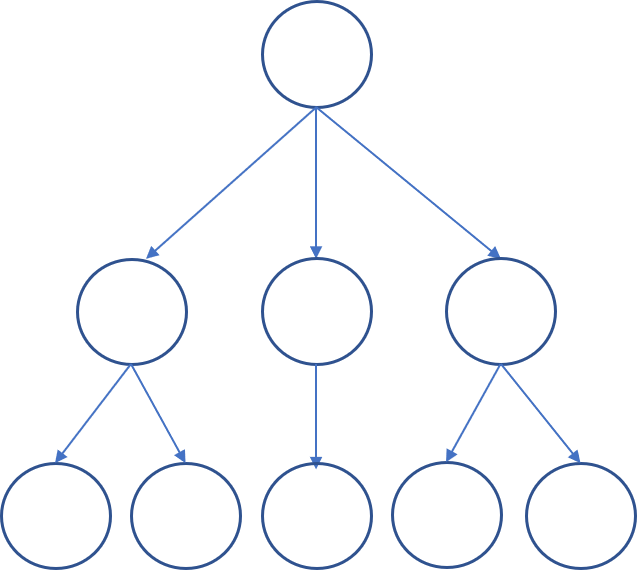

# HTMLの仕様

HTMLはマークアップ言語ですが、その文法や語彙は仕様で決められています。このChapterでは、仕様とは何かを説明し、HTML仕様がどのようなことを定めているのかを紹介します。

## 仕様とは

一般に、製品やサービスなどが満たすべき要求事項として定められたものを「仕様」(specification)と呼び、仕様をまとめて文書にしたものを「仕様書」と呼びます。要求事項には、性能に関する条件、守るべきルール、製品の大きさや製造コストの上限など、さまざまなものが含まれます。

たとえばブラウザーの場合、URL、HTTP、HTMLを理解できなければなりません。ほかにもセキュリティ上の要求、アクセシビリティ上の要求など、さまざまな要求があります。

仕様の要求を実現し、現実に動作するようにしたものを「実装」(implementation)と呼びます。また、動作するようにする行為も実装と呼び、「実装する」と呼び方をします。ブラウザーの場合、実際にプログラムを書いてブラウザーのアプリケーションを作り、動作させることが実装にあたります。

HTMLにも仕様があり、コンテンツ制作者とブラウザーベンダーへの要求事項を定めています。

## コンテンツ制作者のルール

HTML仕様は、コンテンツ制作者がHTMLを書く際のルールを定めています。このルールにはいくつかの種類があり、本書ではそれぞれ、字句的ルール、語彙的ルール、意味論的ルールと呼びます。

### 字句的ルール

Chapter1-1で説明した通り、ウェブでは、プログラムがHTMLを読み取ります。HTMLを読み取って解析することを「パース」(parse)と言い、解析するプログラムを「パーサー」(parser)と言います[^1]。

[^1]: 基本的に、ユーザーエージェントにはHTMLパーサーの機能が含まれています。HTMLの解析処理に特化したものがパーサー、それに加えてURLやHTTPを扱うものがユーザーエージェントです。

パーサーは基本的に、与えられたデータを先頭から1文字ずつ読み、読んだ文字がデータなのか、マークなのか、マークであれば何を意味するのかを解析します。この解析を行うプログラムを「字句解析器」(tokenizer)と呼びます。

HTMLの仕様は、マークの書き方に関するルールを定めています。このルールに違反すると、パーサーは適切な字句解析ができません。以下は、ルールに違反する例です。

```html
<h1>これは見出しの<strong>テキストのかたまりです</h1>
<p>これは本文です。このキーワード</strong>はこの文章で重要なものを表します。</p>
```

この例では、`<strong>`のタグによる入れ子の構造が正しいものではないため、`strong`要素の範囲を適切に解析することができません。

このような字句解析に必要なルールを、本書では字句的ルールと呼びます。字句的ルールには、ほかに以下のようなものがあります。

- DOCTYPE宣言が“先頭に”記述されている
- タグのルールに従って要素と属性が記述されている
- 開始タグと終了タグは正しい入れ子構造になっている
- コメント（およびCDATAセクション）がルールに従って記述されている

仕様が定める字句的ルールについては、Chapter2で詳しく説明します。

### 語彙的ルール

字句的ルールが満たされていれば、字句解析器はマークアップを解釈することができますが、その結果は必ずしもHTMLとして適切であるとは限りません。

HTMLの仕様は、利用できる要素の名前や、ある要素に入れ子にできる要素などを定めています。仕様で定義されない要素名が使用されている場合や、入れ子構造が適切でない場合、字句解析は問題なくできても、HTML仕様には従っていないことになります。以下は、ルールに違反する例です。

```html
<strong><h1>これは見出しのテキストのかたまりです</h1>
<p>これは本文です。このキーワードはこの文章で重要なものを表します。</p></strong>
```

この例では、タグによる入れ子の構造自体は正しく、字句的ルールには従っています。しかし、HTMLでは`h1`要素や`p`要素を`strong`要素の中に入れることはできないとされているため、このルールはHTMLの仕様を満たしません。

このような、要素の種類や関係性に関するルールを、本書では語彙的ルールと呼んでいます。語彙的ルールには、ほかに以下のようなものがあります。

- 要素は、仕様に定められた要素名を持つものである
- ルート要素が`html`要素である
- 内容モデルの制約に従って、適切な親要素の中に入れられている
- 属性は、仕様に定められた属性名を持つものである
- 属性値が仕様によって限定される場合、その限定された属性値を用いている
- 要素と属性の組み合わせは、形式的に仕様に違反しない組み合わせになっている
- 仕様で定められた形式に従った要素の内容（コンテンツ）の記述が求められる場合、その形式に従っている

語彙的ルールについて、詳しくはChapter2とChapter3で説明します。

### 意味論的ルール

字句的ルールと語彙的ルールが適切であれば、パーサーはHTMLを適切に解釈することができます。しかし、パーサーが解釈できるからといって、そのHTMLが適切であるとは限りません。

HTML仕様は、要素の意味や使い方も定めています。本書ではこれを意味論的ルールと呼んでいます。以下は、意味論的ルールに違反する例です。

```html
<p>これは見出しのテキストのかたまりです</p>
<h1>これは本文です。このキーワードはこの文章で重要なものを表します。</h1>
```

この例では、見出しを`p`要素、本文を`h1`要素としてマークアップしています。これは字句的ルールも語彙的ルールも満たしますが、要素の使い方を誤っており、意味論的ルールに反しています。

意味論的ルールには以下のようなものがあります。

- 内容に基づいた、適切な意味づけとなっている要素を選択している
- 要素の出現順序は、機械および人間が読んで意味に矛盾がないものになっている
- 属性値が自由記述である場合、機械および人間が読んで意味のある、矛盾しない属性値が記述されている
- 要素と属性の組み合わせは意味のあるものになっている

意味論的ルールについては、Chapter3で説明します。

## ユーザーエージェントのルール

HTML仕様は、HTMLを処理する側であるユーザーエージェントが守るべきルールも定めています。

### パーサーとDOMツリー

HTML仕様は、パーサーの字句解析ルールを定めています。先にも説明した通り、パーサーはHTMLを読み取って処理するプログラムです。パーサーは字句解析器によってマークアップを解析します。

パーサーは字句解析を終えると、「ツリー構築」(tree construction)を行い、結果をツリー構造 (木構造) のデータとして構築します。

たとえば、以下のようなマークアップがあるとします。

```html
<h1>見出し</h1>
<p>本文です。<strong>キーワード</strong>です。</p>
```

これを字句解析すると、以下のようになります。

- `<h1>` : h1要素開始タグ
- 見出し : データ
- `</h1>` : h1要素終了タグ
- `<p>` : p要素開始タグ
- (以下略)

ツリー構築を行うと、以下の図のようなデータになります。

<!-- 図の丸の中に要素名などをいれる -->


こうして得られたツリー構造のデータを、「DOMツリー」(DOM tree)と呼びます。DOMはDocument Object Modelの略で、文書に含まれる要素をプログラムから操作可能な「オブジェクト」(Object)として扱うためのデータモデルです[^1]。

[^1]: DOM仕様について、かつてはW3Cという組織で策定作業が行われていましたが、現在ではHTML Standardと同様に、WHATWGという組織がリードしています。ただし、DOMを拡張する仕様<!--DOM3 Eventsと称されていたUI Eventsなど-->については引き続きW3Cで策定が行われています。

ブラウザーがHTML文書を表示する際は、まずコンピューターのメモリ上にDOMツリーを構築し、各要素にスタイルを適用して、見た目を決定します。このように、表示するための見た目の姿を構築することを「レンダリング」(rendering)と言います。

DOMツリーはレンダリングに使用されるほか、コンテンツ制作者が記述したJavaScriptから参照され、操作されることもあります。

### 支援技術とアクセシビリティツリー

HTMLの利用の形として、ブラウザーとともに忘れてはならない存在が「支援技術」(assistive technology)です。

支援技術とは、主に障害のある人がパソコンなどの機器を使用する際に、その操作の補助を行うものです。代表的な例としては、音声でコンテンツを読み上げる「スクリーンリーダー」(screen reader)と呼ばれるソフトウェアが挙げられます。

他の例としては、画面を拡大する「画面拡大ソフト」(screen magnifiers)、音声入力を可能にする「音声認識ソフトウェア」(speech recognition)、マウス操作を他の操作で代替できる「代替ポインティングデバイス」(alternative pointing devices)などがあります。

支援技術の多くは、ブラウザーだけでなく、OSや他のアプリケーションの操作にも利用できます。たとえばスクリーンリーダーであれば、OSやアプリケーションが提供するメニュー項目などを読み上げることができます。

この時スクリーンリーダーは、読み上げるべきテキストの情報をOSから受け取っています。このように、OSが支援技術に情報を提供するインターフェイスを「アクセシビリティAPI」(accessibility API)と言います。支援技術は、アクセシビリティAPIを通じてOSから情報を得たり、OSに対して操作を伝えたりします。

支援技術がウェブコンテンツにアクセスする場合、支援技術はDOMツリーにアクセスする必要があります。しかし、DOMツリーの内容をそのまま扱おうとすると、ラベルなど読み上げに必要な情報が足りない、CSSで非表示にされた要素もそのまま残っている、といったさまざまな不都合があります。

そこでブラウザーは、支援技術に必要となる情報をDOMツリーに付け加えたり、不要な情報を取り除いたりして、その結果をアクセシビリティAPIに公開します。このように、アクセシビリティAPIに向けて公開されるツリー構造のデータを「アクセシビリティツリー」(accessibility tree)と呼びます。

HTMLから支援技術を通して、支援技術のユーザーに情報が伝わるイメージは次のようになります。

<!-- アクセシビリティAPIも図の中に入れる必要あり -->

図 1-2-3 アクセシビリティツリーの位置付け
<!--
元URL：
https://github.com/WICG/aom/blob/gh-pages/images/DOM-a11y-tree.png
これを作り直す必要
-->

HTML仕様には、アクセシビリティツリーや、その他アクセシビリティに関連するさまざまなルールが含まれます。アクセシビリティについては、Chapter1-4<!--Chapter番号は暫定。のちに確認-->で詳しく説明します。

## まとめ

このChapterでは、仕様という言葉の意味と、HTML仕様が何を定めているのかを説明しました。

HTML仕様は、HTMLを書く側であるコンテンツ制作者や、HTMLを読む側であるユーザーエージェントの制作者が守るべきルール、要求事項を定めています。

コンテンツ制作者が守るべきルールには、大きく分けて、字句的ルール、語彙的ルール、意味論的ルールがあります。

ユーザーエージェントが守るべきルールとしては、パーサーの字句解析器のルールや、DOMツリーの構築などがあります。支援技術はDOMツリーに直接アクセスするのではなく、アクセシビリティツリーを利用します。
