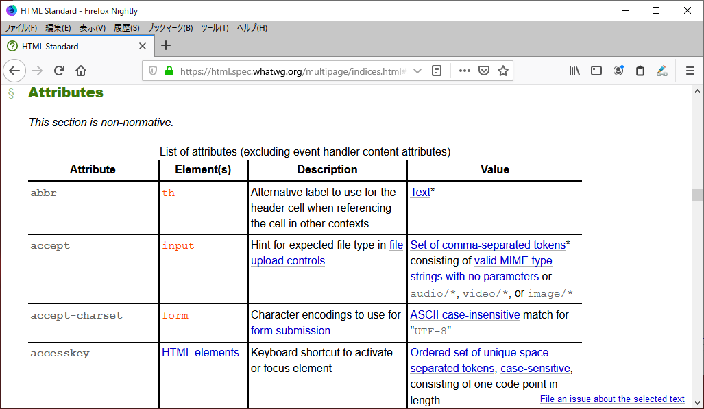

# ウェブ仕様を読む

ここまで説明してきたように、HTMLの仕様はさまざまな歴史を経て発展してきました。
ところで、現在のHTMLの仕様を確認するにはどうすればよいでしょうか。ここでは、HTML仕様を中心とした、ウェブに関する仕様書を読むためのヒントを提供したいと思います。

## HTML仕様はどこにあるのか

WHATWGが公開しているHTML標準は、ウェブで公開されており、以下のURLで読むことができます。

<https://html.spec.whatwg.org/multipage/>

URLに`multipage`と含まれているのは、複数ページ版(Multipage Version)を意味しています。URLから`multipage/`を削除すると単一ページ版(One-Page Version)になりますが、これは膨大な内容のすべてを1つのページに収めたものであり、読み込みに長い時間がかかります。通常は複数ページ版を参照するとよいでしょう。あらかじめダウンロードしておいてオフラインで参照したいというような場合には単一ページ版が便利です。

また、コンテンツ制作者向けとして、レンダリングルールのようなブラウザベンダー向けの情報を省いたバージョンがHTML Standard, Developer's Editionとして存在しています。

<https://html.spec.whatwg.org/dev/>

URLに注目すると、いずれも日付やバージョン番号が含まれていないことがわかります。Chapter1-5でも触れたように、WHATWGによるLiving Standardは、常に更新され続ける標準です。これはWHATWGが管理する標準の大きな特徴であり、他の多くの標準化団体が発行する仕様が最終版で固定されるのとは対照的です。

### 仕様の言語と日本語版

HTMLの仕様書を含めた、ほとんどのウェブ仕様は英語で書かれています。

ウェブ仕様は無料で公開されていますが、翻訳が許可されているライセンスであることが珍しくありません。そのライセンスに基づき、有志が参考となる日本語訳を公開していることもあります。HTML Standardの場合は、次のURLから日本語訳をたどることができます。

<https://github.com/whatwg/html/wiki/Translations>

あくまで正式な仕様は英語版であり、日本語訳は参考に過ぎないことに注意してください。

また、機械翻訳を駆使して読む方法もあります。いずれにしても、仕様に書かれている正確なニュアンスを掴むために、翻訳に頼ることなしに、辞書などを使いながら自力で読む必要もあるかもしれません。

筆者のおすすめは、日本語訳があればまずそれを読んでみて、意味がよくわからないところは原文に当たるという方法です。日本語では表現の難しい言葉や概念もあり、あらためて原文で読むと理解できる場合がしばしばあります。訳者によっては、日本語訳のフィードバックを受け付けていることがあります。そのような場合にフィードバックを送ることで、日本語訳の品質向上に貢献するとよいでしょう。

## HTML仕様の読み方

それでは実際にHTML仕様を読むに当たって、どのような読み方をすればよいでしょうか。
HTML仕様の1章には、"How to read this specification"というズバリそのものなセクションがあります[^1]。

[^1]: https://html.spec.whatwg.org/multipage/introduction.html#how-to-read-this-specification

ここでは以下のようなことが書かれています。

- 仕様は最初から最後まで複数回通読すべきであり、また少なくとも一回は逆から読んだ方がよい
- 目次から任意の章を選んで読んだり、そこからリンクを辿って他の章の内容を読むこともできる

“逆から読んだ方がよい”というのは半ば冗談でしょうが、仕様は基本的に、前から順に通読できるように書かれています。とはいえHTML仕様そのものが巨大と言うこともあり、通読はなかなか難しいというのが現状でしょう。

なお、WHATWG標準の共通ルールは"Infra"という文書にまとめられています[^2]。用語の使い方や記述ルールはこちらもあわせて参照する必要があります。

[^2]: Infra Standard <https://infra.spec.whatwg.org/>

### 目次から探す

多くの場合は、目次から必要な箇所だけを探して読むという使い方になるでしょう。仕様書の表紙ページには目次があり、見たい章に飛ぶことができます。
とはいえ、初見ではどの章に何が書かれているのかわからないことも多いでしょう。以下に、よくありそうな用途と、その情報が執筆時点でどの章に書かれているかを簡単に紹介します。
なお、仕様にも各章の簡単な説明が記載されています[^3]。

[^3]: 1.9 Structure of this specification <https://html.spec.whatwg.org/multipage/introduction.html#structure-of-this-specification>

#### HTMLの要素について詳しく知りたい

これが最も多いニーズだと思います。HTMLの要素については4章に書かれています。

- 4 The elements of HTML

本書でも要素の解説はしていますが、厳密な定義が知りたい時は適宜こちらを参照してください。

#### HTMLの文法について詳しく知りたい

HTMLの文法(シンタックス)については、12章に記載があります。不正なHTMLがどう解釈されるか、といった情報も書かれています。

- 12 The HTML syntax

ただし、HTMLを解析するパーサーの実装者向けに書かれている箇所については、コンテンツ制作者にとってはやや難解かもしれません。プログラミングができる方は、試しにパーサーを自分で実装してみるとこの章の理解が進むでしょう。

#### JavaScriptと連携する機能の情報が知りたい

6章にはインタラクションに関する属性の情報があります。その他、7章から11章にかけて各種のAPIの情報が書かれています。

- 6 User interaction
- 7 Loading Web pages
- 8 Web application APIs
- 9 Communication
- 10 Web workers
- 11 Web storage

#### 古いHTMLとの互換性について知りたい

過去のHTMLにはあったものの、現在では廃止された機能については、15章に書かれています。

- 15 Obsolete features

新しくコンテンツを制作する際には必要ありませんが、古いHTML仕様に基づいて書かれたHTMLを触れるようなときに、当時のHTML仕様にあったものが現在どういう扱いかを知りたいことがあるかもしれません。そのような場合に参照するとよいでしょう。

現仕様で廃止された機能の中には、互換性のためにブラウザーの挙動が定義されているものもあり、「旧式だが適合する機能」(Obsolete but conforming)として規定されています。これらはブラウザーによって解釈されることが期待できますが、それはあくまで互換性のためであり、新しくHTMLを作成する際に用いるべきではありません。文法チェッカーも警告を出します。

現仕様では完全に廃止され、互換性のためのブラウザーの挙動も定義されていない機能は「適合しない機能」(Non-conforming features)として列挙されています。これらについては、ブラウザーのサポートも期待できません。

### 索引から探す

HTML仕様には索引のページも存在します[^4]。目当ての要素や属性についてピンポイントで調べたい場合は、索引にアクセスしてページ内検索で検索してしまうのも手です。

[^4]: Index <https://html.spec.whatwg.org/multipage/indices.html>

図 1-6-2 HTML仕様の索引（属性）のスクリーンショット

## 仕様を読む上で注意が必要な点

実際に仕様を読むにあたり、慣れないと混乱しやすい点がいくつかあります。その注意点についていくつか紹介します。

### ブラウザベンダー向け情報が含まれている

前出の"How to read this specification"には、主にコンテンツ制作者 (プロデューサー) に向けた情報と、ブラウザベンダー (コンシューマー) に向けた情報の両方が含まれていることが記述されており、プロデューサーについての要件は、コンシューマーの要件と関係しないことが強調されています。

たとえば、仕様で`img`要素の`border`属性がどう定義されているのか調べるとすると、以下の2つの情報にたどり着きます。

- 3章では、現在の仕様にそのような属性は定義されていないように書かれている
- 15章では、`border`属性が存在し、その特定の値を解釈する必要があると書かれている

前者がコンテンツ制作者向けの情報で、後者はブラウザベンダー向けの情報です。両者は矛盾しているように見えますが、無関係のものです。現在の仕様では、コンテンツ制作者は`border`属性を使うべきではありません。しかしブラウザーは、過去の互換性にも配慮する必要があるため、もし`border`属性があれば、その値を処理する必要があるのです。

ブラウザーベンダー向けの情報を見てコンテンツを作成してしまうことがないように注意しましょう。言い換えると、ブラウザーが解釈してくれるからといって、コンテンツ制作者向けの仕様を満たすわけではないと言えます。

### 規範部分と参考部分

仕様中の見出しのすぐ下には、次のような文言が書かれていることがあります。

>This section is non-normative.

ウェブ仕様は一般に、規範（normative）とされる部分と、参考（infomativeまたはnon-normative）とされる部分にわけられます。規範部分のみが仕様の規則であり、参考部分は規範部分を理解するための参考情報にすぎません。したがって、仮に規範部分と参考部分に食い違いがある場合、規範部分が優先されます。

一般に、参考部分には上に挙げたような注記がついており、参考であることが明記されています。逆に、特に断りがない場合、本文は規範部分となります。ただし、本文に含まれる例と注、図は参考情報です。WHATWGでは、Infra標準に次のように明示されています。

>All assertions, diagrams, examples, and notes are non-normative, as are all sections explicitly marked non-normative. Everything else is normative.

### RFC 2119キーワード

仕様は一般に、IETFが発行するRFC 2119と呼ばれる文書で定義されるキーワードで適合性の要件が指示されます。本書ではこれを“RFC 2119キーワード”と呼ぶことにします。ウェブ仕様でRFC 2119キーワードが使用されることを示す典型的な文は次のとおりです。

>The keywords "MUST", "MUST NOT", "REQUIRED", "SHALL", "SHALL NOT", "SHOULD", "SHOULD NOT", "RECOMMENDED", "NOT RECOMMENDED", "MAY", and "OPTIONAL" are to be interpreted as described in RFC 2119. [RFC2119]

RFC 2119は、RFC 8174で更新されています。しかし、IETF以外が策定する仕様では、慣習的に読みやすさのためにRFC 2119キーワードは小文字で出現し、もっぱらRFC 2119にのみ従います。

ウェブ標準で頻出するRFC 2119キーワードと典型的な日本語訳、およびキーワードの持つ意味は表のようになります。

表 1-6-1 RFC 2119キーワードと日本語の対応

|キーワード|典型的な日本語訳|意味|
|----|----|----|
|must|～しなければならない|必須|
|should|～すべきである|推奨|
|recommend|～推奨される|推奨|
|may|～してもよい|許容|
|should not|～すべきではない|緩い禁止|
|must not|～してはならない|禁止|

多くの場合、1つの文書にRFC 2119キーワードの全部が出現することはありません。特に、mustとshallはRFC 2119において同じ“必須”であることを示しますが、前者のみを用いることがほとんどです。そのため、表ではshallを省略しています。まったくの余談ですが、英語圏の法律や契約文書においては、一般にshallを用い、mustを使用しません。ISO標準もshallを用います。[^3]

[^3]: ISO標準は、ISO/IEC Directives, Part 2という文書で細かな規定がされています。

また、RFC 2119において、shouldとrecommendは同じ“推奨”の意味を表すキーワードです。こちらは“必須”と異なり、英語の表現上どちらも使用されます。

必須および禁止は、必ず守らなければならない事項です。この要求事項を守れなかった場合、仕様に違反することになります。推奨とは、指示に従わない特別な理由がなければ、指示通りにすることが求められる事項です。許可とは、オプションであり、してもしなくてもよい事項です。

例を1つ示してみましょう。`meta`要素には`charset`という属性があります。この属性値について、HTML 5.0では以下のように書かれていました。

> Authors should use UTF-8.
<!-- https://www.w3.org/TR/html50/document-metadata.html#charset -->

“コンテンツ制作者はUTF-8を使用すべきである”とされており、この場合、何らかの理由があればUTF-8以外でもよいということになります。一方、HTML Standardでは、以下のように書かれています。

> If the attribute is present, its value must be an ASCII case-insensitive match for the string "utf-8".
<!-- https://html.spec.whatwg.org/multipage/semantics.html#the-meta-element -->

“この属性が存在する場合、その値は"utf-8"でなければならない”とされています。この場合、HTML仕様に則ったHTMLであるためには、例外なく常にUTF-8でなければならないことを意味し、理由があるからと言ってUTF-8以外を使用することはできないということになります。

### 他の仕様への準拠

HTML標準に限らず一般的に仕様は、他の仕様に依存しています。ある状況において、仕様と別の仕様が競合して、その別の仕様の要件に違反する場合があります。Infra標準では、そのような違反を「故意の違反」(willful violation)として明示されています。

例えば、小文字でRFC 2119キーワードを示すことは、RFC 8174への故意の違反に当たります。

## HTML以外の仕様

ウェブページを制作する際には、HTMLだけでなく、CSSやJavaScriptの仕様を参照することもあるでしょう。すでに紹介したように、HTMLはWHATWGが仕様を策定していますが、CSSはW3C、JavaScriptはEcma Internationalと、各技術はそれぞれ別々の標準化団体によって策定されています。

一般に、ウェブを含むインターネットに関する仕様書は、各標準化団体のウェブページに無料で公開されています。これはISOやJISのような伝統的な標準化団体によって発行される標準が、基本的に紙の仕様書として有料で販売されているのとは対照的です。

WHATWGの仕様と異なり、W3C等の仕様書は常に更新され続けるわけではなく、特定のバージョンとして公開されています。また、過去の仕様もアーカイブとして残されているため、誤って古いものを参照していないか注意する必要があります。

ウェブ開発者がよく参照するのは、CSSの仕様などを策定しているW3Cの仕様書でしょう。例として、CSSの仕様書の一部を紹介します。

![URL https://www.w3.org/TR/selectors-3/のスクリーンショットに番号を記載したもの。① Selectors Level 3。② W3C Recommendation 06 November 2018。③ This version: https://www.w3.org/TR/2018/REC-selectors-3-20181106/。④ Latest version of Selectors: https://www.w3.org/TR/selectors/。⑤ Editor's Draft
https://drafts.csswg.org/selectors-3/。⑥ Editors: Tantek Çelik (Invited Expert) Elika J. Etemad (Invited Expert) Daniel Glazman (Disruptive Innovations SARL) Ian Hickson (Google) Peter Linss (former editor, Netscape/AOL) John Williams (former editor, Quark, Inc.)。⑦ Please check the errata for any errors or issues reported since publication.。とある。](../img/1-6-01.png)

図 1-6-1 あるW3C仕様書の表紙部分のスクリーンショット

図1-6-1に示したW3Cの仕様書が最新の仕様かどうか、どのように確認すればよいでしょうか。この表紙にはさまざまな情報があります。図中の番号①～⑦を順を追って説明します。

- ①は仕様の名前です。
- ②は仕様のステータスと、発行された日付です。W3C仕様のステータスの位置付けについては、Chapter1-4を参照してください。またステータスについては、ウィンドウ左上の帯にも常に表示されており、図では“W3C Recommendation”と縦書きで表示されている箇所になります。
- ③はこのバージョンの仕様書のURLです。バージョンを固定したい場合に使用できます。なお、W3Cの場合、<https://www.w3.org/TR/>がW3Cの正式な手続きに則った仕様書のURLです。パス`TR`の次のパスに示される4桁の数字が発行された年であり、最後のハイフン区切りになっているパスが、左から仕様のステータスの略称、仕様の短縮名、発行年月日を表しています。
- ④は最新の仕様のURLです（このURLが書かれていないものもあります）。リンク先が後続の仕様であることもあります。つまり言い換えると、閲覧している仕様書が最新の仕様書でないことがあり得る、ということになります（Living Standardはそういったことはありません）。
- ⑤は編集者草案のURLです。編集者が変更しているスナップショットのバージョンを見ることができます（ある意味で、Living Standardに近しい存在と言えます）。
- ⑥は編集者の一覧です。仕様のメンテナンスをしている人です。この仕様に関するキーパーソンであると言え、仕様の策定に関してさらに詳しいことを調べる場合に有用な情報です。
- ⑦はエラッタ（正誤表）へのリンクです。特に勧告となった後に誤りが報告された場合に、リンク先にその修正内容が記載されることがあります。

図の例では、②や④に注意を払うことにより、閲覧している文書が最新の文書なのかどうかを確認することができます。実際、執筆時点で④をクリックすると、リンク先はSelector Level 4[^4]という文書を参照しており、より新しい仕様の草案が存在することが確認できます。

[^4]: https://www.w3.org/TR/selectors-4/

<!-- 一番関連性がありそうなChapterということで仮置き。Chapter1の見直しで移動あり得るかと -->

## WCAGについて

本書ではHTMLに関連する仕様として、WCAG (Web Content Accessibility Guidelines)を折に触れて参照しています。ここでは、WCAGについて簡単に説明を行います。より詳しい説明については、W3Cの提供する概要文書[^5]を参照ください。

[^5]: https://www.w3.org/WAI/standards-guidelines/wcag/

WCAGは、ウェブコンテンツをよりアクセシブルにするための推奨事項を網羅した仕様です。具体的には「達成基準」（Success Criterion; SC）と呼ばれる、特定の技術に依存しない中立的なルールに従うことで、アクセシビリティを満たすコンテンツを作成できます。WCAGに従うことにより、障害のあるユーザーにアクセシビリティを確保するだけではなく、ほとんどのユーザーがより使いやすいウェブコンテンツを提供することにつながります。

本書では、執筆時点で最新の仕様であるWCAG 2.1を参照しています。後続仕様となるWCAG 2.2の開発が進んでいますが、これはWCAG 2.1に達成基準が追加されるものであり、基本的な考え方は変わりません。

また、本書ではわかりやすさのために、達成基準の名称については、W3Cの原文ではなくウェブアクセシビリティ基盤委員会[^6]が作成するWCAG 2.1の日本語訳[^7]を参照して記載しています。

[^6]: https://waic.jp/

[^7]: https://waic.jp/docs/WCAG21/

WCAG 2.1の達成基準は、技術に中立的なルールであるために、非常に難解なものになっています。達成基準の解説書にあたる文書[^8]も公開されていますが、ウェブアクセシビリティの専門家レベルの知識が要求される非常に高度な内容になっています。ウェブアクセシビリティの学習としては、別途W3C WAIの提供する解説リソース[^9]や、書籍[^10]などを参照するとよいでしょう。

[^8]: https://www.w3.org/WAI/WCAG21/Understanding/

[^9]: https://www.w3.org/WAI/fundamentals/

[^10]: 太田良典、伊原力也著『デザイニングWebアクセシビリティ』
