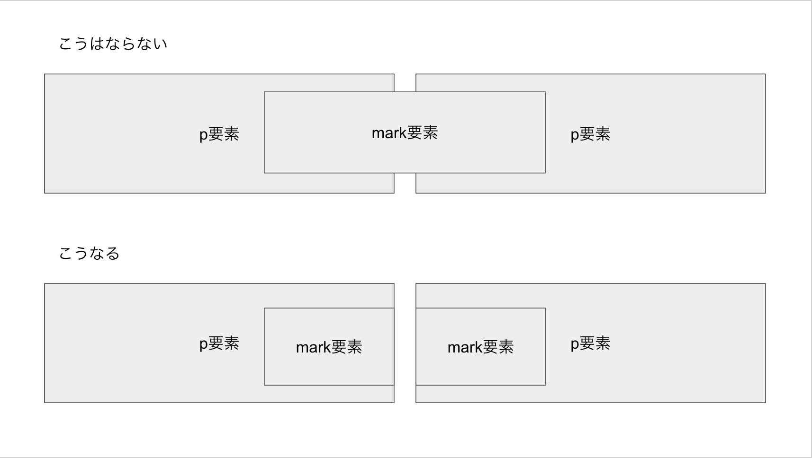

<!--
知識編 2章 HTMLマークアップのルール
2-1. 開始タグと終了タグ
4p
-->

# 2-1. HTMLの要素とタグの基本

1章では、HTMLがマークアップ言語であることを説明しました。ここでは、HTMLの基本的な構文について説明していきます。

## 要素とタグ

1章で説明したとおり、HTMLはマークアップ言語です。マークアップとは、テキストにマークをつけることで、テキストの意味や構造を明確にすることでした。つまりHTMLは、プレーンテキストのデータに対して、マークを付け加えたものということができます。つまりHTMLは、マークとデータから成り立ちます。

1章では以下のような例を示しました。

```text
これは見出しのテキストのかたまりです
これは本文です。このキーワードはこの文章で重要なものを表します。
```

このテキストには、見出し、本文、そしてキーワードが含まれています。別の言い方をすれば、このテキストの中には、「見出し」「本文」「キーワード」という一連の意味を持ったまとまりが存在することになります。1章で触れたように、HTMLでは、こういったまとまりを「要素」(element)と呼んでいます。

マークアップ言語の役割は、どの部分がどの要素なのかを明確にすることです。そのためには、どこからどこまでがひとつの要素になるのか、それがどんな要素なのかという情報を伝える必要があります。HTMLでは、この情報を「タグ」(tag)と呼ばれるマークを使って表現します。

この例に実際にHTMLのタグを付け加えると、以下のようになります。

```html
<h1>これは見出しのテキストのかたまりです</h1>
<p>これは本文です。</p>
<p>この<mark>キーワード</mark>はこの文章で重要なものを表します。</p>
```

※これは断片(fragment)であり、完全なHTMLではありません。

`<`と`>`で囲まれた部分がHTMLのタグです。最初の行の見出しを見ると、見出しの先頭に`<h1>`を、末尾に`</h1>`を入れています。このように、要素の開始位置と終了位置にタグを入れることで、要素の範囲を明らかにします。

### 開始タグと終了タグ

要素の開始位置を表現するタグを「開始タグ」(start tag)と呼びます。開始タグは`<`で始まり、`>`で閉じられます。"h1"と書かれている部分は「タグ名」(tag name)と呼ばれ、要素の名前である「要素名」(element name)を表現しています。

要素の終了位置を表現するタグを「終了タグ」(end tag)と呼びます。終了タグの始まりは開始タグとは異なり、`<`のあとに`/`が入ります。タグ名が書かれる点、`>`で閉じられる点は開始タグと同様です。

また、タグを除いた要素の中身の部分を、要素の「内容」(content)と呼びます。

もう一度、見出しのマークアップを見てみましょう。

```html
<h1>これは見出しのテキストのかたまりです</h1>
```

このマークアップでは、`<h1>`が開始タグ、`</h1>`が終了タグであり、タグ名はどちらも`h1`です。この部分全体が`h1`という要素名の要素であり、その内容は「これは見出しのテキストのかたまりです」というテキストです。

同様に、本文は開始タグ`<p>`と終了タグ`</p>`でマークアップされています。これによって、`p`という要素名の要素であることを表現しています。

さらに、3行目のp要素の中には、さらに`<mark>`と`</mark>`というタグがあります。これによって、この部分が`mark`要素であることを表現しています。


### 要素の入れ子

`mark`要素の前に`</p>`が出現していないことに注目してください。先に`<p>`が存在し、`</p>`がまだ出現していないため、この部分は`p`要素の内部です。つまり、`p`要素の内部に、さらに`mark`要素が入っているということになります。

このように、ある要素の内部に別の要素が入っていることを「入れ子」(nest)と言います。ある要素の内部に別の要素を入れることを、「入れ子にする」、あるいは「ネストする」などと言います。

また、ある要素の中に入れ子になった要素のことを、その要素の「子要素」であると言います。逆に、内側の要素から見て、外側の要素を「親要素」という言い方もします。先の例をもう一度見てみましょう。

```html
<p>この<mark>キーワード</mark>はこの文章で重要なものを表します。</p>
```

このとき、`p`要素と`mark`要素は入れ子になっており、`mark`要素は`p`要素の子要素、`p`要素は`mark`要素の親要素であると言えます。

なお、要素の種類によっては、子要素になれないケースもあります。たとえば、`p`要素の中に`mark`要素を入れることはできますが、`mark`要素の中に`p`要素を入れることはできない決まりになっています。

## 子要素が親要素の外にはみ出すことはない

子要素が親要素の範囲からはみ出すことはありません。たとえば、以下のようにマークアップしたとします。

```html
<p>ある<mark>長いキーワード</p>
<p>キーワードの続き</mark>はこの文章で重要なものを表します。</p>
```

このように、子要素が親要素からはみ出したり、複数の要素にまたがることはできません。このようなマークアップは不正なものとして、エラーになります。

実際には、ブラウザはこのようなエラーに出会うと、マークアップを以下のように修正して解釈します。

```html
<p>ある<mark>長いキーワード</mark></p>
<p><mark>キーワードの続き</mark>はこの文章で重要なものを表します。</p>
```



なお、これはあくまでマークアップの構造上の話です。要素をブラウザ上でレンダリングした際の見た目の話であれば、子要素を親要素からはみ出させたり、親要素の外に出したりすることはできます。

### 終了タグの省略

先ほどの例で、ブラウザはマークアップのエラーに遭遇した際、勝手に開始タグや終了タグを補って解釈していました。このように、書かれていないタグを補って解釈されることがあります。

先の例では不正なマークアップのエラーを回復する処理でしたが、正当なルールに沿ってタグが補われることもあります。別の言い方をすれば、タグの記述を省略しても自動で補われる場合があるということで、つまり、タグを省略できる場合があるということです。

省略の可否は要素によって異なります。何度か出てきた`mark`要素の場合、開始タグと終了タグは省略できないことになっています。そのため、先の例はエラーとなり、エラー回復処理の中で補われる形となりました。

しかし中には、タグの省略ができることになっている要素もあります。これまた何度か出てきている`p`要素の場合は、終了タグが省略できることになっています。そのため、先の例は以下のように書くこともできます。

```html
<p>ある<mark>長いキーワード</mark>
<p><mark>キーワードの続き</mark>はこの文章で重要なものを表します。
```

`</p>`が書かれていませんが、これはエラーにはならず、以下のように補われて解釈されます。

```html
<p>ある<mark>長いキーワード</mark></p>
<p><mark>キーワードの続き</mark>はこの文章で重要なものを表します。</p>
```

ある要素の終了タグが省略できるかどうか、どのような場合に省略できるかは、仕様書の各要素の説明に書かれています。たとえば、`mark`要素の場合は、「[4.5.23 mark要素](https://momdo.github.io/html/text-level-semantics.html#the-mark-element)」に以下のように書かれています。

>text/htmlにおけるタグ省略：
>どちらのタグも省略不可。

これは、開始タグも終了タグも省略できないという意味です。一方、`p`要素の場合は、「[4.4.1 p要素](https://momdo.github.io/html/grouping-content.html#the-p-element)」に以下のような記述があります。

>text/htmlにおけるタグ省略：
>p要素がaddress、article、aside、blockquote、details、div、dl、fieldset、figcaption、figure、footer、form、h1、h2、h3、h4、h5、h6、header、hgroup、hr、main、menu、nav、ol、p、pre、section、table、ul要素の直後に存在する場合、または親要素で追加のコンテンツが存在せずかつ親要素がa、audio、del、ins、map、noscript、video要素、または自律カスタム要素でないHTML要素である場合、p要素の終了タグは省略することができる。

こちらは一定の場合に終了タグを省略できることがわかります。他には、`li`要素、`dt`要素、`dd`要素、`tr`要素、`th`要素、`td`要素、`caption`要素、`thead`要素、`tbody`要素、`tfoot`要素、`option`要素、`rp`要素、`rt`要素などの終了タグが省略可能とされています。

### 開始タグの省略

また、要素によっては、開始タグをも省略できる場合があります。具体的には、`html`要素、`head`要素、`body`要素、`tbody`要素が該当します。以下はタグを省略して書いた例です。

```html
<!DOCTYPE html>
<title>test</title>
<table>
<tr><th>見出し1<td>データ1
<tr><th>見出し2<td>データ2
</table>
```

`html`要素、`head`要素、`body`要素、`tbody`要素の開始タグが全く書かれていないことに注目してください。このマークアップはエラーではなく、以下のように解釈されます。

```html
<!DOCTYPE html>
<html>
<head>
    <title>test</title>
</head>
<body>
<table>
    <tbody>
        <tr>
            <th>見出し1</th>
            <td>データ1</td>
        </tr>
        <tr>
            <th>見出し2</th>
            <td>データ2</td>
        </tr>
    </tbody>
</table>
</body>
</html>
```

`html`要素、`head`要素、`body`要素、`tbody`要素が補われています。このように、タグを全く書かなくても要素が存在する場合があります。とはいえ、慣れないとそこに要素があるということが分からないことがあり、挙動が予想しにくくなることがありますので、開始タグの省略はしないことが多いです。

### 空要素

タグの省略についてご説明しましたが、そもそも終了タグを持たない要素もあります。

HTMLの基本は、テキストをマークアップすることです。そのため多くの場合、要素の中にはテキストか、もしくは子要素が含まれています。しかし、中には内容を全く含まない要素もあります。

以下は、`br`要素を使用した例です。

```html
<p>詩などの<br>文章では<br>改行位置が<br>重要になることもあります。</p>
```

`br`要素は改行を指定する要素で、その位置で改行されることが期待されます。`br`要素はその性質上、その中にテキストや他の要素を含むことはありません。このように、決して内容を持つことのない要素を「空要素」(void element)と呼びます。

空要素には、終了タグを書くことができません。省略して良いのではなく、書いてはいけないことになっています。以下は正しくない例です。

```html
<p>詩などの<br></br>文章では<br></br>改行位置が<br></br>重要になることもあります。</p>
```

このように書いた場合、`</br>`は不正なマークアップとしてエラーになりますが、エラー処理の結果、そこに`<br>`が書かれているものとして扱われます。つまり、`<br></br>`と書くと、`<br><br>`と書いた場合と同じ動作になります。

なお、どの要素が空要素なのかはあらかじめ決まっています。空要素ではない要素について、たまたま内容が空になったようなケースでは、終了タグを書く必要があります。

### 属性

要素には属性をつけられることがあります。HTMLを特徴付けるのは「ハイパーリンク」、あるいは単に「リンク」とも呼ばれる仕組みですが、リンクはたとえば以下のようなマークアップ表現します。

```html
<p>詳しくは<a href="https://html.spec.whatwg.org/m">HTML Living Standard</a>をご覧ください。</p>
```

ここでは、リンクを表す`a`要素を使い、HTML Living Standardというテキストをマークアップしています。このとき、終了タグは`</a>`という記述ですが、開始タグは`<a>`という記述ではなく
、タグの中に`href=`で始まる文字列が含まれています。これによって、リンク先のURLの情報を表現しています。

このように、要素に対しては追加の情報を付け加えることができます。このようなものを「属性」(attribute)と呼んでいます。

属性には名前と値があり、それぞれ「属性名」(attribute name)、「属性値」(attribute value)と呼ばれます。上記の例では、属性名が`href`、属性値が`https://html.spec.whatwg.org/`となっています。

属性を書く際には、属性値の後ろに`=`を記述し、続けて属性値を書きます。属性値は、原則として二重引用符(`"`)または単引用符(`'`)で括ります。属性値をくくる引用符は、前後で同じものを使用しなければなりません。引用符を省略できる場合もありますが、基本的には、常に引用符でくくっておいた方が無難です。

以下は、`abbr`要素に`title`という属性名の属性を指定し、属性値を`accessibility`とした例です。

```html
<abbr title="accessibility">a11y</abbr>
```

前後で異なる引用符を使うことはできません。先頭で使った引用符と異なる方のものは、属性値の終了区切りではなく、属性値の一部とみなされます。言い換えれば、属性値の一部として書くことができます。たとえば、以下のようなマークアップがあったとします。

```html
<abbr title="accessibility'>a11y</abbr>
<abbr title='accessibility">a11y</abbr>
```

これは、`title`属性に以下のような値が指定された、ひとつの`abbr`要素とみなされます。

```text
accessibility'>a11y</abbr>
<abbr title='accessibility
```

### ブール型属性

多くの属性はさまざまな値をとりますが、属性の中には、真偽、on/offだけを表すものを「ブール型属性」(boolean attribute)と呼びます。以下は、ブール型属性のひとつである`hidden`属性の例です。

```html
<p hidden="hidden">この内容は表示されません</p>
```

属性名と同じ属性値を指定していることに注目してください。ブール型属性では、属性名と同じ属性値を書き、これによってその属性が有効であることを表します。この例では`hidden`属性が有効になり、この要素が隠されるべきものであることが示されます。

しかし、属性名と全く同一の属性値を書くというのは冗長です。そこで、ブール型属性の場合には、以下のように省略する書き方も許されています。

```html
<p hidden="">この内容は表示されません</p>
<p hidden>この内容は表示されません</p>
```

いずれの場合も、`hidden="hidden"`と書いたのと同じ効果になります。`hidden=""`が真、onを意味することに注意してください。`hidden`を無効にする場合は、属性自体を省略します。

```html
<p>この内容は表示されます</p>
```

## この節のまとめ

- HTMLはマークアップ言語であり、マークとデータからなる
- 「要素」を明確にするために、「タグ」というマークをつける
- 要素とその階層構造がDOMツリーを構成する
- タグには開始タグ、終了タグがあり、原則セットで使用する
- 要素の種類によっては、終了タグが省略できることもある
- 稀だが、時には開始タグが省略できることもある
- 終了タグのない空要素というものがある
- 要素には属性をつけることができ、開始タグに属性名と属性値を書いて使う
- 原則として、属性値は引用符で括る
- ブール型属性の場合、省略する書き方ができる

### XML構文の場合

- XML構文ではタグの省略ができず、空要素は専用の書き方をする

