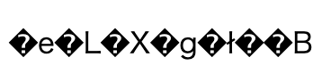

# HTMLで扱える文字

ウェブブラウザーは、画像、映像などさまざまなデータを扱うことができますが、基本となるのはやはりテキストです。ここでは、テキストをデジタルデータとして扱う際の表現方法について説明します。

## 文字のデジタル表現

文字だけで構成されたデータをテキストデータと呼びます。先に説明したように、HTMLは、マークアップを含んだテキストデータです。

コンピューターは、アナログ情報をそのまま扱うことができません。コンピューターがテキストを扱う際には、デジタルデータにして処理する必要があります。具体的には、文字を0と1で表される特定のビット列に対応させることで表現します。

テキストデータは別のコンピューターでも読み取れる必要がありますから、その対応ルールは統一しておく必要があります。このために、文字をビット列で表現する際の共通規格が制定されました。

1963年にアメリカで作られたのが、「ASCII」(American Standard Code for Information Interchange) という規格です[^1]。制御文字、アルファベット、数字、記号などが定義されており、これらは今ではASCII文字と呼ばれています。

[^1]: 何度か規格番号が変更されたものの、長らくANSI X3.4-1986として広く知られていました。ASCIIの後に制定されたISO/IEC 646という規格のベースになりました。

## 文字コード

ASCIIでは、128種類の文字に対して、7ビットのビット列を割り当てるルールを決めました。たとえば、スペース、0、A、aに対して、それぞれ以下のようなビット列を割り当てています。

- （スペース）→ 0100000 (32, 0x20)
- 0 → 0110000 (48, 0x30)
- A → 1000001 (65, 0x41)
- a → 1100001 (97, 0x67)

カッコ内は、ビット列を10進数表記、16進数表記で書いたものです。10進数や16進数の表記に対応させられることから、これは、文字に番号を振っているとも言えます。

このようにして文字に割り当てられた番号を「文字コード」(Character Code) と呼びます。また、このような文字コードの割り当てルールの体系全体を指して文字コードと呼ぶこともあります。

### コラム：ASCII文字の並び

ASCIIの文字コード体系では、制御文字、記号、数字、記号、大文字、記号、小文字、記号、DEL、という順に定義されています。数字、大文字、小文字が連続しておらず、間に記号が挟まっているのは、一見奇妙に見えるかもしれません。しかしビット列を見ると、たとえばAとaがキリの良い位置にあることがわかります。

- A → 1000001 (65, 0x41)
- a → 1100001 (97, 0x67)

これは、6ビット目（先頭から数えると2ビット目）をビット反転するだけで、大文字・小文字を切り替えられるというデータ処理上のメリットがあります。

## 符号化文字集合と文字エンコーディング

ASCIIは7ビットで文字を表現していましたが、7ビットで表現できるパターンは128通りしかありません。英数字のみを扱う場合はこれでも問題ありませんが、英語圏以外ではより多くの文字を扱う必要があります。そこで、ASCIIを拡張する形で、さまざまな文字コードの規格が作られました。

たとえば、ASCIIを8ビットに拡張して文字を追加したものがISO-8859-1（ISO/IEC 8859-1、Latin-1とも呼ばれる）という規格です。ISO-8859-1では、ASCIIにはなかった通貨記号（£、¥など）や、フランス語などで使われるアクセント付き文字（àなど）、ドイツ語などで使われるウムラウト付き文字（äなど）などが追加され、西ヨーロッパの諸言語に対応しています。

ASCIIやISO-8859-1はシンプルな文字コード体系で、文字に付けた番号をそのままビット列としているだけでした。しかし、現在広く使われている、漢字なども含めた世界各国の文字を扱うUnicode[^2]では、データ化する際のビット列が異なります。

[^2]: ほぼ同等の規格として、ISO/IEC 10646が制定・保守されています。ISO/IEC 646に10000を加えた番号になっています。

番号を付けた文字の集まりのことを「符号化文字集合」(Coded Character Set)と呼び[^3]、文字の番号を「コードポイント」(code point) と呼びます[^4]。

[^3]: 文字セットと呼ぶこともあります。

[^4]: 日本産業規格（JIS）では「符号位置」と呼んでいます。

そして、文字を実際にビット列で表現する方法のことを「文字エンコーディング」(Character Encoding)と呼びます[^5]。単に「エンコーディング」と呼ぶこともあります。

[^5]: 文字符号化方式と呼ぶこともあります。

Unicodeの符号化文字集合では、たとえば、ひらがなの「あ」には10進数で12354、16進数で0x3042というコードポイントが割り当てられています。Unicodeではこれを「Unicodeスカラー値」(unicode scalar value)と呼び、「U+」に続けて16進数で表記します。「あ」の場合はU+3042となります。

Unicodeスカラー値がU+3042である文字「あ」をUTF-16BEと呼ばれる文字エンコーディングで表現すると、`0x30 0x42`というデータになります。これはコードポイントをほぼそのままビット列にしただけですが、文字エンコーディングによってはそうならない場合があります。UTF-8と呼ばれる文字エンコーディングを使用した場合、U+3042は`0xE3 0x81 0x82`というデータで表現されます。

このように、文字を最終的にバイナリーデータとして表現することを「符号化」(encode, encoding) と呼びます。

## HTMLで扱う符号化文字集合

HTMLの歴史を振り返ると、初期のHTML (HTML2.0〜HTML3.2) はISO-8859-1しか扱えませんでした。その後、HTML2.x (HTMLi18n) でHTMLの国際化の仕様が作られ、HTML4ではISO/IEC 10646の文字すべてが扱える仕様になりました。つまり、Unicodeの文字がすべて扱えるのとほぼ同義です。この状況は現在も引き継がれています。

ただし、文字が扱えることと、文字が確実に表示できることは必ずしも等価ではありません。HTMLの仕様としては扱えても、端末にその文字を表示できるフォントがなければ表示されません。

## HTMLで扱う文字エンコーディング

現在のHTMLで扱う文字エンコーディングはEncoding Standard[^6]にまとめられています。

[^6]: <https://encoding.spec.whatwg.org/>

この文書では、UTF-8以外の大多数の文字エンコーディングを「レガシーエンコーディング」(Legacy encoding)とし、コンテンツ制作者はUTF-8を使わなければならないことが定められています。今後新規に作成するHTML文書は、UTF-8で符号化しなければなりません。

### UTF-8以外の文字エンコーディング

とはいえ実際には、UTF-8以外のレガシーエンコーディングで符号化された古い文書を扱う必要もあります。ユーザーエージェントの対応が要求されるレガシーエンコーディングで日本語を扱えるものとしては、Shift_JIS、EUC-JP、ISO-2022-JPがあります。

レガシーエンコーディングは、Unicode以外の符号化文字集合を扱います。たとえば、前述のShift_JISは符号化文字集合としてJIS X 0208を扱いますが、これはUnicodeよりも収録されている文字が少ないものです。したがって、Shift_JISでは表現できない文字も存在します。

ただし、文字参照の仕組みは文字エンコーディングに依存しません。そのため、Shift_JISで符号化された文書であっても、文字参照を使うことでUnicodeのすべての文字を表現できます。文字参照についてはChapter2-6で扱います。

## 文字エンコーディングの判定

HTML文書を処理する際には、まず文字エンコーディングを判定する必要があります。詳しくは12.2.3.2 Determining the character encoding[^7]を参照してください。

[^7]: https://html.spec.whatwg.org/multipage/parsing.html#determining-the-character-encoding

大まかには、まず、以下のような判定で文字エンコーディングが確定するかを試みます。

- ユーザーが文字エンコーディングを指定しているならば、それを採用する（ユーザーが手動で文字エンコーディングを切り替えたような場合）
- HTTPレスポンスヘッダーのContent-Typeで文字エンコーディングが指定されていれば、それを採用する
- HTMLの解析を始める前に先頭1024バイトを読み、その中に`<meta charset>`がないか探し、あればそこで指定されたものを採用する

HTTPレスポンスヘッダーで文字エンコーディングが指定されていれば、ユーザーエージェントはHTMLを読み始める前に文字エンコーディングを確定できます。HTTPレスポンスヘッダーで指定できない場合（ローカルファイルのHTML文書を扱う必要がある場合など）には `<meta charset>` の指定が有効です。この場合、ファイルの先頭1024バイト以内に書いておくと、HTMLの解析前に見てもらえることが期待できます。

ここまで見て文字エンコーディングが確定しない場合、ユーザーエージェントは文字エンコーディングを推測しつつHTMLの解析を始めることになります。

- 直前にいたページの文字エンコーディングから推測する
- 出現するビット列から推測する
- HTMLの解析中に、推測と異なる指定の`<meta charset>`があれば、文字エンコーディングを変更してHTMLの解析をやり直す

先頭1024バイトで`<meta charset>`が見つからず、その後ろにあった場合には、HTMLの解析の途中で文字エンコーディングが確定することがあります。この場合、HTMLの解析をやり直すことになるため、パフォーマンスが低下する可能性があります。

## 誤判定と文字化け、セキュリティ問題

テキストデータの文字エンコーディングが正しく判定できないと、データを適切な文字に復元できず、いわゆる「文字化け」を引き起こすことになります。

たとえば、「テキストです」という文字列をShift_JISで符号化した場合、Shift_JISとして解釈すれば「テキストです」となりますが、これをUTF-8として解釈した場合、たとえば以下のように表示されてしまいます。

また、誤判定はセキュリティ上の問題に繋がることもあります。ここでは詳細は述べませんが、Shift_JISと判定させて先行バイト埋め込みによって後ろの文字を消す方法、UTF-7と判定させて文字種チェックをすり抜ける方法などがあります。

このため、HTML文書を作成する際には、文字エンコーディングを明確にして、誤判定が起きないようにすることが重要です。
