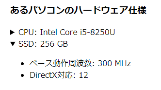

# インタラクティブ要素
<!-- ch3-10.txt (4ページ、3000～4600字想定) -->

ウェブページには、ユーザーの操作に動的に反応するインタラクションの仕組みがあります。近年のHTMLでは、簡単なインタラクションはHTMLのみで実現できるようになってきています。ここでは、HTMLネイティブの機能として定義されているインタラクティブ要素について解説します。

## `details`要素

`details`要素は、ユーザー操作によって追加の詳細情報を提示できるウィジェットを表します。ユーザーエージェントは、詳細情報の表示・非表示を切り替える機能を提供します。たとえばクリックやタップによる開閉を可能にします。

`details`要素には子要素として必ず`summary`要素を含まなければならず、詳細情報が非表示になった状態、すなわち閉じた状態では、`summary`要素の内容のみが表示されます。詳細情報が表示された状態、すなわち開いた状態になると、`details`要素の内容のすべてが表示されます。

以下は`details`要素と`summary`要素を使用した例です。

```html
<h1>あるパソコンのハードウェア仕様</h1>
<details>
  <summary>CPU: Intel Core i5-8250U</summary>
  <ul>
    <li>発売日: 2017年第3四半期</li>
    <li>ベース動作周波数: 1.60 GHz</li>
  </ul>
</details>

<details open>
  <summary>GPU: Intel UHD Graphics 620</summary>
  <ul>
    <li>ベース動作周波数: 300 MHz</li>
    <li>DirectX対応: 12</li>
  </ul>
</details>
```

これはたとえば以下のように表示されます。



### 内容モデル

`details`要素の内容モデルは、`summary`要素とFlowです。`summary`要素は必須であり、最初の子要素になっていなければなりません。`summary`要素は1つのみで、複数持つことはできません。

`summary`要素がない場合は構文上のエラーとなりますが、この場合、ユーザーエージェントは要約文を独自に補って表示することがあります。多くの場合、「詳細」や"Details"といった単語が使われます。

`summary`要素の後ろには任意のFlowの内容を置くことができます。`details`要素が展開された状態になると、残りの内容が表示されることになります。
<!-- /内容モデル -->

### 属性

`details`要素には`open`属性を指定できます。

#### `open`属性

`open`属性は、詳細情報を表示するブール型属性です。この属性が指定されていると、詳細情報が表示される「開いた」状態になります。そうでなければ詳細情報が表示されない「閉じた」状態になります。

### アクセシビリティ上の注意点

`details`要素のデフォルトのARIAロールは`group`です。

仕様上は`details`要素の先頭には必ず`summary`要素があり、`summary`要素はデフォルトで`button`ロールを持つため、多くのスクリーンリーダーは、開閉操作を行うボタンがあることを通知します。「下位項目が非表示になりました、展開ボタン」などと読み上げられることがあります。`summary`要素も参照してください。
<!--
読まれ方はこの辺り参照:
https://accessible-usable.net/2020/06/entry_200613.html
Mac VOが「下位項目が非表示になりました、展開ボタン」と読むのだけれど、もう少しわかりやすい読みをするスクリーンリーダーの例にしてもよい
-->
<!-- /a11y note -->

## `summary`要素

`summary`要素は、`details`要素の要約、キャプション、説明文を表します。`summary`要素は必ず`details`要素とセットで用いられ、`details`要素の子要素でなければなりません。用法については`details`要素を参照してください。

### 内容モデル

`summary`要素の内容モデルはPhrasingですが、`h1`などの見出し要素も混在させることができます。

`summary`要素に見出しを入れると、最初は見出しだけが見え、見出しをクリックすると内容が展開される仕組みを実現できます。ただし、スクリーンリーダーによっては、`summary`要素内の見出しをうまく扱えない場合がありますので注意が必要です。

見出し以外のPhrasingの要素を入れることもできます。フォーム内で使用する場合は、`label`要素を入れるような用法も考えられるでしょう。なお、`legend`要素を入れることはできませんので、`fieldset`要素を開閉させたい場合は別の仕組みを利用する必要があります。
<!-- /内容モデル -->

<!-- summary要素の属性はglobalのみ -->

### アクセシビリティ上の注意点

`summary`要素のデフォルトのARIAロールは`button`です。

多くのスクリーンリーダーは、この要素が開閉するボタンであることを伝えると同時に、対応する`details`要素の現在の開閉状態がわかるように通知します。これは、ボタンに`aria-expanded`属性が指定されている場合と同様の挙動です。たとえば、`summary`要素の内容を読み上げた後に、「ボタン、折り畳み」「ボタン、展開」などと読み上げることがあります。

`summary`要素内には見出しを入れることができますが、`summary`要素のデフォルトのロールが`button`であるため、ボタン内の見出しを見出しとして扱うことができないスクリーンリーダーも存在します。<!-- というようなことがMDNには書いてある。実際、Mac Chrome+VOで試すと「見出し」とは読まれなかった。「ボタン」とは読まれるので、ボタンラベル扱いのほうが優先なのだろう -->
<!-- /a11y note -->

## `dialog`要素

`dialog`要素は、ユーザーがタスクを実行するときのインタラクションに用いるアプリケーションの一部分を表現します。簡単に言えば、ダイアログボックスやサブウィンドウなどを表現するのに使用します。

<!-- サポート状況の注意 -->
この要素はまだ十分にサポートされておらず、ブラウザーによっては動作しないことに注意してください。2021年10月時点において、FirefoxとSafariはこの要素をサポートしていません。なお、Firefoxは`about:config`で`dom.dialog_element.enabled`を有効にすることで動作します。[^1]

[^1]: <https://developer.mozilla.org/ja/docs/Web/HTML/Element/dialog>

ブラウザーの種類を限定できる業務アプリケーションでは問題なく利用できるかもしれませんが、そうでない場合、とくにSafariでサポートされていない機能を採用することは難しいでしょう。
<!-- /サポート状況の注意 -->

### 内容モデル

`dialog`要素の内容モデルはFlowです。`dialog`要素の子孫要素に`method=dialog`を指定した`form`要素がある場合、フォーム送信時にダイアログを閉じ、送信した値を`returnValue`プロパティから取得できるようになります。Chapter3-9の`form`要素も参照してください。

以下は、ボタンを押すとダイアログが表示され、ダイアログ内のボタンを押すとダイアログが閉じる例です。
<!-- form 要素のところで使用した例の再掲。異なるものの方が良い? form要素を参照させる方が良い? -->
```html
<dialog id="confirm_dialog">
  <form method="dialog">
    <p>OKですか?</p>
    <button type="submit" value="OK">OK</button>
    <button type="submit" value="Cancel">Cancel</button>
  </form>
</dialog>
<script>
const dialog = document.getElementById('confirm_dialog');
const dialogOpen = () => {
  dialog.showModal();
};
dialog.onclose = () => {
  alert(dialog.returnValue);
};
</script>
<button type="button" onclick="dialogOpen()">ダイアログを開く</button>
```

上記の例では`showModal()`メソッドでダイアログを表示しているため、この`dialog`要素はモーダルダイアログとして表示されます。CSSの`z-index`プロパティを無視して最前面に表示される、ダイアログの外の要素にフォーカスが移らなくなる、といったモーダルダイアログ特有の処理が行われます。詳細な動作は仕様を参照してください。
<!-- /内容モデル -->

### 属性

`dialog`要素には`open`属性を指定できます。

#### `open`属性

`open`属性を指定すると、`dialog`要素は表示された状態になります。`open`属性はブール型属性です。この属性がない場合、`dialog`要素は非表示になります。`open`属性のない`dialog`要素を単にHTMLに書いても表示されませんので注意してください。

なお、JavaScriptからDOM操作で`open`属性を追加した場合、ダイアログは表示されますが、フォーカス制御が行われない、`close`イベントが発生しないといった不都合があります。JavaScriptで操作する場合は`show()`、`showModal()`、`close()`メソッドを呼ぶほうがよいでしょう。

### アクセシビリティ上の注意点

`dialog`要素のデフォルトのARIAロールは`dialog`です。スクリーンリーダーは「ダイアログ」と読み上げることがあります。

警告メッセージを表示する場合には、`role=alertdialog`を明示的に指定してロールを上書きしてもよいでしょう。

細かいフォーカス制御を実装する場合、`dialog`要素に`tabindex`属性を指定できないことに注意してください。`dialog`要素には`tabindex`属性を指定してはならないと仕様で明確に規定されています。
<!--
https://github.com/whatwg/html/commit/ef6494d86ae7baa4e095715c0a79b7fdc8efd223
-->
<!-- /a11y note -->
