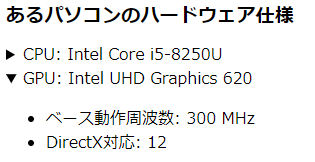

# インタラクティブ要素
<!-- ch3-10.txt (4ページ、3000～4600字想定) -->

Webページには、ユーザーの操作 (インタラクション) に動的に反応する仕組みが設けられることがあります。たとえば、クリックすると開く、ボタンを押すとダイアログが出る、といった仕組みです。このような動きは主にスクリプトによって実装されますが、近年のHTMLでは、簡単なインタラクションはHTMLのみで実現できるようになってきました。このようにユーザーのインタラクションに反応する要素を「インタラクティブ要素」(Interactive elements)と呼びます。

ここでは、HTMLネイティブの機能として定義されているインタラクティブ要素について解説します。

## `details`要素と`summary`要素

`details`要素は、ユーザーが追加情報やコントロールを得ることができるディスクロージャーウィジェットを表します。
要素の子である最初の`summary`要素がもしあれば、`details`のラベル要約または凡例を表します。

`open`属性は、詳細情報を表示する真偽属性です。存在する場合、詳細情報が表示される「開いた」状態になります。

```html
<h1>あるパソコンのハードウェア仕様</h1>
<details>
<summary>CPU: Intel Core i5-8250U</summary>
<ul>
<li>発売日: 2017年第3四半期</li>
<li>ベース動作周波数: 1.60 GHz</li>
</ul>
</details>

<details open>
<summary>SSD: 256 GB</summary>
<ul>
<li>ベース動作周波数: 300 MHz</li>
<li>DirectX対応: 12</li>
</ul>
</details>
```



図 3-10-01 details、summary要素のコード例のレンダリング

<!-- dialog要素はStableだとChromeのみ。 -->
