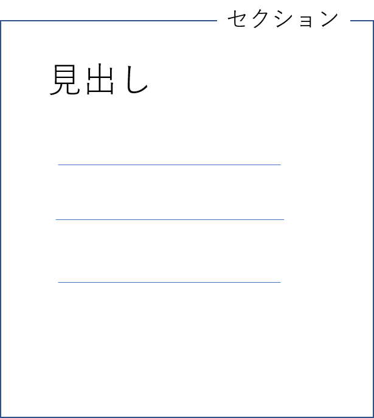

# セクション

このChapterでは、セクションと、セクションに関係する見出し、アウトラインおよびランドマークの概念について説明し、文書全体の構造を表現することを考えてみます。

## セクションとは

セクション（section）は、一般には区分や区画といった意味を持ちます。特に書籍や文章の一部分として、節という訳語が当てられます。

典型的な文章においては、節（セクション）に対して、節見出し（セクション見出し）がセクションの先頭に存在します。これは言い換えると、見出しがセクションの目印になっていると捉えることができ、セクションと見出しは密接に関係していると言えます。

セクションをもつ文章では多くの場合、セクションは階層構造になっています。セクションの深さに応じた日本語の呼びは一定ではありませんが、大きな括りの順から章、節、項とする場合が多いです。

```text
+----- 1章 -------------+
| 1章見出し             |
+-----------------------+

+----- 2章 -------------+
| 2章見出し             |
|                       |
| +---- 2.1節 --------+ |
| | 2.1節見出し       | |
| |                   | |
| | +- 2.1.1.項 ----+ | |
| | | 2.1.1項見出し | | |
| | |               | | |
| | +---------------+ | |
| |                   | |
| +-------------------+ |
|                       |
| +---- 2.2節  -------+ |
| | 2.2節見出し       | |
| |                   | |
| +-------------------+ |
+-----------------------+

+----- 3章 -------------+
| 3章見出し             |
+-----------------------+
```

図3-02-01 セクションの階層構造と対応する見出しの例

この例では、セクションに章番号をつけて、セクションと対応する見出しが存在する文章の階層構造を図示しました。

このように図示することで文章がどのような構造を持っているのかを正確に把握できますが、より簡単に文章構造を表すことができないものでしょうか。

### アウトライン

セクションからなる文章構造を単純に示すことを考えると、

- 各セクションの深さ
- そのセクションの内容の概略

の2つがわかればよいでしょう。この2つを表す1つの方法として、ツリー形式の表現が考えられます。

```text
├ 1章見出し
├ 2章見出し
│ ├ 2.1節見出し
│ │ └ 2.1.1項見出し
│ └ 2.2節見出し
└ 3章見出し
```

図3-02-02 アウトラインの例

この図のように、セクションの深さと概要を示したものを「アウトライン」（outline）と呼びます。このアウトラインでは、概要としてセクションの見出しを示しており、セクションの深さをリストのインデントで表現しています。

アウトラインは言葉を変えれば、“目次”のようなものと捉えることもできます。

HTML仕様ではこのアウトラインを機械的に取得する方法が「アウトラインアルゴリズム」（outline algorithm）としてルール化されています。アウトラインアルゴリズムの詳細については後述します。

## ランドマーク

「ランドマーク」（landmark）とは、“大きな建物など、遠くからでもはっきりと見ることができ、自分がどこにいるのかを知るのに役立つもの”という意味です。実世界の例としては東京スカイツリーを思い浮かべるとよいでしょう。

一方ウェブページにおいては、ヘッダーやフッター、サイトナビゲーション、ページの主要部分というようなサイト共有のものが、目印となるランドマークと言えます。

```text
+--- ヘッダー ----------+
|                       |
+-----------------------+

+--- ナビゲーション ----+
|                       |
|                       |
+-----------------------+

+--- 主要コンテンツ ----+
|                       |
+-----------------------+

+--- フッター ----------+
|                       |
+-----------------------+
```

図3-02-03 典型的なランドマークパターン

WAI-ARIA仕様では、ランドマークロールとして8種類の`role`の値が定義されており、これによりランドマークを表現することができます[^1]。

その一方、HTMLではWAI-ARIA仕様でランドマークロールに分類された`role`の値に対応する要素が用意されています。このChapterで紹介するものでは、`nav`要素、`aside`要素、`header`要素、`footer`要素が該当します。

これらの要素を活用することで、どのような領域なのかを明示することができます。

[^1]: https://www.w3.org/TR/wai-aria-1.2/#landmark_roles

### スクリーンリーダー視点での見出しとランドマーク <!-- コラムでもよい？ -->

ここで、ウェブサイトを音声読み上げすることができるスクリーンリーダーでサイトを読み上げることを考えてみます。視覚的にはモニタ上に2次元の情報として受け取ることになりますが、音声としては1次元の情報となります。1次元情報の捉え方としては、音楽再生ソフトで音声を再生するのがイメージしやすいでしょう。音楽再生ソフトの音声は、再生・停止ボタンそしてシークバーでコントロールできます。

1つのウェブページが1つの音声ファイルに対応しているとしましょう、1ページの情報が多くなるほど、ファイルの再生時間は長くなります。聞き飛ばしをしたい場合には、シークバーで任意の時間にジャンプすることができますが、シークバーを用いてピンポイントで“頭出し”したいと考えるでしょう。この頭出しの目標となるのが見出しに当たります。

```text
|----------------------------------------------------------------|
    |           |  |   |               |             |
    |           |  |   +-2.1.1節見出し |             |
    |           |  +2.1節見出し        +2.2節見出し  |
    +-1章見出し +-2章見出し                          +3章見出し
```

図3-02-04 ページを音声ファイルに見立てた場合の見出しイメージ

見出しの情報は、ウェブアクセシビリティの観点から重要視されています。スクリーンリーダーの利用者は、見出しのみを読み上げさせたり、見出しにジャンプしたりするような使い方をすることが多いようです。

このような背景もあり、WCAG 2.1達成基準2.4.6見出し及びラベル[^2]では、見出しを適切な文言にすることを求めています。また、達成基準2.4.10セクション見出し[^3]では、長い文書を複数のセクションに分割して見出しを追加することを推奨しています。

[^2]: https://www.w3.org/TR/WCAG21/#headings-and-labels

[^3]: https://www.w3.org/TR/WCAG21/#section-headings

さて、多くのサイトの場合、ヘッダーをはじめとするサイト共通のパーツ、つまりランドマークがあると考えられます。このランドマークでも頭出しすることができれば、見出しとは異なる目標を用いて情報を取得することができます。

サイト共通のパーツ単位の目標があれば、見出しに頼らなくても、目的のコンテンツに容易にたどり着くことができます。例えばフッター付近を読んでいるときに、ヘッダーに戻りたい場合、ヘッダーという目標があれば、見出しをたどらずとも容易に移動することができます。

```text
|----------------------------------------------------------------|
    |         |     |                                  |
    |         |     |                                  |
    |         |     |                                  |
    +-ﾍｯﾀﾞｰ   +-ﾅﾋﾞ +主要ｺﾝﾃﾝﾂ                         +ﾌｯﾀｰ
```

図3-02-05 ページを音声ファイルに見立てた場合のランドマークイメージ

なお、WCAG 2.1達成基準2.4.1ブロックスキップ[^4]では、こういったサイト内の共通要素を読み飛ばせるようにすることを求めています。

[^4]: https://www.w3.org/TR/WCAG21/#bypass-blocks

## セクションの表現とアウトラインアルゴリズム

前述したように、HTML仕様ではアウトラインアルゴリズムが定義されています。

しかしながら、W3C HTML 5.2仕様の"Creating an outline" の項[^3]では、アウトラインアルゴリズムについてサポートしている適合性チェッカーのような実装が知られていますが、ブラウザや支援技術の実装は知られていない、という旨の記述があります。

また、アウトラインアルゴリズムに関して、大幅に仕様を変更してはどうかという提案もあります。[^4]

[^3]: https://www.w3.org/TR/html52/sections.html#creating-an-outline

[^4]: https://github.com/whatwg/html/pull/3499

以下にアウトラインアルゴリズムを紹介しますが、前述のような事情もあり、アウトラインアルゴリズムについては、見出しをつけるコンセプトとして参考にするのに留めるのがよいでしょう。

### 見出しによる暗黙のセクション

HTMLには「見出し」(heading) を表現する要素が用意されています。見出し要素は`h1`から`h6`まで6種類が用意されており、見出しを使い分けることで、セクションの「ランク」（rank）を表現することができます。ランクは見出しの階層の深さを表します。

見出しのランクが適切に与えられていることで、そこからセクションの構造を推測できます。ある見出しが出現してから、次に同じランクもしくはランクの高い見出しが出現するまでを、ひとつのセクションとみなすことができます。

このようにして自動的に生成されるセクションのことを「暗黙のセクション」(implied section) と呼びます。

 <!-- 図は要検討 -->

図 3-02-06 見出しと暗黙のセクションの関係

ただし、暗黙のセクションではうまく表現できないケースもあります。以下のマークアップでは、文の途中に注釈を挟み、注釈が終わったあとにまた文が続く構造を意図しています。

```html
<h1>見出し1</h1>
<p>最初の本文です</p>
<div class="note">
  <h2>注意</h2>
  <p>注意書きです</p>
</div>
<p>本文の続きです</p>
```

```text
+- - - 暗黙のセクション -+
| 見出し1                |
| 最初の本文です         |
+- - - - - - - - - - - - +

+- - - 暗黙のセクション -+
| 注意                   |
| 注意書きです           |
| 本文の続きです         |
+- - - - - - - - - - - - +

```

図 3-02-07 暗黙のセクションの様子

暗黙のセクションでは、各要素は最も近い見出しに所属するものとみなされます。そのため、最後の文は`h1`のランクではなく、`h2`のランクになります。つまり、本文ではなく注釈の一部と解釈される可能性があります。

注釈を`div`要素で注釈であることを意図してマークアップしていますが、視覚的なスタイルとしての効果があるだけで、アウトラインに影響はありません。最後の文はあくまで注釈と同じ`h2`ランクのセクションに含まれることになります。

### セクショニングコンテンツによるセクションの明示

現在のHTML仕様では、セクションの範囲を明示するための要素が用意されています。前述の例の場合、以下のように`section`要素を使うことで、最後の文が`h1`に所属することを明示できます。

```html
<h1>見出し1</h1>
<p>最初の本文です</p>
<section class="note">
  <h2>注意</h2>
  <p>注意書きです</p>
</section>
<p>本文の続きです</p>
```

このようにセクションを明示する機能を持つ要素は他にもあり、「セクショニングコンテンツ」(sectioning content) と呼ばれるカテゴリに分類されています。`article`、`section`、`aside`、`nav`の4つの要素が所属しています。4つの要素の使い分けについては後述します。

逆に、これら以外の要素は、セクショニングコンテンツではないため、明示的なセクションを作りません。たとえば、`header`要素や`main`要素はセクショニングコンテンツではないため、見出しを直接の子要素にすると暗黙のセクションが作成されます。

#### コラム：入れ子によるランクの表現

このコラムに記載されたコード例については推奨されるものではありません。後述するように、見出しのランクを使い分けることを勧めます。また、`hgroup`要素で複数の見出しを囲んで小見出しを表現することに同じ問題があります。

セクショニングコンテンツを入れ子にして使えば、入れ子の深さでランクを表現できます。セクショニングコンテンツを入れ子にした場合、まず入れ子の深さでランクが判断され、見出し要素のランクよりも優先されます。

そうすると理論上、見出し要素の使い分けによるランクの表現は不要になります。先の例では`section`要素で階層構造を表現できているため、中の見出しを`h1`にすることもできます。

```html
<h1>見出し1</h1>
<p>最初の本文です</p>
<section class="note">
  <h1>注意</h1>
  <p>注意書きです</p>
</section>
<p>本文の続きです</p>
```

同じ`h1`要素が出現していますが、片方は`section`の中にあるため、1つ下のランクであると判断できます。HTMLのアウトラインアルゴリズムの上では、このようにしても、`h2`を使っていた時と同じアウトラインになります。

`section`要素を入れ子にしていけば、`h3`や`h4`に相当する階層も表現できます。

```html
<h1>見出し1</h1>
<p>見出し1の本文</p>
<section>
  <h1>見出し2</h1>
  <p>見出し2の本文</p>
  <section>
    <h1>見出し3</h1>
    <p>見出し3の本文</p>
    <section>
      <h1>見出し4</h1>
      <p>見出し4の本文</p>
    </section>
  </section>
</section>
```

入れ子を深くすれば、さらに深い階層も表現できます。見出し要素のランクは`h6`までしか用意されていませんが、この方法ならば7階層以上の深いランクも表現できます。

このように表現すると、階層によって見出しのマークアップを変更する必要がないというメリットもあります。見出しを含むHTMLの部品をコンポーネントとして使い回す際、従来の方法では、出現場所に応じて見出しのレベルを変更する必要がありました。この方法なら、完全に同じHTMLのまま使い回すことができます。

#### コラム：見出しランクとの併用

セクショニングコンテンツの入れ子と、見出しランクによる暗黙のセクションは併用することもできます。以下はHTML仕様に出ているマークアップ例です。

<!-- specからそのまま持ってきたので、もうちょっとどうにかする -->
<!--とびとびのランクの例-->
```html
<body>
 <h4>りんご</h4>
 <p>りんごは果物です。</p>
 <section>
  <h2>味</h2>
  <p>すばらしい味です。</p>
  <h6>甘さ</h6>
  <p>赤りんごは青りんごよりも甘い。</p>
  <h1>色</h1>
  <p>さまざまな色があります。</p>
 </section>
</body>
```

このマークアップでは見出し要素のランクがとびとびですし、暗黙のセクションも存在しますが、理論上は問題なく、以下のようなアウトラインになります。

```text
りんご
├ 味
│ └ 甘さ
└ 色
```

しかし、先にも述べたように、アウトラインアルゴリズムはユーザエージェントでサポートされません。そのため、セクションの入れ子階層に応じたランクの見出し要素を使用することが推奨されます。先の例は以下のようにマークアップするとよいでしょう。

<!--ランクに応じた見出しの例-->
```html
<body>
 <h1>りんご</h1>
 <p>りんごは果物です。</p>
 <section>
  <h2>味</h2>
  <p>すばらしい味です。</p>
  <section>
   <h3>甘さ</h3>
   <p>赤りんごは青りんごよりも甘い。</p>
  </section>
 </section>
 <section>
  <h2>色</h2>
  <p>さまざまな色があります。</p>
 </section>
</body>
```

### タイトルのないセクション <!-- コラム？ -->

セクショニングコンテンツは、基本的に見出し要素と併用します。セクショニングコンテンツ内の最初の見出しがそのセクションのタイトルになります。

セクショニングコンテンツ内に見出しが複数ある場合、先に説明したように、2番目以降の見出しは暗黙のセクションを作ります。このため、1つのセクションに複数のタイトルがつくようなことはありません。

では、セクショニングコンテンツ内に見出しが全くない場合はどうなるでしょうか。この場合、タイトルのないセクションができることになります。アウトラインを表示するツールでは "Untitled section" のような仮タイトルが与えられることがあります。

タイトルのないセクションは禁止されてはいませんが、アウトラインの観点からは理解しにくくなり、好ましいとは言えません。そのため、HTMLチェックツールは警告を出すことがあります。たとえば、Nu HTML Checker は以下のような警告メッセージを出します。

>Warning: Section lacks heading. Consider using h2-h6 elements to add identifying headings to all sections.

### セクショニングルート

見出しやセクショニングコンテンツが単純にアウトラインに組み込まれると困る場合もあります。その典型例は引用です。引用した文章に見出しやセクションが含まれる場合、その見出しが文書全体のアウトラインに影響すると混乱が生じてしまいます。

以下は`blockquote`要素を使用して文章を引用している例です。引用部分に見出しが含まれますが、これは単に引用元に見出しがあったに過ぎません。

<!-- 構造はMDNからお借りしており -->
```html
<section>
  <h1>初音ミク</h1>
  <section>
    <h2>はじめに</h2>
    <p>このセクションでは、黎明期の初音ミクについて説明します。</p>
  </section>
  <section>
    <h2>アイテム</h2>
    <p>初音ミクの定番アイテムといえばネギが有名ですが、ここでWikipediaの『初音ミク』の記述を見てみましょう。</p>
    <blockquote>
       <h1>初音ミクとネギ</h1>
       <p>これは派生キャラクターのはちゅねミクを生み出した動画...</p>
    </blockquote>
  </section>
</section>
```
<!-- ここまでMDNから構造をお借り -->

このようなケースでは、引用内部の見出しが文書アウトラインに出現すると混乱が生じます。かといって見出しを単に無視すると、引用部に複数の見出しが現れるようなケースで、引用部のアウトラインを理解できなくなってしまいます。

そこでHTML仕様では、`blockquote`要素の内側と外側が独立したアウトラインを持つようになっています。このように、その要素内に独自のアウトラインを持ち、内側のセクションと見出しが祖先のアウトラインに寄与しないものを「セクショニングルート」(sectioning root)と呼びます。

先ほどの例は、次のアウトラインを導き出します。

```text
初音ミク
├ はじめに
└ アイテム
```

引用を表す`blockquote`要素はセクショニングルートとされているため、中にあった見出しは文書全体のアウトラインには現れていません。

このように、セクショニングルートとなる要素は他にもあります。代表例のひとつは`td`要素です。`td`要素は表のセルを表しますが、セル中に見出しが出現しても文書全体のアウトラインには影響しません。`table`要素をレイアウト目的に使っていると、意図したアウトラインにならないことがあるので注意が必要です。

他にセクショニングルートとなるのは、`body`要素, `details`要素, `dialog`要素, `fieldset`要素, `figure`要素です。

`body`要素もセクショニングルートであることに注意してください。たとえば以下のようにマークアップしたとします。

```html
<body>
<section>
 <h1>Apples</h1>
 <p>Pomaceous.</p>
</section>
</body>
```

この場合、`body`要素に対応する見出しがないため、タイトルのないセクションができることになります。アウトラインは以下のようになります。

```text
[body element with no heading]
└ Apples
```

## `body`要素

`body`要素は、文書のコンテンツを表します。`head`要素内のメタデータが原則として画面に表示されないものだったのに対し、こちらは原則として表示される内容を記述するセクションと言えます。`html`要素の2番目の子として、つまり`head`要素の弟として、HTML文書に必ず1つのみ存在します。

`body`要素は開始タグも終了タグも省略可能です。そのため、マークアップ上は`<body>`タグが現れないこともありますが、その場合でも`body`要素は必ず補われてDOMツリーに追加されます。

`body`要素に必須の属性はありませんが、グローバル属性と、いくつかの固有のイベントハンドラー属性を指定することができます。もっとも近年では、イベントハンドラ属性をHTMLに直接書く機会は少ないでしょう。

```html
<body onload="...">
```

`body`には`class`属性を指定することもできます。これにより、ウェブサイトにおける特定のテンプレートや固有のページに対して、スタイルシートを適用することもできます。

```html
<body class="example-class-1 example-class-2">
```

<!-- 互換性メモ -->
### 廃止された属性: `bgcolor`属性、`text`属性、`link`属性、`alink`属性、`vlink`属性

かつてのHTML仕様では、`body`要素に`bgcolor`、`text`、`link`、`alink`、`vlink`属性が定義されていました。これらは色を指定するもので、順に、ページの背景色、文字色、リンク色（通常、アクティブ時、訪問済み）を指定します。いずれも見た目の色を指定するものであり、現在ではCSSで指定できるため、これらの属性は廃止されています。色指定はCSSで行います。
<!-- /互換性メモ -->

<!-- 内容モデル -->
`body`の内容モデルは"Flow"です。古いHTMLのルールでは、以下のように`body`の直接の子要素として`img`要素やテキストを入れることができない場合がありました。

```html
<body>

テキスト
</body>
```

現在のHTMLにおいて`body`要素にはそのような制限はなく、直下にテキストを書いたり画像を置いたりすることができます。上記は現在のHTML仕様では問題のないマークアップとなります。
<!-- /内容モデル -->

## `section`要素

`section`要素は、文書またはアプリケーションの一般的なセクションを表します。

この要素は汎用のコンテナ要素ではないことに注意してください。すでに説明したように、タイトルのないセクションができることは望ましくありません。見出しを持たないようなブロック、たとえば見た目上の単なる囲みや、JavaScriptで制御するためのエリア等が必要な場合は、`div`要素を使用します。

<!-- よくない例 -->
```html
<section>
  <section>
    <section>
      <h3><code>section</code>要素</h3>
      <p><code>section</code>要素は、文書またはアプリケーションの一般的なセクションを表します。
    </section>
  </section>
</section>
```

<!-- 修正例 -->
```html
<div>
  <div>
    <section>
      <h3><code>section</code>要素</h3>
      <p><code>section</code>要素は、文書またはアプリケーションの一般的なセクションを表します。
    </section>
  </div>
</div>
```

<!-- a11y note -->
`section`要素は、通常はデフォルトのロールを持たず、ランドマークとして扱われることもありません。

ただし、`aria-label`、`aria-labelledby`、`title`などの属性を指定して明示的に名前をつけた場合は、デフォルトが`region`ロールとなり、ランドマークとして扱われます。通常は`section`の中に見出しがあるでしょうから、`aria-labelledby`で見出しをそのまま名前にすることができます。

```html
<section aria-labelledby="region-title">
  <h3 id="region-title">セクションのタイトル</h3>
  <p>...</p>
</section>
```

<!-- どのような場合に付与するとよいのか？ -->
もっとも、このように名前をつけてランドマークにすることが常に望ましいわけではありません。`section`は文書内で多用される場合があり、そのすべてがランドマークとして扱われると利用者は混乱します。ランドマークにしたいという積極的な理由がなければ、不用意に`section`に名前を与えない方が良いでしょう。
<!-- /a11y note -->

## `article`要素

`article`要素は、自己完結型の構造を表します。これは、サイトのページやアプリケーションの中での、ブログの投稿、ニュースの記事、インタラクティブなウィジェットなどが該当します。

`article`要素はネストされることがあります。この場合、原則的に内側の`article`要素は、外側の`article`要素に関連したものとなります。たとえば、ブログエントリーを`article`とし、それに対する個々のコメントもそれぞれ`article`にする、といった例が挙げられます。

<!-- やる気が皆無…もっとまともな例をですね。 -->
```html
<article class="entry">
  <header>
    <h2>テスト投稿</h2>
    <p>
      <time>2017-01-23</time>
    </p>
  </header>
  <section>
    <p>テスト投稿だよ。自由にコメントしてね。</p>
  </section>
  <section class="user_comments">
    <article class="user_comment">
      <p>記念にコメントするッスよー！</p>
      <footer>
        <p>
          ななしさん <time>2017-01-23 19:00</time>
        </p>
      </footer>
    </article>
    <article class="user_comment">
      <p>あなたはブログがかけるフレンズなんだね！</p>
      <footer>
        <p>
          ななしさん <time>2017-01-23 19:02</time>
        </p>
      </footer>
    </article>
  </section>
</article>
```

`article`要素内に`address`要素を入れると、その`article`の著作者の連絡先情報を表します。たとえば、複数の著作者が執筆しているブログでは、ブログエントリーそれぞれを`article`とし、中に`address`を入れることで、記事ごとに異なる執筆者の連絡先を示すことができます。

<!-- a11y note -->
`article`要素はデフォルトで`article`ロールを持ちます。`article`はランドマークではありませんが、スクリーンリーダーは特別な扱いをすることがあります。たとえば、iOSのVoiceOverは、`article`に差し掛かると「記事 ランドマーク」と読みあげます。
<!-- /a11y note -->

### `article`か`section`か

`article`要素と`section`要素は、どちらも見出しを伴ったセクションを表します。似通った要素であるため、使い分けることが難しいかもしれません。使い分け方はコンテンツ制作者の意図次第ですが、そのセクションだけで自己完結するかどうかが1つのポイントになります。

たとえば、Twitterのツイートは、その1つだけで1つのコンテンツとなるため、`article`要素で表現することが適切です。発言が1つのツイートに収まりきらず、複数回連続でツイートしたならば、それぞれのツイートを`section`要素でマークアップしたうえで、一連のツイートを`article`要素で包むことも考えられます。

コンテンツの長さで使い分けるのではなく、文脈によって使い分けましょう。

## `aside`要素

`aside`要素は、メインコンテンツと副次的に関連するものの、メインコンテンツから分離できると考えられるセクションを表します。典型的には、サイドバーや広告、その他の補足情報など、メインコンテンツと切り離すことのできるコンテンツに適しています。

言い換えると、コンテンツと切り離すことが難しい、単なる挿入句のようなものは当てはまりません。
<!-- 何か例を挙げる -->

```html
<aside>
<iframe src="..." title="広告"></iframe>
</aside>
```

<!-- a11y note -->
`aside`要素はデフォルトで`complementary`ロールを持ち、ランドマークとして扱われます。スクリーンリーダーでは、任意の`aside`にジャンプしたり、特定の`aside`を丸ごとスキップできる場合があります。
<!-- /a11y note -->

## `nav`要素

`nav`要素は、ナビゲーションのセクションを表します。ナビゲーションには、サイトの他のページへのリンクが含まれていることもあれば、ページ内のリンクが含まれることもあります。

1つのページに複数の`nav`要素があっても構いません。たとえば、グローバルナビゲーションとローカルナビゲーションの両方がある場合、それぞれを`nav`要素としてマークアップすることができます。

<!-- 内容モデル -->
`nav`の内容モデルは"Flow"です。`nav`の直下に`ul`などのリストをいれてリンクの`a`要素を列挙するパターンがよく見られますが、必ずリストをいれなければならないわけではありませんし、他の要素を入れることもできます。見出しや説明文など、ナビゲーションの機能を説明する要素を入れても問題ありません。

<!--なにかナビゲーションの例-->
```html
<nav>
<h2>ナビゲーション</h2>
<ul>
  <li><a href="/">トップページ</a></li>
  <li><a href="/book">本</a></li>
  <li><a href="/computer">コンピュータ</a></li>
</ul>
</nav>
```
<!-- /内容モデル -->

また、コンテンツ内のリンクのグループすべてを`nav`要素に入れる必要もありません。たとえば、ページのフッターにリンクが数件含まれるようなケースはよく見られます。

<!--小さなフッターの例-->


図 3-02-08 あるウェブサイトに存在するページフッターの様子

このような問い合わせ先を含む小さなフッターは、単に`footer`要素だけで十分です。`footer`の中に`nav`を入れることも可能ですが、無理に`nav`としてマークアップする必要はないでしょう。

<!-- a11y note -->
`nav`要素はデフォルトで`navigation`ロールを持ち、ランドマークとして扱われます。スクリーンリーダーでは、ナビゲーションが不要な時は読み飛ばし、必要になった時にジャンプできる場合があるため、利便性が大きく向上します。

`nav`を使うかどうか迷った場合は、読み飛ばしやジャンプができると便利なら`nav`にする、と考えると良いでしょう。
<!-- /a11y note -->

## `h1`-`h6`要素

`h1`-`h6`要素は、セクションの見出しを表します。これらの要素は、要素名の数字で与えられるランクを持ちます。`h1`要素が最高ランクを持ち、`h6`要素が最低ランクを持ちます。また、同じ名前の要素は等しいランクを持ちます。

<!-- 内容モデル -->
`h1`-`h6`要素の内容モデルは"Phrasing"です。"Flow"ではないため、`h1`の中に`div`などを入れることはできません。
<!-- /内容モデル -->

<!-- a11y note -->
`h1`-`h6`要素はデフォルトで`heading`ロールを持ち、要素名の数字に等しい`aria-level`を持ちます。たとえば、`h2`要素にはデフォルトで`role=heading`と`aria-level=2`が設定されます。

スクリーンリーダーは一般的に、見出しを「見出し レベル 2」のように読み上げます。また、見出しにジャンプすることもできます。ランドマークに対応していない古いスクリーンリーダーでも、見出しジャンプには対応しているケースがほとんどです。

先に述べたように、HTML5のアウトラインアルゴリズムは`section`の入れ子でランクを表現できますが、ほとんどのスクリーンリーダーはこの機能には対応していません。見出しのランクを適切に設定しないと、利用者は混乱することがあります。

見出しランクは6までしかありません (つまり`h7`は存在しません)。7以上のランクを指定したい場合は、`aria-level`属性を利用することで表現できます。

```html
<h6>h6見出し</h6>
<h6 aria-level="7">h7見出し</h6>
```

ただし、このような深いランクのアウトラインが利用者に理解できるかどうかは別の問題です。また、`aria-level`に対応していないスクリーンリーダーも存在します。深いランクの使用は慎重に検討してください。
<!-- /a11y note -->

## `header`要素

`header`要素は、いわゆるヘッダーのセクションを表します。セクションの導入部分やナビゲーションの補助を表します。使い方としては、そのセクションの見出しを含めることが考えられますが、これは必須ではありません。

`header`要素が使われる箇所によって、受ける扱いが若干異なります。`body`要素の子要素になっている場合など、祖先に他のセクショニングコンテンツがない場合には、ページ全体のヘッダーとして扱われます。

```html
<body>
  <header>
    <h1>メインページのタイトル</h1>
    
  </header>
...
</body>
```

<!-- a11y note -->
この場合には、`header`要素はデフォルトで`banner`ロールを持ち、ランドマークとして扱われます。スクリーンリーダーはここにジャンプしたり、読み飛ばしたりすることができる場合があります。
<!-- /a11y note -->

`header`要素を他のセクショニングコンテンツ中に入れた場合、そのセクションのヘッダーを表します。たとえば`article`要素に入れると、記事のヘッダーとして使うことができます。

```html
<article>
  <header>
    <h1>HTML</h1>
    <h2>Living Standard — Last Updated <time datetime="2019-08-30">30 August 2019</span></h2>
  </header>
  <p>HTML Living Standardは随時更新される文章です。</p>
  <p><a href="/20190930">続きを読む...</a></p>
</article>
```

<!-- a11y note -->
この場合には、`header`要素はデフォルトのロールを持たず、ランドマークとしては扱われないことになっています。
<!-- /a11y note -->

`header`要素自身はセクショニングコンテンツではないため、新しいセクションを設けません。`header`要素の後ろに見出しがないようなケースでは、意図しないアウトラインができてしまうことがあります。

```html
<header>
  <h1>メインページ</h1>
  <h2>このページについて</h2>
  <p>このページは……</p>
</header>
<p>こんにちは、私は……</p>
```

この場合、`header`の外にある「こんにちは、私は……」という文は「このページについて」という見出しのセクションに属することになります。`section`要素で明示的にマークアップするか、見出しを置くようにしましょう。

## `footer`要素

`footer`要素は、いわゆるフッターを表現します。最も近い祖先のセクショニングコンテンツ、またはセクショニングルートのフッターを表します。フッターは、著作者に関する情報、関連文書へのリンク、著作権に関する情報などを含みます。

```html
<footer>
<p>最終更新 2018年5月7日 (月) 11:23 （日時は個人設定で未設定ならばUTC）。</p>
<p>テキストはクリエイティブ・コモンズ 表示-継承ライセンスの下で利用可能です。追加の条件が適用される場合があります。詳細は利用規約を参照してください。</p>
</footer>
```

`footer`要素は、多くの点が`header`要素と共通しています。`body`要素の子要素になっている場合など、祖先に他のセクショニングコンテンツがない場合には、ページ全体のフッターとして扱われます。

<!-- a11y note -->
この場合には、`footer`要素はデフォルトで`contentinfo`ロールを持ち、ランドマークとして扱われます。スクリーンリーダーはここにジャンプしたり、読み飛ばしたりすることができる場合があります。フッターを読み飛ばすのは無意味かもしれませんが、フッターにジャンプできる機能は有用でしょう。
<!-- /a11y note -->

`footer`要素を他のセクショニングコンテンツ中に入れた場合、そのセクションのフッターを表します。この場合はデフォルトのロールを持たず、ランドマークとしては扱われません。

## `address`要素

`address`要素は連絡先情報を表します。祖先に`article`要素がある場合、最も近い`article`要素の連絡先情報となります。そうでない場合は`body`要素と関連づけられ、文書全体の連絡先情報を表します。

<!-- 内容モデル -->
`address`要素の内容モデルは"Flow"です。古いHTMLのルールでは、`address`要素の中に`p`要素や`ul`要素などを入れることができませんでしたが、現在のHTML仕様ではそのような制限はありません。
<!-- /内容モデル -->

連絡先情報の内容は限定されていません。著作者の名前や電子メールアドレス、SNSのアドレス等が書かれることが一般的ですが、電話番号、郵便番号、住所といったものでも構いません。ただし、これらは`address`要素の属する文書や記事 (その文書全体か、もしくは祖先の`article`) に対する連絡先とみなされることに注意してください。

```html
<body>
...
<!-- article要素が祖先になければ、文書全体の連絡先となる -->
<address>
<p>株式会社ボーンデジタル</p>
<p>〒102-0074<br>
東京都千代田区九段南一丁目5番5号<br>
九段サウスサイドスクエア（旧 Daiwa九段ビル）</p>
</address>
</body>
```

コンテンツとは関係のない住所 (たとえば懸賞の送り先など) を提示するような場合には、`address`要素は使わず、単に`p`要素などでマークアップすると良いでしょう。

<!-- a11y note -->
なお、`address`要素はデフォルトのロールを持たず、ランドマークとしては扱われません。一般的に、連絡先の情報はフッターに入れられることが多いため、`footer`要素の中に入れておくと見つけやすいでしょう。
<!-- /a11y note -->

<!-- 互換性情報 -->
ちなみに参考情報として、W3C HTML 5.2においては、`article`要素や`body`要素に関する言及はなく、人または組織の連絡先情報を表すとされていました。連絡先情報には、“物理的および/またはデジタル的な場所/連絡先情報、そして情報が関係する人または組織を識別する手段を含むべきである”と記述されていました。

何が連絡先情報か、言い換えれば何が`address`要素としてふさわしいのか、少し考えると難しい側面があります。しかし、文書や記事に関連する連絡先情報であるかどうかが`address`要素として適当かどうかの決め手であることは言えます。
<!-- /互換性情報 -->
