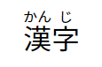

<!-- ch3-4.txt (4ページ、3000～4600字想定) -->
# テキストレベルセマンティックス

このChapterでは、30ほど存在する、主にテキストをマークアップすることを目的としたテキストレベルセマンティックスとしてHTML仕様で分類されている要素を紹介します。

## `a`要素

`a`要素は、「アンカー」(anchor)を表現する要素です。多くの場合は`href`属性を指定して、リンクとして利用します。詳細についてはChapter3-5で紹介します。

## `em`要素

`em`要素は、強調、強勢を表します。たとえば、文の一部を強調してニュアンスを変化させることができます。以下は具体的です。

```html
<p>猫はかわいい動物です。</p>
<p><em>猫</em>はかわいい動物です。</p>
<p>猫<em>は</em>かわいい動物です。</p>
<p>猫はかわいい<em>動物</em>です。</p>
<p><em>猫はかわいい動物です！</em></p>
```
<!-- 原文 Cats are cute animals. 日本語では「は」と「が」のニュアンスが異なるため、あまりよい例ではないようにも感じる。 -->

`em`要素の有無や場所によってニュアンスが違ってきます。「猫」を強調すれば、動物の種類が重要というニュアンスになりますし、「動物」を強調すれば、かわいいけれどあくまで動物であることを忘れないようにというニュアンスが出てくるでしょう。`em`要素は文全体も強調可能であり、その場合は、意図を伝えるために懸命であるようなニュアンスが出てきます。

### 内容モデル

`em`要素の内容モデルはPhrasingです。`em`要素自身もPhrasingに属しますから、複数の`em`要素を入れ子にもできます。これによって、より強いレベルの強調を表現できます。
<!-- /内容モデル -->

### アクセシビリティ上の注意点

`em`要素にはデフォルトのロールはありません[^3]。多くのスクリーンリーダーは、`em`要素について特別な読み上げをしないため、伝わらない可能性があります。`em`要素の有無で文の意味が大きく変わるような表現は避けたほうがよいでしょう。

[^3]: WAI-ARIA 1.2では`emphasis`ロールが定義されています。<https://www.w3.org/TR/wai-aria-1.2/#emphasis>

典型的なブラウザーのデフォルトスタイルシートでは、`em`要素がイタリック体（斜体）で表現されるため、斜体を表現する意図でこの要素が使用されることもあります。しかし、`em`要素は斜体のための要素ではありません。英語のようなアルファベット主体の言語において、慣用的にイタリック体にする必要がある箇所については、`i`要素の利用がおそらく適切でしょう。

また、`em`要素は重要性を伝えるものではない点に注意してください。重要性を伝えたい場合には、後述の`strong`要素を使います。
<!-- /a11y note -->

## `strong`要素

<!--
仕様でこの要素だけ Importance: のようなユニークな書き方をしているのは、これ自体をstrong要素のマークアップ例としているため。書籍ではこのスタイルを踏襲する意味はないものと思われる。
>For example, the first word of the previous paragraph is marked up with strong to distinguish it from the more detailed text in the rest of the paragraph.
-->
`strong`要素は、重要性、深刻性、または緊急性を表します。古いHTMLでは強調を表すとされていましたが、現在は単なる強調の目的で使用することは推奨されません。強調目的には`em`要素を使用します。

以下は`strong`要素で重要性を表現した例です。文から本当に重要である部分を区別するために、見出し、キャプション、または段落で使用できます。

```html
<p><strong>酸性タイプ</strong>の製品と一緒に使う（まぜる）と有害な塩素ガスが出て<strong>危険</strong>。</p>
```

以下は深刻性を示した例です。警告または注意の通知をマークアップするために使用できます。

```html
<p><strong>注意。</strong>テレビを見るときは、部屋を明るくして、なるべくテレビから離れて見てね。</p>
```

以下は緊急性を示した例です。ユーザーに、他の部分より先に読んでほしい箇所を示すために使用しています。

```html
<p>リマインダー</p>
<p>今日のタスク:</p>
<ul>
  <li><p><strong>オーブンの電源を切る。</strong></p></li>
  <li><p>ごみを出す。</p></li>
  <li><p>洗濯する。</p></li>
</ul>
```

### 内容モデル

`strong`要素の内容モデルはPhrasingです。`strong`要素自身もPhrasingに属しますから、複数の`strong`要素を入れ子にもできます。これによって、より強い重要性を表現できます。
<!-- /内容モデル -->

### アクセシビリティ上の注意点

`strong`要素にはデフォルトのロールはありません。[^4]重要性を伝えるとされているにもかかわらず、多くのスクリーンリーダーは、`strong`要素について特別な読み上げをしないことに注意してください。`strong`要素の有無で文の意味が大きく変わるような表現は避けたほうがよいでしょう。
<!-- /a11y note -->

[^4]: WAI-ARIA 1.2では`strong`ロールが定義されています。 <https://www.w3.org/TR/wai-aria-1.2/#strong>

## `small`要素

`small`要素は、一般的に小さい文字で表記されるような、副次的なコメントを表現します。例としては、著作権表示、免責事項、法的な注意書きなどが挙げられます。以下は著作権の帰属表示（Copyright）に用いられている例です。

```html
<p><small>© ボーンデジタル</small></p>
```

その他の副次的なコメントを表現するのに使うこともできます。

```html
<p>しょうゆ 198円<small>（税込み）</small></p>
```

`small`要素が文を弱める意味を持たないことに注意してください。`em`要素や`strong`要素と反対の意味にはなりません。`em`要素や`strong`要素と併用して、`small`要素で表現された内容を強調したり、重要性を表現したりできます。

### 内容モデル

`small`要素の内容モデルはPhrasingです。基本的に、文章のテキストの一部を修飾する形で利用します。注意書きが長文になるケース、たとえば複数の段落で構成される利用規約を掲載するような場合には、`small`要素を利用するべきではありません。そのような利用規約はもはや主題となる内容であって、副次的なコメントとしては扱いません。
<!-- /内容モデル -->

### アクセシビリティ上の注意点

`small`要素にはデフォルトのロールはありません。多くのスクリーンリーダーは、`small`要素について特別な読み上げをしませんので、`small`要素が使われていることは伝わらない可能性があります。`small`要素の有無で意味が大きく変わるような表現は避けたほうがよいでしょう。
<!-- /a11y note -->

## `s`要素

`s`要素は、もはや正確でなくなったものや、関連しなくなったものを表現します。ブラウザーのデフォルトスタイルシートでは、多くの場合、打ち消し線を伴って表現されます。以下の例は、価格が値下げされ、値下げ前の価格がもはや正確でないことを表現するために`s`要素を用いています。

```html
<p>ゲーミングキーボード</p>
<p><s>希望小売価格 15000円</s></p>
<p>セール価格 9800円</p>
```

`s`要素は、編集による削除や訂正を表現するわけではないことに注意してください。編集による削除を表現したい場合は`del`要素を使用します。

### 内容モデル

`s`要素の内容モデルはPhrasingです。他のPhrasingに属する要素をまるごと修飾可能です。しかし、`p`要素などのFlowに属する要素を子にはできないため、段落全体を`s`要素で修飾するような使い方はできないことに注意してください。
<!-- /内容モデル -->

### アクセシビリティ上の注意点

`s`要素にはデフォルトのロールはありません。多くのスクリーンリーダーは`s`要素について特別な読み上げをしないことに注意してください。`s`要素はテキストの意味を変更する意図で使われることが多いにもかかわらず、そのことが伝わらないことに特に注意が必要です。以下は望ましくない例です。

<!-- 望ましくない例 -->
```html
<p>価格<s>98</s>90円</p>
```

これは、視覚的には98円を90円に訂正したように見えるでしょう。しかし、`s`要素の存在が伝わらないケースでは、9890円の商品であると誤解される可能性があります。先に挙げた例のように、それぞれの価格が何であるのか、前後のテキストからわかるようにするのが好ましいです。
<!-- /a11y note -->

## `cite`要素

`cite`要素は、作品などのタイトルを表現します。ここでいう作品には、書籍、文書、楽曲、映画、ゲーム、プログラム、美術作品、ウェブページといったさまざまなものを含みます。ただし、ここでいうタイトルには作品の著作者名を含む人名は対象にはなりません。

典型的には、引用の際の出典や、参考文献のタイトルを示す際に利用します。たとえば、SIST 02『参照文献の書き方』[^5]に従った文献情報は、次のようにマークアップできます。

```html
<p>Berners-Lee, Tim. <cite>Web の創成 World Wide Web はいかにして生まれどこに向かうのか</cite>. 高橋徹監訳. 毎日コミュニケーションズ, 2001, 279p.</p>
```

[^5]: <https://jipsti.jst.go.jp/sist/handbook/sist02_2007/main.htm>

また、通常の文章の途中での利用もできます。

```html
<p>本文は英語版Wikipediaの<cite>HTML</cite>の項目を参考にしました。</p>
```

タイトル以外のものを`cite`要素に含めてはなりません。たとえば、以下は誤った例となります。

<!-- 正しくない例 -->
```html
<p>本文は<cite>英語版WikipediaのHTMLの項目</cite>を参考にしました。</p>
```

### 内容モデル

`cite`要素の内容モデルはPhrasingです。作品のタイトルにマークアップを含むことは少ないでしょうが、Phrasingに属する要素を入れることは可能です。
<!-- /内容モデル -->

### アクセシビリティ上の注意点

`cite`要素のデフォルトのロールはありません。多くの場合、作品のタイトルであることは前後の文脈から伝わると思われますが、`cite`要素によって意味がわかるような表現は避けましょう。
<!-- /a11y note -->

## `q`要素

`q`要素は、別のソースから引用されたフレージングコンテンツを表します。これは短い引用のためのものです。一定以上の長さのある、段落の塊を引用するような場合には`blockquote`要素が適切です。

この要素を用いると、ブラウザーによって要素の前後に引用符が自動的に挿入されます。そのため、要素の前後に引用符の文字を入れてはなりません。逆に、テキスト中の引用箇所に既に引用符が付いているならば、`q`要素として無理にマークアップする必要はありません。

なお、補われる引用符の種類は言語に依存し、たとえば日本語ではかぎ括弧（「」）、英語ではクォーテーションマーク（""）となるのが一般的です。また、スタイルシートで引用符の種類を指定もできます[^6]。

[^6]: <https://www.w3.org/TR/CSS2/generate.html#propdef-quotes>

以下は`q`要素を使用して俳句を引用した例です。

```html
<p lang="ja">松尾芭蕉が<q>五月雨を集めて早し最上川</q>と詠んだ最上川は……</p>
<p lang="en">The Mogami River, which Matsuo Basho wrote the Japanese poem <q>五月雨を集めて早し最上川</q>, is ...</p>
```

一般的なブラウザーのデフォルトスタイルでは、以下のように引用符が補われます。

```text
松尾芭蕉が「五月雨を集めて早し最上川」と詠んだ最上川は……
The Mogami River, which Matsuo Basho wrote the Japanese poem “五月雨を集めて早し最上川”, is ...
```

引用ではないものに対して`q`要素を使用してはなりません。たとえば、特別な意味で使用する単語や、人物の発言などを引用符で括る表現は一般的ですが、それらは引用ではないため、`q`要素で表現することは適切とはなりません。

`cite`属性を指定すると、引用の出典となるURLを示すことができます。指定できる値は、「潜在的にスペースで囲まれた妥当なURL」(valid URL potentially surrounded by spaces)で、これは`a`要素の`href`属性と同様です。ただし、この属性はページの読者のためのものではないため、一般的なブラウザーはリンクとしては扱わないことに注意してください。出典へのリンクを設けるためには、`cite`要素と`a`要素を併用することで実現します。

### 内容モデル

`q`要素の内容モデルはPhrasingです。`q`要素自身もPhrasingに属するため、`q`要素を入れ子にもできます。つまり、引用を含むフレーズをさらに引用したという表現が可能です。
<!-- /内容モデル -->

### アクセシビリティ上の注意点

`q`要素にはデフォルトのロールはありません。スクリーンリーダーは`q`要素を特別なものとして読み上げない可能性があります。ただし、前後に補われた引用符は読まれることがあります（記号を読み上げるかどうかはスクリーンリーダーの設定に依存し、設定によっては読まない場合もあります）。
<!-- /a11y note -->

## `dfn`要素

`dfn`要素は、文書中で用語を定義する際の、定義された用語を表します。

この要素を使用する際は、その定義（用語の説明）とセットにする必要があります。`dfn`要素の最も近い祖先要素となる段落（典型的には`p`要素ですが、`p`要素に限りません）、セクション、あるいは説明リスト（`dl`要素）のグループに定義の説明を含めなければなりません。

通常は、`dfn`要素の内容が用語として定義されることになります。以下の例では「dfn」という単語を定義していることになります。

```html
<!-- dfn要素として囲まれたテキスト、dfnが定義 -->
<p><dfn><code>dfn</code></dfn>要素は、用語の定義を表します。</p>
```

`dfn`要素に`title`属性が指定されている場合、`title`属性で指定した値が用語として定義されます。以下の例では、説明文としては「重曹」という単語を出しながら、「炭酸水素ナトリウム」という用語の定義をしています。

```html
<!-- title属性の値、炭酸水素ナトリウムが定義 -->
<p><dfn title="炭酸水素ナトリウム">重曹</dfn>は、常温で白い粉末であり……</p>
```

このため、`dfn`要素に`title`属性を指定する際には、定義される用語以外のものを含めることはできません。

また、`dfn`要素の唯一の子要素が`title`属性を持つ`abbr`要素である場合は、その`abbr`要素の`title`属性の値が用語として定義されたことになります。

```html
<!-- abbr要素のtitle属性の値、Hypertext Markup Languageが定義 -->
<p><dfn><abbr title="Hypertext Markup Language">HTML</abbr></dfn>は、マークアップ言語の一種であり……</p>
```

上記以外の`title`属性は用語の定義に影響しません。`dfn`要素の祖先要素に`title`属性が指定されていても、その用語を定義したことにはなりません。

### 内容モデル

`dfn`要素の内容モデルはPhrasingですが、`dfn`要素を子孫要素に持つことは禁止されています。`dfn`要素を入れ子にはできません。
<!-- /内容モデル -->

### アクセシビリティ上の注意点

`dfn`要素のデフォルトのARIAロールは`term`です。とはいえ、多くのスクリーンリーダーは特別な読み上げをしません。前後の文脈から、用語の定義であることがわかるようにするとよいでしょう。
<!-- /a11y note -->

## `abbr`要素

`abbr`要素は、略語や頭字語を表します。`title`属性を指定すると、その値は内容の単語を展開したもの（省略しない、完全な表記）を表します。

```html
<abbr title="World Wide Web Consortium">W3C</abbr>
<abbr title="日本銀行">日銀</abbr>
```

前後で何の略か説明している場合など、展開を示す必要がないケースでは`title`属性を指定せずに使うこともできます。

```html
<abbr>HTML</abbr>はHyperText Markup Languageの略です。
```

ただし、`title`属性を指定せずに`abbr`要素を使った場合、同一の略語は同一の展開を持つものとみなされます。異なる言葉が同じ略語になるような場合は、それぞれに`title`属性を指定しないと混乱を招きます。

```html
<p><abbr title="System and Organization Controls">SOC</abbr>レポートの中では、
<abbr title="Security Operation Center">SOC</abbr>によるシステム監視に言及している。</p>
```

また、略語や頭字語をすべて`abbr`要素でマークアップする必要はありません。たとえば、前後にカッコ書きを付けることでマークアップすることなく略語であることを示すことができます。

```html
HTML (HyperText Markup Language) はマークアップ言語の一種であり……
```

このような表記ができない場合や、読者に馴染みのない単語で明示的にマークアップしたい場合、スタイル付けしたい場合などに`abbr`要素を使用するとよいでしょう。

<!-- 互換性メモ -->
古いHTML4では、頭字語を表現するための`acronym`要素が`abbr`要素と別に定義されていましたが、現在のHTMLでは`acronym`要素は廃止され、`abbr`要素に一本化されました。頭字語についても`abbr`要素で表現します。
<!-- /互換性メモ -->

### 内容モデル

`abbr`要素の内容モデルはPhrasingです。必要があるかは別として、`abbr`要素自身を入れ子にもできます。
<!-- /内容モデル -->

### アクセシビリティ上の注意点

`abbr`要素にデフォルトのARIAロールはありません。`title`属性が指定されている場合に、スクリーンリーダーによる`title`属性の値の読み上げを期待するところですが、読み上げをサポートする実装は知られていません。
<!-- /a11y note -->

## ルビ関連要素

ルビ関連要素は複雑であり、仕様の移り変わりも激しいことから、本書では概要の説明に留めます。[^7]

[^7]: W3C HTML 5.2では正式な要素として定義されていた一方で、2021年10月時点でHTML Standardでは`rb`要素および`rtc`要素はdeprecated（旧式の機能）とされています。これらの要素に関してはHTML Standardにも取り込まれるよう、継続して議論が行われています。<https://github.com/whatwg/html/pull/6478>

`ruby`要素、`rt`要素はルビ注釈を付けるための要素です。ルビを付ける範囲全体を`ruby`要素としてマークアップし、ルビとなる文字を`rt`要素で表します。たとえば以下のようになります。

```html
<ruby>漢<rt>かん</rt>字<rt>じ</rt></ruby>
```



ただし、`ruby`要素を理解しないブラウザーや支援技術は、これを以下のように表示（読み上げ）するかもしれません。

```text
漢かん字じ
```

これでは意味が通じなくなりますので、`ruby`要素を理解しないブラウザーとの互換性のために、`rp`要素が用意されています。`rp`要素の内容は、`ruby`要素を理解するブラウザーには無視されます。

```html
<ruby>漢<rp>（</rp><rt>かん</rt><rp>）</rp>字<rp>（</rp><rt>じ</rt><rp>）</rp></ruby>
```

これは、`ruby`要素を理解しないブラウザーでは以下のように表示されます。

```text
漢（かん）字（じ）
```

## `time`要素

`time`要素は、日付や時刻などの値をマシンリーダブルな形式で表現します。

マシンリーダブルなデータは`datetime`属性で指定します。`datetime`属性はオプションであり、指定がない場合は、要素の内容となっているテキストがマシンリーダブルなデータであるとみなされます。

たとえば、2017年1月23日という日付は次のようにマークアップできます。

```html
<!-- 日付 -->
<time>2017-01-23</time>
<time datetime="2017-01-23">2017年1月23日</time>
```

### 内容モデル

`time`要素の内容モデルは`datetime`属性の有無によって異なります。`datetime`属性がある場合の内容モデルはPhrasingであり、Phrasingに属する他の要素を子要素にできます。

`datetime`属性がない場合、`time`要素の内容は日付時刻を表現するテキストでなければならず、他の要素を入れることはできません。
<!-- /内容モデル -->

`time`要素で扱うことができるデータの種類にはさまざまなものがあり、それぞれについて形式が決められています。以下に代表的なものを取り上げます。正確なルールとパターンは、仕様を参照してください。

```html
<time>2017-01</time><!-- 2017年1月 -->
<time>01-23</time><!-- ある年の1月23日 -->
<time>14:56</time><!-- 14時56分 -->
<time>2017-08-29T01:23:45</time><!--日付と時刻-->
<time>-0600</time><!-- タイムゾーンオフセット -->
<time>0789</time><!-- 西暦789年 -->
```

形式が適切でない場合はエラーになります。上記の最後の例は西暦789年を表していますが、以下のように書くことはできません。

<!-- 正しくない例 -->
```html
<time>789</time><!-- 西暦789年のつもりだが…… -->
```

このように誤りやすいパターンもあるため、Nu Html Checkerなどのチェックツールを使って、`time`要素の書式が正しいかどうかを確認するとよいでしょう。

### コラム：`data`要素

`time`要素では日付や時刻をマシンリーダブルな形式にできましたが、日付や時刻以外のデータをマシンリーダブルにしたい場合もあるでしょう。`data`要素を使うと、任意の内容に対してマシンリーダブルなデータを提供できます。データは`value`属性で指定します。次の例は、書名に対してISBNコードのデータを結び付けています。

```html
<data value="978-4-86246-460-6">実践！ユニティちゃん トゥーンシェーダー2.0 スーパー使いこなし術</data>
```
<!-- https://www.borndigital.co.jp/book/15564.html -->

Microdataと組み合わせて、コンテンツにメタデータを付与できます。以下の例では、製品名に製品のIDを結び付けています。

```html
<h1 itemscope>
 <data itemprop="product-id" value="9678AOU879">The Instigator 2000</data>
</h1>
```
<!-- 出典: https://html.spec.whatwg.org/multipage/microdata.html#the-basic-syntax -->

人間に対して提示したいテキストがマシンリーダブルでない場合に、`data`要素を使ってマシンリーダブルな値を提供できます。

```html
<data value="20000">弐萬圓</data>
```

## `code`要素

`code`要素は、コンピューターコードを表します。プログラムのソースコードやファイル名など、機械が読み取るコードを表現するのに利用します。HTML仕様では、HTMLの要素名が`code`要素でマークアップされています。

```html
<p><code>code</code>要素は、コンピューターコードを表します。</p>
```

`pre`要素と併用して、複数行にわたるコードを表すこともできます。

<!-- 複数行の適当なJavaScript -->
```html
<pre><code>
(() => {
  const target = document.getElementById('target');
  if (target === null) return;
  target.textContent = 'Hello, World';
})();
</code></pre>
```

### 内容モデル

`code`要素の内容モデルはPhrasingです。`code`要素の中に他の要素を入れることはあまりないでしょうが、Phrasingに属する要素を入れることができます。
<!-- /内容モデル -->

### アクセシビリティ上の注意点

`code`要素にデフォルトのARIAロールはありません。スクリーンリーダーが特別な読み上げをしないことに注意しましょう。
<!-- /a11y note -->

## `var`要素

`var`要素は、数式やプログラムコードにおける変数を表します。

```html
<p><var>n</var>, <var>m</var>はそれぞれ任意の自然数とします。</p>
```

### 内容モデル

`var`要素の内容モデルはPhrasingです。変数名の一部を修飾したり、`sub`要素や`sup`要素の使用もできます。

```html
<p>2つの点の座標をそれぞれ (<var>x<sub>1</sub></var>, <var>y<sub>1</sub></var>)、(<var>x<sub>2</sub></var>, <var>y<sub>2</sub></var>) とします。</p>
```

本書では扱いませんが、本格的に数式を扱いたい場合は、MathMLと呼ばれるマークアップ言語を用いての表現も可能です。[^8]

[^8]: MathMLはSVGと同様にHTMLに取り込まれているにも関わらず、ブラウザーのサポート状況が芳しくありません。これを解消すべく、W3CのMathML Working Groupが次世代となるMathML 4仕様の策定を進めています。<https://www.w3.org/Math/>

<!-- /内容モデル -->

### アクセシビリティ上の注意点

`var`要素にデフォルトのARIAロールはありません。スクリーンリーダーが特別な読み上げをしないことに注意しましょう。
<!-- /a11y note -->

## `samp`要素

`samp`要素は、何かのサンプルや、コンピュータープログラムの出力結果などを表します。

<!-- とりあえずWindowsのエラーメッセージを -->
```html
<p>パソコンで<samp>ディスクがいっぱいです。</samp>というエラーメッセージが出ました。
```

### 内容モデル

`samp`要素の内容モデルはPhrasingです。`kbd`要素や`var`要素などと組み合わせて使うこともできます。
<!-- /内容モデル -->

### アクセシビリティ上の注意点

`samp`要素にデフォルトのARIAロールはありません。スクリーンリーダーが特別な読み上げをしないことに注意しましょう。
<!-- /a11y note -->

## `kbd`要素

`kbd`要素はユーザーの入力を表します。入力は、典型的にはキーボード入力を指しますが、音声や他のデバイスによる入力でも構いません。以下の例では、ユーザーが実際にキーボードで入力する部分を`kbd`要素としてマークアップしています。

```html
<p>コピーのショートカットキーは、Windowsでは<kbd>Ctrl+C</kbd>、MacOSでは<kbd>command+C</kbd>です。
```

### 内容モデル

`kbd`要素の内容モデルはPhrasingです。`kbd`要素を入れ子にもでき、修飾キーを使った入力などを`kbd`要素の入れ子で表現できます。

```html
コピーのショートカットキーは、Windowsでは<kbd><kbd>Ctrl</kbd>+<kbd>C</kbd></kbd>、MacOSでは<kbd><kbd>command</kbd>+<kbd>C</kbd></kbd>です。
```

とはいえ、このように細かくマークアップすることが必須というわけではありません。複雑なスタイルを適用しないのであれば、先に挙げた例のように一括りにするだけで十分です。
<!-- /内容モデル -->

### アクセシビリティ上の注意点

`kbd`要素にデフォルトのARIAロールはありません。スクリーンリーダーが特別な読み上げをしないことに注意しましょう。
<!-- /a11y note -->

## `sup`要素および`sub`要素

`sup`要素は上付き文字（superscript）を、`sub`要素は下付き文字（subscript）を表します。

```html
<p>二酸化炭素はCO<sub>2<sub>と書き表せます。
<p>2<sup>8</sup>は256です。
```

これらの要素は、上付き・下付きになることが意味のある文字に対して使います。装飾目的などで、単に文字の表示位置を動かすためのものではありません。

### 内容モデル

`sup`要素、`sub`要素の内容モデルはPhrasingです。読みやすいかどうかはともかく、`sub`要素や`sup`要素を入れ子にできます。
<!-- /内容モデル -->

### アクセシビリティ上の注意点

`sup`要素、`sub`要素にデフォルトのARIAロールはありません。[^9]スクリーンリーダーは特別な読み上げをしないため、文字が上付き・下付きであることは伝わらない可能性があることに注意しましょう。
<!-- /a11y note -->

[^9]: WAI-ARIA 1.2では`superscript`、`subscript`ロールがそれぞれ定義されています。
<https://www.w3.org/TR/2021/CR-wai-aria-1.2-20210302/#superscript>
<https://www.w3.org/TR/2021/CR-wai-aria-1.2-20210302/#subscript>

## `i`要素

`i`要素は、典型的にイタリック体（斜体）で表されるような、通常のテキストとは異なる部分を表します。

古いHTMLではイタリック体のための要素として定義されていました。そのため、多くのブラウザーのデフォルトスタイルシートでは斜体で表現されますが、スタイルは変更できるため、必ず斜体になるとは限りません。斜体を表現するための要素と考えるべきではありません。

日本語における伝統的な組版では、そもそもイタリック体で文字を表現することがないため、`i`要素でマークアップするべきテキストを想定するのは難しいでしょう。無理に使わず、他に適切な要素がないかどうかを検討すべきです。たとえば、強調ならば`em`要素を使うことができます。

### 内容モデル

`i`要素の内容モデルはPhrasingです。実用上の意義はさておき、`i`要素を入れ子にもできます。
<!-- /内容モデル -->

### アクセシビリティ上の注意点

`i`要素にデフォルトのARIAロールはありません。スクリーンリーダーは特別な読み上げをしないため、`i`要素が使われていることは伝わらない可能性があります。
<!-- /a11y note -->

<!-- コラム -->
一部でアイコンフォントを使用する際にこの要素は使われることがあり、iconの“i”と理解されていることがあるようですが、HTML仕様では認められていません。[^10]そもそもの話として、アイコンフォントそのものが特にウェブアクセシビリティの観点から推奨されるものではありません。この目的のためには`span`要素を使用するのが適切です。

[^10]: <https://github.com/w3c/html/issues/732>で議論されたこともありましたが、iconの“i”を表すものではないことが確認されています。

```html
<!-- 不適切なアイコンフォント -->
<i class="fas fa-address-book"></i>
```
<!-- /コラム -->

## `b`要素

`b`要素は、特に重要ではないものの、注目すべきテキストの範囲を表します。文中のキーワードや記事のリード文など、慣習的に太字にされるようなものを表現できます。

```html
<h3>山登りの魅力について</h3>
<p><b>そこに山があるから</b></p>
<p>山ならではの四季折々の景色、街の喧騒を離れた自然、登山仲間との交流などなど、いろいろな魅力について記します。</p>
```

古いHTMLでは太字を表現する要素として定義されていました。そのため、多くのブラウザーのデフォルトスタイルシートでは太字で表現されますが、スタイルは変更できるため、必ず太字になるとは限りません。太字を表現するための要素と考えるべきではありません。

あるテキストを太字にしたい場合、ほとんどのケースで`b`要素よりも適切な要素があるはずです。見出しを表すならば`h1`-`h6`要素を、重要性を表すならば`strong`要素を、強調を表すならば`em`要素を使うべきです。文中のキーワードも`mark`要素で表現できることがあります。`b`要素を使うのは、他に適切な要素がない場合の最後の手段です。

### 内容モデル

`b`要素の内容モデルはPhrasingです。実用上の意義はさておき、`b`要素を入れ子にもできます。
<!-- /内容モデル -->

### アクセシビリティ上の注意点

`b`要素にデフォルトのARIAロールはありません。スクリーンリーダーは特別な読み上げをしないため、`b`要素が使われていることは伝わらない可能性があります。
<!-- /a11y note -->

## `u`要素

`u`要素は、綴りの誤ったテキストやなど、一般的に下線付きで表現されるようなものを表します。

古いHTMLでは単に下線を引く要素として定義されていました。そのため、多くのブラウザーのデフォルトスタイルシートでは下線付きで表現されますが、スタイルは変更できるため、必ず下線が付くとは限りません。下線を表現するための要素と考えるべきではありません。

HTML仕様では、中国語において固有名詞を区別するために下線を使うことがあると述べられています。[^11]日本語では、この要素の使用が望ましい状況は稀でしょう。多くの場合、`em`要素、`strong`要素、`mark`要素などといった他の要素がより適切です。

[^11]: Proper name mark - Wikipedia <https://en.wikipedia.org/wiki/Proper_name_mark>では、一部地域で使用されているとあります。

### 内容モデル

`u`要素の内容モデルはPhrasingです。実用上の意義はさておき、`u`要素を入れ子にもできます。
<!-- /内容モデル -->

### アクセシビリティ上の注意点

`u`要素にデフォルトのARIAロールはありません。スクリーンリーダーは特別な読み上げをしないため、`u`要素が使われていることは伝わらない可能性があります。
<!-- /a11y note -->

## `mark`要素

`mark`要素は、第三者による参照の目的で行われるテキストのハイライトを表します。たとえば、引用文の一部を引用者が強調するケースや、検索結果ページ上で検索した語句をハイライトする場合などに使います。元の文脈では特に強調されていたわけではない部分を、参照する側の都合でハイライトするための要素です。いわば、文章中に興味のある箇所について、読者が蛍光ペンでマークするようなものです。

```html
<p>mark要素のHTML仕様訳によれば、この要素は次のように定義されます。</p>
<blockquote>
<p>mark要素は、別のコンテキストにおいて関連性のために、<mark>参照目的でマークまたは強調表示される</mark>ある文書内の一連のテキストを表す。引用文または文から参照されるテキストのブロック内で使用される場合、ブロックがもともと書かれた際に、もともと存在しないが、<mark>オリジナルの著作者によって重要だと考えられていないかもしれない</mark>だろう、<mark>テキストの一部に読者の注意を喚起する</mark>ために追加されたハイライトを示す。</p>
</blockquote>
<p>※mark要素でのマークアップ部分は引用者による強調です。</p>
```

元の文の文意としての強調であれば`em`要素などを使うべきです。また、スペルミスの指摘などであれば`u`要素を使ってもよいでしょう。

### 内容モデル

`mark`要素の内容モデルはPhrasingです。`em`要素などを含むテキストをまるごと`mark`要素でのマークアップもできます。
<!-- /内容モデル -->

### アクセシビリティ上の注意点

`mark`要素にデフォルトのARIAロールはありません。[^12]一部のスクリーンリーダーは、マークあり、マークありの外などと読み上げることがあります。
<!-- /a11y note -->

[^12]: WAI-ARIA 1.3 (Editor's Draft)では`mark`ロールが検討されています。<https://w3c.github.io/aria/#mark>

## `bdi`要素および`bdo`要素

<!-- 
そもそもややこしい書字方向の話を説明しないと理解できないのでは。
参考: https://ja.wikipedia.org/wiki/%E5%8F%8C%E6%96%B9%E5%90%91%E3%83%86%E3%82%AD%E3%82%B9%E3%83%88
-->

`bdi`要素を使うと、書字方向が異なる可能性のあるテキストの範囲を明示できます。

日本語や英語のテキストは通常、左から右に向かって書かれますが、言語によってはそうでないものもあり、たとえばアラビア語は右から左に向かって書かれます。

HTML文書では通常、論理的な順に文字を記述しておけばよく、ブラウザーが適切に書字方向を切り替えて表示します。以下では仮にABCDE...が右から左に読む文字だったとします。HTMLのデータ上は、以下のように先頭から順にデータが並んでいます。

```html
<p>ABCDE</p>
```

ABCDEの部分は右から左に書かれる言語ですから、ブラウザーで表示すると以下のようになります。これで読者はABCDEの部分を正しく読むことができます。

```text
EDCBA
```

問題はこれらが混在する場合です。たとえば、日本語の文章の中にアラビア語の文章を引用した場合、全体は左から右に向かって読みますが、引用されたアラビア語の箇所は右から左に向かって読むことになります。ABCDEで示すと、以下のようになります。

<!-- いい感じの図が欲しいがどうするか -->

```html
<p>あいうえお ABCDE かきくけこ</p>
```

これは以下のように表示されます。

```text
あいうえお EDCBA かきくけこ
```

これは一見自明なように思えますが、文字の中にはさまざまな言語で使われるものがあり、文字だけではどの言語に属しているのかわからないことがあります。アラビア数字（算用数字）や算術記号はその一例です。以下の例では、英語の文中に、アラビア語のユーザー名と日付が出現しています。

```html
<p>User <b>إيان</b> : 2012/12/26</p>
```

この場合、`:`以降の記号と数字がアラビア語の一部であるのか、英語の一部であるのか判然としません。ブラウザーは数字をアラビア語と解釈して右から左に向かって表示する可能性があります。

次の例では、アラビア語の範囲を明示的に`bdi`要素でマークアップすることにより、ブラウザーに対して明確に異なる書字方向の範囲を伝えます。

```html
<p>User <bdi>إيان</bdi> : 2012/12/26</p>
```

このようにすると、異なる書字方向の可能性があるのは`bdi`要素の内容だけであり、その外にある記号と数字の部分は英語の書字方向であることがブラウザーに伝わります。

`bdo`要素は、テキストの書字方向規則を明示的に上書きします。HTML文書では通常、論理的な順に文字を記述しますが、もともと表示順に文字が並べ替えられたデータになっているような場合があります。この場合、通常の書字方向アルゴリズムを適用すると文字が逆転してしまいますが、`bdo`要素を使うと書字方向を強制できます。

`bdo`要素を使う場合、`dir`属性が必須であり、左から右への上書きを指定する"`ltr`"か、右から左への上書きを指定する"`rtl`"のいずれかを指定します。

```html
User <bdo dir="rtl">إيان</bdo> : 2012/12/26
```

`bdi`要素と`bdo`要素のどちらを使うのかよいのかなど、より深い書字方向の設定については、W3C i18n文書[^13]を参照ください。

[^13]: Inline markup and bidirectional text in HTML <https://www.w3.org/International/articles/inline-bidi-markup/>

### 内容モデル

`bdi`要素と`bdo`要素の内容モデルはPhrasingです。マークアップを含むテキストをまるごと`bdi`要素でのマークアップもできます。
<!-- /内容モデル -->

### アクセシビリティ上の注意点

`bdi`要素と`bdo`要素にデフォルトのARIAロールはありません。`bdo`要素を利用して書字方向を強制した場合でも、スクリーンリーダーではソースコード上の順で読み上げてしまう可能性があることに注意してください。
<!-- /a11y note -->

## `span`要素

`span`要素は、それ自身は何の意味も持たない、汎用のコンテナーです。`div`要素がまとまったフレーズなどのために用意されるのに対し、`span`要素は文の一部のフレーズなどに使用します。たとえば`class`や`lang`、`dir`属性などのグローバル属性と併せて使用する場合に役立ちます。

たいていの場合は、他の要素がより適切となるでしょう。より適切な要素が他にないか検討してみてください。
<!-- 検討するためのフローチャート？のようなものがあるとよいのかもしれません。 -->

次の例は、コンピューターコードを色付けする（シンタックスハイライト）ために、`span`要素と`class`属性を使用している例です。

<!-- はてなダイアリー風HTML断片 -->
```html
<pre class="syntax-highlight"><code>
<span class="synComment">&lt;!doctype html&gt;</span>
<span class="synIdentifier">&lt;</span><span class="synStatement">html</span><span class="synIdentifier"> </span><span class="synType">lang</span><span class="synIdentifier">=</span><span class="synConstant">&quot;ja&quot;</span><span class="synIdentifier">&gt;</span>
</code>
</pre>
```

### 内容モデル

`span`要素の内容モデルはPhrasingです。マークアップを含むテキスト全体を`span`要素でマークアップできます。`span`要素は入れ子にもできます。
<!-- /内容モデル -->

### アクセシビリティ上の注意点

`span`要素にデフォルトのARIAロールはありません。`span`要素を使って要素の見た目を変更しても、スクリーンリーダーでは特別な読み上げがなされないことに注意してください。

特に、`span`要素に`onclick`属性などを付けてボタンのような挙動にした場合、スクリーンリーダーではボタン扱いされませんし、キーボード操作もできない場合があります。
<!-- /a11y note -->

## `br`要素

`br`要素は改行を表します。これは単なる改行であり、意味的な区切りではありません。意味的には一連のものである一方で、改行によって行を分割することが有効であるような例としては、住所が挙げられます。

```html
<p>
〒102-0074<br>
東京都千代田区<br>
九段南一丁目5番5号<br>
九段サウスサイドスクエア（旧 Daiwa九段ビル）
</p>
```

このほか、詩などの改行を表現するのにも使うことができます。

多くの場合、`br`要素は濫用される傾向にあります。意味的に区切られるような場合には、`br`要素を用いるのではなく、他のマークアップを利用する必要があります。たとえば、段落の内容のトピックが変わるのであれば、そのトピックそれぞれを`p`要素としてマークアップすることが適切となります。`br`要素で区切ることは不適切といえます。

<!-- LSより濫用の例 -->
```html
<!-- 濫用されている例 -->
<p><a ...>34件のコメント</a><br>
<a ...>コメントを追加する</a></p>

<p><label>名前: <input name="name"></label><br>
<label>住所: <input name="address"></label></p>

<!-- 適切な例 -->
<p><a ...>34件のコメント</a></p>
<p><a ...>コメントを追加する</a></p>

<p><label>名前: <input name="name"></label></p>
<p><label>住所: <input name="address"></label></p>
```

また、余白を設けるために`br`要素を連続で複数用いてはなりません。そのような見た目の制御はCSSを用います。

```html
<!-- 悪い例 -->
<p>段落の下に余白を作る<br>
<br>
<br>
</p>
```

### 廃止された属性: `clear`属性

かつてのHTML仕様では、`br`要素に`clear`属性が定義されていました。これを指定すると、`img`要素の`align`属性で指定されたフロートを解除し、続くテキストが画像の下から始まるようになります。端的にはCSSの`clear:both`と同じ機能です。`img`要素の`align`属性が廃止されるとともに、この属性も廃止されました。フロートの指定や解除はCSSで行います。

### 内容モデル

`br`要素は内容を持ちません。
<!-- /内容モデル -->

### アクセシビリティ上の注意点

`br`要素にデフォルトのARIAロールはありません。スクリーンリーダーは特別な読み上げをしませんが、`br`要素は単語の区切りとして扱われることがあることに注意してください。たとえば、以下のように`br`要素を利用すると、文字を縦書きのように見せかけることができます。[^14]

```html
<!-- 悪い例 -->
<p>
縦<br>
書<br>
き<br>
</p>
```

[^14]: 縦書きはCSSの`writing-mode`プロパティで実現できます。<https://developer.mozilla.org/ja/docs/Web/CSS/writing-mode>

しかし、スクリーンリーダーは1つの単語としては読み上げず、1文字ずつ「たて」「しょ」「き」と読み上げてしまう場合があります。このように、文字の配置を整えるために`br`要素を使うことは避けるべきです。
<!-- /a11y note -->

## `wbr`要素

`wbr`要素は、その位置で改行が可能であることを表します。`br`要素と異なり、常に改行されるわけではありません。

たとえば、長いURLが存在するとき、途中に`wbr`要素を入れておくと、必要に応じて`wbr`要素の位置で改行されることが期待できます。

<!-- MDNからコード例をお借り。よりよい例があれば。 https://developer.mozilla.org/ja/docs/Web/HTML/Element/wbr -->
```html
<p>http://this<wbr>.is<wbr>.a<wbr>.really<wbr>.long<wbr>.example<wbr>.com/With<wbr>/deeper<wbr>/level<wbr>/pages<wbr>/deeper<wbr>/level<wbr>/pages<wbr>/deeper<wbr>/level<wbr>/pages<wbr>/deeper<wbr>/level<wbr>/pages<wbr>/deeper<wbr>/level<wbr>/pages
</p>
```

### 内容モデル

`wbr`要素は内容を持ちません。
<!-- /内容モデル -->

### アクセシビリティ上の注意点

`wbr`要素にデフォルトのARIAロールはありません。スクリーンリーダーは特別な読み上げをしませんが、`wbr`要素は単語の区切りとして扱われることがあることに注意してください。<!-- 本当か? 要実機確認 -->
<!-- /a11y note -->
