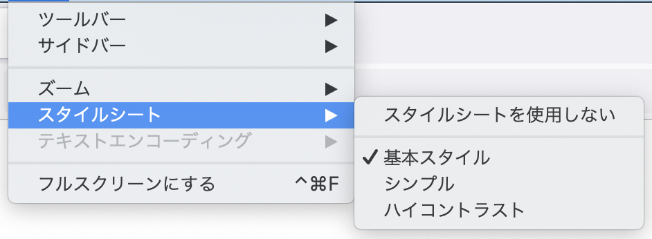

# リンク関連要素

HTMLの根幹となる重要な機能のひとつがハイパーリンクです。HTMLでは、`a`要素や`area`要素、`link`要素、`form`要素を使って外部リソースへのリンクを表現できます。ここでは、主に`a`要素と`link`要素のふたつの要素を取り上げつつ、リンクに関連する要素で使える属性について紹介します。

## `a`要素

`a`要素は、「アンカー」(anchor) を表現する要素です。多くの場合は`href`属性を指定して利用します。`href`属性を指定した場合、この要素はハイパーリンクとして機能します。

`href`属性に指定できる値は、「潜在的にスペースで囲まれた妥当なURL」(valid URL potentially surrounded by spaces)です。先頭と末尾の「ASCII空白文字」(ASCII whitespace)は、ブラウザーがHTMLを解析するときに取り除かれます。たとえば、以下の2つの`a`要素は同じ意味になります。

```html
<a href="https://www.example.com/">Example Domain</a>
<a href="
    https://www.example.com/
">Example Domain</a>
```

コードの可読性の観点から、通例はスペースを入れずに書きます。

<!-- 2-3に移動するかも？ -->
`href`属性値で指定されたリソースは、常にブラウザーで開くとは限りません。たとえば、`mailto:`であればメールソフトでそのメールアドレス宛てにメールを書く、`tel:`であれば通話アプリでその電話番号に電話をかけるなど、URLスキームによっては、あらかじめ設定したブラウザー以外のソフトウェアでリンク先のリソースを開くことがあります。
<!-- //2-3に移動するかも？ -->

`href`属性値に`#`で始まるURLフラグメントを指定していた場合、該当するフラグメントIDを持つ要素の場所までページをスクロールします。フラグメントについては、Chapter2-3を参照してください。なお、`#top`を指定していて、かつ`top`というフラグメントIDがページ内に存在しない場合は、ページの最上部へスクロールします。これは仕様に定められた挙動です[^1]。

[^1]: <https://html.spec.whatwg.org/multipage/browsing-the-web.html#scroll-to-fragid>
<!--
>If decodedFragment is an ASCII case-insensitive match for the string top, then the indicated part of the document is the top of the document; return.
-->

### 内容モデル
`a`要素の内容モデルは"Transparent"で、親要素の内容モデルを引き継ぎます。古いHTMLでは、`a`要素の中に`div`、`p`、`h1`などの要素を入れることはできませんでしたが、現在のHTMLでは見出しや段落などをまるごとリンクにすることも可能です。

```html
<a href="/product/01">
    <h1>商品名</h1>
    <p>説明文</p>
</a>
```
<!-- /内容モデル -->

### アクセシビリティ上の注意点
`a`要素のデフォルトのARIAロールは`link`です。

ほとんどのスクリーンリーダーは、`a`要素の内容をすべて読み上げた後に「リンク」と読み上げます。前述のように現在のHTMLでは`a`要素に見出しなどを含むさまざまな要素を入れられますが、大量のテキストをリンクにした場合、リンクであることが伝わりにくくなる場合があります。
<!-- / a11y note -->

<!-- 互換性メモ -->
なお、`target`属性は古いHTML4の仕様では「非推奨」(deprecated)とされていましたが、現在のHTMLでは廃止されることなく、引き続き定義されています。

`target`属性は、かつてはフレームセット文書を制御する属性として定義されていました。フレーム関連の要素としては、フレームセット文書を定義する`frameset`要素と`frame`要素があり、これら要素の廃止に伴って`target`属性も廃止される可能性がありました。しかし、インラインフレームを表す`iframe`要素は現在でも使われています。また、リンク先を別タブで開く場合の制御にも用いられています。こういった事情から、`target`属性は現在でも引き続き利用可能となっています。
<!-- /互換性メモ -->

`rel`属性は、リンク先URLとの関係を示す、リンクタイプの空白区切りのリストです。リンクタイプについては後述します。

### コラム: `href`属性を持たない`a`要素

典型的な`a`要素は`href`属性を持ちますが、`href`属性は必須の属性ではありません。以下のような、`href`属性のない`a`要素も許されています。

```html
<a>リンクになるかもしれないテキスト</a>
```

この場合、`a`要素はインタラクティブにはならずハイパーリンクとしては機能しませんが、JavaScriptで後から`href`属性を付与することが可能です。また、以下のように`id`属性を指定し、リンク先として機能させることもできます。

```html
<h1><a id="midashi">見出し</a></h1>
```

このような書き方は、非常に古いHTMLで`id`属性が使えなかった頃の名残です。当時は`a`要素に`name`属性を指定することで、ページ内リンクのリンク先を示していました。現在でもフラグメントIDを「アンカー」と呼ぶことがありますが、それは当時`a`要素（アンカー）が使われていた頃の名残です。現在のHTMLでは、`a`要素の`name`属性は廃止されています[^2]。単に次のように記述すれば十分です。

```html
<h1 id="midashi">見出し</h1>
```

[^2]: コンテンツ制作者は例外を除いて`name`属性を使用してはなりませんが、ブラウザーは互換性のために`name`属性を解釈します。 <https://html.spec.whatwg.org/multipage/obsolete.html#obsolete-but-conforming-features>

## link要素

`link`要素は、このHTML文書自身とリンク先のリソースとの関係性を表現します。`href`属性が必須であり、属性値にリンクの対象リソースのURLを指定します。

`link`要素には、`rel`属性か`itemprop`属性のいずれかを指定しなければなりません。ほとんどの場合、`rel`属性を使用します。後述の`rel`属性を参照してください。

`itemprop`属性はMicrodataを示すのための属性です。`link`要素`itemprop`属性を使用すると、メタデータとして外部リソースを参照することができます。以下は、作者を示すURLを参照する例です。

```html
<link itemprop="creator" href="https://example.com/author" />
```

通常`link`要素は、`head`要素内に記述します。ただし、`itemprop`属性を指定した場合と、`rel`属性でbody-okであるキーワード[^3]を指定した場合には`body`要素内でも有効です。この場合、CMSの都合などで`body`内に出現しても正しく解釈されます。

[^3]: <https://html.spec.whatwg.org/multipage/links.html#body-ok>

代替スタイルシートを指定する場合、`title`属性でスタイルシートの名前を指定します。詳しくは代替スタイルシートを参照してください。

### 内容モデル
`link`要素の内容モデルはNothingで、内容を持つことはできません。また、終了タグを書くこともできません。
<!-- /内容モデル -->

## リンク関連要素の属性

リンクを扱う`a`要素や`area`要素、`link`要素、`form`要素は、外部リソースの扱いに関連する、これら複数の要素にわたって利用できる属性を持っています。ここでは、それらの属性を紹介します。

### `hreflang`属性

`hreflang`属性は、リンク先の言語を示します。`lang`属性が現在のコンテンツの言語を指定するのに対し、`hreflang`は`href`属性で指定されたリンク先の言語を示します。属性値は言語タグで、これは`lang`属性と同様です。値の詳細はChapter4-1の`lang`属性を参照してください。

`a`要素では、`hreflang`属性は単なるアドバイスとして扱われます。リンク先のコンテンツで`lang`属性などによって言語が指定されていれば、そちらの方が優先されます。

`link`要素では、`rel=alternate`と組み合わせることで、言語の異なるバージョンを示すために用いることができます。用例はリンクタイプ`alternate`を参照してください。

### `download`属性

`a`要素、`area`要素に`download`属性を指定すると、URLへのリンクではなく、URLで示されたリソースのダウンロードを促します。

`download`属性に空でない値を指定した場合、ダウンロードファイルを保存するときのファイル名のヒントとなります。値にファイル名に使用できない文字が含まれていた場合、ブラウザーは必要に応じて文字を削除したり、ユーザーに訂正を促したりすることがあります。

```html
<a href="sample.png" download>サンプル画像をダウンロード</a>
<a href="sample.png" download="download.png">download.pngとして画像をダウンロードして保存</a>
```

なお、実際にダウンロードする場合のHTTPレスポンスヘッダーでファイル名が指定されていた場合は、属性の指定よりもそちらが優先されます。

<!-- セキュリティ上の考慮事項 -->
リンク先のリソースが同一オリジンのものでない場合、ブラウザーは`download`属性を無視することがあります。これは悪用を防ぐためです[^4]。仕様は注釈で注意を促しているだけであり、クロスオリジンの`download`属性を無視する動作が規定されているわけではありませんが、多くのブラウザーはこの注意に従っています。

[^4]: <https://html.spec.whatwg.org/multipage/links.html#downloading-resources>
<!--
>This could be dangerous, because, for instance, a hostile server could be trying to get a user to unknowingly download private information and then re-upload it to the hostile server, by tricking the user into thinking the data is from the hostile server.
>Thus, it is in the user's interests that the user be somehow notified that the resource in question comes from quite a different source, and to prevent confusion, any suggested filename from the potentially hostile interface origin should be ignored.
-->
<!-- /セキュリティ上の考慮事項 -->

### `target`属性

`a`要素と`area`要素、`form`要素に`target`属性を利用すると、リンク先をどのフレームやタブ、ウィンドウに表示するかを制御できます。以下は`iframe`と組み合わせた例です。

```html
<iframe src="a.html" name="iframe01"></iframe>
<a href="b.html" target="iframe01">Bを表示</a>
```

`iframe`要素には`a.html`の内容が表示されています。このように、ユーザーに対してドキュメントを表示するウィンドウやフレームのような枠を「ブラウジングコンテキスト」(browsing context)と呼びます。`iframe`要素もブラウジングコンテキストとなり、`name`属性でブラウジングコンテキストの名前をつけられます (`id`属性ではないことに注意してください)。

この例では、`a`要素の`target`属性で`iframe`要素の名前を指定しています。このリンクを辿ると、リンク先はこの`iframe`要素の中に表示され、`iframe`の中身が切り替わるような形になります。

ブラウジングコンテキストは、別のウィンドウや別のタブであることもあります。`target`属性に指定された名前が存在しない場合、ブラウザーは新たにタブやウィンドウを開き、そこで新たなブラウジングコンテキストを開始します。

以下の例では、`window01`という名前のブラウジングコンテキストを参照しています。

```html
<a href="a.html" target="window01">Aを表示</a>
<a href="b.html" target="window01">Bを表示</a>
<a href="c.html" target="window01">Cを表示</a>
```

この場合、まず`window01`という名前のブラウジングコンテキストを探し、それが存在すればそこでリンク先を開きます。存在しない場合、ブラウザーは新たにタブやウィンドウを開き、そのブラウジングコンテキストに`window01`という名前をつけます。この例でリンクを上から順にクリックしていった場合、まず新しいタブが開いて`a.html`が表示され、その同じタブ内に`b.html`と`c.html`が表示されることになります。

ブラウジングコンテキストの名前は、`_`（アンダースコア）で始めることができません。`_`で始まる文字列は名前ではなく、定義されたキーワードとみなされます。以下の4つのキーワードが定義されています。

- `_self`: 現在のブラウジングコンテキストを指します。既定値です。
- `_blank`: 新しいブラウジングコンテキストを作成します。タブを持つブラウザーの場合は新しいタブで開きます。
- `_parent`: 親のブラウジングコンテキストを指します。親がない場合は、`_self`と同じ挙動となります。
- `_top`: 祖先となる最上位のブラウジングコンテキストを指します。親がない場合は、`_self`と同じ挙動となります。

<!-- セキュリティ上の注意点 -->
新しいブラウジングコンテキストで他のHTMLを開いた場合、`window.opener`を参照することで元のブラウジングコンテキストを参照できます。古いブラウザーでは、このブラウジングコンテキストの参照がクロスドメインで行える場合があり、セキュリティ上の重大な注意点とされていました。現在のブラウザーではクロスドメイン参照はできなくなっています。
<!-- /セキュリティ上の注意点 -->

### アクセシビリティ上の注意点
`target="_blank"`を指定すると、多くの場合、リンク先を別のブラウザータブで開く挙動になります。

ほとんどのブラウザーは`target="_blank"`を指定した場合に特別な通知をすることはありません。また、この挙動がユーザーに伝わりにくいことがあります。特にスクリーンリーダーのユーザーや画面を拡大しているユーザーの場合、状況によっては別タブになったことに気づかずに混乱することもあります。そのため、`target="_blank"`を指定する場合にリンクテキスト内で「新しいタブが開く」ことがわかるような説明を検討するとよいでしょう。

また、ユーザーによってはブラウザータブを閉じるのが容易でない場合や、わずらわしいと感じることがあります。`target="_blank"`がそのリンクに対して本当に必要かどうかもあわせて吟味したほうがよいでしょう。WCAG 2.1達成基準3.2.5 要求による変化[^5]の観点からも配慮が必要な事項とされています。

[^5]: <https://www.w3.org/TR/WCAG21/#change-on-request>

<!-- /a11y note -->

### `rel`属性

`rel`属性は、リンクの種類、リンク先とこの文書との関連性を示します。属性値は「リンクタイプ」(link types)です。リンクタイプについては、後述の「リンクタイプ」で詳しく説明します。

### `referrerpolicy`属性

`a`要素と`area`要素、`link`要素で`referrerpolicy`属性を利用すると、リンク先に送信するHTTP Refererを制御することができます。`rel=nofollow`を指定することでもRefererの送信を抑制できますが、`referrerpolicy`属性ではさらに細かい制御が可能です。

詳細はReferrer Policy仕様[^6]を参照してください。

[^6]: <https://w3c.github.io/webappsec-referrer-policy/>

### `ping`属性
<!-- 参考URL: https://blog.jxck.io/entries/2019-04-26/hyperlink-auditing-via-ping.html -->
`href`属性のリンク先に遷移するときに`ping`属性で指定したURLにリンク元とリンク先を伝えます。例として、`https://example.net/link-from/`というURLに次のようなリンクがあるとします。

```html
<a href="https://example.com/link-to/" ping="/tracker">example.com</a>
```

この場合、`/tracker`に対して次のようなHTTP POSTリクエストを送信します。

```http
POST /tracker HTTP/1.1
Content-Type: text/ping
Ping-From: https://example.net/link-from/
Ping-To: https://example.com/link-to/
```

このように、`Ping-From`ヘッダーにリンク元のURL、`Ping-To`ヘッダーにリンク先のURLの情報が記録されます。

どこからどこにページ遷移したのかを知る方法としては、HTTPリダイレクトやJavaScriptなどの既存の技術を用いる方法が知られています。しかし、`ping`属性を用いることで、ユーザーがリンク先を正確に知ることができる、ユーザーエージェントが情報を送信するかどうかを制御できる、追加の処理が発生しないためにパフォーマンスの向上が見込まれるといった利点があります。HTTP仕様でもこの属性を用いることをアドバイスしています。

ただし、2021年10月現在で、Firefoxは`ping`属性をデフォルトで無効にしている点に注意が必要です。[^7]

[^7]: https://caniuse.com/ping

## `rel`属性とリンクタイプ

リンクタイプは、現在の文書とリンク先のリソースとの関係を表すキーワードで、HTML仕様の4.6.6 Link types[^8]にて定義されています。また、後述の「その他リンクタイプ」で記載しているように、拡張リンクタイプを誰でも登録することができます。

リンクタイプのキーワードは別に指定がない限り、1つの`rel`属性に1つのみ指定します。複数指定する場合は、属性値で空白で区切って指定します。（`rel="alternate stylesheet"`）

互換性のために、キーワードには同義語が定義されていることがあります。たとえば、キーワード"`license`"に対して、"`copyright`"が同義語として定義されています。コンテンツ制作者は"`copyright`"を指定してはなりませんが、ユーザーエージェントはどちらも同じように扱います。

キーワードは大文字小文字を区別しません。たとえば、"stylesheet"と"StyleSheet"と"STYLESHEET"は同じ意味になります。

[^8]: <https://html.spec.whatwg.org/multipage/links.html#linkTypes>

本書では代表的なリンクタイプをいくつか紹介します。

### リンクタイプ`alternate`

リンクタイプ `alternate`は、リンク先が現在の文書の代替表現であることを示します。このキーワードの意味は、属性値として列挙された他のリンクタイプに依存して変化します。

#### 代替スタイルシート

`link`要素で`stylesheet`キーワードとともに`alternate`が指定される場合、代替スタイルシートとして扱われます。たとえば以下のように指定します。

```html
<!-- 固定スタイルシート -->
<link rel="stylesheet" href="base.css">

<!-- 優先スタイルシート -->
<link rel="stylesheet" href="default.css" title="基本スタイル">

<!-- 代替スタイルシート -->
<link rel="alternate stylesheet" href="simple.css" title="シンプル">
<link rel="alternate stylesheet" href="highcontrast.css" title="ハイコントラスト">
```

代替スタイルシートが提供されていると、ブラウザーはスタイルシートを切り替える機能を提供することがあります。`title`属性でスタイルに名前を与えておくと、切り替え時に表示されることが期待されます。以下はFirefoxの例です。



この例の場合、初期状態は「基本スタイル」で、`base.css`と`default.css`が適用されています。「シンプル」に切り替えると`default.css`は適用されなくなり、`base.css`と`simple.css`が適用されるようになります。細かい挙動の詳細は、CSS Object Model (CSSOM)仕様[^9]を参照してください。

[^9]: <https://drafts.csswg.org/cssom/#css-style-sheet-collections>

残念なことに、このような切り替え機能を持たないブラウザーもあり、代替スタイルシートを利用するには拡張機能の導入が必要となる場合があります。また、標準対応しているブラウザーでも使い方がわかりにくいことが多く、ユーザーが代替スタイルシートを活用することは難しいかもしれません。
<!--
MDN曰く、CSSOMが仕様の模様
https://developer.mozilla.org/ja/docs/Web/CSS/Alternative_style_sheets
6.2. CSS Style Sheet Collections
https://drafts.csswg.org/cssom/#css-style-sheet-collections
-->

#### フィードの指定

`type`属性が`application/rss+xml`か`application/atom+xml`のいずれかである場合、`alternate`キーワードは、このHTML文書に対応するフィードとして扱われます。`link`要素にこれらを指定すると、ブラウザーにフィードの自動検出を促します。

フィードとは、ウェブサイトが直近の更新情報や概要などをまとめたデータです。RSSやAtomといったXMLベースのマークアップ言語が主に用いられることから、RSSフィードやAtomフィードと呼ばれることもあります。
<!-- フィードの例のアイコンがあるとよい？ https://ja.wikipedia.org/wiki/%E3%83%95%E3%82%A3%E3%83%BC%E3%83%89 -->

<!-- 単なる例示 -->
```html
<link rel="alternate" type="application/rss+xml" href="posts.xml" title="ブログの新着投稿RSSフィード">
<link rel="alternate" type="application/rss+xml" href="posts.xml?category=cat" title="ブログの猫に関する新着投稿RSSフィード">
<link rel="alternate" type="application/rss+xml" href="comments.xml" title="ブログの新着コメントRSSフィード">
```

#### 文書の代替表現

`alternate`キーワードが指定され、かつ代替スタイルシートにもフィードにも当てはまらない場合には、このHTML文書の代替表現であるものと解釈されます。

`hreflang`属性が指定されており、かつ現在のページと異なる言語が指定される場合は、この文書の翻訳であることを示します。

`type`属性が指定されている場合は、現在の文書の異なるフォーマットであることを示します。

これらは組み合わせて指定することも可能です。たとえば以下のようになります。

<!--LSからのコピー-->
```html
<link rel="alternate" href="/en/html"
 hreflang="en" type="text/html" title="英語版">
<link rel="alternate" href="/fr/html"
 hreflang="fr" type="text/html" title="フランス語版">
<link rel="alternate" href="/en/pdf" 
 hreflang="en" type="application/pdf" title="英語版PDF">
<link rel="alternate" href="/fr/pdf"
 hreflang="fr" type="application/pdf" title="フランス語版PDF">
```

`media`属性と併用すると、文書が特定のメディア向けのものであることを示すことができます。<!-- というのは仕様の地の文に書いてないが例だけはでている。 -->

```html
<link rel="alternate" href="/en/html/print"
 hreflang="en" type="text/html" media="print" title="英語版（印刷用）">
<link rel="alternate" href="/fr/html/print"
 hreflang="fr" type="text/html" media="print" title="フランス語版（印刷用）">
```

`media`属性の値にはメディアクエリー[^10]を指定でき、モバイル向け、パソコン向けといった表現も可能です。

[^10]: <https://drafts.csswg.org/mediaqueries/>

```html
<link rel="alternate" href="https://m.example.com/" 
 media="only screen and (max-width: 640px)" title="モバイル向けページ">
```

検索エンジンのクローラーがこのような指定を認識し、モバイル向けの別コンテンツがあるかどうか判断することもあります。[^11]

[^11]: <https://developers.google.com/search/mobile-sites/mobile-seo/separate-urls?hl=ja>

### リンクタイプ`author`

リンクタイプ`author`は、リンク先が著作者に関連する情報であることを示します。`mailto:`スキームのURLを使用して、著作者の電子メールアドレスを示すことが一般的です。`link`要素で用いた場合、このHTML文書全体の著作者を指します。

```html
<link rel="author" href="mailto:me@example.com">
```

このリンクタイプを`a`要素、`area`要素で用いた場合は、最も近い祖先の`article`要素の著作者を指すものと解釈されます。`article`要素の外で用いられているときは、HTML文書全体の著作者を指します。

古いブラウザー<!-- lynxとか -->の中には、これを解釈し、文書の著作者に即座に電子メールを送信できる機能を持つものがありました。現在のブラウザーはそのような機能をほとんどサポートしていませんので、無理に指定する必要はないでしょう。

### リンクタイプ`bookmark`

リンクタイプ`bookmark`は`a`要素、`area`要素で使用でき、リンク先が「パーマリンク」(permalink)であることを示します。パーマリンクは、文書中に記事が列挙されている場合などに、個々の記事を指すリンク先です。「固定リンク」と呼ばれることもあります。

このリンクタイプが`article`要素の中で用いられた場合、最も近い祖先の`article`要素のパーマリンクと解釈されます。`article`要素の外で用いられているときは、HTML文書自体のパーマリンクと解釈します。

```html
<article>
<a href="a.html" rel="bookmark">ブログ記事のパーマリンク</a>
<h1>ブログ記事のタイトル</h1>
<p>ブログ記事の中身</p>
  <article>
  <h2 id="comment-1">コメント1</h2>
  <p>コメントの中身</p>
  <p><a href="a.html#comment-1" rel="bookmark">コメント1のパーマリンク</a></p>
  </article>
</article>
```

### リンクタイプ`external`

<!--これいる？nofollowと組み合わせるのがはやってたようだけど、言及必要か？-->
リンクタイプ`external`は`a`要素、`area`要素、`form`要素で使用でき、リンク先が外部サイトであることを示します。

```html
<a href="https://example.com/" rel="external">example (外部サイト)</a>
```

### リンクタイプ`help`

<!--題目のように古くから存在するが果たして重要度は高いのか？-->
<!-- lynxは対応してたらしいですね…… -->
リンクタイプ`help`は、リンク先がヘルプ情報であることを示します。`a`要素、`area`要素に指定した場合、親要素や兄弟要素に関連するコンテキストヘルプ情報であると期待されます。

<!-- LSからのコピー -->
```html
<p><label>トピックを入力: <input name="topic">
 <a href="help/topic.html" rel="help">(ヘルプ)</a></label></p>
```

この例では、入力すべき「トピック」についてのヘルプ情報が得られることが期待されるでしょう。`form`要素にも同様に指定できます。

`link`要素に指定した場合は、このページ全体のヘルプ情報とみなされます。古いブラウザー<!-- lynxとかlynxとか -->の中には、ヘルプへのリンクを提供する機能を持つものもありました。

### リンクタイプ`icon`

`link`要素でリンクタイプ`icon`を使用すると、リンク先がアイコンであることを示します。現在の文書を表現するアイコン、いわゆるファビコン（favicon）を指定するために使われます。

```html
<link rel="icon" href="/assets/favicon.ico">
```

互換性の理由から、`shortcut icon`と書くことも認められており、`icon`と同一視されます。この場合、`rel`属性の値全体が`shortcut icon`でなければならず、逆順にしたり、他のキーワードを入れたりすることはできません。

`link`要素によるアイコンの指定がない場合、ブラウザーは`/favicon.ico`というURLにアクセスしてアイコンの取得を試みます。この挙動はHTML仕様4.6.6.8 Link type "icon"[^12]で明確に定義されています。逆に言えば、`/favicon.ico`にアイコンが置いてあり、それを使えばよい場合は指定不要だということです。

[^12]: <https://html.spec.whatwg.org/multipage/links.html#rel-icon>

ブラウザーの種類や端末の種類によって、アイコンの大きさやフォーマットを変えたい場合もあるでしょう。その場合は、`type`属性、`sizes`属性、`media`属性と組み合わせて、さまざまなバージョンのアイコンを指定することもできます。以下はHTML仕様で紹介されている例です。

```html
<link rel="icon" href="favicon.png" sizes="16x16" type="image/png">
<link rel="icon" href="windows.ico" sizes="32x32 48x48" type="image/vnd.microsoft.icon">
<link rel="icon" href="mac.icns" sizes="128x128 512x512 8192x8192 32768x32768">
<link rel="icon" href="iphone.png" sizes="57x57" type="image/png">
<link rel="icon" href="gnome.svg" sizes="any" type="image/svg+xml">
```

また、主にiOSやAndroidといったモバイル端末向けに、拡張キーワード`apple-touch-icon`とともにアイコンを指定するという方法があります[^13]。

[^13]: <https://developer.apple.com/library/archive/documentation/AppleApplications/Reference/SafariWebContent/ConfiguringWebApplications/ConfiguringWebApplications.html>
<!--詳しくは、古いですがファビコン・カンニング・ペーパー[^11]が参考になります。-->

<!--
[^11]: https://hail2u.net/documents/favicon-cheat-sheet-ja.html
-->

### リンクタイプ`license`

リンクタイプ`license`は、リンク先が著作権情報、ライセンス情報であることを示します。`link`要素で使用した場合、文書全体の著作権情報を表します。

```html
<link rel="license" href="https://creativecommons.org/licenses/by/4.0/deed.ja">
```

この例では、文書が『クリエイティブ・コモンズ 表示 4.0 ライセンス』で提供されることを表します。

`a`要素で使うこともできますが、この場合、文書のどの部分の著作権情報なのかは明示されません。文書全体のライセンスかもしれませんし、段落や引用部のライセンスかもしれません。リンクタイプ`help`や`bookmark`と異なり、親要素や祖先要素のライセンスを表すというような決まりはないため、ユーザーは設置されている場所やスタイルなどが手掛かりに、文脈から判断することになります。

なお、ブラウザーは互換性のため、`copyright`というキーワードを`license`と同じように解釈します。

### リンクタイプ`canonical`

`link`要素でリンクタイプ`canonical`を使用すると、リンク先が正規のURLであることを示します。これはCanonical Linkとして機能します。詳細はRFC 6596 The Canonical Link Relation[^14]を参照してください。

[^14]: <https://datatracker.ietf.org/doc/html/rfc6596>

Canonical Linkは、あるリソースが複数のURLで示されるとき、正規のURLを示すものです。たとえば以下のように、同一のリソースに異なるドメインでアクセスできる場合があります。

- https://www.example.com/
- https://example.com/

また、主にユーザー追跡のために、リソースの本質と関係のないクエリー文字列がURLに付与されることもあります。

- https://www.example.com/?sessionid=1234567
- https://www.example.com/?linkfrom=twitter
- https://www.example.com/?trackingid=abcdef

このような場合に、`rel="canonical"`を使用すると、どれが正規のURLなのか示すことができます。これにより、検索エンジンが検索結果に出すURLが1つに絞られる、といった効果が期待できます。

```html
<link rel="canonical" href="https://www.example.com/">
```

`href`属性値には相対URLで指定することも可能ですが、絶対URLを使用するのが一般的です。自身を参照するような記述も可能ですので、複数のURLすべてに同一の内容を書いておくとよいでしょう。

### リンクタイプ`nofollow`

`a`要素や`area`要素でリンクタイプ`nofollow`を使用すると、リンク先の内容を保証しないことを示します。

リンクの中には、コンテンツ制作者が意図して設定したわけではないものもあります。たとえば、訪問者がコメント欄に書き込んだリンクや、広告配信のスクリプトによって自動的に挿入されたリンクなどです。コンテンツ制作者は、このようなリンク先のコンテンツの品質を保証できません。また、このような機能を悪用され、スパムリンクを大量に生成されることもあります。このようなリンクを検索エンジンにそのまま評価させると、評価に悪影響が出る懸念があります。リンクタイプ`nofollow`を使用することで、保証できないリンクを明確にすることができます[^15]。

[^15]: Googleはこれらの目的のために、キーワード`sponsored`や`ucg`をサポートします。 <https://developers.google.com/search/docs/advanced/appearance/qualify-outbound-links?hl=ja>

```html
<a href="http://example.net/untrusted.html" rel="nofollow">品質が信頼できないページ</a>
```

検索エンジンはこれを読み取り、リンク関係を評価しないようにするかもしれません。
<!--
https://support.google.com/webmasters/answer/96569?hl=ja
-->

### リンクタイプ`noopener`

`a`要素でリンクタイプ`noopener`を使用すると、リンク先を新しいブラウジングコンテキストで開いたとき、リンク元のブラウジングコンテキストにアクセスできないようにすることを示唆します。ブラウジングコンテキストとは、タブやウィンドウ、`iframe`の枠などを指します。詳しくは`target`属性を参照してください。

`target=_blank`などで新しいブラウジングコンテキストを開始した場合、開かれた側のコンテンツからJavaScriptでリンク元のブラウジングコンテキストにアクセスできる場合があります。`window.opener`でブラウジングコンテキストを参照したり、`postMessage`による通信を試みることができます。リンク先のコンテンツが信頼できない場合、これはセキュリティ上の問題につながる場合があります。

このようなとき、`rel=noopener`を利用することができます。

```html
<a href="http://example.net/fishy.cgi" rel="noopener" target="_blank">信頼できるかどうか不明なページ</a>
```

こうすると、リンク先から元のブラウジングコンテキストを参照することができなくなり、`window.opener`を参照しても`null`が返ります。

なお、モダンなブラウザーの多くは、`noopener`がなくてもクロスオリジンのブラウジングコンテキストは参照できないようになっています。このリンクタイプの必要性は低下していますが、古いブラウザーの安全性を確保したい場合には役立つことがあります。

### リンクタイプ`noreferrer`

<!-- https://qiita.com/wakaba@github/items/707d72f97f2862cd8000 -->
`a`要素でリンクタイプ`noreferrer`を使用すると、リンク先に参照元情報を送信しないように促します。具体的には、リンク元ページのアドレスを、ブラウザーが`Referer`HTTPヘッダーでリファラーとして送信しないようにします。

```html
<a href="https://example.com/" rel="noreferrer">リファラーを送信しないリンク</a>
```

さらに、`noopener`と同様にブラウジングコンテキストを参照させない効果もあります。ブラウジングコンテキストが参照できると、結局リンク元のURLを知ることができてしまうためです。詳しくは`noopener`を参照してください。

より細かいリファラーの制御をしたい場合は、`referrerpolicy`属性を用いてリファラーポリシーを設定することもできます。また、ページ全体のリンクについてリファラーポリシーを制御したい場合は、`<meta name=referrer>`を使用することで実現できます。

### リンクタイプ`dns-prefetch`

`link`要素でリンクタイプ`dns-prefetch`を指定すると、指定されたドメインの名前解決を行うことが期待されます。あとで使用することになるドメイン名の名前解決を事前に行っておくことで、そのオリジンのリソースを読み込むときの時間短縮を期待するものです。

```html
<link rel="dns-prefetch" href="https://example.com">
```

詳細な挙動はResource Hints仕様[^16]で定義されています。

[^16]: <https://w3c.github.io/resource-hints/>。2021年10月時点ではW3C文書ですが、WHATWGに移管される予定です。

### リンクタイプ`preconnect`

`link`要素でリンクタイプ`preconnect`を指定すると、事前に接続を確立しておくことが期待されます。DNSの名前解決に加え、TCPコネクションの確立、TLSのネゴシエーションまでが含まれます。これにより、後のリソースの読み込み時間の短縮が期待できる場合があります。

```html
<link rel="preconnect" href="https://example.com">
```

リンク先URLのスキームは`http`もしくは`https`でなければなりません。そうでなければこの指定は無視されます。
<!--
If preconnect URL's scheme is not one of "http" or "https" then abort these steps.
-->

### リンクタイプ`prefetch`

`link`要素でリンクタイプ`prefetch`を指定すると、リソースを事前にダウンロードし、ブラウザーにキャッシュさせることが期待できます。

ユーザーが次に遷移するページが明確な場合などに、次ページで必要になるリソースを事前にキャッシュしておくことで、表示の高速化が期待できます。

```html
<link rel="prefetch" href="next.js">
```

### リンクタイプ`preload`

`link`要素でリンクタイプ`preload`を指定すると、リソースを事前にダウンロードし、ブラウザーにキャッシュさせることが期待できます。

<!-- https://blog.jxck.io/entries/2016-03-04/preload.html が参考になる -->
現在のページで使用するリソースの多くは、`img`要素の`src`属性などを利用してHTMLに書かれており、HTMLを読み込んだ時点で必要性を判断できます。しかし、中にはCSSから読み込まれるもの、JavaScriptで後から挿入されるものなどもあり、これらの必要性はHTMLを読み込んだ時点では判断できません。`preload`は、こういったリソースが実際に必要になる前に読み込んでおき、動作を高速化させることを期待するものです。詳細はPreload仕様[^17]を参照してください。

[^17]: <https://w3c.github.io/preload/>。2021年10月時点ではW3C文書ですが、WHATWGに移管される予定です。

以下の例では、スタイルシートで利用する画像を事前に読み込んでいます。

```html
<link rel="preload" href="bgimage.png" as="image">
<style>
div.hoge {background-image: url: ("bgimage.png");
</style>
```

`rel=preload`を用いる場合、`as`属性を指定する必要があります。`as`属性はリソースの用途を指定するは列挙型属性で、指定できる値はFetch Standardのdestination[^18]に定められています。具体的には、以下のいずれかの値を指定できます。

"audio", "audioworklet", "document", "embed", "font", "frame", "iframe", "image", "manifest", "object", "paintworklet", "report", "script", "serviceworker", "sharedworker", "style", "track", "video", "worker", "xslt"

[^18]: <https://fetch.spec.whatwg.org/#concept-request-destination>

前述の例では、画像として利用するため`as=image`を指定しています。Webフォントであれば"font"、JavaScriptであれば"script"など、それぞれ対応する適切な値を指定する必要があります。この指定により、ブラウザーはリソースの優先順位を判断したり、Content Security Policyを適切に処理することができます。

`integrity`属性を指定して、プリロードする外部リソースの完全性を担保することもできます。これは`script`要素の`integrity`属性と同じものです。Chapter3-11の`script`要素を参照してください。

### リンクタイプ`modulepreload`

`link`要素でリンクタイプ`modulepreload`を使用すると、モジュールスクリプトをプリロードすることができます。リンクタイプ`preload`と似ていますが、モジュールスクリプトに固有のCORSの処理、依存関係の処理などを適切に行うことができます。クラシックスクリプトとモジュールスクリプトについてはChapter3-11を参照してください。

<!-- https://1000ch.net/posts/2017/module-preload.html を参考に-->

```html
<link rel="modulepreload" href="critical.mjs">
```

`as`属性、`integrity`属性については、リンクタイプ`preload`と同様です。リンクタイプ`preload`を参照してください。

### リンクタイプ`prerender`

`link`要素でリンクタイプ`prerender`を指定すると、リソースを事前にダウンロードした上で、バックグラウンドでレンダリングしておくことが期待できます。

ユーザーが次に遷移するページが明確な場合などに、次ページのレンダリング処理をあらかじめ行っておくことで、表示の高速化が期待できます。

```html
<link rel="prerender" href="https://example.com/next-page.html">
```

### リンクタイプ`stylesheet`

`link`要素にリンクタイプ`stylesheet`を指定すると、外部スタイルシートを読み込みます。

```html
<link rel="stylesheet" href="basic.css">
```

古いHTMLでは`type=text/css`もあわせて指定していましたが、現在のHTML仕様はCSS以外のスタイルシート言語を想定しておらず、デフォルトで`text/css`とみなされるため、`type`属性は省略することが推奨されています。`type`属性があり、かつ`text/css`以外の値だった場合、そのスタイルシートは無視されます。<!-- https://html.spec.whatwg.org/multipage/semantics.html#processing-the-type-attribute -->

`media`属性を併用することで、特定のデバイスに向けたスタイルシートであると宣言することができます。以下の例では、印刷用のスタイルシートを定義しています。

```html
<link rel="stylesheet" href="print.css" media="print">
```

`media`属性にはメディアクエリー<!--脚注リンクは上で既出-->を指定することもできます。これを利用すると、デバイスの画面幅に応じてスタイルを変更する、いわゆるレスポンシブデザインを実現することができます。

```html
<link rel="stylesheet" href="mobile.css" media="screen and (max-width: 420px)">
<link rel="stylesheet" href="tablet.css" media="screen and (max-width: 768px)">
```

リンクタイプ`alternate`と組み合わせると、代替スタイルシートを定義することができます。詳しくはリンクタイプ`alternate`を参照してください。

`disabled`属性を指定すると、スタイルシートを無効にすることができます。JavaScriptから操作してスタイルの有効・無効を切り替えるために利用できます。

`integrity`属性を指定すると、外部スタイルシートの完全性を担保することができます。これは`script`要素の`integrity`属性と同様です。Chapter3-11の`script`要素を参照してください。

<!-- 互換性メモ -->
古いHTMLでは`charset`属性でスタイルシートの文字エンコーディングを指定できましたが、`link`要素の`charset`属性は廃止されました。外部スタイルシートの文字エンコーディングは、HTTPレスポンスヘッダーなどに基づいて決定されます。
<!-- /互換性メモ -->

### シーケンシャルリンクタイプ`prev`/`next`

リンクタイプ`prev`/`next`は、リンク先が現在のページと一続きのコンテンツであることを示します。リンクタイプ`next`は次のページ、リンクタイプ`prev`は前のページであることをそれぞれ示します。

たとえば、3つに複数に分割された記事で、2つめのページが`article-part2.html`とすると、前後のページを次のように表すことができます。

```html
<link rel="prev" href="article-part1.html">
<link rel="next" href="article-part3.html">
```

古いブラウザーには、このような`link`要素の指定を解釈して、前後のページに移動するナビゲーションを提供するものもありました。現在ではそのような機能はほとんど提供されていませんが、検索エンジンのクローラーに前後ページの情報を与えるために用いられることがあります。また、ブラウザーは`next`で指定されたリソースを先読みし、リンクタイプ"dns-prefetch"、"preconnect"、"prefetch"、"prerender"のいずれかの処理を行う場合があります。処理の詳細は各リンクタイプを参照してください。

`link`要素だけでなく`a`要素に使用することもできますので、ページナビゲーションに含まれる`a`要素に指定してもよいでしょう。

互換性のため、`previous`キーワードは`prev`と同一視されます。

### その他のリンクタイプ

HTML仕様に示されたキーワード以外にも、microformats wikiのexisting-rel-valuesページ[^19]に登録されたものを使用することができます。このページは誰でも登録することができるので、事実上、自由に拡張することができます。

[^19]: <http://microformats.org/wiki/existing-rel-values#HTML5_link_type_extensions>

## コラム：廃止された属性: `rev`属性

古いHTMLでは、`rev`属性で`rel`属性と逆向きのリンクを示すものがありました。よく使われていた用例として、以下のようなものがあります。

```html
<link rev="made" href="mailto:me@example.com">
```

現在のHTML仕様では`rev`属性は廃止されており、`rev`属性は逆向きの`rel`属性に書き換えることができます。

上記の場合、`rev="made"`の代わりに`rel="author"`として表現することができます。なお、互換性のために、ブラウザーは`rev="made"`を`rel="author"`と同じ意味に解釈します。

## リンク利用時のアクセシビリティ上の注意点

`a`要素は、ハイパーリンクという重要な機能を提供する要素です。ユーザーがハイパーリンクを利用できなくなると、ウェブサイトを一切利用できなくなることもあります。そのため、`a`要素にはアクセシビリティの考慮点が多数あります。

### リンク先を理解できるようにする

`a`要素の内容はリンクテキストとして扱われますが、リンクテキストからリンク先の内容を推測できるようにする必要があります。
以下は望ましくない例で、俗に「here症候群」と呼ばれるものです。

```html
<p>
<a href="wcag.html">こちら</a>をご覧ください。
</p>
```

上記の例では、リンク先が何であるのかまったくわかりません。WCAG 2.1達成基準2.4.4リンクの目的 (コンテキスト内)[^20]では、このようなリンク先が理解できないリンクを避け、どのようなリンク先であるのかが理解できるようにすることを求めています。

[^20]: <https://www.w3.org/TR/WCAG21/#link-purpose-link-only>

以下は、`a`要素の前後のテキストを読むことでリンク先が理解できるものです。

```html
<p>
WCAGの関連資料は<a href="wcag.html">こちら</a>
</p>
```

この例では、`a`要素の直前のテキストを読むことでリンク先の内容を推測することができ、最低限のアクセシビリティが担保されていると言えます。

しかし、より高度なアクセシビリティな観点からは、ベストな例とはなりません。スクリーンリーダーをはじめ多くの支援技術は、次のリンクに飛ぶ機能や、リンクだけを読み上げる機能を持ちます。この場合、前後の文とは切り離されてリンクだけが読まれることになります。WCAG 2.1達成基準2.4.9リンクの目的 (リンクのみ)[^21]では、リンクテキストのみでどのようなリンクなのかが理解できることを求めています。

[^21]: <https://www.w3.org/TR/WCAG21/#link-purpose-link-only>

ひとつの考え方として、リンク先のコンテンツのタイトル（`title`要素の内容）をそのままリンクテキストにすることで、高度なアクセシビリティ要件を満たすことができます。

```html
<p>
<a href="wcag.html">WCAGの関連資料</a>をご覧ください。
</p>
```

また、画像をリンクにする場合、代替テキスト（`alt`属性の値）がリンクテキストになります。この場合、リンクテキストが空にならないように注意してください。以下は望ましくない例です。

<!-- 望ましくない例 -->
```html
<a href="pr.html"></a>
```

この場合、`a`要素の内容に何もテキストがないため、リンクテキストは空になってしまいます。スクリーンリーダーはリンク先のURLを読み上げてしまうことがありますが、ユーザーにはリンク先の内容が伝わりません。

### `a`要素をボタンとして用いる

`a`要素を利用して擬似的なボタンを作成することがあります。`a`要素の見た目をボタンのようなものに変更し、`click`イベントを定義して、クリックしたときにJavaScriptを実行されることが可能です。

```html
<p><a href="#" onclick="...">実行</a></p>
<p><a href="javascript:void(0)" onclick="...">実行</a></p>
```

しかし、`href`属性のある`a`要素はデフォルトで`link`ロールを持つため、スクリーンリーダーはこれをリンクとして扱います。上記の例では「実行 ボタン」ではなく「実行 リンク」と読まれることになります。つまり、スクリーンリーダーのユーザーにはボタンであることは伝わりません。

Chapter4で紹介するWAI-ARIAを使用する方法もありますが、ボタンには`button`要素を使用するのが素直と言えます。

### スキップリンク

Webコンテンツの冒頭に大きなヘッダーがついている場合、スクリーンリーダーのユーザーやキーボードユーザーは、メインコンテンツに辿り着くまでの多大な労力が必要になることがあります。そのため、WCAG 2.1達成基準2.4.1ブロックスキップ[^22]では、ブロックをスキップする機能を提供するように求めています。

[^22]: <https://www.w3.org/TR/WCAG21/#bypass-blocks>

この機能を実現する方法のひとつとして、コンテンツの冒頭に、メインコンテンツに飛ぶリンクを設けるというものがあります。このテクニックは「スキップリンク」と呼ばれます。

```html
<body>
  <a href="#content">メインコンテンツへ</a>
  <header>
    ...
  </header>
  <main id="content">
    ...
  </main>
</body>
```

スキップリンクを設ける場合、スクリーンリーダーを利用していないキーボードユーザーにも配慮するようにします。スキップリンクを視覚的に不可視にしてしまった場合、視覚環境を利用するキーボードユーザーはフォーカスを見失ってしまうことがあります。

達成基準2.4.1は、メインコンテンツの位置に見出しを配置する、メインコンテンツを`main`要素としてマークアップするといった方法によって満たすことができます。スキップリンクも達成基準2.4.1を満たす方法のひとつですが、あくまで方法のひとつにすぎません。ウェブアクセシビリティの観点からスキップリンクの導入は必須のものではないことに注意してください。
