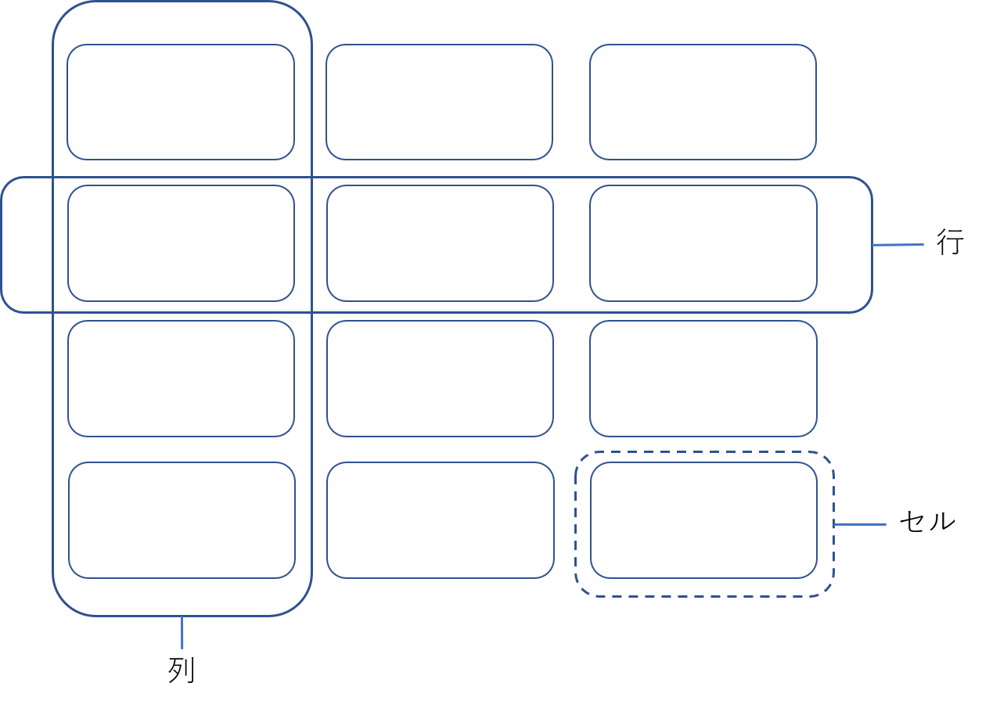
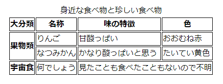

# テーブル

このChapterでは、テーブル（表）を表現する`table`要素と、関連の要素について説明します。

## テーブルとは

要素の説明に入る前に、テーブルについて確認しておきましょう。ここで言うテーブルとは、複数のデータを縦横に並べて、表の形式にまとめたものを指します。データが入っている1つ1つの項目を「セル」(cell)、テーブルを水平方向に切ったときのまとまりを「行」(row)、垂直方向に切ったときのまとまりを「列」(column)と呼びます。



図 3-8-01　テーブルの構成部品

テーブルにはタイトル（見出し、表題）が付けられることもあります。また、行や列にもラベルをつけることがあり、一般的に、行や列の先頭のセルにラベルを入れることで表現します。このようなラベルとなっているセルを「見出しセル」(header cell)と呼びます。

行や列はグループ化されることもあります。

## テーブル全体: `table`要素

HTMLでは、このようなテーブル構造となったデータを`table`要素で表現できます。`table`要素でテーブル全体を表現し、その中にテーブル中の行を表す`tr`要素を入れ、さらにその中にセルを表す`td`要素を入れるのが基本となります。以下は、2行3列のテーブルをマークアップした例です。

```html
<table>
  <tr>
    <td>日本</td>
    <td>東京</td>
    <td>アジア</td>
  </tr>
  <tr>
    <td>フランス</td>
    <td>パリ</td>
    <td>ヨーロッパ</td>
  </tr>
</table>
```

<!-- 内容モデル -->
`table`要素の内容モデルは複雑です。`caption`要素、`colgroup`要素、`thead`要素、`tbody`要素、`tfoot`要素が子要素となり得ます。それぞれの要素については、この後で説明します。要素の省略の可否や入れられる個数についても各要素を参照してください。

`table`要素には最低でも`tbody`要素が1つ以上必要です。しかし、`tbody`要素は開始タグと終了タグが共に省略可能であるため、何も書かなくてもパース時に`tbody`要素が補われます。そのため、`table`要素の内容に何も書かない場合でも文法違反にはなりません[^1]。また、上記で示した例のように、`tr`要素を`table`要素の直接の子要素であるかのように記述することも可能です（ただしこの場合、`tr`は`tbody`の子要素になります。詳しくは本書の`tbody`要素を参照してください）。

[^1]: 空の`table`要素は意味のないマークアップなので、HTML Checkerで報告されないからと言ってそのように記述してはなりません。

`table`要素直下には、これらテーブルに関連する要素のほかに`script`要素と`template`要素を入れることができますが、他の要素やテキストは入れられません。本来入れられない要素が`table`要素の直下に出現した場合、"foster parenting"と呼ばれる特殊なエラー処理が行われ、該当の要素が`table`要素の前に挿入されます。

以下は、一見すると問題のないマークアップですが、誤って全角スペースでインデントを行ってしまっている例です。

```html
<p>以下の表をご覧ください。</p>
<table>
<tr>
[　]<td>日本</td>
</tr>
</table>
```

`[　]`の部分は全角スペースです。全角スペースはHTMLの空白ではなくテキストであるため、`table`要素直下に出現できないテキストノードとして扱われます。よって、HTMLがパースされるときに"foster parenting"によって`table`要素の前に移動されます。

```html
<p>以下の表をご覧ください。</p>
[　]
<table>
<tr>
<td>日本</td>
</tr>
</table>
```

結果として`p`要素と`table`要素の間に全角スペースのテキストノードが挿入され、余白ができることになります。このように、`table`直下に内容モデルに従わないものが存在すると、予想外の挙動になることがあります。
<!-- /内容モデル -->

<!-- a11y note -->
`table`要素のデフォルトのARIAロールは`table`です。

スクリーンリーダーについては基本的に、テーブルのデータを先頭から順に読み上げていくことになります。しかしこれだけでは、テーブルの利点であるデータの比較が難しくなります。そこで、多くのスクリーンリーダーは、テーブルを読み上げる専用のモードを用意することで、データの比較が行いやすいようにしています。

`table`要素でテーブルをマークアップすることで、スクリーンリーダーはテーブルであることを理解し、これによりテーブル読み上げのための豊富な機能を利用できるようになります。具体的には、ページ内のテーブルに飛ぶ、テーブル内のセルを上下左右に移動しながら読む、テーブルの行や列の見出しを読む、現在のセルが何行目何列目かを読む、などです。`table`の関連要素を利用せずに表のようにコンテンツを並べた場合は、このような機能は利用できません。なお、CSSで`table`要素の`display`プロパティを`display: table`以外のものに変更した場合、適切に読めなくなるスクリーンリーダーも存在しますので注意が必要です。

言いかえると`table`要素を利用することは、テーブルであると伝えることになります。かつてはスタイルシートが仕様、実装ともに未成熟なこともあって、`table`要素を駆使したレイアウトが多数見られました。しかし現在では、CSS FlexboxやCSS Gridなどのスタイルシート技術で複雑なレイアウトを実現できるようになっています。レイアウトのためのテーブルは歴史的な誤用であり、レイアウトはスタイルシートで実現すべきです。

何らかの事情でやむを得ずテーブルでレイアウトを提供せざるを得ない場合には、`table`要素に`role="presentation"`を指定することにより、デフォルトの`table`ロールを上書きします。こうすることで、その`table`要素が意味のある表ではなく、レイアウトのために利用されているものであることを支援技術に伝えることができます。繰り返しになりますが、原則として`table`要素をレイアウト目的に用いるべきではありません。
<!--テーブルレイアウトとは何なのか、というのは整理した方がいいかも？ -->

`table`要素に`role="grid"`を付与してロールを上書きすると、この`table`要素がウィジェット（操作可能なユーザーインターフェイス）であることを伝えます。たとえばカレンダー状のデートピッカーや、座席の予約に使用する座席表など、表形式で表現され、かつ個々のセルに対して選択などの操作ができるものに使用します。[^2]

[^2]: 実装パターンはWAI-ARIA Authoring Practicesが参考になります。 <https://www.w3.org/TR/wai-aria-practices/#grid>
<!-- /a11y note -->

<!-- 互換性メモ -->
### 廃止された属性

#### `summary`属性

古いHTML4では、主にスクリーンリーダーに向けた表の内容の要約・説明を記述する`table`要素に`summary`属性が定義されていました。現在のHTML仕様ではこの属性は廃止されています。

ウェブアクセシビリティのために導入された属性ですが、画面表示されないスクリーンリーダーのためだけの説明を設定・保守するのは困難だったこともあり、適切な利用法は普及しませんでした。ブラウザーのCSSのサポートが貧弱であった時代では、レイアウトの目的で`table`が使われていたこともあり、`summary="layout table"`という無意味な指定が一部で普及してしまいました。この用法は、Techniques for WCAG 2.1 F46において名指しで否定されています[^3]。

[^3] <https://www.w3.org/WAI/WCAG21/Techniques/failures/F46.html>

そのような利用状況を鑑みて、現在のHTML仕様では削除されています。表の説明を提供したい場合は、地の文や`caption`要素などで提供します。そのほかにもHTML仕様で複数の実装パターンが説明されています[^4]。

[^4]: <https://html.spec.whatwg.org/multipage/tables.html#table-descriptions-techniques>

#### 見た目を制御する属性

また、古いHTML4では、テーブルの枠線の制御する`border`属性、`frame`属性、`rules`属性、テーブルセルに余白を取るための`cellpadding`属性、`cellspacing`属性が定義されていました。これらはいずれもテーブルの見た目を制御する属性であり、現在のHTML仕様では廃止されています。テーブルの見た目の制御はCSSで行います。
<!-- /互換性メモ -->

## テーブルの行: `tr`要素

`tr`要素はテーブルの行を表します。

<!-- 内容モデル -->
`tr`要素の内容モデルは`td`要素、`th`要素です。それぞれの役割は後述します。なお、内容モデルとしては`th`も`td`も0個以上となっており、`tr`要素の内容を完全に空にできるように見えますが、空の行が存在するとテーブル構造が不正となるため "table model error" となります[^5]。基本的には`th`か`td`のいずれかが1つ以上必要だと考えてください。
<!--
4.9.12.1 Forming a table
>If there exists a row or column in the table containing only slots that do not have a cell anchored to them, then this is a table model error.
-->

[^5]: マークアップの意味として誤りとなるために、Nu Html Checkerではエラーとして報告されます。
<!-- /内容モデル -->

<!-- a11y note -->
`tr`要素のデフォルトのARIAロールは`row`です。`table`要素で説明したように、スクリーンリーダーはテーブルの行と列を認識して特別な読み上げを行うことがあります。現在のセルが何行目かを読む機能を持つものもあります。
<!-- /a11y note -->

## テーブルのセル: `td`要素と`th`要素

`td`要素はテーブルのデータセルを表します。通常のデータセルは`td`要素でマークアップしますが、見出しに相当するセルは`td`に代えて`th`要素で表現します。`th`要素はテーブルの見出しセルを表します。

前述のテーブルのコード例に列見出しを付けると、次のようになります。

```html
<table>
  <tr>
    <th>国名</th>
    <th>首都</th>
    <th>五大州</th>
  </tr>
  <tr>
    <td>日本</td>
    <td>東京</td>
    <td>アジア</td>
  </tr>
  <tr>
    <td>フランス</td>
    <td>パリ</td>
    <td>ヨーロッパ</td>
  </tr>
</table>
```

<!-- 内容モデル -->
`td`要素、`th`要素の内容モデルはいずれも"Flow"です。ただし、`th`要素の子孫には`header`要素、`footer`要素、セクショニングコンテンツ、見出し要素を入れることはできません。`th`要素の内容はそれ自体が見出しとなるため、子孫にさらに見出しを含むことはできないようになっています。`td`要素にはそのような制限はなく、見出しなども入れることが可能です。

1つのセルに複数のデータが含まれるような場合、段落やリストで表現することも可能です。また、`table`要素を入れることもでき、テーブルを入れ子にすることも可能です。もっとも、入れ子のテーブルは理解が難しくなるため、基本的には避けた方が良いでしょう。
<!-- /内容モデル -->

<!-- a11y note -->
`td`要素のデフォルトのARIAロールは`cell`です。ただし、祖先の`table`要素が`grid`ロールを持っている場合は`gridcell`がデフォルトになります。

`th`要素のデフォルトのARIAロールは、その`th`が列見出しであれば`columnheader`、行見出しであれば`rowheader`、いずれでもなければ`cell`となります (`td`同様、祖先の`table`要素が`grid`ロールを持つならば`gridcell`になります)。

アクセシビリティの観点から、テーブルの行や列に見出しがついていることは重要です。スクリーンリーダーがテーブルを読み上げる際、セルを読むときに対応する見出しを読み上げることができます。たとえば先の例では、2行目を読む際に「国名:フランス」「首都:パリ」「五大州:ヨーロッパ」のように読まれ、あるデータがどの列に属するのかわかります。

`th`要素の`scope`属性で見出しの範囲を指定することができます。`scope`属性は列挙型属性で、`row`、`col`、`rowgroup`、`colgroup`、`auto`のいずれかを指定します。`row`は行（水平方向）の見出しであることを、`col`は列（垂直方向）の見出しであることを表します。`rowgroup`や`colgroup`は、それぞれ行グループや列グループの見出しであることを示します（行グループと列グループについては後述します）。デフォルトではコンテキストに基づく`auto`で、この場合はセルの配置場所などから推測を行います。

先に挙げた例では`th`要素に`scope`属性がつけられていませんでしたが、列の先頭にあることから列見出しであると推測されます。明示的に`scope`属性をつけると以下のようになります。

```html
<table>
  <tr>
    <th scope="col">国名</th>
    <th scope="col">首都</th>
    <th scope="col">五大州</th>
  </tr>
  <tr>
<!-- (以下略) -->
```

行と列の両方が見出しを持つような場合、ある見出しセルが行、列どちらの見出しなのか自明でない場合があります。そのような場合は`scope`属性で明示的に関連づけるとよいでしょう。

さらに複雑なテーブルについては、`th`要素に`id`属性をつけ、`td`要素の`headers`属性でそのIDを指定することで関連づけることができます。しかし、支援技術の`headers`属性のサポートは良好ではないことが知られています。[^6]

[^6]: `header`属性を使用しなければ見出しセルとデータセルの関連付けが表現できないような複雑なテーブルは、別々のテーブルに分離するなどしてシンプルなテーブルで提供することを勧めます。

`abbr`属性を用いると、見出しセルに略称をつけることができます。データセルを読むたびに見出しセルの内容が読まれることがあるため、見出しが長い場合は読み上げが非常に煩雑になります。このような場合、`abbr`属性で見出しの略称を指定できます。

```html
<tr>
  <th scope="row" abbr="割合">全体に占める割合 (小数点以下を切り捨てているため、合計が100%にならない場合があります)</th>
  <td>59%</td>
  <td>15%</td>
  <td>25%</td>
</tr>
```

この例では、見出しセルそのものにフォーカスするとセルの内容全てが読まれますが、その列のデータを読んでいく際には「割合 59%」のような簡潔な読み上げになることが期待できます。
<!-- /a11y note -->

### 複雑なテーブル: `rowspan`属性と`colspan`属性

`th`および`td`要素に`rowspan`属性を指定すると、1つのセルを複数行にまたがるようにすることができます。同様に、`colspan`属性でセルを複数列にまたがるようにすることができます。どちらもデフォルトの値は1ですが、`colspan`の属性値は1～1000の整数を、`rowspan`の属性値は0～65534の整数を指定できます。`rowspan`属性値に0を指定すると、セルが行グループ内の残りの行すべてに拡がります。

例えば次のようになります。

<!-- https://www.kanzaki.com/docs/html/htminfo16.html#S24からそのままお借り。もう少し例を煮詰める -->
```html
<table>
  <caption>身近な食べ物と珍しい食べ物</caption>
  <tr>
    <th>大分類</th>
    <th>名称</th>
    <th>味の特徴</th>
    <th>色</th>
  </tr>
  <tr>
    <th rowspan="2">果物類</th>
    <td>りんご</td>
    <td>甘酸っぱい</td>
    <td>おおむね赤</td>
  </tr>
  <tr>
    <!-- 上のセルで拡げられるため、ここのthはない -->
    <td>なつみかん</td>
    <td>かなり酸っぱいと思う</td>
    <td>たいてい黄色</td>
  </tr>
  <tr>
    <th>宇宙食</th>
    <td>何でしょう</td>
    <td colspan="2">見たことも食べたこともないので不明</td>
    <!-- 左のセルで拡げられるため、ここのtdはない -->
  </tr>
</table>
```



図 3-8-02 `rowspan`と`colspan`属性を指定したテーブルコード例のレンダリング結果。わかりやすさのためにCSSでボーダーを付けています。

`rowspan`属性や`colspan`属性を用いることにより、視覚的に複雑なテーブルを作成することができます。しかし、アクセシビリティの観点からは、見出しとセルの関係性を上手く解釈できない場合があるため、勧められません。可能であれば、セルを拡げることのない、シンプルなテーブルで表現することを勧めます。[^7]

[^7]:  W3CのWAI Web Accessibility Tutorialsが参考になります。<https://www.w3.org/WAI/tutorials/tables/tips/>

また、複数のセルが重なる（オーバーラップする）ような指定はできません。以下は正しくない例です。

<!-- エラーとなる例 -->
```html
<table>
  <tr><td></td><td rowspan="2"></td></tr>
  <tr><td colspan="2"></td></tr>
</table>
```

先頭行の2列目のセルが縦に伸び、次行の最初のセルが横に伸びようとして重なり合ってしまいます。このようなケースは "table model error" となります。

<!-- 互換性メモ -->
### 廃止された属性: `axis`属性、`align`属性

古いHTML4では、`th`要素に`axis`属性で見出しを関連付ける機能もありました。今日のHTML仕様では`axis`属性は廃止されています。代わりに`scope`属性で関連付けします。

また、`td`要素に`align`属性が定義されていました。これは要素の内容の配置を指定するもので、主にテキストの左寄せ、右寄せ、センタリングを指定するために用いられてきました。現在ではCSSの`text-align`で代用可能です。文字寄せの指定はCSSで行います。
<!-- /互換性メモ -->

## テーブルのキャプション: `caption`要素
<!-- table要素にはtitle属性を指定することも可能で、「タイトル」とすると紛らわしいのでHTML4の翻訳では「表題」という訳語を採用していた。ここではひとまずカタカナでキャプションとする -->
`caption`要素は`table`のキャプション（タイトル、表題）を表します。前述のテーブルのコード例にキャプションを付けると、次のようになります。

```html
<table>
  <caption>国の首都と所属する州</caption>
  <tr>
    <th>国名</th>
    <th>首都</th>
    <th>五大州</th>
  </tr>
  <tr>
    <td>日本</td>
    <td>東京</td>
    <td>アジア</td>
  </tr>
  <tr>
    <td>フランス</td>
    <td>パリ</td>
    <td>ヨーロッパ</td>
  </tr>
</table>
```

`caption`要素は`table`要素の冒頭、つまり`tr`などが出現する前に記述します。省略は可能ですが、複数置くことはできません。

`caption`要素は、`figcaption`要素と同様の役割を果たします。[^8]よって、`table`要素と`figure`要素を併用する、具体的には、`table`要素が`figure`要素の子要素であり、兄弟要素が`figcaption`要素しかない場合には、`caption`要素を用いずに`figcaption`要素のみを利用するようにします。

[^8]: WAI-ARIA 1.2仕様の`caption`ロールでは`caption`要素と`figcaption`要素が同じ役割を果たすことが示唆されています。

<!-- 内容モデル -->
`caption`要素の内容モデルは"Flow"です。ただし、子孫要素として`table`要素を含むことはできません。`caption`要素の内容にはマークアップを入れることができますし、"Flow"ですから`p`要素なども入れられます。複数の段落からなる長い文章を入れることも可能です。
<!--テーブルのタイトルを表すといいつつ、仕様はテーブルの説明も一緒に表してるように思われ、これでいいのかという。-->
<!-- いいんじゃないでしょうか。凡例など入れたりするのに他に適切な要素もないですし……。-->
多くの場合、単に表のタイトルとなるテキストを入れますが、凡例や説明文などを入れることも可能です。
<!-- /内容モデル -->

<!-- a11y note -->
`caption`要素にデフォルトのARIAロールはありません[^9]。テーブル読み上げ機能を持つスクリーンリーダーのほとんどは`caption`要素を認識し、テーブルに差し掛かった時にキャプションとして読み上げます。
<!-- /a11y note -->

[^9]: WAI-ARIA 1.2仕様では`caption`ロールが存在します。<https://www.w3.org/TR/wai-aria-1.2/#caption>

## テーブルの行グループ: `thead`要素、`tbody`要素、`tfoot`要素

テーブルの行や列はグループ化することができます。行を表す`tr`要素について、`thead`要素、`tbody`要素、`tfoot`要素を親要素とすることで行のグループ化ができます。`thead`要素はヘッダー行のグループ、`tbody`要素はテーブルの本体を構成する行のグループ、`tfoot`要素はフッター行のグループを表現します。前述のテーブルのコード例に行グループを追加すると、次のようになります。

```html
<table>
  <caption>国の首都と所属する州</caption>
  <thead>
  <tr>
    <th>国名</th>
    <th>首都</th>
    <th>五大州</th>
  </tr>
  </thead>
  <tbody>
  <tr>
    <td>日本</td>
    <td>東京</td>
    <td>アジア</td>
  </tr>
  <tr>
    <td>フランス</td>
    <td>パリ</td>
    <td>ヨーロッパ</td>
  </tr>
  </tbody>
　<!-- tfoot要素を加えるなら、この位置になる -->
</table>
```
<!-- 互換性メモ -->
古いW3C HTML 5.0以前では、`tfoot`要素は`tbody`要素よりも前に記述するものとしており、`thead`、`tfoot`、`tbody`の順で書くことになっていました。現在のHTMLでは、実際に表示される順番の通り、`thead`、`tbody`、`tfoot`の順に記述します。
<!-- /互換性メモ -->

`thead`要素と`tfoot`要素はなくても構いませんが、記述する場合はそれぞれ1つずつしか置くことができません。`tbody`要素は最低1つ必要で、複数持つこともできます。本体にあたる行を複数のグループに分けることができます。

ところで、最初の単純なテーブルで挙げたマークアップ例では、テーブル本体があるにもかかわらず、`<tbody>`タグを記述していませんでした。これは、特定の場合に`tbody`要素のタグを省略できることによります（正確な省略可能な条件は、仕様に譲ります）。言い換えると、`tbody`要素のタグを書かなくても、自動的に補われて`tbody`要素が挿入されることになります。

`<tbody>`タグを記述しなくても`tbody`要素は存在するため、CSSセレクターを利用する場合などに注意が必要です。`<tbody>`タグを持たない単純なテーブルのコード例に対し、CSSの子セレクターを用いて、以下のように指定することを考えます。

```css
table > tr {color: red;}
```

しかし、これは何も起きません。一方で以下ではスタイルが反映されます。

```css
table > tbody > tr {color: red;}
```

これは、HTMLのパース時に`tbody`要素が補われ、`tr`要素が`table`の直接の子ではなく、`tbody`要素の子要素になっているためです。

<!-- 内容モデル -->
`thead`要素、`tbody`要素、`tfoot`要素の内容モデルは、いずれも`tr`です。`tr`は0個以上とされており、空でも構いません。このほか、スクリプト関連の要素(`script`要素と`template`要素)を置くことができます。他の要素を入れることはできません。
<!-- /内容モデル -->

## テーブルの列と列グループ: `col`要素と`colgroup`要素

テーブルの水平方向の行は`tr`要素で表現しますが、テーブルの垂直方向の列を表現するための要素も存在します。それが`col`要素です。また、`colgroup`要素は列のグループを表します。それぞれ`tr`と`tbody`に対応するものと考えるとわかりやすいかもしれません。ただし、`tr`要素と異なり、`col`要素は`th`要素や`td`要素を子に持ちません。

`col`要素や`colgroup`要素は、使用しなくても構いません。特定の列や列グループにスタイルを適用したい場合には便利でしょう。

前述のテーブルのコード例に列グループを追加し、左側2列と右側1列をそれぞれひとつのグループとすると、たとえば次のようになります。

```html
<table>
  <caption>国の首都と所属する州</caption>
  <colgroup span="2"></colgroup>
  <colgroup></colgroup>  
  <thead>
  <tr>
    <th>国名</th>
    <th>首都</th>
    <th>五大州</th>
  </tr>
  </thead>
  <tbody>
  <tr>
    <td>日本</td>
    <td>東京</td>
    <td>アジア</td>
  </tr>
  <tr>
    <td>フランス</td>
    <td>パリ</td>
    <td>ヨーロッパ</td>
  </tr>
  </tbody>
</table>
```

`colgroup`要素は`caption`要素の後ろ、`thead`要素や`tbody`要素の前に置きます。

`colgroup`要素には`span`属性を指定することができます。これはグループ化する列の数を表し、1～1000の整数を指定できます。初期値は1です。
上記の例では、最初の`colgroup`に`span="2"`を指定することで、2列をひとつのグループにしています。後の`colgroup`には`span`属性がありませんが、`span`属性の初期値である`span="1"`が指定されているものと同様になります。

`colgroup`要素に`span`属性を指定せず、`col`要素を子要素とすることで列グループを指定することもできます。先の`colgroup`要素の部分は、以下のように書くこともできます。

```html
<colgroup><col><col></colgroup>
<colgroup><col></colgroup>  
```

`col`要素の数がそのグループの列数となります。`col`要素にも`span`属性を指定でき、以下のように書くこともできます。

```html
<colgroup><col span="2"></colgroup>
<colgroup><col></colgroup>  
```

また、`colgroup`要素の開始タグは省略可能です。以下は、`table`の直接の子要素であるかのように`col`要素を置いた例です。

```html
<table>
<col span="2">
<col>
<tbody>
<!-- 略 -->
```

このようにするとパース時に`colgroup`が補われて解釈され、以下のようになります。

```html
<table>
<colgroup>
<col span="2">
<col>
</colgroup>
<tbody>
<!-- 略 -->
```

<!-- 内容モデル -->
`colgoup`要素に`span`属性を指定している場合、`colgroup`要素の内容モデルは空であり、`colgroup`は空要素となります。`span`属性を指定していない場合は、`col`要素を任意の数だけ入れることができます。`col`要素は0個でも構いませんが、その場合は`col`要素を子に含まないとみなされ、`<colgroup span="1">`と解釈されます。

`col`要素は空要素です。
<!-- /内容モデル -->

<!-- a11y note -->
`col`要素、`colgoup`要素にデフォルトのARIAロールはありません。スクリーンリーダーは実際のテーブル構造に基づいて列を認識し、`col`要素や`colgoup`要素を特別に扱うことはありません。HTMLのテーブルの構造上、行を中心に構造を決められることもあり、アクセシビリティの観点でも重要な意味を持たない要素だと言えるでしょう。
<!-- /a11y note -->
