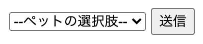
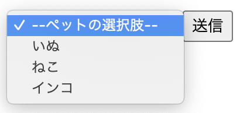
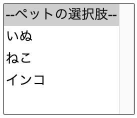
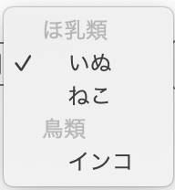
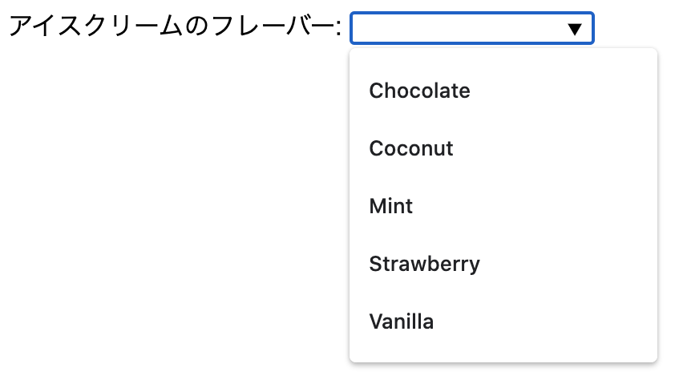
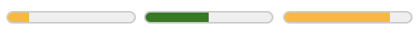

# フォーム (続き)

HTMLには「フォーム」を表示する機能があり、利用者はフォームにデータを入力し、それをウェブサーバーに情報を送信することができます。この節では、フォームとそれを構成する入力欄に関連する要素について説明します。

## `button`要素

`button`要素は、ボタンを表します。`input`要素でもボタンを表現できますが、`input`要素ではボタンのラベルを`value`属性で指定するのに対し、`button`では要素の内容がラベルとなる点が異なります。「送信」というボタンを`input`要素と`button`要素で実装すると、それぞれ以下のようになります。

```html
<!-- inputとbutton要素の比較 -->
<input type="submit" value="送信">
<button type="submit">送信</button>
```

`type`属性で、ボタンが押されたときの振る舞いを制御します。この属性は列挙属性であり、次の表の値を取ります。

- `submit`: フォームを送信する
- `reset`: フォームをリセットする
- `button`: 何もしない (主にスクリプトと組み合わせて使用します)

`type`属性のデフォルト値は`submit`です。`type`属性を指定しない場合、送信ボタンになることに注意してください。フォーム送信を意図しない場合、明示的に`type=button`を指定する必要があります。

`type=reset`を指定するとリセットボタンとなります。リセットボタンが押されると、ボタンに対応するフォームに含まれるすべてのフォームコントロールが初期化されます。リセットボタンを誤って押すと、入力内容のすべてが消えてしまい、取り返しがつかない場合があります。リセットボタン自体には、押されたときに警告を出すような機能は備わっていません。必要に応じてスクリプトなどで動作を制御し、本当にリセットするかどうかを確認するのも一つの方法です。そもそも、必要のないリセットボタンは配置しないのが賢明と言えます。

<!-- 内容モデル -->
`button`要素の内容モデルは"Phrasing"です。ただし、子孫要素にインタラクティブコンテンツを入れることはできません。また、`tabindex`属性が指定されている要素を子孫要素にすることもできません。

`button`要素の内容はボタンのラベルとなります。単純なテキストを入れるだけでなく、マークアップを行うこともできます。`img`要素を入れることもできるので、画像を用いるなどのさまざまな装飾が可能です。`input`要素でボタンを表現する場合はラベルにマークアップを含めることができないので、`button`要素のほうが表現力に優れていると言えます。
<!-- /内容モデル -->

<!-- a11y note -->
`button`要素のデフォルトのARIAロールは"button"です。スクリーンリーダーでは、ボタンのラベルとともに、ボタンであることが読み上げられます。逆に、ボタンに適切なラベルが与えられていない場合、単に「ボタン」としか読まれず、何をするボタンなのかがわからなくなってしまいます。特にボタンに画像のみを入れている場合は、画像に代替テキストを指定して、適切なラベルテキストを設定する必要があります。

`type=button`のボタンには、スクリプトによってさまざまな機能を与えられることがあります。ボタンの機能によっては、WAI-ARIAの状態(ステート)を付与することによって理解がしやすくなる場合があります。たとえば、トグルボタンのようなものであれば`aria-pressed`を、ボタンがメニューを開閉するようなものであれば`aria-expanded`を使用することを検討すると良いでしょう。
<!-- /a11y note -->

## `select`要素

`select`要素は、オプションから選択するためのコンボボックス、あるいはリストボックスのコントロールを表します。子要素として、`option`要素で選択肢を記述します。以下は選択肢からペットの種類を選択させる例です。

```html
<label>ペットを選びます:
<select name="pet" required>
    <option value="" selected>--ペットの選択肢--</option>
    <option value="dog">いぬ</option>
    <option value="cat">ねこ</option>
    <option value="parakeet">インコ</option>
</select>
</label>
```

`size`属性を指定すると、ユーザーに一度に見せる選択肢の数を指定できます。属性を指定しない場合のデフォルト値は"1"で、この場合はコンボボックスとして表現されます。多くのブラウザーではプルダウン式のリストとして表現されますが、モバイル端末ではドラムロール型のUIで表現されることもあります。UIの表現方法は仕様で規定されていないため、他の表現方法になる可能性もあります。



<!-- モバイルデバイスの表示例も載せる? -->

`size`属性に"2"以上の値を指定すると、リストボックスとして表現されます。多くのブラウザーでは高さが広がり、複数の選択肢が一度に見えるようになります。



`select`要素のコントロールは提示した選択肢から選ばせる機能を提供しますが、ラジオボタンでも同じ機能を実現できます。見た目や操作方法が異なるので、ユーザーにとって使いやすいと思われる方を選択するとよいでしょう。

`multiple`属性を指定することで複数選択が可能になります。多くのブラウザーでは、`size`属性の値が"1"であっても選択肢のすべてが展開された状態で表示されます。複数選択を行う場合、`ctrl`もしくは`cmd`キーを押しながらリスト項目を選択するといった独自の操作が必要になります。この操作に慣れていないユーザーも多いと考えられ、この複数選択のコントロールはあまり使われません。<!--個人的には一発太郎 ( https://www.ippatsu.net/ ) でしか見たことがない-->複数選択が必要な場合は、チェックボックスによる提供を検討するとよいでしょう。



選択肢の初期値は、初期値となる`option`要素に`selected`属性を指定することで設定します。`select`要素に`multiple`属性がついていない場合、`selected`を指定できる`option`はひとつだけです。フォーム送信を行うと、選択されている`option`要素の`value`属性の値がサーバーに送信されます。詳しくは`option`要素の項を参照してください。

`select`要素に`multiple`属性がない場合において、最初に登場する`option`要素の`value`属性の値が空文字列であるなら、その`option`は「プレースホルダラベル」(placeholder label)として扱われます。これが選択されていると、その`select`は何も選択していない初期状態になっているとみなされます。`select`要素に`required`属性を指定している場合、プレースホルダラベルが選択されている状態で送信を行うとエラーになります。

`value`属性の値が空文字列でも、`option`が先頭にないとプレースホルダーラベルとはみなされません。以下の例は、先の例とほぼ同じですが、選択肢の順番だけを入れ替えています。この場合、初期状態の「--ペットの選択肢--」のまま送信しようとしてもエラーになりません。

```html
<select name="pet" required>
    <option value="dog">いぬ</option>
    <option value="cat">ねこ</option>
    <option value="parakeet">インコ</option>
    <option value="" selected>--ペットの選択肢--</option>
</select>
```

<!-- 内容モデル -->
`select`要素の内容モデルは`option`もしくは`optgroup`です。`optgroup`要素を使用すると、選択肢をグループ化してグループのラベルを表示できます。詳しくは`optgroup`要素の項を参照してください。
<!-- /内容モデル -->

<!-- a11y note -->
`select`要素のデフォルトのARIAロールは、`size`属性と`multiple`属性の内容によって変化します。どちらの属性もないか、あるいは`size=1`の場合、ロールは"combobox"です。スクリーンリーダーは、`select`要素に関連づけされたラベルを読み、さらに「コンボボックス」などと読み上げることがあります。

`size`属性が2以上か、`multiple`属性がある場合は"listbox"となります。スクリーンリーダーは、`select`要素に関連づけされたラベルを読み、さらに「リストボックス」などと読み上げることがあります。

いずれの場合も、ラベルが関連づけされていないと何を選択するのか伝わらないことがあるため、`label`要素を適切に使用して関連づけておくと良いでしょう。
<!-- /a11y note -->

### `option`要素

`option`要素は`select`要素や`datalist`要素とセットで扱い、個々の選択肢を表現します。用例は`select`要素、`datalist`要素の項を参照してください。

`value`属性で、フォーム送信時に送信される値を指定します。この属性を省略した場合は、要素の内容となっているテキストが値として送信されます。

`label`属性を指定すると、選択肢として表示されるラベルを指定できます。この属性を省略した場合は、要素の内容となっているテキストがラベルとして表示されます。通常はこの属性を使わず、要素の内容をそのままラベルとすることが多いでしょう。

`selected`属性が指定されていると、その`option`要素がデフォルトで選択されている状態になります。`selected`属性は真偽値属性です。

<!-- 内容モデル -->
`option`要素の内容はテキストです。ただし、`label`属性と`value`属性の両方が指定されている場合には、`option`要素の内容モデルは"Nothing"となり、内容を含めることはできません。
<!-- /内容モデル -->

<!-- a11y note -->
`option`要素のデフォルトのARIAロールは、文脈によって異なります。祖先が`select`要素であり、そのロールが"listitem"である場合、もしくは祖先が`satalist`要素である場合は、"option"ロールとなります。祖先が`select`要素であり、ロールが"combobox"である場合、特定のロールは持たず、コンボボックスの一部として扱われます。この場合、ブラウザーは内部的に"menuitem"ロールとして扱うことがあります。
<!-- /a11y note -->

### `optgroup`要素

`select`要素の中で`optgroup`要素を使用すると、`option`要素をグループ化できます。`label`属性が必須で、これがグループの名前となります。

```html
<select>
  <optgroup label="ほ乳類">
    <option>いぬ</option>
    <option>ねこ</option>
  </optgroup> 
  <optgroup label="鳥類">
    <option>インコ</option>
  </optgroup>
</select>
```

これはたとえば以下のように表示されます。


`optgroup`要素は、あくまでグループのラベルを表現するものです。`optgroup`自体を選択することはできません。そのため、`selected`属性や`value`属性はありません。

すべての`option`を`optgroup`に入れなければならないわけではなく、`optgroup`に属さない`option`を混在させることもできます。

```html
<select>
  <optgroup label="ほ乳類">
    <option>いぬ</option>
    <option>ねこ</option>
  </optgroup> 
  <option>その他</option>
</select>
```

<!-- 内容モデル -->
`optgroup`要素の内容モデルは0個以上の`option`です。`option`以外のものを入れることはできません。`optgroup`を入れ子にすることもできません。なお、`option`要素は0個でも良いので、空の`optgroup`要素を使うことも可能です (意味があるかはともかく)。
<!-- 内容モデル -->

<!-- a11y note -->
`optgroup`要素のデフォルトのARIAロールは"group"です。スクリーンリーダーでは、ラベルを読み上げた後「クループ」などと読んで、選択肢のグループの名前であることがわかるように伝えてくれることが期待されます。
<!--
 しかしスクリーンリーダーの実際の対応状況は厳しいかも。
 最新のMacOS VoiceOverはoptgroupを特にそれらしくは読まず「淡色表示 {ラベル}」などと読む (見た目が淡色表示になっているのでそのまま読んでいる模様。とてもわかりにくい)。
 2014年時点ではNVDAも対応していなかった模様。https://waic.jp/docs/as/info/201406/H85-2.html
 最新の状況は要確認。
-->
<!-- /a11y note -->


## `datalist`要素

`datalist`要素は、ユーザーに提案する定義済み候補のリストを示します。`input`要素と組み合わせて使用し、対応する`input`要素の入力時に入力補完の候補を示します。`datalist`要素の子孫要素である`option`要素が候補として提示されます。

`datalist`要素に`id`属性を指定し、`input`要素の`list`属性でそのIDを指定することにより、候補を結び付けます。以下は、テキスト入力欄に対して入力補完候補を提示する例です。

```html
<label for="ice-cream-choice">アイスクリームのフレーバー:</label>
<input list="ice-cream-flavors" id="ice-cream-choice" name="ice-cream-choice">

<datalist id="ice-cream-flavors">
    <option value="Chocolate">
    <option value="Coconut">
    <option value="Mint">
    <option value="Strawberry">
    <option value="Vanilla">
</datalist>
```

これはたとえば以下のように表示されます。



この例では、ユーザーは選択肢から選ぶこともできますし、選択肢を無視して任意のテキストを入力することもできます。

テキスト入力以外にも、日付の入力、範囲の入力、カラーピッカーのコントロールなどに対して候補を提示できます。`datalist`要素による補完候補を利用できるのは、`type`属性が"text"、"search"、"url"、"tel"、"email"、"date"、"month"、
"week"、"time"、"datetime-local"、"number"、"range"、"color"の場合です。

`type=range`に適用すると、候補リストを表示するのではなく、提示された場所に目盛りが表示され、そこにスナップするような動作になります。具体的な使用例は`type=range`の項を参照してください。

<!-- 内容モデル -->
`datalist`要素の内容モデルは、`option`要素もしくは"Phrasing"です。通常は`option`要素を入れますが、`datalist`要素に対応していないブラウザーに対して入力欄を提示できるようになっています。以下はその一例です。

```html
<label>
動物の名前を入力してください:
<input name="animal" list="animals">
</label>
<datalist id="animals">
 <label>
  もしくは、以下から選択してください:
  <select name="animal">
   <option value="">--選んでください--</option>
   <option>猫</option>
   <option>犬</option>
  </select>
 </label>
```

こうすると、`datalist`要素を理解しないブラウザーでは、内容である`label`要素および`select`要素が表示され、`option`は`select`要素の選択肢となります。

`datalist`要素に対応したブラウザーの場合、`datalist`要素の内容は表示されず、子孫の`option`要素が`input`要素の入力補完候補として利用されることになります。
<!-- /内容モデル -->

<!-- a11y note -->
`datalist`要素のデフォルトのARIAロールは"listbox"です。`datalist`要素と結び付けられたコントロールにフォーカスすると、スクリーンリーダーは、「候補リストが表示されました」のように読み上げ、補完候補があることをユーザーに伝えます。
<!-- a11y note -->


## `textarea`要素

`textarea`要素は、複数行のテキストを入力・編集するフォームコントロールを表します。`type=text`の`input`要素と異なり、改行が入力可能です。コメント欄やお問い合わせフォームの本文入力欄など、ユーザーが自由記述のテキストを入力するときに利用します。

以下は`textarea`要素を使用した例です。

```html
<label for="advanced">高度な例:
  <textarea id="advanced" name="advanced"
            rows="3" cols="33" maxlength="200">
rows属性とcols属性でサイズが指定されたtextarea要素。最大文字数は、maxlengthによって200に制限されています。
  </textarea>
</label>
```

`type=text`の`input`要素ではテキストの初期値を`value`属性で指定していましたが、`textarea`要素では要素の内容が初期値となります。

`rows`属性で入力欄に表示する行数を指定します。指定がない場合の初期値は"2"で、2行分の高さが確保されます。入力欄の高さを指定するものと考えても差し支えありませんが、スタイルシートによって高さが指定されている場合、そちらの方が優先されます。

同様に、`cols`属性で1行あたりの文字数を指定できます。指定がない場合の初期値は"20"で、20文字分の幅が確保されます。後述の`wrap`属性を使用して`wrap=hard`を指定した場合、折り返しの文字数としても利用されます。詳しくは`wrap`属性を参照してください。

`cols`属性で指定した文字数が必ずしも入るわけではないことに注意してください。文字の幅は文字によって異なるため、使用しているフォントの文字幅の平均によって幅を計算します。なお、スタイルシートによる幅指定がある場合はそちらが優先されます。
<!--
https://html.spec.whatwg.org/multipage/rendering.html#textarea-effective-width
The textarea effective width of a textarea element is size×avg + sbw, where size is the element's character width, avg is the average character width of the primary font of the element, in CSS pixels, and sbw is the width of a scrollbar, in CSS pixels. (The element's 'letter-spacing' property does not affect the result.)
-->

<!-- wrap属性は実務でほぼ使わないけれど面白いので説明してしまう。コラム扱いでも可 -->
`wrap`属性を指定すると、フォーム送信時の長い行の折り返し処理を制御できます。`wrap`属性は列挙型属性で、"soft"または"hard"のいずれかを指定します。"hard"を指定すると、フォーム送信時に、入力欄の端で自動的に折り返した部分に改行 (CR+LF, %0d%0a) が挿入されます。指定がない場合のデフォルトは"soft"です。この場合、長い行が入力欄の端で自動的に折り返しても、その部分に改行は挿入されません。

以下は`wrap=hard`を指定した例です。

```html
<textarea name="wrapped" wrap="hard" cols="10">
this is a textarea element
</textarea>
```

内容のテキストに改行は含まれていませんが、`wrap="hard" cols="10"`が指定されているため、10文字ごとに折り返されて改行が挿入されます。GETメソッドで送信すると以下のようになります。

```text
wrapped=this+is+a+%0D%0Atextarea+%0D%0Aelement%0D%0A
```

なお、`wrap=hard`を指定した場合は`cols`属性が必須です。
<!--
https://html.spec.whatwg.org/multipage/form-elements.html#attr-textarea-wrap
>If the element's wrap attribute is in the Hard state, the cols attribute must be specified.
`cols`属性の省略時のデフォルト値は"20"なのだから省略してもcols=20として扱えば問題なさそうに思えるし、実際にChromeもcols=20として動作する。とはいえ、仕様には必須と書いてあるから必須なのだしか言いようがない。Nu Html Checkerでもしっかりエラーになる。
-->

また、`type=text`の`input`要素と同様に、以下の属性を使用できます。詳しくは`input`要素の項を参照してください。

- `maxlength`
- `minlength`
- `required`
- `placeholder`

なお、`textarea`要素では`pattern`属性を使用することはできません。

<!-- 互換性メモ -->
古いHTML4では`texrarea`要素に`maxlength`属性が存在しませんでしたが、現在のHTMLでは`textarea`要素にも指定できるようになりました。
<!-- /互換性メモ -->

<!-- 内容モデル -->
`texrarea`要素の内容モデルはテキストです。内容として指定されたテキストが入力欄の初期値となります。改行を含めることも可能です。
<!-- /内容モデル -->


<!-- a11y note -->
`texrarea`要素のデフォルトのARIAロールは"textbox"です。多くのスクリーンリーダーは、ラベルを読み上げたのち、「テキストを編集」「複数行テキスト入力」などと読み上げ、その後に入力されている内容を読み上げます。

ラベルが指定されていないと何を入力すべきかわからなくなることが多いため、`label`要素と組み合わせて確実にラベルを指定するようにするべきです。
<!-- /内容モデル -->

## `output`要素

`output`要素は、アプリケーションによって実行された処理の結果や、ユーザー操作によって得られた結果を表します。主にスクリプトの実行結果の出力先として利用します。実行結果を表すものとしては`samp`要素もありますが、`samp`要素は実行済みのサンプルを静的に表現するものです。`output`要素は、動的な実行結果を出力する先のプレースホルダーとして利用します。

実行結果の出力先には`span`など他の要素を利用することもできますが、`output`要素には、スクリプトによる動的処理に適した以下のような機能があります。

- `value`プロパティを通じて値の読み書きができる (ただし、HTMLを書く際に`value`属性を指定することはできません)
- `id`属性だけでなく、`name`属性でも名前をつけることができる
- デフォルトのARIAロールが"status"であり、値が変化した際に支援技術に通知する機能を持つ
- フォーム内に配置した場合、同一フォーム内のリセットボタンで値を初期値に戻すことができる

次は、簡単な足し算を行う電卓アプリケーションの例です。

```html
<form onsubmit="return false" oninput="o.value = a.valueAsNumber + b.valueAsNumber">
 <input id="a" type="number" step="any"> +
 <input id="b" type="number" step="any"> =
 <output id="o" for="a b"></output>
</form>
```

この例では、この出力に関連する入力欄を`for`属性で指定しています。`for`属性の属性値には、対応する要素のIDをスペース区切りで記述します。

`name`属性を指定でき、スクリプトから参照する際に利用できます。`id`属性を利用しても構いませんが、`name`属性は重複しても問題ないため、`name`属性のほうが便利な局面もあるかもしれません。

また、`form`属性を利用することで、この要素に関連するフォームを明示的に指定できます。以下は、ボタンを押すと数値が増加する例です。

```html
<form id="form1" onsubmit="result.value=parseInt(result.value)+1;return false">
<button>+1</button>
<button type="reset">reset</button>
</form>

<output name="result" form="form1">1</output>
```

この`output`要素は`form`要素の外にありますが、`form`属性でフォームと関連付けられているため、フォーム内に置かれているかのように機能します。フォーム内のスクリプトから`this.result`として参照できますし、フォーム内のリセットボタンによって値を初期値に戻すことができます。

<!-- 内容モデル -->
`output`要素の内容モデルは"Phrasing"です。出力結果に強調などのマークアップを含めることもできます。ただし、`output`要素の`value`プロパティでは内容のテキストしか取得・設定できません。マークアップを含む内容を扱う場合には、`value`プロパティを使わずにDOM操作を行って処理する必要があります。
<!-- /内容モデル -->

<!-- a11y note -->
`output`要素のデフォルトのARIAロールは`status`です。statusロールは「ライブリージョン」(live region)であり、値が変化したときに支援技術に通知します。`output`要素の内容が変化すると、スクリーンリーダーはその内容を読み上げます。先に紹介した例では、ボタンを押すと数値が増加し、その数値が読まれます。ボタンからフォーカスを移動しなくても結果を知ることができるため、ユーザーはボタンを連打しながら数値を確認できます。

statusロールのデフォルトは、`aria-live=polite`と`aria-atomic=true`が指定されている状態になります。つまり、変更が起きても即座に読み上げられるわけではなく、他の読み上げが一段落したタイミングで読まれることになります。また、`output`要素の内容の一部だけが変化しても、要素の内容全てがあらためて読まれます。

この挙動は、必要に応じて`role=alert`を明示的に指定して`alert`ロールに変更したり、`aria-live`や`aria-atomic`に別の値を設定することで変更できます。

なお、`output`要素は「ラベル付け可能要素」(labelable element)に分類されているため、必要に応じて`label`要素と関連づけることもできます。出力内容を単独で読んでも理解しにくい場合には、ラベルをつけることを検討しても良いでしょう。
<!-- /a11y note -->


## `progress`要素

`progress`要素は、タスクの進捗状況を表します。これは通常、プログレスバーとしてレンダリングされます。以下は、進捗度が半分の状態のプログレスバーを表示した例です。

```html
<progress value="0.5">50%</progress>
```


あくまで動的な進捗状況を表現する要素であることに注意してください。単に割合をグラフを表示したい場合には、後述の`meter`要素などを利用します。
`progress`要素を実際に利用する際は、進捗状況を動的に反映させるために、スクリプトから`value`プロパティの値を操作します。

```html
<progress id="p" max="100" value="0"><span>0</span>%</progress>
<script>
  var progressBar = document.getElementById('p');
  function updateProgress(newValue) {
    progressBar.value = newValue;
    progressBar.getElementsByTagName('span')[0].textContent = newValue;
  }
 </script>
```

この例では、`updateProgress()`関数を外部から呼び出すことで`progress`要素の値を更新できます。

`value`属性で進捗の現在値を表します。属性値は任意の浮動小数点数です。`max`属性が指定されていない場合、`value`属性は0.0〜1.0までのいずれかの値をとり、1.0の場合に進捗が完了したことになります。負の値を指定することも可能ですが、プログレスバー上では負の値は表現されず、0のときと同じ表示になります。

`value`属性の初期値が"0"ではないことに注意してください。`value`属性を省略すると、現在値は「未定義」(indeterminate)となります。これは、プログレスバーを表示する準備ができていない状況を表し、多くのブラウザーは、プログレスバー自体がローディング中であるような表示を行います。

`max`属性で進捗の最大値を指定できます。`max`属性が指定されていると、`value`属性の値は`max`属性の値に対する割合として扱われます。たとえば、`max=100`を指定すると、`value=50`のときに半分、`value=100`のときに最大となります。

なお、`max`属性に0以下の値を指定することはできません。0や負の値を指定すると、不正な値とみなされて`max`属性は無視されます (その結果として初期値が採用され、`max=1.0`を指定した場合と同じように動作します)。

`progress`要素に`min`属性はありません。最小値は変更できず、常に0となります。

<!-- 内容モデル -->
`progress`要素の内容モデルは"Phrasing"です。ただし、`progress`要素を子孫に持つことはできません。

`progress`要素の内容は表示されませんが、`progress`要素を理解しないブラウザーに対するフォールバックとして機能します。先の例のように、テキストを入れて進捗状況がわかるようにしておき、プログレスバーの更新と同時に内容のテキストも更新すると良いでしょう。
<!-- /内容モデル -->

<!-- a11y note -->
`progress`要素のデフォルトのARIAロールは"progressbar"です。スクリーンリーダーは、進捗の割合を読んだ上でこのコントロールの名前を読みます。たとえば、「50% 進行インジケータ」のように読まれることがあります。

ライブリージョンの機能は持たないため、進捗状況が変化しても自動的に読み上げられるわけではありません (プログレスバーが変化するたびに読まれると鬱陶しい場合の方が多いでしょう)。

`progress`要素は「ラベル付け可能要素」(labelable element)に分類されているため、必要に応じて`label`要素と関連づけることもできます。単独で読んでも理解しにくい場合には、ラベルをつけることを検討しても良いでしょう。
<!-- /a11y note -->


## `meter`要素

`meter`要素は、一定範囲に収まるスカラー量や、割合で表現できる値を表します。たとえば、ディスク使用量や投票率などです。これは通常、棒グラフのようなゲージとしてレンダリングされます。以下は0.75 (75%、3/4) のゲージを表示する例です。

```html
<meter value="0.75">0.75</meter>
```


見た目は前述の`progress`要素と似た表現になります。刻一刻と変化する進捗状況を表現したい場合に`progress`要素を使用し、そうでない場合には`meter`要素を使います。

`value`属性で割合を表します。属性値は任意の浮動小数点数です。`min`属性や`max`属性が指定されていない場合、`value`属性は0.0〜1.0までのいずれかの値をとり、1.0の場合に最大となります。

負の値を指定することも可能ですが、`min`属性で指定した最小値(`min`属性がない場合は0)を下回る値は表現できず、最小値のときと同じ表示になります。同様に、`max`属性で指定した最大値(`max`属性がない場合は1)を超える値を指定すると、最大値のときと同じ表示になります。

`min`属性、`max`属性を指定でき、それぞれゲージの最小値、最大値を表します。指定できる値は任意の浮動小数点数で、負の値も設定可能です。ただし、`min`属性と`max`属性の両方を指定する場合、`min`属性の値よりも`max`属性の値のほうが大きくなくてはなりません。

以下は、-100度から200度までの温度を表現するゲージの例です。

```html
<meter min="-100" max="200" value="10">摂氏10度</meter>
```

### `low`属性、`high`属性、`optimum`属性による閾値の指定
ときには、値が一定の範囲を超えた場合にゲージの見た目を変えて、ユーザーに注意を促したいこともあるでしょう。

`low`属性と`high`属性を使用すると、低い値、高い値の閾値を指定できます。`low`属性で指定した値以下の値は、低い値であるとみなされます。同様に、`high`属性で指定した値以上の値は、高い値であるとみなされます。

さきほどの温度ゲージに閾値を追加し、0度以下を低温、100度以上を高温とみなすようにすると、以下のようになります。

```html
<meter min="-100" low="0" high="100" max="200" value="10">摂氏10度</meter>
```

`value`属性の値を-50、50、150にしたものを並べてみると、以下のようになります。

```html
<meter min="-100" low="0" high="100" max="200" value="-50">摂氏-50度</meter>
<meter min="-100" low="0" high="100" max="200" value="50">摂氏50度</meter>
<meter min="-100" low="0" high="100" max="200" value="150">摂氏150度</meter>
```

これはたとえば以下のように表示されます。



50度は適温と判断されて通常の表示となり、-50度は低温、150度は高温と判断されて色が変化しています。

この例では中間のレンジを適温 (適切な値) としましたが、状況によっては、低いや高い値の方が適切な場合もあるでしょう。`optimum`属性を使用すると、どのレンジの値が適切な値であるのかを指定できます。浮動小数点数で指定し、その値が含まれるレンジが適切な値であるとみなされます。

先の例で、`optimum=-100`を指定すると以下のようになります。

```html
<meter min="-100" low="0" high="100" max="200" optimum ="-100" value="-50">摂氏-50度</meter>
<meter min="-100" low="0" high="100" max="200"  optimum ="-100" value="50">摂氏50度</meter>
<meter min="-100" low="0" high="100" max="200"  optimum ="-100" value="150">摂氏150度</meter>
```

`optimum`の値は-100であり、この値が含まれる`low`以下のレンジが適切な値とみなされます。これはたとえば以下のように表示されます。


-50度は適温と判断されて通常の表示となり、50度は高温と判断されて色が変化しています。150度は超高温と判断され、さらに色が変化しています。

`optimum`属性を省略した時の初期値は、最小値と最大値の中間の値となります。言い換えれば`min`と`max`の平均です。`low`と`high`の平均ではないことに注意してください。
<!--
>Otherwise, the candidate optimum point is the midpoint between the minimum value and the maximum value.
-->

以下は、先の例の`min`と`max`を変更し、温度の範囲を-273度から1000度とした例です。`optimum`属性は省略されています。

```html
<meter min="-273" max="1000" value="50" low="0" high="100">摂氏50度</meter>
```

この例では`optimum`属性を省略しているため、`min`と`max`の中間である363.5という値が含まれるレンジ、すなわち`high`以上のレンジが適切であるとみなされます。

<!-- 内容モデル -->
`meter`要素の内容モデルは"Phrasing"です。ただし、`meter`要素を子孫に持つことはできません。

`meter`要素の内容は表示されませんが、`meter`要素を理解しないブラウザーに対するフォールバックとして機能します。先の例のように、テキストを入れて進捗状況がわかるようにしておくとよいでしょう。
<!-- /内容モデル -->

<!-- a11y note -->
`meter`要素にデフォルトのARIAロールはありません。スクリーンリーダーは、ゲージの割合を読んだ上で「レベルインジケータ」などと読むことがあります。`low``high`属性を使用しているケースについては、特別な読み上げはなされず、値が特定の閾値を超えていることが伝わらない場合があります。

`meter`要素は「ラベル付け可能要素」(labelable element)に分類されているため、必要に応じて`label`要素と関連づけることもできます。単独で読んでも理解しにくい場合には、ラベルをつけることを検討しても良いでしょう。
<!-- /a11y note -->

## `fieldset`要素

`fieldset`要素は、一連のフォームコントロールをグループ化します。`legend`要素を使用してグループにラベルをつけることもできます。主にラジオボタンや
チェックボックスのグループにラベルを付けるのに使いますが、他の種類のコントロールをグループ化することもできます。以下は、いくつかの種類のコントロールをグループ化してラベルをつけた例です。

```html
<fieldset>
 <legend>ディスプレイ表示</legend>
 <p><label><input type="radio" name="c" value="0" checked>黒地に白字</label>
 <p><label><input type="radio" name="c" value="1">白地に黒字</label>
 <p><label><input type="checkbox" name="g">グレースケールを使用する</label>
 <p><label>コントラストを強調する <input type="range" name="e" list="contrast" min="0" max="100" value="0" step="1"></label>
 <datalist id="contrast">
  <option label="Normal" value="0">
  <option label="Maximum" value="100">
 </datalist>
</fieldset>
```

<!-- 内容モデル -->
`fieldset`要素の内容モデルは、単一の`legend`要素と、"Flow"です。`legend`要素は省略可能ですが、使用する場合は`fieldset`要素の最初の子要素である必要があります。また、`legend`は`fieldset`要素の直接の子要素でなければならず、`div`や他の要素でラップすることはできません。<!--たまにやろうとする人がいるのですが、できません。-->

`legend`要素の後には、"Flow"のコンテンツを自由に置くことができます。`p`要素で説明文を書いたり、`ul`要素で複数のフォームコントロールをリスト化したりできます。`fieldset`要素の中に他の`fieldset`要素を入れ子にすることもできます。

見出しを入れることもできます。アウトラインアルゴリズム上、`fieldset`要素はセクショニングルートとなり、見出しを入れた場合、外のアウトラインとは独立したアウトラインが作られます。
<!-- /内容モデル -->

<!-- a11y note -->
`fieldset`要素のデフォルトのARIAロールは"group"です。多くのスクリーンリーダーは、グループ内の最初のフォームコントロールにフォーカスしたときにクループのラベルを読み上げます。`legend`要素を使用してラベルを付けることを強くお勧めします。

ラジオボタンやチェックボックスを使用する場合、`label`要素によるラベルは個々の選択肢の名前となります。選択肢だけを読まれても、何に対する選択なのかわからないことが多いため、`fieldset`要素と`legend`要素でグループ全体にラベルを付けるとよいでしょう。

ラジオボタンをグループ化している場合は、`role=radiogroup`を指定することもできます。<!--この情報いる? スクリーンリーダーで何か変わる? -->
<!-- /a11y note -->


## `legend`要素

`legend`要素は、`fieldset`要素のキャプションを表します。`fieldset`要素で表したグループのラベルとして機能します。使い方については`fieldset`要素を参照してください。

<!-- 内容モデル -->
`legend`要素の内容モデルは"Phrasing"ですが、見出し要素を混在させることができます。`legend`要素に見出しを入れると、グループのラベルと見出しを兼ねさせることができます。

```html
<fieldset>
 <legend><h2>希望する連絡方法</h2></legend>
 <ul>
 <li><label><input type="radio" name="contact" checked>電子メール</label></li>
 <li><label><input type="radio" name="contact">電話</label></li>
 <li><label><input type="radio" name="contact">ファクシミリ</label></li>
 </ul>
</fieldset>
```

とはいえ、見出しを入れることが必須なわけではありません。通常は単にテキストを入れることが多いでしょう。"Phrasing"が入りますので、テキストをマークアップしたり、フォームコントロールを入れたり、`label`要素を入れたりすることも可能です。ただし、`legend`要素の内容はグループのラベルとして使用されるものですので、あまり長いテキストを入れると理解が難しくなるかもしれません。

見出しを除き、"Phrasing"でない要素を入れることはできません。`div`要素入れられませんので注意してください。
<!-- /内容モデル -->

<!-- a11y note -->
`legend`要素にデフォルトのARIAロールはありません。`legend`要素は`fieldset`のラベルとして扱われます。スクリーンリーダーは、`fieldset`要素内のフォームコントロールにフォーカスした時に`legend`要素の内容を読むことがあります。
<!-- /a11y note -->

## フォームコントロールの共通属性

ここでは、フォームコントロールに共通して指定できる属性のうち、代表的なものを紹介します。
<!-- dirname などマイナーなものは省いています -->

### 名前フォームコントロール：`name`属性
<!--もうちょっと説明を深化したほうがよさげ-->
`name`属性は、フォームコントロールに名前を与えます。フォーム送信時には、有効なフォームコントロールの`name`属性の値が送信されます。`name`属性が指定されていないと、そのコントロールの値は送信されません。フォーム送信時の動作の詳細については、`form`要素の項も参照してください。
<!--
(↓これいります? 説明するなら、name属性はparam要素、meta要素、ifeame要素などにも存在するので全部説明するべき?)
なお、`a`要素に付与する`name`属性（`id`属性のように使用されていました）とは役割が異なることに注意してください（これは廃止されました）。
-->

`id`属性と異なり、複数の要素に同じ名前を与えることができます。複数のチェックボックスやラジオボタンに同じ`name`属性を指定すると、それらは同一のグループに属するものとみなされます。詳しくは`input`要素の項を参照してください。

フォーム送信時には、同名の`name`属性があってもまとめられることはなく、全て個別に送信されます。以下はふたつのチェックボックスに同じ名前を指定した例です。

```html
<label><input type="checkbox" name="animal[]" value="cat">ねこ</label>
<label><input type="checkbox" name="animal[]" value="dog">いぬ</label>
```

両方にチェックして送信すると、以下のような値が送られます。名前=値のベアが複数送信されている点に注目してください。

```text
animal%5B%5D=cat&animal%5B%5D=dog
```

なお、フォーム送信を受け取る側の処理系によっては、同名の値をひとつにまとめて処理できることもあります。たとえばPHPでは、名前の末尾に`[]`がついた値を配列として扱うことができます。上記の例で送信された値は、`$_POST['animal']`として取得でき、その値は`["cat", "dog"]`という配列になります。


### 入力長さの制限：`maxlength`属性と`minlength`属性
<!-- 要編集: 3-9 前半の方に書いたものをこちらに移動してくる? -->

### フォームコントロールの有効化および無効化：`disabled`属性
<!--もうちょっと説明が必要？-->
`disabled`属性を指定すると、そのフォームコントロールを無効にできます。`disabled`属性は真偽値属性です。この属性をスクリプトから制御することで、特定の条件を満たした場合にのみ入力できるような入力欄を実現できます。

フォームコントロールが無効になっていると、入力や編集、ボタン操作といった動作が行えなくなります。フォーカスを当てることもできません。ブラウザーは多くの場合、フォームコントロールの見た目を薄い色に変更するなど、無効であることがわかるようにします。また、スクリーンリーダーでは「無効なコントロール」などと読み上げられることがあります。

無効になっているフォームコントロールの値は送信されません。ユーザーが値を入力したあとでスクリプトによって`dsisable`が設定された場合、ユーザーが入力した値が送られなくなることに注意してください。この点は`readonly`属性との大きな違いです。

### フォームコントロールを自動フォーカスする：`autofocus`属性
<!-- 編集上の留意点:
 autofocusはtabindexと同様に全ての要素に指定可能ですが、ここでの紹介でOK?
 仕様上はtabindexなどと同じところで紹介されています。
 https://html.spec.whatwg.org/multipage/interaction.html#the-autofocus-attribute
 tabindexとセットにしたほうがよいようにも思いつつ、実務上はフォームコントロール以外に使うことはあまりないのでここでも良いような気もしつつ
-->
`autofocus`属性を指定すると、その要素が表示された際に即座にフォーカスを受け取ることが期待されます。`autofocus`属性は真偽値属性です。この属性が`dialog`要素の子孫要素に指定されている場合は、その`dialog`が表示された際にフォーカスを受け取ります。そうでない場合は、ページの読み込み時にフォーカスを受け取ります。

ログインフォームや検索フォームしか存在しないページなど、入力欄以外のコンテンツがほとんどないような場合に、入力欄にこの属性を指定しておくと、ユーザーがすぐに入力を始めることができます。

この属性を、同一ページ内 (`dialog`要素の中で使われる場合は、同一の`dialog`要素内) の複数の要素に同時に指定することはできません。
<!--
Nu html checkerでは以下のエラーになる。
Error: A document must not include more than one autofocus attribute.
ちなみに現状のNuはdialogについては考慮していない模様。
仕様上は、
There must not be two elements with the same nearest ancestor autofocus scoping root element that both have the autofocus attribute specified.
であり、dialogはautofocus scoping root elementなので、別のdialogの中のものに指定することはできる。
-->

<!-- a11y note -->
この属性が指定されている要素は、強制的にフォーカスを奪うことに注意してください。スクリーンリーダーを利用している場合、通常はページの先頭から読まれますが、この属性のある要素が登場した場合、いきなりその要素が読まれるため、混乱を招くことがあります。特に、ページ内に読むべきコンテンツが他にあるような場合には、不用意に利用しない方がよいでしょう。
<!-- /a11y note -->


### オートフィルフォームコントロール：`autocomplete`属性

`autocomplete`属性を指定すると、ユーザーエージェントに対して、フォームコントロールの入力補完に関するヒントを与えることができます。この属性には大きく分けて2種類の用途があり、ひとつは自動補完の動作自体を制御するもの(autofill expectation mantle)、もうひとつは値の種類を指定するもの (autofill anchor mantle) です。
<!-- 表現至難。調整歓迎。mantleは外套、マントのmantleでは原文はwear...mantleと「マントを羽織る」という表現。 -->

### 自動補完の動作を制御する
自動補完の動作自体を制御しようとする場合、属性値として"on"もしくは"off"を指定します。"off"を指定した場合、該当の入力欄がセンシティブな値、再入力すべきでない値を扱うことを示唆します。<!-- 原文には for example the activation code for a nuclear weapon とある…… -->"on"の場合は、際入力して良い値であり、入力補完が許されるものであることを示唆します。

`input type=password`の入力欄では、`autocomplete=off`が特殊な扱いを受けることがあります。モダンなブラウザーではパスワードを一括管理する機能を持ちます。このパスワード管理機能はセキュリティの向上につながるため、モダンなブラウザーのほとんどは`autocomplete=off`の指定があってもユーザーにパスワードを保存するかどうかを尋ね、ユーザーが許可すればパスワードを保存する挙動を示します。企業によっては「ブラウザーにパスワードを記憶させないようにすること」という古いガイドラインを持つ場合がありますが、現在ではウェブコンテンツ側で実現することは事実上不可能です。

なお、新規パスワード設定の際の入力欄に過去のパスワードを補完させたくないという場合には、値の種類を"new-password"と指定する、すなわち、`autocomplete=new-password`を指定することによって目的を達成できる場合があります。

### 値の種類を指定する

ブラウザーに対して値の種類を示唆することで、ブラウザーは適切な入力の補完ができます。

たとえば、ユーザーが「氏名」という入力欄に入力した後、別の場所で同様に「氏名」の入力を求められた場合、ブラウザーは先に入力した氏名のデータを記憶しておき、後の入力欄を補完することがあります。

このとき、ブラウザーは、その入力欄の値の種類が同一かどうかを判断する必要があります。ブラウザーは`input`要素の`name`属性の値をヒントに同一性を判断しますが、`autocomplete`属性を利用すると、その種類を明示的に指定できます。氏名のほかにも、住所、性別、クレジットカード番号、URL、メールアドレスなどを明示できます。

属性値には、3種類のトークンを組み合わせた値を指定します。それぞれ以下のようになります。

- 送り先か、支払情報か: 送り先の情報であれば "shipping"、支払情報であれば "billing"を指定します。どちらでもなければ省略します。
- グループ名: 値が何かのグループに属する場合、"section-" で始まるグループ名を指定できます。グループ名は任意に付けることができます。送信元と送信先の両方の住所を入力しなければならない場合など、同種の情報を区別する必要がある場合に利用します。省略することも可能です。
- 値の種類: 値の種類を示すキーワードを指定します。キーワードは仕様で規定されており、"name"、"nickname"、"country"、"photo"など40種類以上が存在します。詳しくは仕様を参照してください。

複数のトークンを指定する場合は、スペースで区切ります。たとえば、フォームで2つの配送先住所がある場合、次のようにマークアップできます。

<!--何かわかりやすい例を作成 以下はHTMLStdからの複写-->
```html
<fieldset>
 <legend>1つ目のギフトの配送先</legend>
 <p> <label>郵便番号: <input name="bp" autocomplete="section-blue shipping postal-code"> </label>
 <p> <label>都道府県: <input name="bc" autocomplete="section-blue shipping address-level1"> </label>
 <p> <label>住所:     <textarea name="ba" autocomplete="section-blue shipping street-address"></textarea> </label>
</fieldset>

<fieldset>
 <legend>2つ目のギフトの配送先</legend>
 <p> <label>郵便番号: <input name="rp" autocomplete="section-red shipping postal-code"> </label>
 <p> <label>都道府県: <input name="rc" autocomplete="section-red shipping address-level1"> </label>
 <p> <label>住所:     <textarea name="ra" autocomplete="section-red shipping street-address"></textarea> </label>
</fieldset>
```
