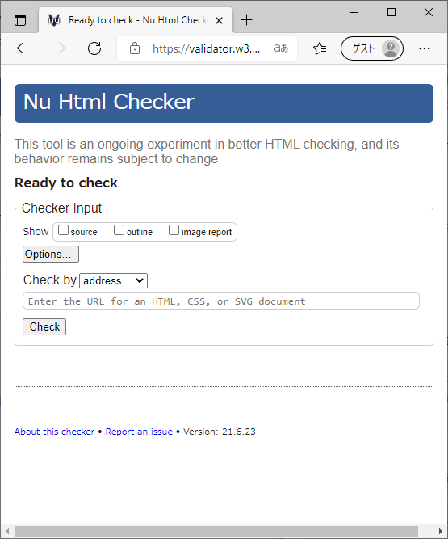
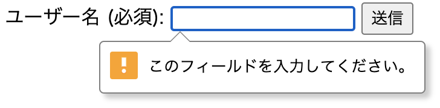
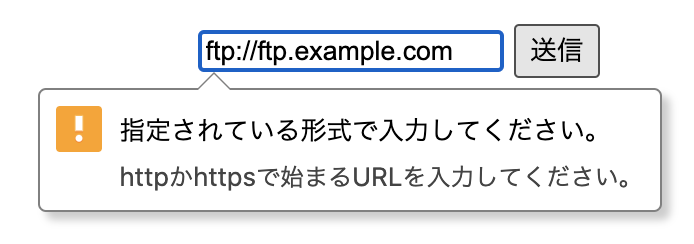

<!-- ch3-9.txt (4ページ、3000～4600字想定) -->
# フォーム

HTMLには「フォーム」を表示する機能があり、ユーザーはフォームにデータを入力し、それをウェブサーバーに情報を送信できます。この節では、フォームとそれを構成する入力欄に関連する要素について説明します。

## フォーム概説

ウェブコンテンツの中には、利用者による入力を受け付けるものがあります。以下は、本書で何度か紹介しているHTMLチェッカー"Nu Html Checker"の画面です。


<!-- 横着して00にしてますが、後で変える -->

ここでは、ユーザーがチェック対象のURLを入力できます。また、オプションとして何を表示するのかを、チェックボックスで選択できます。チェック方法を選択することもできます。こうして、一通りの入力と選択を終えた後、"check"ボタンを押すとチェックが行われます。

このように、テキストを入力したり、選択肢を選んだりしてから送信ボタンを押す、という一連の操作を提供するもの全体を「フォーム」(form)と呼びます。フォームは「入力フォーム」と呼ばれることもあります。

フォームの中には、テキスト入力欄やラジオボタンといったさまざまな部品が置かれます。ユーザーはこれらを操作することで、フォームに対して値を指定したり、入力を行ったりします。このような、ユーザーが値を入力・設定するための部品を「フォームコントロール」(form control) と呼びます。

ほとんどのフォームでは、ユーザーが入力・設定した値は、最終的にサーバーに向けて「送信」(submit)されます。この送信を行うボタンを「送信ボタン」(submit button)と呼びます。多くのフォームでは、ユーザーが送信ボタンを押すまで情報がサーバーに送信されることはありません。送信ボタンを押す前であれば、ユーザーは自由に入力内容を修正できます。

HTMLには、フォームやフォームコントロール表現する要素が多数用意されており、これらを利用することで、基本的なフォームを表現できます。

## `form`要素

`form`要素は、フォーム全体を表します。以下は簡単な検索フォームの例です。

```html
<form method="get" action="/search.cgi">
  <input type="text" name="k">
</form>
```

`method`属性でフォーム送信時の送信方法を指定します。`method`属性は列挙属性で、`get`、`post`、`dialog`のいずれかを指定します。

`get`は、入力内容がHTTP GETメソッドで送信されます[^1]。フォームのデータはURLとして送信されます。これは、`action`で指定されたURLの後ろで`?`で区切って、フォームに入力された値を`application/x-www-form-urlencoded`のアルゴリズム[^2]でシリアライズした（パーセントエンコーディングやURLエンコードなどとも呼ばれる）URLとなります。上記の入力欄に、例えば"テスト"と入力すると、次のようなURLにアクセスすることになります。

```txt
/search.cgi?k=%E3%83%86%E3%82%B9%E3%83%88
```

`post`では、入力内容がHTTP POSTメソッドで送信されます[^3]。この場合、入力された値はHTTPリクエストのリクエストボディに含まれます。リクエストボディの形式については、後述の`enctype`属性の項を参照してください。

`dialog`では、入力内容をサーバーに対して送信しません。これは`dialog`要素と組み合わせて使用し、フォームを送信するとダイアログが閉じられると同時に、入力された内容を`dialog`要素の`returnValue`プロパティから読み取れるようになります。以下は、ダイアログを閉じた際に押されたボタンを表示する例です。

```html
<dialog id="dialog1">
  <form method="dialog">
    <p>OKですか?</p>
    <button type="submit" value="OK">OK</button>
    <button type="submit" value="Cancel">Cancel</button>
  </form>
</dialog>
<script>
  const d = document.getElementById('dialog1');
  d.showModal();
  d.onclose = () => {alert (d.returnValue)};
</script>
```

`method`属性を省略した際のデフォルト値は`get`です。たとえフォームの入力内容をサーバーに送信する必要がない場合に`method`属性を省略したとしても、暗黙的に`method="get"`が補われ、GETによるフォーム送信が行われる状態になります。スクリプトでフォームの送信を明示的に抑制しないと、フォーム送信が行われることになるので注意してください。

`action`属性で、フォーム送信時の送信先となるURLを指定します。`action`属性を指定していない場合は、フォームが置いてあるページ自身が送信先となります。`action`属性に空の値を指定する (`action=""`) ことはできず、構文エラーとなりますが、この場合もエラー処理の結果としてフォームが置いてあるページ自身が送信先となります。
<!--
4.10.21.3 Form submission algorithm
>If action is the empty string, let action be the URL of the form document.
-->

[^1]: RFC 7231 4.3.1で定義されています。 <https://datatracker.ietf.org/doc/html/rfc7231#section-4.3.1>

[^2]: "application/x-www-form-urlencoded" はURL Standardで定義されています。 <https://url.spec.whatwg.org/#urlencoded-serializing>

[^3]: RFC 7231 4.3.3で定義されています。 <https://datatracker.ietf.org/doc/html/rfc7231#section-4.3.3>

`enctype`属性を指定すると、`method="post"`でフォーム送信するときのリクエストボディの形式を指定できます。`enctype`属性は列挙型属性で、以下のいずれかを指定します。

- "application/x-www-form-urlencoded"
- "multipart/form-data"
- "text/plain"

`application/x-www-form-urlencoded`は、`method="get"`での処理と同様です。たとえば以下のような形式でリクエストボディで送信されます。

```text
name1=value1&name2=value2
```

フォーム送信では一般的にこの形式が利用されます。省略時のデフォルト値でもあります。

`multipart/form-data`は、入力項目それぞれをバウンダリー（区切り文字）で区切った形式で、RFC7578[^3]で定義されています。たとえば以下のようにリクエストボディで送信されます。

```text
------WebKitFormBoundarygOTbtF2D0Y0ZT1Ak
Content-Disposition: form-data; name="name1"

value1
------WebKitFormBoundarygOTbtF2D0Y0ZT1Ak
Content-Disposition: form-data; name="name2"

value2
------WebKitFormBoundarygOTbtF2D0Y0ZT1Ak--
```

この形式は、主にフォームからファイルを送信する際に利用します。

"text/plain"は、単純に`名前=値`のペアを改行(CR+LF)で区切った形式です。例えば以下のようになります。

```text
name1=value1
name2=value2
```

簡素で人間には読みやすい形式ですが、現在ではほとんど使われていません。

[^3] RFC7538 <https://datatracker.ietf.org/doc/html/rfc7578>

このほかの属性として、`target`属性と`rel`属性を指定することができます。これらは`a`要素の同名の属性と同じです。「リンク関連要素」の各属性の項を参照してください。`rel`属性では`a`要素で利用できるリンクタイプを指定できますが、`form`要素ではリンクタイプ"alternate"、"author"、"bookmark"、"tag"を利用することができません。

<!-- 互換性メモ -->
古いHTML4では、`accept-charset`属性でフォーム送信時の文字エンコーディング方式の候補を指定できました。この属性は現在のHTMLにも存在しますが、現在のHTML仕様では"UTF-8"以外は指定できません。属性を省略しても"UTF-8"を指定したことになるため、現在ではこの属性を利用する意義はありません。
<!-- /互換性メモ -->

<!-- 内容モデル -->
`form`要素の内容モデルは"Flow"です。フォームコントロール以外にも、見出し、説明文、表など、さまざまな要素を入れることができます。ただし、子孫要素に`form`を入れ子にすることはできませんので注意してください。フォーム内に複数のボタンがあり、ボタンによってフォームの送信先を変えたいような場合、`form`を入れ子にするのではなく、ボタンに`formaction`属性を指定することで実現します。
<!-- /内容モデル -->

<!-- a11y note -->
`form`要素のデフォルトのARIAロールは基本的にはありません。ただし、フォームにアクセシブルな名前がつけられていれば`form`となります。フォームが検索フォームである場合は、`form`の代わりに`search`ロールを与えることで、明示的に検索フォームであることがユーザーに伝わります。

なお、`form`ロールや`search`ロールはランドマークロールでもあります。多くのスクリーンリーダーは前後のランドマークに飛んだり、ランドマーク領域全体を読み飛ばしたりする機能を持ちますが、ランドマークでないフォームに飛ぶ機能も持っています。無理に`role="form"`を与える必要はないでしょう。
<!-- /a11y note -->

## `label`要素

`label`要素は、ユーザーインターフェイスのキャプションを表す要素で、フォームコントロールにラベルを付けることができます。この要素を利用することで、ラベルのテキストを単に視覚的に表示するだけでなく、プログラム的にもフォームコントロールに関連付けることができます。

これにより、ほとんどのブラウザーでは、ラベルをクリックしたときに対応するフォームコントロールにフォーカスが当たります。また、ラベルに対応するフォームコントロールにフォーカスが当たったときに、スクリーンリーダーは明示的にラベルを読み上げ、どのようなデータを入力すればよいかをユーザーが理解しやすくなります。

この要素でラベルをつけることのできる要素を「ラベル付け可能要素」(labelable element)と呼びます。具体的には、以下の要素がラベル付け可能要素となります。

- `button`要素
- `input`要素 (ただし、`type="hidden"`のものを除く)
- `meter`要素
- `output`要素
- `progress`要素
- `select`要素
- `textarea`要素

このほか、カスタム要素で`form-associated`が`true`に設定されているものはラベル付け可能要素となります。

`label`要素とラベル付け可能要素を結びつける方法は2種類あります。ひとつの方法は、ラベル付け可能要素を`label`要素の子孫要素とする方法です。

```html
<label>クエリー: <input name="q" type="text"></label>
```

もうひとつの方法は、`for`と`id`属性を用いてラベル付けする方法です。

```html
<label for="q">Query: </label><input name="q" id="q" type="text">
```

この方法では、`label`要素がどこにあっても関連付けができるため、配置の自由度が増します。ただし、フォームコントロールの側に`id`属性が必要になることに注意してください。`id`属性はページ内で一意でなければならないため、システムでフォームコントロールを増減できるようなケースでは扱いに注意する必要があります。

また、冗長になりますが、ふたつの方法を同時に使って以下のようにすることも可能です。

```html
<label for="q">クエリー: <input name="q" id="q" type="text"></label>
```

ただしこの場合、両方が同じ要素を指すようにしなければなりません。以下は正しくない例です。

```html
<!-- 文法エラーとなる例 -->
<label for="text2">Query: <input id="text1"></label>
<input id="text2">
```

これはエラーになりますが、エラー処理の結果として`for`属性による指定の方が優先され、"text1"はラベルを持たない状態になります。`for`による指定と子孫要素による指定を混在させると混乱が起こりやすいため、どちらかに統一するとよいでしょう。

ひとつの`label`要素を複数のラベル付け可能要素に関連付けることはできません。`label`要素の子孫にラベル付け可能要素が複数出現した場合はエラーとなり、エラー処理の結果として、最初に出現したラベル付け可能要素だけに結び付けられます。

逆に、ひとつのラベル付け可能要素に複数の`label`要素を関連付けることは可能です。以下は文法的には正しい例です。

```html
<label>ラベル1<input id="text1"></label>
<label for="text1">ラベル2</label>
<label for="text1">ラベル3</label>
```

この場合、"text1"に対してラベル1、ラベル2、ラベル3のすべてが結びつけられます。

<!-- 以下は余談、コラムや注釈扱い可能 -->
なお、スクリプトから`for`属性にアクセスする場合は`htmlFor`というキーワードで参照できるようになっています。これは、`for`というキーワードが多くのプログラミング言語で予約語になっており、衝突を避けたためと言われています。
<!-- ここまで余談 -->

<!-- 内容モデル -->
`label`要素の内容モデルは"Phrasing"です。ただし、`label`要素を子孫に含むことはできません。また、この`label`要素によってラベル付けされた以外のラベル付け可能要素を子孫に含むこともできません。

内容モデルが"Flow"ではないことに注意してください。`label`要素に見出しや段落などを入れることはできません。
<!-- /内容モデル -->

<!-- a11y note -->
`label`要素にデフォルトのARIAロールはありません。

`label`要素をラベル付け可能要素に結びつけると、そのラベル付け可能要素のラベルとして扱われます。スクリーンリーダーでフォームを操作する際、ラベルが適切に設定されていないと入力欄が何であるのかわからないことがあるため、適切なラベルを必ず設定しましょう。ラベルをクリックすることで対応するフォームコントロールにフォーカスを移せるため、細かなマウス操作が難しいユーザーにも役立ちます。
<!-- /a11y note -->

## `input`要素

`input`要素は、データを入力や編集をするフォームコントロールを表します。`input`要素の動作は、`type`属性の値に応じて大きく異なります。以下で個別の値について見ていきます。`type`属性を省略した場合や、ブラウザーにとって未知の値であった場合は、デフォルトの`text`になります。

### `type=text`と`type=search`

どちらも、1行のプレーンテキスト編集コントロールを表します。

```html
<label>検索キーワード: <input name="q" type="search"></label>
```

これは1行の入力欄であるため、改行を入力することはできません。`value`属性で初期値を指定できますが、`value`属性の値に改行が含まれている場合はエラーとなり、結果として改行文字は取り除かれます。

`type=text`と`type=search`の大きな違いは、検索に適したインターフェイスを提供するかどうかです。`type=search`を解釈するブラウザーは、入力ボックスの端に×印のアイコンを表示し、入力欄をクリアする機能を提供することがあります。また、ソフトウェアキーボード上の入力完了ボタンのラベルが「検索」に変化することもあります。


### `type=tel`

`type=tel`は、電話番号の入力や編集をするコントロールを表します。改行が入力できない点も含め、`type=text`の入力欄とほとんど同じですが、電話番号の入力に適した機能を提供します。スマートフォンに搭載されるモバイルブラウザーでは、電話番号の入力に最適化された専用のキーパッドを提供することがあります。

`type=tel`の入力欄では、後述の`type=url`や`type=email`のような、フォーム送信時での入力値の検証が行われません。電話番号にはさまざまなパターンがあり、`-`、`*`、`#`はもちろんのこと、国番号（日本の場合+81）を表す`+`や、海外では電話番号にアルファベット等を含むこともあります。こういった事情から、この入力欄は、改行以外のあらゆる文字列パターンを受け入れます。入力されたものが電話番号として適切な形式になっている保証はありませんので、多くの場合、値の検証を別途行う必要があります。後述の`pattern`属性を使って、入力値の検証を行うこともできます。

### `type=url`

`type=url`は、絶対URLの入力や編集をするコントロールを表します。ブラウザーはURLの入力補助のために補完候補を出したり、URLの入力に最適化された専用のキーパッドを表示するかもしれません。

`type=url`の入力欄では、フォーム送信時に入力値の検証が行われます。空でない値が入力されている場合には、絶対URLの形式になっている必要があります。そうでない場合、フォーム送信を行おうとするとエラーメッセージが表示され、送信できません。ただし、値の前後には空白が許されており、空白が入っていた場合は自動的に取り除かれます。


`value`属性で初期値を指定できますが、この場合も絶対URLの形式になっている必要があります。

URLのスキームがHTTPやHTTPSに限られないことに注意してください。スキームが適切であるかどうかも問わないため、未知のスキームのURLも受け付けてしまいます。たとえば、"a:"という値は適切な絶対URLとみなされます。":"（コロン）を含む文字列はすべて許可してしまうと考えたほうがよいでしょう。

より実用的な検証を行いたい場合は、後述の`pattern`属性を使うことで実現できます。詳細については、`pattern`属性の節を参照してください。

### `type=email`

`type=email`は、電子メールアドレスの入力や編集をするコントロールを表します。

`type=email`の入力欄では、フォーム送信時に入力値の検証が行われます。空でない値が入力されている場合には、適切な電子メールアドレスの形式になっている必要があります。そうでない場合、フォーム送信を行おうとするとエラーメッセージが表示され、送信できません。ただし、値の前後には空白が許されており、空白が入っていた場合は自動的に取り除かれます。

なお、この検証で許される電子メールアドレスの形式は、電子メールに関するルールを定めるRFC 5322の仕様とは異なります。これは「意図的な逸脱」(willful violation)です。たとえば、RFC 5322では電子メールアドレスにコメントを含めることが許されていますが、メールアドレスにコメントを含めることは実際には現実的ではないため、`type=email`の検証ではコメントを含むメールアドレスはエラーとなります。検証ルールの詳細については、仕様の"valid email address"の定義[^4]を参照してください。

[^4]: <https://html.spec.whatwg.org/multipage/input.html#valid-e-mail-address>

また、`type="url"`の場合と同様に、後述の`pattern`属性を使って、より詳細な入力値の検証を行うこともできます。

`type=email`の入力欄には、`multiple`属性を指定できます。`multiple`属性はブール型属性です。`multiple`属性が指定されていると、複数のメールアドレスをカンマ区切りで列挙して入力できるようになります。

### `type=password`

`type=password`は、パスワードのようなセンシティブな値を入力するコントロールを表します。`type=text`と異なるのは、入力した値が伏せられ、ユーザーから直接見えなくなることが期待されるという点です。これは、パスワードなどが盗み見される、いわゆる「ショルダーハック」を防ぐためとされています。

ただし、モバイルデバイスなどでは、入力中の1文字が見るようになっていることがあります。また、ブラウザーによっては、ユーザーの操作で値を表示できる機能を持つ場合もあります。

`type=password`の入力欄では、`autocomplete`属性の挙動が他の入力欄と異なる場合があります。詳しくは`autocomplete`属性の項を参照してください。

### 日付および時刻のコントロール

`type`属性に以下の値を指定することで、日付や時刻を入力するさまざまなコントロールを表現できます。

- `type=month` 年と月
- `type=week` 年と週番号
- `type=date` 年月日
- `type=time` 時刻
- `type=datetime-local` 日付と時刻

これらの値を入力するインターフェイスは、ブラウザーによってさまざまです。多くのブラウザーでは、日付を入力する場合にはカレンダーが表示され、日付を選択するだけで入力できます。


多くのブラウザーでは、カレンダーが表示されるときに現在の日付が選択された状態となります。例えば、ユーザーの生年月日を入力させるときに`type=date`コントロールを使用すると、過去まで遡るのに大変な労力がかかる場合があります（実はほとんどの場合、カレンダーの年を選択する機能があるのですが、残念ながらその機能はわかりやすいとは言えません）。そのような場合、後述する`min`属性と`max`属性を使って日付の範囲を指定することで使いやすくなる場合があります。

また、`step`属性で値の間隔を指定することもできます。たとえば、10時から20時までで、15分刻みのフォームにするには、次のようになります。

```html
<input type="time" min="10:00" max="20:00" step="900">
```

時刻の場合、`step`属性の値は秒単位で指定します。デフォルトの間隔は60秒 (1分) です。例では値を900とすることで、900秒=15分を指定しています。

フォーム送信時には、フォームコントロールに応じた、HTML仕様で定義される日付および時刻形式の値を返します。すなわち、日付を持つコントロールの場合、年月日はそれぞれハイフン（`-`）で区切られます。時刻を持つコントロールの場合、時と分はコロン（`:`）で区切られ、タイムゾーン情報は持ちません。日付と時刻の両方を持つ場合は`T`で区切られます。たとえば、2020年11月29日16時25分は以下のようになります。

```text
2020-11-29T16:25
```

### `type=number`

`type=number`は、ユーザーに数値を入力させるコントロールを表します。ブラウザーは、数値を入力するのに適した機能を提供することがあります。たとえば、数字のみを入力できるキーパッドを表示したり、数値を増減させるためのスピンボタンを表示する場合があります。


ここで言う数値は、HTML仕様で定義される「妥当な浮動小数点数」（valid floating-point number）です。数字以外の文字も入力できることに注意してください。小数を表す"."（ピリオド）や、"+"や"-"の正負符号も入力可能です。また、`3.14e+20`のような指数表記も可能であり、`e`と`E`が入力可能です。

デフォルトではあらゆる数値を入力できますが、`min`属性、`max`属性、`step`属性を利用すると、値の範囲を指定できます。たとえば、1以上100以下の整数を入力させたい場合は、次のようにします。

```html
<input type="number" min="1" max="100" step="1" value="1">
```

`min`属性や`max`属性に負の数を指定したり、`step`属性に小数を指定することも可能です。-1以上1以下の数値を0.01刻みで入力させたい場合は、次のようになります。

```html
<input type="number" min="-1" max="1" step="0.01" value="0">
```

数字で表現されていても、数値として`type=number`で入力させるのに適さないものがあることに注意してください。`type=number`を使用する目安としては、スピンボックスで値を増減するのが適当かを考えるのがよいでしょう。たとえば、ID番号、郵便番号、クレジットカード番号のようなものは、数字で表現されてはいますが、数値を増減させるような操作にはなじみません。そのようなものを入力させる場合は、`type=text`を使うのが適しています。

`type=number`の入力欄では、フォーム送信時に入力値の検証が行われます。空でない値が入力されている場合には、適切な浮動小数点数の形式になっている必要があります。そうでない場合、フォーム送信を行おうとするとエラーメッセージが表示され、送信できません。

値の先頭に符号を付けていたり、指数形式で入力していた場合でも、値の変換などは行われないことに注意してください。たとえば、"+1e-3"と入力されていた場合、これは"0.001"と同値ですが、変換されることなく"+1e-3"という文字列がそのまま送られます。数字のみで構成された値を選択させたい場合は、`select`要素を検討するのがよいでしょう。

#### `maxlength`属性と`size`属性の扱い

`input`要素に`type=number`を指定した時、`maxlength`属性や`size`属性は指定できないことになっています (最大値を制限したい場合は、`max`属性を利用します)。

しかし、`type=number`を解釈しない古いブラウザーは、これを`type=text`であると解釈し、その場合には`maxlength`属性や`size`属性が有効になるため、これらの属性が意味を持つことになります。この互換性のため、これらの属性は「旧式だが適合する機能」(Obsolete but conforming)という扱いで許容されています。

ただし、チェッカーは好ましくないものとして警告を出します。互換性の観点での必要性がない場合には、これらの属性は指定しない方がよいでしょう。

### `type=range`

`type=range`は、範囲内の数値を指定するコントロールを表します。多くの場合、スライダーコントロールとしてレンダリングされます。スライダーでつまみを動かすインターフェイスであるため、大まかな値を感覚的に指定しやすい反面、正確な値を細かく指定するのには向いていません。


`type=number`と同様、`min`属性、`max`属性、`step`属性で値の範囲を指定できます。これらの指定がない場合は、`min=0`、`max=100`、`step=1`がデフォルト値となります。

`datalist`要素と組み合わせると、スライダーに目盛りをつけることができます。目盛りがある場合、ブラウザーは目盛りに近い値を目盛りの値に合わせてくれる (目盛りにスナップさせる) ことがあります。以下は、範囲が0～100、ステップが0.2のスライダーに、50ごとに目盛りをつける例です。

```html
<input id="range01" type="range" min="0" max="100" step="0.2" value="0" list="scale" />
<datalist id="scale">
<option>0</option>
<option>50</option>
<option>100</option>
</datalist>
```

### `type=color`

`type=color`は、色を選択するコントロールを表します。ブラウザーはカラーピッカーを提供することがあります。


フォーム送信時には、"#"（ハッシュ）で始まる6個のCSS 16進数記法のsRGB値が送られます。たとえば、"#ff00a1"のような値が送信されます。

ブラウザーによっては、RGBではない、HSLのような色指定方法のインターフェイスを採用することがあるかもしれませんが、その場合でも結果の値は常にRGBで送信されます。また、アルファチャンネル値（不透明度; opacity）を指定することもできません。

### `type=checkbox`

`type=checkbox`は、チェックボックスを表します。チェックボックスは、チェックされている状態と、チェックされていない状態を持ちます[^5]。

典型的には、YES/NO、ON/OFFのような二択で選ぶ項目に使うことができます。次の例は、「利用規約に同意する」というラベルを伴うチェックボックスの例です。

```html
<label><input type="checkbox" name="agree">利用規約に同意する</label>
```

また、複数選択が可能な選択肢を提示する場合にも使うことができます。

```html
<fieldset>
<legend>所有している機器 (複数選択可能)：</legend>
<label><input type="checkbox" name="gadget" value="desktop">デスクトップパソコン</label>
<label><input type="checkbox" name="gadget" value="laptop">ノートパソコン</label>
<label><input type="checkbox" name="gadget" value="smartphone">スマートフォン</label>
<label><input type="checkbox" name="gadget" value="tablet">タブレット</label>
</fieldset>
```

フォームを送信するときにチェックボックスがチェックされている場合、`value`属性で指定した値が送られます。なお、`value`属性が存在しない場合は"on"という値が送られます。チェックボックスがチェックされていない場合、フォームを送信してもその値は送られません。

`checked`属性を指定すると、チェックされている状態が初期状態になります。`checked`属性はブール型属性です。

[^5]: スクリプトから`HTMLInputElement`インターフェイスの`indeterminate`プロパティを`true`にすると、未確定（indeterminate）という状態にできます。こうすると、チェックボックスの現在の状態が表示されなくなります（オンともオフとも異なる見た目になります）。しかし、これが影響するのは見た目だけで、チェック状態や送信される値には影響しません。チェックボックスがチェックされた後で`indeterminate`プロパティを`true`に設定しても、チェックが解除されるわけではなく、値がそのまま送信されます。 <!-- Chromeで動作確認しましたがこういう挙動でした。 -->

### `type=radio`

`type=radio`は、ラジオボタンを表します。チェックボックスと同様に、チェックされている状態とチェックされていない状態を持ちますが、選択肢の中から1つのみを選択できるという点が異なります。

同一のフォーム内に、同一の`name`属性の値を持つラジオボタンが複数ある場合、それらは「ラジオボタングループ」(radio button group)を構成します。同一のラジオボタングループに属するラジオボタンのうち、チェック状態にできるのは1つだけです。チェックされていないラジオボタンをチェックすると、既にチェックされていたラジオボタンからはチェックが外れます。これはユーザーの操作に限らず、DOM操作などでチェック状態にした場合も同様です。

以下は性別を選択するラジオボタンの例です。

```html
性別：
<label><input type="radio" name="sex" value="1">男性</label>
<label><input type="radio" name="sex" value="2">女性</label>
<label><input type="radio" name="sex" value="9">その他</label>
<label><input type="radio" name="sex" value="0" checked>回答しない</label>
```

`checked`属性を指定すると、チェックされている状態が初期状態になります。`checked`属性はブール型属性です。上記の例では、「回答しない」が選択された状態で表示されます。

同一ラジオボタングループ内の複数のラジオボタンに`checked`属性を指定した場合は、後からチェックされた項目（ソースコード内で後に現れた項目）だけがチェック状態となり、他の項目からはチェックが外れた状態になります。

<!-- 互換性メモ -->
古いHTML仕様では、ラジオボタングループの中でいずれか1つのラジオボタンを必ずチェック状態にしておく必要がありました。しかし、現在のHTML仕様にはそのような制限はなく、何も選択されていない状態を許しています。

ただし、一度でもラジオボタンがチェックされて選択されると、未選択状態に戻す手段がなくなるので注意が必要です。未選択に戻すことが必要な場合は、リセットボタンを用意するか（この場合は他の項目もすべてリセットされます）、未選択に戻す機能をスクリプトなどで実装しなければなりません。
<!-- /互換性メモ -->

チェックボックスと同様に、フォームを送信したときは、チェックされている項目の`value`属性の値が送られます。また、`value`属性が指定されていない場合は、"on"という値が送られます。

### `type=file`

`type=file`は、ファイルアップロードコントロールを表します。ユーザーは、このコントロールを操作してローカルのファイルを指定できます。指定されたファイルは、フォーム送信でサーバーにアップロードされたり、File API[^6]を通じてスクリプトから読み取られたりします。

[^6]: MDNのWeb アプリケーションからのファイルの使用が参考になります。<https://developer.mozilla.org/ja/docs/Web/API/File/Using_files_from_web_applications>

ファイルアップロードを行うフォームでは、`form`要素の`enctype`属性を`multipart/form-data`とします。`enctype`属性の詳細は`form`要素の項を参照してください。最低限のファイルの送信フォームは次のようになります。

```html
<form enctype="multipart/form-data" method="post" action="/upload.php">
<label>アップロードするファイルを選択してください：
<input type="file" name="file">
</label>
<button>送信</button>
</form>　
```

`multiple`属性を設定すると、複数のファイルを指定できるようになります。ブラウザーは、複数ファイルを選択可能なインターフェイスを表示します。多くの場合、ファイル選択インターフェイスの見た目に大きな変化はありませんが、`ctrl`キーを押しながら選択したり、ドラッグで範囲指定することで、複数のファイルを選択できるようになります。

`accept`属性を指定することで、ファイルの種類を絞り込むことができます。値として、以下の5種類の指定が可能です。

- "audio/*" という文字列を指定した場合: 音声ファイルを指定できます。
- "video/*" という文字列を指定した場合: 映像ファイルを指定できます。
- "image/*" という文字列を指定した場合: 画像ファイルを指定できます。
- パラメーターのない妥当なMIMEタイプ文字列を指定した場合: ";"を持たないMIMEタイプのファイルを指定できます。たとえば、`text/html`という指定はできますが、`text/html;charset=utf-8`という指定はできません。
- "."（ピリオド）で始まる文字列を指定した場合: 指定された拡張子のファイルを指定できます。

複数を組み合わせることも可能で、その場合はカンマで区切って列挙します。この場合、指定されたものすべてが受け入れ可能になります。たとえば、Microsoft Word文書をアップロードさせたい場合、以下のように指定できます。

<!-- 仕様の4.10.5.1.17 File Upload stateに掲載されているサンプルの引用-->
```html
<input type="file" accept=".doc,.docx,.xml,application/msword,application/vnd.openxmlformats-officedocument.wordprocessingml.document">
```

ただし、この指定は厳密にファイルの種類を指定できるものではありません。拡張子".doc"はMicrosoft Wordファイルとは限らず、単なるテキストファイルかもしれません。また、ファイルの種類によっては、MIMEタイプが正式に登録されたものではないかもしれません。`accept`属性を指定しても、意図しない内容のファイルがアップロードされてくる可能性がありますので、この点は注意が必要です。

このコントロールにセキュリティ上の制約があることにも注意してください。このコントロールの`value`属性の値はファイル名となりますが、HTMLで`value`属性を指定したり、スクリプトから`value`属性に値を指定しようとしても、意図したとおりには動作しません。スクリプトからアップロードファイルを設定する場合は、`files`プロパティにファイルの内容を直接設定する必要があります。これは、ユーザーの操作を介さずに任意のローカルファイルを読み取ることができないようにするための制約です。

### `type=submit`、`type=reset`、`type=button`

`type=submit`、`type=reset`、`type=button`は、ボタンを表します。いずれも、同一の`type`属性をもつ`button`要素と同様の挙動となります。詳しくは`button`要素を参照してください。

互換性などの理由で`button`要素を使えない場合を除き、`button`要素を選択する方がよいでしょう。

### `type=image`

`type=image`はイメージボタン、すなわち、画像によって表現された送信ボタンを表します。役割としては`type=submit`とほぼ同じですが、ボタンとして画像が表示される点と、クリックした画像の座標が送信される点が異なります。

画像の指定は`img`要素と同じように、`src`属性で画像を指定し、`alt`属性で代替テキストを提供します。`width`属性、`height`属性で画像サイズのヒントを指定できることも`img`要素と同様です。ただし`srcset`属性は定義されませんし、`picture`要素と組み合わせることもできないため、複数の画像候補を指定することはできません。

#### コラム：イメージボタンと座標

以下は、フォームに2つのイメージボタンを配置した例です。

```html
<form>
    <input type="image" name="button1" src="button1.png" alt="送信ボタン1">
    <input type="image" name="button2" src="button2.png" alt="送信ボタン2">
</form>
```

このボタンをポインティングデバイスでクリックした場合、フォーム送信時にクリックした位置の座標が送信されます。座標は、画像の左上を(0,0)とし、左右位置をx座標、上下位置をy座標としたもので、単位はCSSピクセルです。送信される値は、ボタンの`name`属性の値と`.x=` あるいは`.y=`を連結し、その後に座標値を記述したものとなります。たとえば、上記の例で、`button1`の画像の左から100ピクセル、上から5ピクセルの位置をクリックした場合、以下の値が送信されます。

```txt
?button1.x=100&button1.y=5
```

座標の値はCSSピクセルの整数であるため、小数点以下の数値になることはありません。ただし、負の値になることはあります。たとえば、CSSで`border`や`padding`が設定されている場合、ボタン画像の外側の領域がクリックできることがあり、画像より左や上の領域をクリックすると座標は負の値になります。なお、キーボード操作など、クリックを伴わずにそのボタンを押した場合には、座標の値は(0,0)となり、`x=0`、`y=0`が送信されます。

この座標を利用することで、サーバーサイドイメージマップと似た動作を実現できます。ただし、ポインティングデバイスで特定の箇所をクリックするという動作ができないユーザーもいるため、この操作にはアクセシビリティ上の問題があります。イメージマップを利用したい場合には、クライアントサイドイメージマップ（`area`要素）を使うほうが望ましいでしょう。

実務上、座標が必要になるケースはほぼないと言ってよく、座標が送信される機能は単に邪魔であることが多いでしょう。単にボタンを画像にしたい場合は、`button`要素内に`img`要素を入れた上で、細かいスタイル調整をするほうがよいでしょう。

## 共通`input`要素属性

`input`要素に共通する属性について説明します。ここで取り上げるほとんどの属性は`type`属性が特定の値のときにのみ使えるものであり、グローバル属性のように常に使用できるわけではないことに注意してください。どの属性をどの`type`と組み合わせられるかの正確な情報は、仕様を参照してください。

### `maxlength`および`minlength`属性

入力値として許容する文字列の長さを指定します。文字数そのものではなく、長さの指定であることに注意してください。`maxlingth`属性は最大の長さを、`minlength`属性は最小の長さを指定します。

文字列の長さは、"code units"の個数と定義されます。おおまかに言い換えると、文字列のUTF-16配列の長さです。これは基本的には全角・半角なども問わず、ひとつの文字を長さ1と数えますが、サロゲートペアで表現される文字は長さ2と数えることになるので注意が必要です[^7]。近年では絵文字が入力されることも増えてきましたが、ほとんどの絵文字は長さ2と数えられるので注意してください。

[^7]: これはJavaScriptで文字列の長さを取得する操作と同一の扱いです。たとえば、JavaScriptで`'🍣'.length`を実行すると`2`が返ります。

<!--
See also:
https://blog.jxck.io/entries/2017-03-02/unicode-in-javascript.html
https://jsprimer.net/basic/string-unicode/
-->

なお、`textarea`要素の場合は、改行も1文字としてカウントします。この場合は改行コードは関係なく、`&#13;&#10;`と記述するようなCRLFであっても長さ1として数えられます。

`minlength`が指定されていても、それより短い値を入れること自体は可能です。ただし、フォーム送信を行おうとするとエラーメッセージが表示され、送信できません。

```html
<label>パスワード<input type="password" minlength="8"></label>
```

この例では、パスワードを長さ8以上の文字列を入力しなければならないことになります。長さ8未満の状態でフォーム送信を行うとエラーとなります。


`maxlength`についても同様ですが、`maxlength`の場合では、エラーを出す代わりに、入力ができないように抑制してもよいことになっています。実際、多くのブラウザーは入力を抑制する挙動を採用しています。`maxlength`の指定よりも長い値を入力しようとした場合、キーボードから入力を試みても何も入りませんし、長い文字列をペーストした場合には、長さを超えた分が切り捨てられます。
<!--
仕様ではこの挙動はmayとなっている。なおminlengthのほうには該当の記述はない。
https://html.spec.whatwg.org/multipage/form-control-infrastructure.html#limiting-user-input-length:-the-maxlength-attribute
>User agents may prevent the user from causing the element's API value to be set to a value whose length is greater than the element's maximum allowed value length.
-->

このため、パスワード入力欄に`maxlength`を指定する場合は注意が必要です。入力している文字が見えないため、ユーザーは入力できていないことに気づかないことがあります。

### `size`属性

`size`属性は、`input`要素の見た目の幅を指定します。指定する値は文字数で、初期値は"20"です。以下の例では、4文字に相当する幅の入力欄が表示されます。

```html
<label>名前(姓):
<input name="name" size="4">
</label>
```

厳密に文字数の幅にはないことに注意してください。この値はブラウザーによって解釈が異なることが知られており、CSSの`width`プロパティで`em`や`ex`で指定した幅とも異なります。<!-- MDNにはemっぽいことが書いてあるが実際試してみると明らかに異なる幅になる。 https://developer.mozilla.org/en-US/docs/Web/HTML/Element/input#htmlattrdefsize -->なお、スタイルシートで幅が指定される場合には`size`属性の指定よりも優先されます。正確な大きさを指定したい場合はスタイルシートで指定するとよいでしょう。

この幅は実際に入力できる文字数とは関係ないことに注意してください。
入力文字数の制限は`maxlength`属性や`minlength`属性で行います。

### `readonly`属性

`readonly`属性は、コントロールが編集可能かどうかを表すブール型属性です。この属性が指定されている場合、コントロールは読み取り専用となり、ユーザーによる入力を受け付けません。

`disabled`属性とは異なり、単に入力ができないだけであることに注意してください。ユーザーが既に入力済みのときにスクリプトで後から`readonly`を設定しても、既に入力されている値は有効であり、フォーム送信時にはその値が送信されます。

なお、コントロールの種類によっては`readonly`にできないものがあります。`type`属性が"range"、"color"、"radio"、"checkbox"、"file"、"image"、"submit"、"reset"、"button"の場合、`readonly`属性を指定しても無視されます。

### `required`属性

`required`属性は、必須かどうかを表すブール型属性です。この属性が指定されている場合、コントロールは入力必須項目として扱われ、そのコントロールにユーザーが入力しない限りフォーム送信を行うことができません。

```html
<label>ユーザー名 (必須):
  <input name="username" required>
</label>
```

このようにマークアップすればユーザー名は必須項目となり、空欄のままフォーム送信するとエラーになります。



なお、コントロールの種類によっては`required`を指定できないものがあります。`type`属性が"range"、"color"、"submit"、"reset"、"button"の場合、`required`属性を指定しても無視されます。

チェックボックスやラジオボタンにも`required`を指定できます。チェックボックスの場合、`required`を指定したチェックボックスにチェックを入れることが必須となります。ラジオボタンの場合、同一のラジオボタングループに属するラジオボタンのいずれかにチェックを入れることが必須となります。

以下は、3つの選択肢から選ぶラジオボタンの例です。

```html
<label><input type="radio" name="opt" value="1" required>1</label>
<label><input type="radio" name="opt" value="2">2</label>
<label><input type="radio" name="opt" value="3">3</label>
```

この例では最初の選択肢のみに`required`が指定されていますが、3つの選択肢のいずれかを選ぶことができます。何も選んでいない状態で送信した場合はエラーとなります。

### `multiple`属性

`multiple`属性は、ユーザーに複数の値を指定することを許可するかどうかを表すブール型属性です。`type`属性が"email"または"file"の場合のみ利用できます。詳しくは`type=email`、`type=file`の項を参照してください。

### `pattern`属性

`pattern`属性は、テキスト入力コントロールの値を検査する正規表現を指定します。正規表現の文法は、JavaScript の正規表現アルゴリズムと同一です。

たとえば、`http://`または`https://`で始まるURLのみを受け付けたい場合、次のように書くことができます。

```html
<input type="url" pattern="^https?://.+" title="httpまたはhttpsで始まるURLを入力してください。">
```

`title`属性を指定しておくと、エラー時の説明文として表示されることが期待できます。`pattern`属性を指定している場合、どのような値を入力する必要があるのかユーザーに伝わりにくい場合が多いため、`title`属性を指定しておくべきです。上記の例では、たとえば以下の図のようにエラーが表示されます。



なお、値が空の場合は`pattern`属性の正規表現による検証は行われません。以下は3〜4文字の入力を期待している例です。

```html
<input pattern="[0-9]{3,4}" title="3〜4文字の数字を入力してください">
```

この場合、1〜2文字の入力や5文字以上の入力ではエラーになりますが、0文字、すなわち何も入力していない場合にはエラーになりません。未入力をエラーにしたい場合は`required`属性を使用します。

この属性が指定できるのは、テキスト入力を行うコントロールのみです。すなわち、`type`属性が"text"、"search"、"url"、"tel"、"email"、"password"の場合です。そうでない場合、`pattern`属性を指定しても無視されます。

<!-- security consideration -->
`pattern`属性による値の検証は、セキュリティ上の意味を持つものではないことに注意してください。ユーザーは開発者ツールを用いて`pattern`属性を削除することもできますし、ブラウザーを使わずに特殊なツールからサーバーに値を送ることもできます。`pattern`属性による検証は、あくまでユーザーの利便性のためのものに過ぎず、サーバー側での検証を不要にするものではありません。
<!-- /security consideration -->

### `min`および`max`属性

`min`および`max`属性はそれぞれ、最小と最大の値（数値または日時に対して）を示します。

たとえば、日付コントロールで2021年7月23日から2021年8月8日までの範囲を指定する場合、次のようになります。<!-- なんとなく五輪期間中にしておきます -->

```html
<input type="date" min="2021-07-23" max="2021-08-08">
```

どちらか片方だけを指定することもできます。以下は`min`属性を指定し、0以上の数値を入力させるようにした例です。

```html
<input type="number" min="0">
```

この例では`max`属性の指定がないため、入力できる値に上限はありません。

この属性が指定できるのは、値の範囲を制限できるコントロールのみです。すなわち、`type`属性が`date`、`month`、`week`、`"time`、`datetime-local`、`number`、`range`の場合です。そうでない場合、この属性を指定しても無視されます。

`min`と`max`を同時に指定する場合、原則として、`min`よりも`max`のほうが大きくなくてはなりません。ただし、`type=time`のコントロールについては、「反転した範囲」(reversed range)を指定することが可能です。次の例は、深夜・早朝の時間帯を指定させることを意図した例です。

```html
<input type="time" min="22:00" max="06:00">
```

この例では、22:00〜23:59、および00:00〜06:00までの時刻が設定できます。`min`と`max`を入れ替えると06:00〜22:00が指定できることになり、意味が異なることに注意してください。

### `step`属性

`step`属性は、値の刻み幅を制御します。文字列`any`または正の浮動小数点数を指定できます。属性値に数値を指定した場合、コントロールはstep値の倍数のみを受け入れます。

この属性が指定できるのは、値の範囲を制限できるコントロールのみです。すなわち、`type`属性が`date`、`month`、`week`、`time`、`datetime-local`、`number`、`range`の場合です。そうでない場合、この属性を指定しても無視されます。

`step`属性を省略した際のデフォルト値はコントロールによって異なります。`date`、`month`、`week`、`number`、`range`の場合、デフォルト値は"1"です。`time`、`datetime-local`の場合は"60"で、これは60秒を意味します。つまり、デフォルトでは1分刻みになります。`step="1"`を指定すれば1秒刻みの値を指定できるようになりますし、`step="0.001"`を指定すれば1ミリ秒単位で指定できるようになります。

`step=any`を指定すると、値の刻み幅に制限がない状態となり、いかなる細かい値も指定できるようになります。これはデフォルトの指定とは異なることに注意してください。"any"の指定は、そのコントロールで実現可能な最も小さな`step`を指定するのと同じ意味になります。

### `list`属性

`list`属性は、ユーザーに提案する定義済み候補のリストを示します。値は、同一文書内の`datalist`要素のIDでなければなりません。詳細については、`datalist`要素を参照ください。

なお、コントロールの種類によっては定義済み候補のリストを利用できないものがあります。`type`属性が`password`、`radio`、`checkbox`、`file`、`image`、`submit`、`reset`、`button`の場合、`list`属性を指定しても無視されます。

### `placeholder`属性

これは、ユーザー入力の支援を行うためのヒント（単語や短いフレーズ）を表します。

`label`要素とよく似たものではありますが、`placeholder`属性は入力欄にユーザーが値を入力する前にのみ表示される一方で、`label`要素は常に表示されている状態となります。`placeholder`属性は、そもそもラベルを表すためのものではなく、`label`要素の代替として使用すべきではありません。

`label`要素の代替として`placeholder`属性を使用することは、アクセシビリティとユーザビリティを損ねることにつながることがあります。プレースホルダーのテキストは入力欄に入力されると表示されなくなります。これは、ユーザーの記憶に負荷をかけることになります。また、入力済みの値であるという勘違いを招くことがあります。さらに、一般にプレースホルダーテキストはデフォルトで薄い文字色で表示されることがあり、その場合はWCAGで定めるコントラスト比を満たさないことがあります。そのようなデメリットが存在することに注意して用いるようにしましょう。

<!-- ここまでinput要素、以下分割可能 -->
