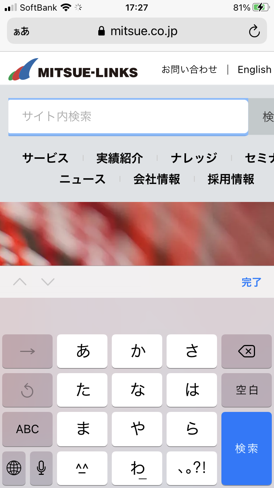
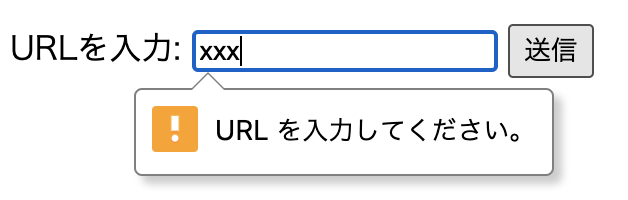
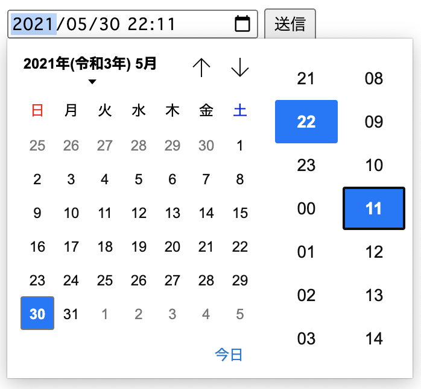
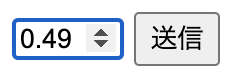
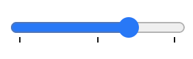
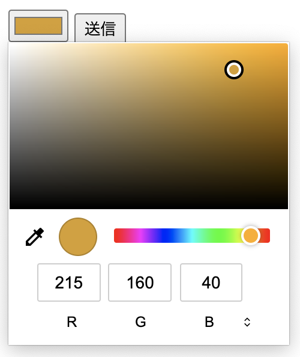

<!-- ch3-9.txt (4ページ、3000～4600字想定) -->
# フォーム

HTMLには「フォーム」を表示する機能があり、利用者はフォームにデータを入力し、それをウェブサーバーに情報を送信することができます。この節では、フォームとそれを構成する入力欄に関連する要素について説明します。


## フォーム概説

Webコンテンツの中には、利用者による入力を受け付けるものがあります。以下は、本書で何度か紹介しているHTML文法チェッカー "Nu Html Checker" の画面です。


ここでは、利用者がチェック対象のURLを入力することができます。また、オプションとして何を表示するのか、チェックボックスで選択することができます。チェック方法を選択することもできます。こうして、一通りの入力と選択を終えた後、"check"ボタンを押すと文法チェックが行われます。

このように、テキストを入力したり、選択肢を選んだりしてから送信ボタンを押す、という一連の操作を提供するもの全体を「フォーム」(form)と呼びます。「入力フォーム」と呼ばれることもあります。

フォームの中には、テキスト入力欄やラジオボタンといったさまざまな部品が置かれます。利用者はこれらを操作することで、フォームに対して値を指定したり、入力を行ったりします。このような、利用者が値を入力・設定するための部品を「フォームコントロール」(form control) と呼びます。

ほとんどのフォームでは、利用者が設定・入力した値は、最終的にサーバーに向けて「送信」(submit)されます。この送信を行うボタンを「送信ボタン」(submit button)と呼びます。多くのフォームでは、利用者が送信ボタンを押すまで情報がサーバーに送信されることはありません。送信ボタンを押す前であれば、利用者は自由に入力内容を修正することができます。

HTMLには、フォームやフォームコントロール表現する要素が多数用意されており、これらを利用することで、基本的なフォームを表現することができます。

## `form`要素

`form`要素は、フォーム全体を表します。以下は簡単な検索フォームの例です。

```html
<form method="get" action="/search.cgi">
  <input type="text" name="k">
</form>
```

`method`属性でフォーム送信時の送信方法を指定します。`method`属性は列挙属性で、`get`、`post`、`dialog`のいずれかを指定します。

`get`は、入力内容がHTTP GETメソッドで送信されることを示します[^1]。この場合、まずフォームに入力された値を"application/x-www-form-urlencoded"のアルゴリズム[^2]でシリアライズし、それを`action`で指定されたURLの後ろにクエリ文字列として付加して、その結果のURLにアクセスします。先の例では、`/search.cgi?k={ユーザーが入力した単語をURLエンコードして&で連結したもの}` のようなURLにアクセスすることになります。

`post`では、入力内容がHTTP POSTメソッドで送信されます。この場合、入力された値はPOSTリクエストのリクエストボディに含まれます。リクエストボディの形式については、後述の`enctype`属性の項を参照してください。

`dialog`では、入力内容をサーバーに対して送信しません。これは`dialog`要素と組み合わせて使用し、フォームを送信するとダイアログが閉じられると同時に、入力された内容を`dialog`要素の`returnValue`プロパティから読み取れるようになります。以下は、ダイアログを閉じた際に押されたボタンを表示する例です。

```html
<dialog id="dialog1">
  <form method="dialog">
    <p>OKですか?</p>
    <button type="submit" value="OK">OK</button>
    <button type="submit" value="Cancel">Cancel</button>
  </form>
</dialog>
<script>
  const d = document.getElementById('dialog1');
  d.showModal();
  d.onclose = () => {alert (d.returnValue)};
</script>
```

`method`属性を省略した際の初期値は`get`です。フォームの入力内容をサーバーに送信する必要がない場合に`method`属性を省略しても、暗黙的に`method="get"`が補われ、GETによるフォーム送信が行われる状態になります。スクリプトでフォームの送信を明示的に抑制しないと、フォーム送信が行われることになるので注意してください。

`action`属性で、フォーム送信時の送信先となるURLを指定します。`action`属性を指定していない場合は、フォームが置いてあるページ自身が送信先となります。`action`属性に空の値を指定する (`action=""`) ことはできず、文法エラーとなりますが、この場合もエラー処理の結果としてフォームが置いてあるページ自身が送信先となります。
<!--
4.10.21.3 Form submission algorithm
>If action is the empty string, let action be the URL of the form document.
-->

[^1]: RFC 7231 4.3.1で定義されています。 <https://tools.ietf.org/html/rfc7231#section-4.3.1>
[^2]: "application/x-www-form-urlencoded" の仕様はURL Standardで定義されています。 <https://url.spec.whatwg.org/#urlencoded-serializing>

`enctype`属性を指定すると、`method="post"`でフォーム送信した際のリクエストボディの形式を指定できます。`enctype`属性は列挙型属性で、以下のいずれかを指定します。省略時の初期値は"application/x-www-form-urlencoded"です。

- "application/x-www-form-urlencoded"
- "multipart/form-data"
- "text/plain"

"application/x-www-form-urlencoded"は、フォーム入力値をURLエンコードした形式で、`method="get"`の際にクエリ文字列として付加されるものと同様の処理です。たとえば以下のような形式になります。

```text
name1=value1&name2=value2
```

フォーム送信では一般的にこの形式が利用されます。

"multipart/form-data"は、入力項目それぞれをバウンダリ(区切り文字)で区切った形式で、RFC7578[^3]で定義されています。たとえば以下のような形式になります。

```text
------WebKitFormBoundarygOTbtF2D0Y0ZT1Ak
Content-Disposition: form-data; name="name1"

value1
------WebKitFormBoundarygOTbtF2D0Y0ZT1Ak
Content-Disposition: form-data; name="name2"

value2
------WebKitFormBoundarygOTbtF2D0Y0ZT1Ak--
```

この形式は、主にフォームからファイルを送信する際に利用します。

"text/plain"は、単純に`名前=値`のペアを改行(CR+LF)で区切った形式です。例えば以下のようになります。

```text
name1=value1
name2=value2
```

簡素で人間には読みやすい形式ですが、現在ではほとんど使われていません。

[^3] RFC7538 <https://datatracker.ietf.org/doc/html/rfc7578>

<!-- 互換性メモ -->
HTML4では、`accept-charset`属性でフォーム送信時の文字符号化方式の候補を指定することができました。この属性は現在のHTMLにも存在しますが、現在のHTML仕様では"UTF-8"以外は指定できません。属性を省略しても"UTF-8"を指定したことになるため、現在ではこの属性を利用する意義はありません。
<!-- /互換性メモ -->

<!-- 内容モデル -->
`form`要素の内容モデルは"Flow"です。フォームコントロール以外にも、見出し、説明文、表など、さまざまな要素を入れることができます。ただし、子孫要素に`form`を入れ子にすることはできませんので注意してください。フォーム内に複数のボタンがあり、ボタンによってフォームの送信先を変えたいような場合、`form`を入れ子にするのではなく、ボタンに`formaction`属性を指定することで実現します。
<!-- /内容モデル -->

<!-- a11y note -->
`form`要素のデフォルトのARIAロールは、フォームにアクセシブルな名前がつけられていれば"form"となります。そうでなければ、デフォルトのロールはありません。`form`要素が検索フォームである場合は、`role="search"`を指定して"search"ロールを与えると、検索フォームであることが利用者に伝わりやすくなります。

"form"ロールや"search"ロールがランドマークロールであることに注意してください。多くのスクリーンリーダーには前後のランドマークに飛んだり、ランドマーク領域全体を読み飛ばしたりする機能を持ちますが、ランドマークが増えすぎると混乱を招く可能性もあります。ほとんどのスクリーンリーダーは、ランドマークでないフォームに飛ぶ機能も持っています。あまり重要でないフォームであれば、無理にrole="form"を与える必要はないでしょう。
<!-- /a11y note -->

## `label`要素

`label`要素は、ユーザーインターフェイスのキャプションを表す要素で、フォームコントロールにラベルをつけることができます。この要素を利用することで、ラベルのテキストを単に視覚的に表示するだけでなく、プログラム的にもフォームコントロールに関連付けることができます。

これにより、ほとんどのブラウザーでは、ラベルをクリックした際に対応するフォームコントロールにフォーカスが当たります。また、対応するフォームコントロールにフォーカスが当たった際に、スクリーンリーダーが明示的にラベルを読み上げ、どのようなデータを入力すれば良いのか理解しやすくなります。

この要素でラベルをつけることのできる要素を「ラベル付け可能要素」(labelable element)と呼びます。具体的には、以下の要素がラベルづけ可能要素となります。

- `button`要素
- `input`要素 (ただし、`type="hidden"`のものを除く)
- `meter`要素
- `output`要素
- `progress`要素
- `select`要素
- `textarea`要素

このほか、カスタムエレメントで`form-associated`が`true`に設定されているものはラベル付け可能要素となります。

`label`要素とラベル付け可能要素を結びつける方法は2種類あります。方法のひとつは、ラベル付け可能要素を`label`要素の子孫要素とする方法です。

```html
<label>クエリー: <input name="q" type="text"></label>
```

もうひとつの方法は、`for`と`id`属性を用いてラベル付けする方法です。

```html
<label for="q">Query: </label><input name="q" id="q" type="text">
```

こちらの方法では、`label`要素がどこにあっても関連づけができるため、配置の自由度が増します。ただし、フォームコントロールの側に`id`属性が必要になることに注意してください。`id`属性はページ内で一意でなければならないため、システムでフォームコントロールを増減できるようなケースでは扱いが面倒な場合があります。

また、冗長になりますが、ふたつの方法を同時に使って以下のようにすることも可能です。

```html
<label for="q">クエリー: <input name="q" id="q" type="text"></label>
```

ただしこの場合、両方が同じ要素を指すようにしなければなりません。以下は正しくない例です。

```html
<!-- 文法エラーとなる例 -->
<label for="text2">Query: <input id="text1"></label>
<input id="text2">
```

これはエラーになりますが、エラー処理の結果として`for`属性による指定の方が優先され、"text1"はラベルを持たない状態になります。`for`による指定と子孫要素による指定を混在させると混乱が起こりやすいため、どちらかに統一するとよいでしょう。

ひとつの`label`要素を複数のラベル付け可能要素に関連づけることはできません。`label`要素の子孫にラベル付け可能要素が複数出現した場合はエラーとなり、エラー処理の結果として、最初に出現したラベル付け可能要素だけに結び付けられます。

逆に、ひとつのラベル付け可能要素に複数の`label`要素を関連づけることは可能です。以下は文法的に正しい例です。

```html
<label>ラベル1<input id="text1"></label>
<label for="text1">ラベル2</label>
<label for="text1">ラベル3</label>
```

この場合、"text1"に対してラベル1、ラベル2、ラベル3の全てが結びつけられます。

<!-- 以下は余談、コラムや注釈扱い可能 -->
なお、`for`というキーワードは多くのプログラミング言語で予約語になっているため、スクリプトから`for`属性にアクセスする場合は`htmlFor`というキーワードで参照できるようになっています。
<!-- ここまで余談 -->

<!-- 内容モデル -->
`label`要素の内容モデルは"Phrasing"です。ただし、`label`要素を子孫に含むことはできません。また、この`label`要素によってラベル付された以外のラベルづけ可能要素を子孫に含むこともできません。

内容モデルが"Flow"ではないことに注意してください。`label`要素に見出しや段落などを入れることはできません。
<!-- /内容モデル -->

<!-- a11y note -->
`label`要素にデフォルトのARIAロールはありません。

`label`要素をラベル付け可能要素に結びつけると、ラベル付可能要素のラベルとして扱われます。スクリーンリーダーでフォームを操作する際、ラベルが適切に設定されていないと入力欄が何であるのかわからないことがあるため、必ず適切なラベルを設定しましょう。ラベルをクリックすることで対応するフォームコントロールにフォーカスを移せるため、器用なマウス操作が難しい利用者にも役立ちます。
<!-- /a11y note -->

## `input`要素

`input`要素は、データを入力や編集をするフォームコントロールを表します。`input`要素の動作は、`type`属性の値に応じて大きく異なります。以下で個別の値について見ていきます。`type`属性を省略した場合や、ブラウザーにとって未知の値であった場合のデフォルトは`text`になります。

### `type=text`と`type=search`

どちらも、1行のプレーンテキスト編集コントロールを表します。

```html
<label>検索キーワード: <input name="q" type="search"></label>
```

これは1行の入力欄であり、改行を入力することはできません。`value`属性で初期値を指定できますが、`value`属性の値に改行が含まれている場合はエラーとなり、結果として改行文字は取り除かれます。

`type=text`と`type=search`の大きな違いは、検索に適したインターフェイスを提供するかどうかです。`type=search`を解釈するブラウザーは、入力ボックスの端に×印のアイコンを表示し、入力欄をクリアする機能を提供することがあります。また、ソフトウェアキーボード上の入力完了ボタンのラベルが「検索」に変化することもあります。



### `type=tel`

`type=tel`は、電話番号の入力や編集をするコントロールを表します。改行が入力できない点も含め、標準の`type=text`の入力欄とほとんど同じですが、電話番号の入力に適した機能を提供します。スマートフォンに搭載されるモバイルブラウザーでは、電話番号の入力に最適化された専用のキーパッドを表示することがあります。

`type=tel`の入力欄では、フォーム送信時に入力値の検証が行われません。電話番号には様々なパターンがあり、`-`、`*`、`#`が入力できるのはもちろん、国番号（日本の場合+81）を入力するための `+`も入力可能ですし、海外では電話番号にアルファベット等を含むこともあります。こういった事情から、この入力欄は、改行以外のあらゆる文字列パターンを受け入れます。入力されたものが電話番号として適切な形式になっている保証はありませんので、多くの場合、値の検証を別途行う必要があるでしょう。後述の`pattern`属性を使って、入力値の検証を行うこともできます。

### `type=url`

`type=url`は、絶対URLの入力や編集をするコントロールを表します。ブラウザーはURLを入力しやすいように補完候補を出したり、URLの入力に最適化された専用のキーパッドを表示するかもしれません。

`type=url`の入力欄では、フォーム送信時に入力値の検証が行われます。空でない値が入力されている場合には、適切な絶対URLの形式になっている必要があります。そうでない場合、フォーム送信を行おうとするとエラーメッセージが表示され、送信できません。ただし、値の前後には空白が許されており、空白が入っていた場合は自動的に取り除かれます。



`value`属性で初期値を指定できますが、この場合も適切な絶対URLの形式になっている必要があります。

URLのスキームがHTTPやHTTPSに限られないことに注意してください。スキームが適切であるかどうかも問わないため、未知のスキームのURLも受け付けてしまいます。たとえば、`a:`という値は適切な絶対URLとみなされます。`:`を含む文字列はなんでも許してしまうと考えたほうがよいでしょう。

もう少し実用的な検証を行いたい場合は、後述の`pattern`属性を使って、より詳細な入力値の検証を行うことができます。詳細については、`pattern`属性の節を参照してください。

### `type=email`

`type=email`は、電子メールアドレスの入力や編集をするコントロールを表します。

`type=email`の入力欄では、フォーム送信時に入力値の検証が行われます。空でない値が入力されている場合には、適切な電子メールアドレスの形式になっている必要があります。そうでない場合、フォーム送信を行おうとするとエラーメッセージが表示され、送信できません。ただし、値の前後には空白が許されており、空白が入っていた場合は自動的に取り除かれます。

なお、この検証で許される電子メールアドレスの形式は、RFC5322の仕様とは異なります。これは「意図的な逸脱」(willful violation)です。たとえば、RFC5322では電子メールアドレスにコメントを含めることが許されていますが、`type=email`の検証ではコメントを含むメールアドレスはエラーとなります。検証ルールの詳細は、仕様の "valid email address" の定義[^4]を参照してください。

[^4]: <https://html.spec.whatwg.org/multipage/input.html#valid-e-mail-address>

後述の`pattern`属性を使って、より詳細な入力値の検証を行うこともできます。

`type=email`の入力欄には、`multiple`属性を指定することができます。`multiple`属性は真偽値属性です。`multiple`属性が指定されていると、複数のメールアドレスをカンマ区切りで列挙して入力できるようになります。

### `type=password`

`type=password`は、パスワードのようなセンシティブな値を入力するコントロールを表します。`type=text`と異なるのは、入力した値が伏せられ、利用者から直接見えなくなることが期待されるという点です。これは、パスワードなどが盗み見される、いわゆる「ショルダーハック」を防ぐためとされています。

ただし、モバイルデバイスなどでは、入力中の1文字が見るようになっていることがあります。また、ブラウザーによっては、利用者の操作で値を表示できる機能を持つ場合もあります。

`type=password`の入力欄では、`autocomplete`属性の挙動が他の入力欄と異なる場合があります。詳しくは`autocomplete`属性の項を参照してください。

### 日付および時刻のコントロール

`type`属性に以下の値を指定することで、日付や時刻を入力するさまざまなコントロールを表現できます。

- `type=month` 年と月
- `type=week` 年と週番号
- `type=date` 年月日
- `type=time` 時刻
- `type=datetime-local` 日付と時刻

これらの値を入力するインターフェースは、ブラウザーによってさまざまです。多くのブラウザーでは、日付を入力する際にカレンダーが表示され、日付を選択するだけで入力できます。



多くのブラウザーでは、カレンダーが表示される際、現在の日付が選択された状態となります。生年月日を入力させる際に`type=date`コントロールを使用すると、過去まで遡るのに大変な労力がかかる場合があります (実はほとんどの場合、カレンダーの年を選択する機能があるのですが、残念ながらその機能はわかりやすいとは言えません)。そのような場合、後述する`min`属性と`max`属性を使って日付や時刻の範囲を指定すると使いやすくなる場合があります。

また、`step`属性で値の間隔を指定することもできます。たとえば、10時から20時までで、15分刻みのフォームにするには、次のようになります。

```html
<input type="time" min="10:00" max="20:00" step="900">
```

時刻の場合、`step`属性の値は秒単位で指定します。デフォルトの間隔は60秒 (1分) です。例では値を900とすることで、900秒=15分を指定しています。

フォーム送信時には、HTML5の日付および時刻形式に従った値を返します。すなわち、日付を持つコントロールの場合、年月日はそれぞれハイフン（`-`）で区切られます。時刻を持つコントロールの場合、時と分はコロン（`:`）で区切られ、タイムゾーン情報は持ちません。日付と時間の両方を持つ場合は`T`で区切られます。たとえば、2021年5月27日12時35分は以下のようになります。

```text
2021-05-27T12:35
```

### `type=number`

`type=number`は、ユーザーに数値を入力させるコントロールを表します。ブラウザーは、数値を入力するのに適した機能を提供することがあります。たとえば、数字のみを入力できるキーパッドを表示したり、数値を増減させるためのスピンボタンを表示する場合があります。



ここで言う数値は、HTML仕様で定義される妥当な浮動小数点数（valid floating-point number）です。数字以外の文字も入力できることに注意してください。小数を表す`.`や、符号を表す`+`と`-`も入力可能です。また、`3.14e+20`のような指数表記も可能であり、`e`と`E`が入力可能です。

デフォルトではあらゆる数値を入力できますが、`min`属性、`max`属性、`step`属性を利用すると、値の範囲を指定できます。たとえば、1以上100以下の整数を入力させたい場合は、次のようにします。

```html
<input type="number" min="1" max="100" step="1" value="1">
```

`min`属性や`max`属性に負の数を指定したり、`step`属性に小数を指定することも可能です。-1以上1以下の数値を0.01刻みで入力させたい場合は、次のようになります。

```html
<input type="number" min="-1" max="1" step="0.01" value="0">
```

数字で表現されていても、数値とは言えないものがあることに注意してください。たとえば、ID番号、郵便番号、クレジットカード番号のようなものは、数字で表現されてはいますが、数値を増減させるような操作にはなじみません。そのようなものを入力させる場合は、`type=text`や`select`要素などを使う方が良いでしょう。

`type=number`の入力欄では、フォーム送信時に入力値の検証が行われます。空でない値が入力されている場合には、適切な浮動小数点数の形式になっている必要があります。そうでない場合、フォーム送信を行おうとするとエラーメッセージが表示され、送信できません。

値の先頭に符号をつけていたり、指数形式で入力していた場合でも、値の変換などは行われませんので注意してください。たとえば、"+1e-3"と入力されていた場合、これは"0.001"と同値ですが、変換などはされずに"+1e-3"という文字列がそのまま送られてきます。数字だけで構成された値だけを選択させたいような場合は、`select`要素を使うことを検討したほうがよいでしょう。

### `type=range`

`type=range`は、範囲内の数値を指定するコントロールを表します。多くの場合、スライダーコントロールとしてレンダリングされます。スライダーでつまみを動かすインターフェイスであるため、大まかな値を感覚的に指定しやすい反面、正確な値を細かく指定するのことには向いていません。



`type=number`と同様、`min`属性、`max`属性、`step`属性で値の範囲を指定できます。これらの指定がない場合は、`min=0`、`max=100`、`step=1`が初期値となります。

`datalist`要素と組み合わせると、スライダーに目盛りをつけることができます。目盛りがある場合、ブラウザーは目盛りに近い値を目盛りの値に合わせてくれる (目盛りにスナップさせる) ことがあります。以下は、範囲が0～100、ステップが0.2のスライダーに、50ごとに目盛りをつける例です。

```html
<input id="range01" type="range" min="0" max="100" step="0.2" value="0" list="scale" />
<datalist id="scale">
<option>0</option>
<option>50</option>
<option>100</option>
</datalist>
```

### `type=color`

`type=color`は、色を選択するコントロールを表します。ブラウザーはカラーピッカーを表示することがあります。



フォーム送信時には、`#`で始まる6桁の16進記法のRGB値が送られます（sRGB）。たとえば、"#ff00a1"のような値が送信されます。

ブラウザーによっては、RGBではなくHSLなどの色指定方法のインターフェイスを採用することがあるかもしれませんが、その場合でも結果の値は常にRGBで送信されます。また、アルファチャンネル値 (透明度) を指定することもできません。

### `type=checkbox`

`type=checkbox`は、チェックボックスを表します。チェックボックスは、チェックされている状態と、チェックされていない状態を持ちます[^6]。

典型的には、YES/NO、ON/OFFの二択で選ぶ項目に使うことができます。次の例は、「利用規約に同意する」というラベルを伴うチェックボックスの例です。

```html
<label><input type="checkbox" name="agree">利用規約に同意する</label>
```

また、複数選択が可能な選択肢を提示する場合に使うこともできます。

```html
<fieldset>
<legend>所有している機器 (複数選択可能)：</legend>
<label><input type="checkbox" name="gadget" value="desktop">デスクトップパソコン</label>
<label><input type="checkbox" name="gadget" value="laptop">ノートパソコン</label>
<label><input type="checkbox" name="gadget" value="smartphone">スマートフォン</label>
<label><input type="checkbox" name="gadget" value="tablet">タブレット</label>
</fieldset>
```

フォーム送信した際、チェックボックスがチェックされていれば、`value`属性で指定した値が送られます。`value`属性が存在しない場合は、"on"という値が送られます。チェックボックスがチェックされていない場合、フォーム送信してもその値は送られません。

`checked`属性を指定すると、初期状態がチェックされている状態になります。`checked`属性は真偽値属性です。

[^6]: スクリプトから`HTMLInputElement`インターフェイスの`indeterminate`プロパティを`true`にすると、未確定（indeterminate）という状態にすることができます。こうすると、チェックボックスの現在の状態が表示されなくなります (オンともオフとも異なる見た目になります)。しかし、これが影響するのは見た目だけで、チェック状態や送信される値には影響しません。チェックボックスがチェックされた後で`indeterminate`プロパティを`true`に設定しても、チェックが解除されるわけではなく、値がそのまま送信されます。 <!-- Chromeで動作確認しましたがこういう挙動でした。 -->

### `type=radio`

`type=radio`は、ラジオボタンを表します。チェックボックスと同様に、チェックされている状態とチェックされていない状態を持ちますが、選択肢の中から1つのみを選択できるという点が異なります。

同一のフォーム内に、同一の`name`属性の値を持つラジオボタンが複数ある場合、それらは「ラジオボタングループ」(radio button group)を構成します。同一のラジオボタングループに属するラジオボタンのうち、チェック状態にできるのは1つだけです。チェックされていないラジオボタンをチェックすると、既にチェックされていたラジオボタンからはチェックが外れます。これは利用者の操作に限らず、DOM操作等でチェック状態にした場合も同様です。

以下は性別を選択するラジオボタンの例です。

```html
性別：
<label><input type="radio" name="sex" value="1">男性</label>
<label><input type="radio" name="sex" value="2">女性</label>
<label><input type="radio" name="sex" value="9">その他</label>
<label><input type="radio" name="sex" value="0" checked>回答しない</label>
```

`checked`属性を指定すると、チェックされている状態が初期状態になります。`checked`属性は真偽値属性です。上記の例では、「回答しない」が選択された状態で表示されます。

同一ラジオボタングループ内の複数のラジオボタンに`checked`属性を指定した場合は、後からチェックされた項目 (ソースコード内で後に現れた項目) だけがチェック状態となり、他の項目からはチェックが外れた状態になります。

<!-- 互換性メモ -->
古いHTML仕様では、ラジオボタングループの中でいずれか1つのラジオボタンを必ずチェック状態にしておく必要がありました。しかし、現在のHTML仕様にはそのような制限はなく、何も選択されていない状態を許しています。

ただし、一度でもラジオボタンが選択されると、未選択状態に戻す手段がなくなるので注意が必要です。未選択に戻すことが必要な場合は、リセットボタンを用意するか (この場合は他の項目も全てリセットされます)、未選択に戻す機能をスクリプト等で実装しなければなりません。
<!-- /互換性メモ -->

フォーム送信した際は、チェックされている項目の`value`属性の値が送られます。`value`属性が指定されていない場合は、"on"という値が送られます。

### `type=file`

`type=file`は、ファイルアップロードコントロールを表します。利用者は、このコントロールを操作してローカルのファイルを指定することができます。指定されたファイルは、フォーム送信でサーバーにアップロードされたり、File APIを通じてスクリプトから読み取られたりします。


ファイルアップロードを行うフォームでは、`form`要素の`enctype`属性を`multipart/form-data`とします。`enctype`属性の詳細は`form`要素の項を参照してください。最低限のファイルの送信フォームは次のようになります。

```html
<form enctype="multipart/form-data" method="post" action="/upload.php">
<label>アップロードするファイルを選択してください：
<input type="file" name="file">
</label>
<button>送信</button>
</form>　
```

`multiple`属性を設定すると、複数のファイルを指定できるようになります。ブラウザーは、複数ファイルを選択可能なインターフェイスを表示します。多くの場合、ファイル選択インターフェイスの見た目に大きな変化はありませんが、`ctrl`キーを押しながら選択したり、ドラッグで範囲指定することで、複数のファイルを選択できるようになります。

`accept`属性を指定すると、指定できるファイルの種類をある程度絞ることができます。以下の5種類の指定が可能です。

- "audio/*" という文字列を指定した場合: 音声ファイルを指定できます。
- "video/*" という文字列を指定した場合: 映像ファイルを指定できます。
- "image/*" という文字列を指定した場合: 画像ファイルを指定できます。
- 適切なMIMEタイプ文字列を指定した場合: そのMIMEタイプのファイルを指定できます。なお、パラメータを含むことはできません (`;`を含めることができません)。たとえば、`text/html`という指定はできますが、`text/html;charset=utf-8`という指定はできません。 
- `.` で始まる文字列を指定した場合: 指定された拡張子のファイルを指定できます。

複数を組み合わせることも可能で、その場合はカンマで区切って列挙します。この場合、指定されたもの全てが受け入れ可能になります。たとえば、Word文書をアップロードさせたい場合、以下のように指定することができます。

<!-- 仕様の4.10.5.1.17 File Upload stateに掲載されているサンプルの引用-->
```html
<input type="file" accept=".doc,.docx,.xml,application/msword,application/vnd.openxmlformats-officedocument.wordprocessingml.document">
```

ただし、この指定は厳密なものではありません。拡張子やMIMEタイプとファイル内容は正しくマッピングされていないかもしれません。`accept`属性を指定しても、意図しない内容のファイルがアップロードされてくる可能性はありますので、この点は注意が必要です。

このコントロールにセキュリティ上の制約があることにも注意してください。このコントロールの`value`属性の値はファイル名となりますが、HTMLで`value`属性を指定したり、スクリプトから`value`属性に値を指定しようとしても、意図したとおりには動作しません。スクリプトからアップロードファイルを設定する場合は、`files`プロパティにファイルの内容を直接設定する必要があります。これは、利用者の操作を介さずに任意のローカルファイルを読み取ることができないようにするための制約です。

### `type=submit`、`type=reset`、`type=button`

`type=submit`、`type=reset`、`type=button`をもつ`input`要素は、`button`要素でもマークアップすることができます。レガシーな環境のために、これらの`type`属性値をもつ`input`要素を使用しなければならない場合を除いて、`button`要素を選択した方がよいでしょう。機能については、`button`要素を参照してください。

### `type=image`

`type=image`をもつ`input`要素は、画像による送信ボタンを表します。この目的では、代わりに`button`要素を使用できます。

また、クリックした画像の座標を送信できます。サーバーサイドイメージマップと似た動作を実現することができますが、アクセシビリティ上の問題があります。この目的では、代わりにクライアントサイドイメージマップ（`area`要素）を使うのが望ましいです。

## 共通`input`要素属性

特定の`type`属性に対して、組み合わせて使用できる共通の属性について説明します。どの`type`に対して使用できるの正確な情報については、仕様を参照してください。

### `maxlength`および`minlength`属性

許容する長さを指定します。`maxlingth`属性は最大の長さを、`minlength`属性は最小の長さをそれぞれ指定します。

```html
<label>パスワード<input type=password minlength=8></label>
```

この例では、8文字以上のパスワードを受け付けるようになります。

### `size`属性

`size`属性は、`input`要素の文字数による幅を指定します。初期値は20です。ユーザーエージェントによって解釈が異なることが知られていますので、正確な大きさを指定するにはスタイルシートで指定した方がよいでしょう。

### `readonly`属性

`readonly`属性は、コントロールが編集可能かどうかを表す真偽属性です。指定される場合、読み取り専用コントロールとなります。

`disabled`と`readonly`との違いは、`readonly`はコントロールが機能するのに対し、`disabled`はコントロールが有効化されるまで機能しないという点にあります。

### `required`属性

`required`属性は、必須かどうかを表す真偽属性です。指定される場合、ユーザーはそのコントロールを必ず入力しなければなりません。

```html
<label>ユーザー名: <input name="username" required></label> 必須
```

このようにマークアップすれば、ユーザー名は必須項目になります。


### `multiple`属性

`multiple`属性は、ユーザーに複数の値を指定することを許可するかどうかを表す真偽属性です。

### `pattern`属性

`pattern`属性は、コントロールの値を検査する正規表現です。正規表現の文法は、JavaScript の正規表現アルゴリズムと同一です。この属性を指定する場合、`title`属性で、どのようなパターンなのかを説明すべきです。

例えば、`https://`で始まるURLのみをフォームで受け付けたい場合は、次のように書くことができるでしょう。

```html
<input type="url" pattern="^https://.+" title="httpsで始まるURLを入力してください。">
```

この例のように`title`属性も持たせることで、`pattern`にマッチしない値が入力されたときに、どのようなパターンを入力する必要があるのかのヒントを与えることができます。

### `min`および`max`属性

`min`および`max`属性はそれぞれ、最小と最大の値（数値または日時）を示します。

例えば日付コントロールで2019年1月3日から2019年5月3日までの範囲を指定する場合、次のようになります。

```html
<input type="date" min="2019-01-03" max="2019-05-03">
```

### `step`属性

`step`属性は、値の刻み幅を制御します。文字列`any`または正の浮動小数点数を指定できます。属性値に数値を指定した場合、コントロールはstep値の倍数のみを受け入れます。例については、日付および時刻のコントロールも参照ください。


### `list`属性

`list`属性は、ユーザーに提案する定義済み候補のリストを示します。値は、同一文書内の `datalist`要素のIDでなければなりません。詳細については、`datalist`要素を参照ください。


## `button`要素

`button`要素は、ボタンを表します。

`type`属性は、アクティブ時のボタンの振る舞いを制御します。この属性は列挙属性であり、次の表の値を取ります。

|`type`属性値  |機能の概要 |
|---|---|
|`submit`  |フォームを送信します。  |
|`reset` |フォームをリセットします。  |
|`button`| 何もしません。 |

`type`属性を省略した場合、`submit`が指定されたのと同じになります。

`input`要素でも`button`要素の機能を実現できますが、`input`要素は`value`属性に文字列しか設定できないのに対し、`button`要素はコンテンツとして表すことができます。言い換えると、`button`要素の内側で要素（フレージングコンテンツ）を置くこともできることになります。

```html
<!-- inputとbutton要素の比較 -->
<input type="submit" value="送信">
<button type="submit">送信</button>
```

## `select`要素

`select`要素は、オプションから選択するためのコントロールを表します。子要素として、`option`要素で選択肢を記述します。

```html MDN(改)
<label>ペットを選びます:
<select>
    <option value="">--ペットの選択肢--</option>
    <option value="dog">いぬ</option>
    <option value="cat">ねこ</option>
    <option value="parakeet">インコ</option>
</select>
</label>
```

`optgroup`要素を使用することで、選択肢をグループ化できます。`label`属性は、オプションのグループの名前です。これは必須の属性です。

```html MDN→上と対応
<select>
  <optgroup label="ほ乳類">
    <option>いぬ</option>
    <option>ねこ</option>
  </optgroup> 
  <optgroup label="鳥類">
    <option>インコ</option>
  </optgroup>
</select>
```

`value`属性はサーバーに送信される値です。この属性を省いた場合、要素の内容が送信されます。


## `datalist`要素

`datalist`要素は、他のコントロール用のオプションを表す`option`要素の集合を表します。

```html MDN
<label for="ice-cream-choice">アイスクリームのフレーバー:</label>
<input list="ice-cream-flavors" id="ice-cream-choice" name="ice-cream-choice">

<datalist id="ice-cream-flavors">
    <option value="Chocolate">
    <option value="Coconut">
    <option value="Mint">
    <option value="Strawberry">
    <option value="Vanilla">
</datalist>
```


## `textarea`要素

`textarea`要素は、複数行のプレーンテキスト編集コントロールを表します。コメント欄やお問い合わせフォームのように、ユーザーが大量の自由記述なテキストを入力できるようにするときに便利です。

```html
<label for="advanced">高度な例:
  <textarea id="advanced" name="advanced"
            rows="3" cols="33" maxlength="200">
rows属性とcols属性でサイズが指定されたtextarea要素。最大文字数は、maxlengthによって200に制限されています。
  </textarea>
</label>
```

`row`属性で行を、`cols`属性で幅を指定することができます。

`maxlength` 属性は、ユーザーが入力可能な文字 (Unicode コードポイント) の最大文字数です。<!--maxlengthについてもっと調べておく-->


## `output`要素

`output`要素は、アプリケーションによって実行された計算の結果やユーザー操作の結果を表します。

次のように、簡単な電卓の出力部分に`output`要素を使用できます。

```html
<form onsubmit="return false" oninput="o.value = a.valueAsNumber + b.valueAsNumber">
 <input id=a type=number step=any> +
 <input id=b type=number step=any> =
 <output id=o for="a b"></output>
</form>
```


## `progress`要素

`progress`要素は、タスクの進捗状況を表します。これは通常、プログレスバーとしてレンダリングされます。

```html
<progress id=p max="100" value="50"><span>50</span>%</progress>
<script>
  var progressBar = document.getElementById('p');
  function updateProgress(newValue) {
    progressBar.value = newValue;
    progressBar.getElementsByTagName('span')[0].textContent = newValue;
  }
 </script>
```

このように`updateProgress()`メソッドを外部から呼び出すことで、`progress`要素の値を更新することができます。


## `meter`要素

`meter`要素は既知の範囲のスカラー量、または小数の値を表します。たとえば、ディスク使用量、投票人口の割合などです。
<!-- std -->

次の例は、すべて3/4で満たされる3つのゲージを示します。

```html
ストレージ容量の使用状況: <meter value=6 max=8>6ブロック使用済み (合計8個中)</meter>
投票率: <meter value=0.75></meter>
チケット販売数: <meter min="0" max="100" value="75"></meter>
```
<!-- https://www.tagindex.com/html5/form/meter.html ここに色の挙動が書かれているのでこれをごにょごにょ  -->


## `fieldset`要素

`fieldset`要素は、関連するコントロールのセットをグループ化するために使用されます。

```html
<fieldset>
 <legend>ディスプレイ表示</legend>
 <p><label><input type=radio name=c value=0 checked>黒地に白字</label>
 <p><label><input type=radio name=c value=1>白地に黒字</label>
 <p><label><input type=checkbox name=g>グレースケールを使用する</label>
 <p><label>コントラストを強調する <input type=range name=e list=contrast min=0 max=100 value=0 step=1></label>
 <datalist id=contrast>
  <option label=Normal value=0>
  <option label=Maximum value=100>
 </datalist>
</fieldset>
```

## `legend`要素

`legend`要素は、`fieldset`要素のキャプションを表します。


## フォームコントロールの共通属性
### 名前フォームコントロール：`name`属性
<!--もうちょっと説明を深化したほうがよさげ-->
フォームコントロールで用いる`name`属性は、フォームコントロールの名前を与えます。`a`要素に付与する`name`属性（`id`属性のように使用されていました）とは役割が異なることに注意してください（これは廃止されました）。

処理系によっては、`name`属性の後に`[]`を付与することによって、配列のようにデータを扱うことができます。

```html
<input type=checkbox name="animal[]" value="cat"> ねこ
<input type=checkbox name="animal[]" value="dog"> いぬ
```

### 入力長さの制限：`maxlength`属性と`minlength`属性

`maxlength`属性は入力できる最大の文字数を、`minlength`属性は入力に必要な最小の文字数をそれぞれ指定します。両方が指定される場合、`minlength`属性の値は`maxlength`属性の値以下でなければなりません。

文字数は、Infra標準で説明される、JavaScript長さで数えられます<!--U+xxxxとかで説明した方がよいのか？-->。`textarea`要素にこれらの属性が指定される場合、改行は、1文字として数えられます。

### フォームコントロールの有効化および無効化：`disabled`属性
<!--もうちょっと説明が必要？-->
`disabled`属性が設定される場合、そのフォームコントロールは無効にされます。無効な要素は、アクティブにできませんし、フォーカスを当てることもできません。

### フォームコントロールを自動フォーカスする：`autofocus`属性

`autofocus`属性は、ページ読み込み時にフォーカスを持つことを指定するものです。1つのフォーム要素に複数設定してはなりません。

自動的にフォーカスを奪うため、利用者の混乱をかえって招く可能性があることに注意すべきでしょう。

### オートフィルフォームコントロール：`autocomplete`属性

`autocomplete`属性は、フォームコントロールがどのような目的で提供されるかを示唆すると同時に、ユーザーエージェントへのヒントの手段に使用できるものです。

例えば、氏名や住所、URLやメールアドレス、性別やクレジットカードの番号などと言った意味をフォームコントロールに付与することができます。完全な属性の値と組み合わせについては、仕様を参照してください。

たとえば、フォームで2つの配送先住所がある場合、次のようにマークアップできます。

<!--何かわかりやすい例を作成 以下はHTMLStdからの複写-->
```html
<fieldset>
 <legend>1つ目のギフトの配送先</legend>
 <p> <label>郵便番号: <input name=bp autocomplete="section-blue shipping postal-code"> </label>
 <p> <label>都道府県: <input name=bc autocomplete="section-blue shipping address-level1"> </label>
 <p> <label>住所:     <textarea name=ba autocomplete="section-blue shipping street-address"></textarea> </label>


</fieldset>
<fieldset>
 <legend>2つ目のギフトの配送先</legend>
 <p> <label>郵便番号: <input name=rp autocomplete="section-red shipping postal-code"> </label>
 <p> <label>都道府県: <input name=rc autocomplete="section-red shipping address-level1"> </label>
 <p> <label>住所:     <textarea name=ra autocomplete="section-red shipping street-address"></textarea> </label>
</fieldset>
```


`type=password`の入力欄では、`autocomplete`属性が特殊な働きをします。

https://developer.mozilla.org/ja/docs/Web/Security/Securing_your_site/Turning_off_form_autocompletion#the_autocomplete_attribute_and_login_fields