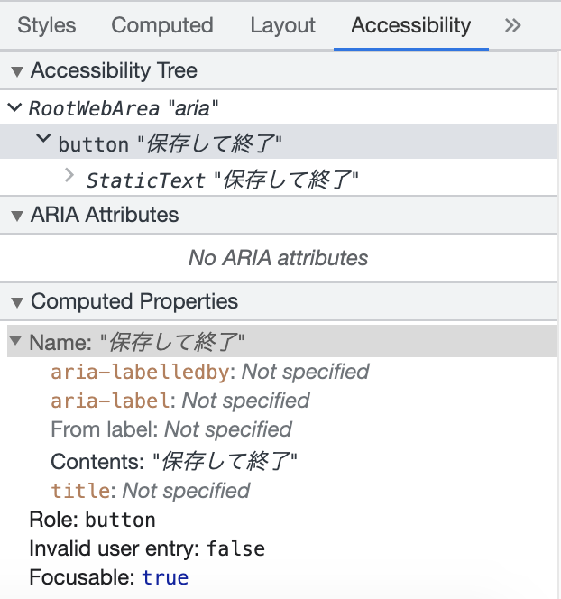

<!-- ch4-2.txt (8ページ、3000～4600字x2想定) -->

# WAI-ARIA

HTMLで利用できる属性の中には、HTML仕様とは別の文書で定義されているものもあります。そのひとつに、近年利用されるようになってきたWAI-ARIAがあります。ここでは、ウェブサイトやウェブアプリケーションのウェブアクセシビリティの向上に寄与するWAI-ARIAという技術と、よく使われるいくつかの属性について説明します。

## WAI-ARIAの概説

WAI-ARIA[^1]とは、W3Cによって発行されている仕様の名称で、単にARIAとも呼ばれます。

[^1]: <https://www.w3.org/TR/wai-aria/>

WAI-ARIAのWAIはWeb Accessibility Initiativeの略称で[^2]、W3C内部に存在するウェブアクセシビリティを推進する組織です[^3]。ARIAとは、Accessible Rich Internet Applicationsの略称です。ここでの"Rich"は、表現が豊かであるという意味ですが、端的にはクライアント側で動的な処理を行うことを指します。

[^2]: WAIの発音は「ワイ」であったり「ウェイ」であったりと、英語圏でも一定ではないようです。

[^3]: <https://www.w3.org/WAI/>

かつてのウェブアプリケーションは、静的HTMLのフォームからデータを送信してサーバー側で処理することが一般的でした。その後、ブラウザーの表現力の向上に伴い、動的に変化するコンテンツや、複雑なユーザーインターフェイスを実現できるようになりました。これらは、従来のものより豊かな表現であるという意味で「リッチアプリケーション」と呼ばれます。

このようなリッチなアプリケーションは、しばしばアクセシビリティ上の問題を抱えることがあります。HTMLが元々用意しているフォームコントロールと異なるリッチなインターフェイスは、スクリーンリーダーなどの支援技術を使っているユーザーに対して十分な情報を提供できない場合があります。これを補うために作られたのがWAI-ARIAです。

WAI-ARIAは単独で使うものではなく、別のマークアップ言語と組み合わせて、それを補助する形で利用します。組み合わせる相手のマークアップ言語のことを「ホスト言語」(host language)と呼びます。HTMLがホスト言語になることがほとんどですが、たとえばSVGがホスト言語になることもあります。

### ARIA属性

WAI-ARIAは、ホスト言語の要素に対して追加で指定できる属性を定義します。WAI-ARIAが定義する属性を「WAI-ARIA属性」(WAI-ARIA attribute)、もしくは単に「ARIA属性」(ARIA attribute)と呼びます。ARIA属性を利用すると、ホスト言語の要素に対して追加の情報を与えることができます。

ARIA属性は、その性質によって「ロール」(role)、「ステート」(state)、「プロパティ」(property)の3種類に分類されます。

#### ロール

ロールとは要素の役割を表すもので、この要素が何であるのか、何をするものかという情報を与えます。要素にロールを付与する場合は、`role`属性を使用します。

たとえば、`div`要素に`role="navigation"`を指定すると、HTMLの`nav`要素と同じようなナビゲーションのセマンティクスを持つことを示せます。ロールの中には、`role="search"`のように、HTMLの要素では表現できないものもあります。

#### ステート

ステートは、要素の現在の状態を表すものです。ステートを定義するARIA属性には、`aria-`で始まる名前がつけられています。ステートと後述のプロパティとの役割はほとんど同じですが、ステートは頻繁に変化することが想定されるものを表します。主にJavaScriptからの操作によって設定や変更され、現時点でのその要素の状態を表します。

たとえば、`aria-disabled="true"`は、指定された要素が現在無効になっていることを伝えますし、`aria-expanded`属性は、指定された要素と関連する要素が開閉どちらの状態になっているのかを伝えます。

#### プロパティ

プロパティは、要素に対し、性質や特性などの情報を表現するものです。要素のプロパティを定義するARIA属性には、ステート同様に`aria-`で始まる名前がつけられています。

たとえば、`aria-required="true"`は、指定されたフォームの要素が必須であることを伝えます（HTMLの`required`属性と同じセマンティクスを持ちます）。`aria-label`属性のように、要素に対して追加の説明を与えるものや、`aria-controls`属性のように、他の要素との関連性を示すものもあります。

なお、ステートとプロパティとの違いはそこまで厳密なものではありません[^4]。プロパティが頻繁に変更されたり、ステートが変更されずに使われることもあります。たとえば、`aria-valuenow`プロパティは範囲を示すコントロールの現在値を示すもので、頻繁に変化する可能性があります。`aria-hidden`ステートは要素を支援技術から隠すものですが、頻繁には変更されないような使われ方が主流です。

[^4]: 実際、WAI-ARIA仕様ではステートとプロパティは一括りのセクションで記述されています。 <https://www.w3.org/TR/wai-aria-1.2/#states_and_properties>

<!--プロパティとステートの中には特定のロールの要素に対してしか指定できないものがある、を書くか?最後まで見てから決める-->

### WAI-ARIAとその周辺仕様

WAI-ARIAには、本体の仕様のほかに複数の関連文書があります。WAI-ARIAを体系立てて理解したい場合や、HTML仕様との対応関係を調べたい場合などは、関連文書を参照する必要があります。

#### WAI-ARIA仕様

WAI-ARIA仕様の本体では、WAI-ARIAそのものの説明と、ロール、プロパティ、ステートの定義を行っています。それぞれの意味や効果、どのロールにどのプロパティやステートが指定可能か、といった情報も含まれています。

JavaScriptからARIA属性にアクセスする場合に利用するIDLインターフェイスについても、WAI-ARIA 1.2以降、この仕様本体で定義されるようになりました。

ロールの情報の中には、"Related Concepts"のように、どのHTML要素に類似する概念かという情報もあります。ただし、これはあくまで参考情報という位置づけです。HTML要素とロールとの対応関係については、後述のARIA in HTMLを参照する必要があります。

<!-- 参考日本語訳紹介する? -->

#### ARIA in HTML

ARIA in HTML[^5]は、HTMLをホスト言語とした場合のARIAの位置付けを規定した文書です。ARIAロールとHTMLの要素との対応関係や、どのHTML要素にどのロールを指定できるかといった情報があります。

[^5]: <https://www.w3.org/TR/html-aria/>

ARIA in HTMLはHTMLとARIAとの組み合わせのルールを規定していますが、具体的な使い方までは説明していません。使い方のガイドとしては、後述のUsing ARIAとWAI-ARIA Authoring Practicesがあります。

#### Using ARIA

Using ARIA[^6]はW3Cのワーキンググループノートで、ARIAの使い方の基本的な方針について書かれています。入門ガイドのような位置付けだと考えるとよいでしょう。ただし、2018年に公開されてから2021年10月現在まで更新されておらず、一部の情報は他のW3C文書と重複して古いものになっていることに注意してください。

[^6]: <https://www.w3.org/TR/using-aria/>

Using ARIAには使用例も出ていますが、コード例はあくまで基本的な説明にとどまったものです。本格的なウィジェットをデザインするには不十分かもしれません。実践的なコード例はまた別の文書にまとめられています。

#### WAI-ARIA Authoring Practices

WAI-ARIA Authoring Practices[^7]はW3Cのワーキンググループノートで、カルーセルやモーダルダイアログといった本格的なウィジェットの実装例が紹介されています。コード例はもちろん、実際に動作を見ることのできるサンプルも用意されており、実際に制作する際の参考になるでしょう。

[^7]: <https://www.w3.org/TR/wai-aria-practices/>

<!-- 参考日本語訳紹介する? -->
<!-- 紹介するなら他の仕様書とまとめて巻末で一挙というイメージですかね…？ -->

#### その他の関連文書

その他、WAI-ARIAの関連文書には以下のようなものがあり、WAI-ARIAスイートとして位置づけられています。

- Core Accessibility API Mappings[^8] : ブラウザーや支援技術の開発者向けの仕様
- HTML Accessibility API Mappings[^9] : プラットフォームAPIとの対応を示した仕様
- Accessible Name and Description Computation[^10]というアクセシブルな名前や説明などの優先順位を決める仕様

[^8]: <https://www.w3.org/TR/core-aam/>

[^9]: <https://www.w3.org/TR/html-aam/>

[^10]: <https://www.w3.org/TR/accname/>

さらに、WAI-ARIA仕様の拡張として、EPUBのためのDPUB-ARIA[^11]、SVGのためのSVG Accessibility API Mappings[^12]といった仕様もあります。<!-- MathML https://w3c.github.io/mathml-aam/ は開発が止まり気味か？ -->

[^11]: Digital Publishing WAI-ARIA Module <https://www.w3.org/TR/dpub-aria/>

[^12]: <https://www.w3.org/TR/svg-aam/>

## `role`属性

`role`属性を使用すると、要素のロールを指定することができます。

属性値として通常は1つのロールの名前を指定しますが、複数のロールをスペースで区切って列挙することもできます。複数を指定した場合、同時に適用されるわけではなく、ブラウザーが解釈でき、かつ、その要素に適用可能なロールのうち、先頭にあるものが適用されます。

以下は複数指定の例です。

```html
<div role="dummyrole blockquote note">
...
</div>
```

この場合、`dummyrole`というロールは現在のARIA仕様に存在しないため、無視されます。`blockquote`ロールはARIA 1.2仕様で定義されたロールで、ARIA 1.2に対応するブラウザーはこれを採用するでしょう。そうでないブラウザーはこれも無視して`note`ロールを採用することになります。

`role`属性を使用する場合は、さまざまな注意点があります。

### 抽象ロールは指定できない

ARIA仕様では、ロールを継承・派生関係で定義しているため、「抽象ロール」(abstract role)が存在します。これはロールの派生関係を表現するために定義されているもので、実際に使うことはできません。逆に、実際に使える具体的なロールは「具象ロール」(concrete role)と呼びます。
<!-- 
concrete roleは以下のURLで言及されている
https://www.w3.org/TR/wai-aria-1.2/img/rdf_model 
-->

`role`属性で抽象ロールを指定してはなりません。抽象ロールを指定していても、ブラウザーはそれを無視します。たとえば、`window`ロールは抽象ロールですので、以下のような指定はできません。

<!-- 意図どおりに動作しない例 -->
```html
<div role="window">
ダイアログのつもり?
</div>
```

`window`ロールの派生ロールである`dialog`は具象ロールですので、問題なく指定可能です。

<!-- 問題ない例 -->
```html
<div role="dialog">
ダイアログのつもり
</div>
```

あるロールが抽象ロールかどうかは、ARIA仕様本体を見ることで確認できます。以下に挙げる12種のロールが抽象ロールとなっています。

<!-- 継承関係を階層で表現してみたが不要かも -->
<!-- スーパークラス/サブクラスとかも説明するなら階層構造でもよいとは思いますが、紙面の都合ですかね -->
- roletype
  - structure
    - range
    - section
      - landmark
    - sectionhead
  - widget
    - command
    - composite
      - select
    - input
  - window

### ロールの上書き

`role`属性はホスト言語にセマンティクスの情報を追加しますが、本書で説明してきたように、HTMLの要素は、もともとセマンティクスを持っています（それがWAI-ARIA仕様で表現できるかは別にして）。たとえば、`h1`要素はランク1の見出しを、`main`要素は主要なコンテンツを表します。`role`で明示的にロールを指定しなくても、その要素が暗黙的にロールを持っていることがあるのです。

このような、ホスト言語がもともと持つロールを「暗黙のネイティブロール」(implicit native role)、もしくは単に「ネイティブロール」(native role)と呼びます。どの要素がどのようなネイティブロールを持つかは、先に紹介したARIA in HTMLで定義されています。

要素がネイティブロールを持つ場合、`role`属性で異なるロールを指定すると、ネイティブロールを上書きします。以下は、`a`要素に`role`属性を指定した例です。

<!-- 適切な例 -->
```html
<a href="/register" role="button">今すぐ登録</a>
```

`a`要素が`href`属性を持つ場合、ネイティブロールとして"link"を持ちますが、`role`属性によって"button"ロールが上書きされています。そのため、支援技術は、この要素をリンクではなくボタンとして認識します。たとえば、スクリーンリーダーは「今すぐ登録 リンク」ではなく「今すぐ登録 ボタン」と読み上げるようになります。<!-- 本当か? 要スクリーンリーダー検証 -->

なお、`role`属性はセマンティクスを上書きするだけで、要素の機能を変更しないことに注意してください。上記の例は単に「ボタン」と読まれるだけで、`button`要素の持つ機能までは得られません。たとえば、スペースキーでボタンを押せるようにはなりません。

#### コラム：ネイティブ、暗黙、ホスト言語

WAI-ARIA仕様では、ネイティブ（native）、暗黙の（implicit）、ホスト言語（host language）といった用語が出てきますが、これらはすべて同じ概念を表しているものです。

つまり、HTMLを考える場合、すべてHTMLデフォルトの（default）と読み替えることができます。本書ではネイティブとして統一して言及します。

なお、ネイティブセマンティクス（native semantics）というような表現がARIA関連仕様で出てきますが、この文脈でのセマンティクスはロール、ステート、プロパティの総称と言うことができます。

<!--
The "default semantics" referred to here are sometimes also called "native", "implicit", or "host language" semantics in ARIA. [ARIA]
https://html.spec.whatwg.org/multipage/dom.html#wai-aria
-->

### 指定できるロールの制限

`role`属性では要素のネイティブロールを上書きできますが、ネイティブロールの機能と矛盾するような指定はできません。以下は適切でない例です。

<!-- 適切でない例 -->
```html
<button role="heading">見出し?</button>
```

<!--
Nu HTML Checkerは以下のようなエラーを出す
>Error: Bad value heading for attribute role on element button.
-->
`button`要素をボタンではなく見出しにしようとしていますが、ボタンと見出しとでは、持つ機能がかけ離れており、互換性がありません。このような無理のあるロール変更はできず、エラーとなります。
<!--
文法エラーになるのだが、現実のブラウザの挙動としては、普通にボタンの機能が残り、かつrole=headingも適用する。押せるのだが支援技術にはボタンではなく見出しと通知される要素が出来上がる。
Chrome/firefoxで確認。
-->
ARIA in HTMLでは、どの要素にどのロールが適用可能かを定義しています。`button`要素に適用可能なロールは以下のとおりです。

>checkbox, link, menuitem, menuitemcheckbox, menuitemradio, option, radio, switch or tab.

`heading`は含まれていないため、`button`要素のロールを`heading`にすることはできません。なお、見出しをボタンとして押せるようにしたい場合には、次のように、見出しの中にボタンを入れる方法があります。

<!-- 望ましい例 -->
```html
<h1><button>見出しボタン</button></h1>
<!-- 見出し要素の内部にボタン要素を設置している -->
```

ARIA in HTMLで許されている組み合わせであっても、不用意なセマンティクスの変更は望ましくありません。以下の例は許されており、エラーにはなりませんが、望ましくない例です。

<!-- 望ましくない例 -->
```html
<div role="tablist">
<h2 role="tab">見出しタブ</h2>
</div>
```

この例では`h2`要素のロールを変更しているため、見出しであることが伝わらなくなります。この場合は以下のようにするとよいでしょう。

<!-- 望ましい例 -->
```html
<div role="tablist">
<div role="tab"><h2>見出しタブ</h2></div>
</div>
```

### 冗長なロール指定

ネイティブロールとまったく同じロールを`role`属性で明示的に指定することも可能ですが、望ましくはありません。

<!-- 望ましくない例 -->
```html
<main role="main">
<h1 role="heading" aria-level="1">メインコンテンツ</h1>
...
</main>
```

これはエラーにはなりませんが、冗長です。かつてのHTML 5.0仕様では、`main`要素に`role="main"`をあわせて指定するようにアドバイスされていましたが、これは要素のネイティブロールを解釈できないレガシーユーザーエージェント向けのもので、モダンブラウザーに対してこのように指定する必要はありません。
<!-- see also https://www.w3.org/TR/2018/SPSD-html5-20180327/grouping-content.html#the-main-element -->

ARIAの機能とまったく同一の機能がネイティブで利用できる場合は、ネイティブの機能だけを使用し、ARIAを使わないようにすることがARIA in HTML仕様で推奨されています。
<!-- https://www.w3.org/TR/html-aria/#rules-wd
It is NOT RECOMMENDED for authors to set the ARIA role and aria-* attributes to values that match the implicit ARIA semantics defined in the table. Doing so is unnecessary and can potentially lead to unintended consequences.
 -->

### 特殊な働きをするロール

基本的に、ロールはユーザーにセマンティクスを伝えるものであり、要素の機能を変更することはありません。ただし、中には特殊な働きをするロールもあります。ここでは、注意が必要なロールをいくつか紹介します。

#### ランドマークロール

ロールの中には「ランドマークロール」と呼ばれるものがあります。これはその名の通り、ナビゲーションのランドマークとして機能するものです。以下の8つがランドマークロールです。

- banner
- complementary
- contentinfo
- form
- main
- navigation
- region
- search

支援技術の多くはランドマークを利用したナビゲーションの機能を持ち、特定のランドマークを連続的に移動することが可能になっています。これをうまく利用すると、`main`ランドマークが登場するまで読み飛ばして本文から読み始める、`search`ランドマークに移動して検索を行う、といったことがスムーズにできるようになります。ユーザーの操作に大きく影響する重要なロールであると言えるでしょう。

ただし、使い過ぎには注意してください。一つのコンテンツ内に必要以上に大量のランドマークが存在すると、目的のランドマークを見つけ出すのに多大な労力がかかるようになってしまいます。

#### ライブリージョンロール

「ライブリージョン」(live region)とは、内容が更新されたときにユーザーに通知される領域です。

支援技術のユーザーが特定の場所を読んでいるとき、他の場所がリアルタイムで更新されても、その更新に気づかないことがあります。更新される領域をライブリージョンとして定義しておくと、更新された場合にユーザーに通知されるため、他の場所を読んでいても更新に気づくことができます。たとえば、株価の表示、ゲームのスコア表示、緊急性の高いエラーメッセージなど、リアルタイムに更新される箇所に使用します。

以下の5つのロールはライブリージョンの機能を持ちます。

- alert
- log
- marquee
- status
- timer

逆に言うと、これらのロールを使用すると、更新がユーザーに通知されることになります。通知の必要がない箇所でこれらのロールを使用しないように注意してください。場合によってはスクリーンリーダーのユーザーが通知を受け続けて操作不能となることがあります。

なお、後述の`aria-live`属性を使用すると、他のロールの要素をライブリージョンとしたり、これらのロールの挙動を変更したりすることもできます。

### ロールの削除: `presentation`と`none`ロール

ときには、ホスト言語のネイティブロールを変更するのではなく、削除したい場合もあります。その場合に使用するのが`presentation`ロールや`none`ロールです。これらはセマンティクスを持たないことを意味するロールであり、ネイティブロールを打ち消し働きをします。

`presentation`と`none`は同義のロールです。同義のロールが存在するに至った経緯については「コラム: `presentation`ロールの誤解と`none`ロール」を参照ください。

ネイティブロールを打ち消したいケースには、たとえば以下のようなものがあります。

<!--
- `img`要素を純粋にレイアウト調整に用いている場合（いわゆるスペーサー画像） // `alt=""`があれば既に打ち消されているのでは 
- CSSの表示のフックのためだけに要素を用いている場合 // div、spanを通常使うはずなので現実味に欠ける
-->

- `table`要素を純粋にレイアウト調整のためだけに用いている場合（いわゆるテーブルレイアウト、CSSのブラウザーサポートが貧弱だった時代に、`table`要素を用いてページレイアウトを実現する手法）
- 親子のロール関係を修復したい場合

ここでいう親子のロール関係の修復というのは、たとえば`ul`/`li`を用いてタブコンポーネントを作成するような場合です。具体例を示します。

<!--axe devtoolでは怒られる-->
```html
<ul role="tablist">
  <li>
    <button role="tab" aria-controls="panel1">タブ1</button> 
  </li>
  ...
</ul>
<div role="tabpanel" id="panel1">
タブ1は…。
</div>
```

一見問題が存在しないように見えますが、`ul`要素のネイティブロール（`list`）を`tablist`で上書きした一方で、`li`要素はネイティブロール（`listitem`）のままです。これは、`li`から見れば、本来あるべきネイティブロールを持った`ul`要素が存在しないことになります。そこで、`presentation`を用いて次のようにマークアップすることで、親子のロール関係の修復を行います。

```html
<ul role="tablist">
  <li role="none presentation">
    <button role="tab" aria-controls="panel1">タブ1</button> 
  </li>
  ...
</ul>
<div role="tabpanel" id="panel1">
タブ1は…。
</div>
```

このようにすることで、セマンティクスの観点から矛盾のないタブコンポーネントを作成できます。タブコンポーネントについてはChapter4-4の事例3.でも詳しく検討していますので、あわせて参照してください。

なお、`presentation`ロールは特定の場合に継承されることがあります。「必須の所有要素がある場合のロール変更」も参照ください。

#### ロールの削除ができない場合

ロールの削除ができない場合もあります。まず、フォーカス可能要素やインタラクティブ要素のロールを打ち消すことはできません。これは、要素が操作可能であることを担保するための決まりです。以下は`role`属性が機能しない例です。

<!-- 機能しない例 -->
```html
<button role="presentation">ボタンじゃない?</button>
```

この場合、ブラウザーは`role`属性を無視しなければならないと定められています。ロールの指定は無視され、ネイティブロールである"button"ロールが有効になります。
<!--
If an element is focusable, or otherwise interactive, user agents MUST ignore the presentation role and expose the element with its implicit role, in order to ensure that the element is operable.
-->

また、グローバルARIA属性が明示的に指定されている場合、その要素のロールは削除できません。以下は`aria-describedby`属性が指定されている例です。

<!-- 機能しない例 -->
```html
<section role="presentation" aria-describedby="heading01">
<h1 id="heading01">このセクションの説明</h1>
</section>
```

この場合、要素のロールは削除できませんので、`role="presentation"`の指定は無視され、ネイティブロールがそのまま残ります。

グローバルARIA属性が指定されていることが要件のため、たとえば`aria-hidden=false`のような一見無意味な指定でも、ロールは打ち消せなくなります。

<!-- 機能しない例 -->
```html
<section role="presentation" aria-hidden="false">
<h1 id="heading01">このセクションの説明</h1>
</section>
```

この場合も、ブラウザーは`role`の指定を無視します。

なお、グローバルでないARIA属性がついている場合は、ロールの削除が可能です。以下は`aria-level`属性を使用している例です。

<!-- 機能する例 -->
```html
<h1 role="presentation" aria-level="1">このセクションの説明</h1>
```

この場合、`role=presentation`の指定は有効になり、ロールを削除できます。`aria-level`は`heading`ロールに対してのみ指定できる属性であり、グローバル属性ではないためです。

#### コラム: `presentation`ロールの誤解と`none`ロール

`presentation`ロールの働きはよく誤解されます。これは単にネイティブセマンティクスを削除するもので、簡単に言えば、その要素を`div`や`span`に変更するのと同じ効果です。

よくある誤解は、このロールが要素の内容を削除したり、支援技術から隠すというものです。支援技術から要素を隠す`aria-hidden=true`と同じ効果があるかのように思われることがあります。

"presentation"という言葉は、「視覚効果のためだけのもの」という意味に受け取れます。視覚効果のためだけのもの、と言えば`alt=""`を指定した画像を連想する方も多いでしょう。それと同じように、このロールは支援技術からは完全に無視されると思われるのも無理はないかもしれません。

このような誤解を避けるために、ARIA 1.1では`role="none"`が新たに追加されました。`none`ロールは`presentation`ロールの別名であり、同じ効果を持ちます。`none`が十分にサポートされない間は、`role="none presentation"`と同時に指定することが勧められています。

### 必須の所有要素がある場合のロール変更

HTMLの要素には、`table`や`ul`のように、必ず特定の子孫とセットで用いるものがあります。このような場合に必須となる特定の子孫を、ARIA仕様では「必須の所有要素」(Required Owned Elements)と呼んでいます。`table`要素なら`tr`要素が、`ul`要素なら`li`要素が必須所有要素となります。
<!-- 
Required Owned Elementsの日本語訳要確認。
https://momdo.github.io/wai-aria-1.2/#mustContain では「必要とされる所有される要素」となっているが、これはどうなの……
いったん「必須所有要素」とした
-->
必須の所有要素を持つ親要素のロールを変更した場合、ブラウザーは必須の所有要素のロールを打ち消します。

以下の例は、テーブルレイアウトでカラムを左右に並べたものです。

```html
<table>
<tr>
<td>左カラム</td>
<td>右カラム</td>
<tr>
</table>
```

このとき、ネイティブロールとして、`table`要素は`table`ロール、`td`要素は`cell`ロールを持ちます[^13]。

[^13]: ブラウザーによっては、`table`に`th`や`caption`などが一切使われていない場合、レイアウト目的のテーブルと判断して独自のロールを割り当てることもあります。

このままでは支援技術に表として扱われてしまい、混乱を招くことがあります。そこで、`table`要素に`presentation`や`none`を指定し、表としてのセマンティクスを打ち消します。

```html
<table role="none presentation">
<tr>
<td>左カラム</td>
<td>右カラム</td>
<tr>
</table>
```

このとき、`td`のロールはどうなるでしょうか。`cell`ロールは祖先が`table`であることを前提としていますが、`table`ロールが失われたことにより、宙に浮いてしまうことになります。

このようなとき、ブラウザーは、`td`のネイティブセマンティクスを自動的に削除します。ARIA 1.2仕様では、このような場合に割り当てるための`generic`ロールが定義されており、上記の例では`tr`要素や`td`要素のロールが`generic`に変更されます。
<!-- genericの理解がこれでよいのかは別途確認 -->

## 代表的なARIA属性

ARIA属性の多くは、本格的なアプリケーションを作る場合、特に独自のウィジェットを作る場合に役立つものです。しかし、中には一般的なウェブサイトで活用できるものもあります。ここでは、ステートおよびプロパティを表すARIA属性の中でもよく利用されるものを紹介します。ここで挙げていないARIA属性を用法については、先に紹介したW3C文書群を参照してください。

### `aria-hidden`属性（ステート）

`aria-hidden`は、その要素がアクセシビリティAPIに対して公開されるかどうかを指定する属性です。属性値として"true"もしくは"false"を指定します。HTMLのブール型属性とは指定の仕方が異なり、`aria-hidden`と書いただけでは効果を発揮しないので注意してください。

`aria-hidden=true`を指定すると、アクセシビリティAPIに公開されなくなります。言い換えると、支援技術から要素を隠すことができます。しかし、視覚環境での表示には影響しません。要素は視覚環境では表示され、しかしスクリーンリーダーでは読まれなくなります。

視覚的に非表示にする`hidden`属性、CSSの`display: none`や`visibility: hidden`は`aria-hidden=true`と同様、アクセシビリティツリーから削除させる機能があります。そのため、`aria-hidden`属性をこれら機能と併用しないようにします。

この属性は、冗長な情報を支援技術から隠すために使用します。たとえば、意味を持たないアイコンを表現するためにアイコンフォントを利用するような時、スクリーンリーダーでは意図しない読み上げがなされてしまうことがあります。`aria-hidden=true`を指定することで、読み上げられないようにすることができます。

```html
<span class="icon" aria-hidden="true">□</span>
```

要素が意味を持つ場合、`aria-hidden=true`を指定すると意味が伝わらなくなります。これは支援技術を利用するユーザーとそうではないユーザーで受け取ることができる情報が異なることを意味します。支援技術の有無にかかわらず、同等の情報や機能が伝わるように`aria-hidden=true`を使用しなければなりません。

言いかえると、視覚的にレンダリングされる情報について、その情報を隠すことで支援技術のユーザーエクスペリエンスを改善できる場合にのみ、この属性を使用することができます。本当に`aria-hidden`属性を利用する必要があるのか、十分に考慮する必要があります。

なお、フォーカス可能な要素に`aria-hidden="true"`を指定した場合、フォーカスを見失う危険性があります。フォーカスに関しては後述のARIAルール4.も参照してください。

### `aria-label`属性（プロパティ）

`aria-label`属性は、要素に対して「アクセシブルな名前」（accessible name）を提供します。言い換えると、要素にラベル付けする文字列を定義します。

主にアイコンボタンやアイコン画像など、視覚的には意味を持ち、かつテキストを持たない要素にラベルを与えるために使用します。以下の例は、閉じるボタンに「X」とだけ記載されている例です。

```html
<button type="button" aria-label="閉じる" onclick="myDialog.close()">X</button>
```

視覚環境ではこの「X」がバツ印のように見え、閉じるボタンであることが伝わりますが、スクリーンリーダーでは単に「エックス ボタン」などと読まれてしまいます。`aria-label`属性によって「閉じる」というラベルを与えることで、「閉じる ボタン」と読まれることが期待されます。

このとき、ボタンの内容である「X」というテキストが読まれなくなっていることにも注意してください。元々ラベルを持っている要素に`aria-label`属性でラベルを与えた場合、元のラベルは上書きされる形になります。

ラベルのためのテキストが利用できる場合は、後述の`aria-labelledby`属性を用いるべきです。

また、要素に名前を提供するという観点では、この属性と類似のコンセプトを持つHTMLの`title`属性を利用することができます。`title`属性はブラウザーがツールチップとして情報を提供する一方で、`aria-label`属性は視覚的なラベル情報を一切提供しない点に注意が必要です。`title`属性で十分な場合はホスト言語の機能である`title`属性を利用します。

この属性は、可視のテキストラベルができない場合かつ、ツールチップが望ましく場合にのみ利用します。`aria-label`属性でアクセシブルな名前を提供するのは最後の手段と考えるのがよいでしょう。

### `aria-labelledby`属性（プロパティ）

`aria-labelledby`属性は`aria-label`と同様の働きをしますが、ラベルの文字列を直接指定するのではなく、ラベルを含む要素のIDを指定する点が異なります。視覚環境でも見えているラベルがある場合に、そのラベルを要素に結びつけることができます。HTMLの`label`要素の`for`属性と似ていますが、`label`要素とは参照の方向が逆になることに注意してください。

属性値は要素のID（`id`属性の値）です。IDを複数指定することもでき、その場合はスペースで区切ります。複数指定されている場合、その全てが有効となり、順に読まれます。次のコード例のように、2つ以上の要素を連結させることもできます。

```html
<div id="billing">請求書</div>
<div>
    <div id="name">名前</div>
    <input type="text" aria-labelledby="billing name"/>
</div>
<div>
    <div id="address">住所</div>
    <input type="text" aria-labelledby="billing address"/>
</div>
```

1つ目の`input`要素は「請求書 名前」、2つ目の`input`要素は「請求書 住所」とラベル付けされます。

`aria-label`属性と同様に、元あったラベルが上書きされることに注意してください。以下は、ラベルを持つボタンに`aria-labelledby`を指定した例です。

<!-- 望ましくなさそうな例 -->
```html
<div id="billing">請求書</div>
<button aria-labelledby="billing">
下書き保存する
</button>
```

この例の場合、「請求書 ボタン」とだけ読まれ、「下書き保存する」は読まれません。ボタンのラベルも読ませたい場合は、自身にIDをつけて参照することもできます。

```html
<div id="billing">請求書</div>
<button id="submitbutton" aria-labelledby="billing submitbutton">
下書き保存する
</button>
```

こうすると、「請求書 下書き保存する 送信ボタン」と読まれることが期待されます。

`aria-labelledby`では不可視の要素を参照することもできるため、不可視の要素を利用して細かい調整をすることも可能です。

```html
<div id="billing">請求書</div>
<span id="billingsubname" hidden>を</span>
<button id="submitbutton" aria-labelledby="billing billingsubname submitbutton">
下書き保存する
</button>
```

こうすると不可視の`span`の内容も参照されて「請求書 を 下書き保存する」というラベルになります。もっとも、実際にはここまで細かくこだわらなくてもユーザーには十分伝わるでしょう。

なお、画面上で可視のラベルを持つことができない場合は、`aria-labelledby`ではなく`aria-label`属性を使うべきです。

`aria-labelledby`と`aria-label`を同時に指定した場合は、`aria-labelledby`だけが有効となり、`aria-label`は無視されます。複数の方法でラベルを指定した場合の優先順位については、後述の「ARIAルール5.」の説明を参照してください。

### `aria-describedby`属性（プロパティ）

`aria-describedby`属性を利用すると、その要素に対して「アクセシブルな説明」（accessible description）を提供することができます。使い方は`aria-labelledby`とほとんど同じで、提供されるものが名前であるのか、説明であるのかという点が異なります。要素のIDを指定すること、複数指定が可能であることも共通です。

```html
<label>新しいパスワード
<input type="password" aria-describedby="new-pass-desc">
</label>
<p id="new-pass-desc">※半角英数記号、8文字以上512文字以下で入力してください</p>
```

多くのスクリーンリーダーは、入力欄の種類とラベルを読んだ後に説明文を読み上げます。上記の例は、たとえば「新しいパスワード パスワード入力欄 半角英数記号、8文字以上512文字以下で入力してください」などと読まれます。

<!--
なお、要素の参照ではなく説明文のテキストを直接指定する`aria-description`属性は、ARIA 1.2には存在していません (ARIA 1.3のエディターズドラフト文書には含まれています)。ほとんどの場合、要素の説明文は視覚環境でも有益なものであり、視覚環境から隠す必要性は少ないでしょう。
-->

### `aria-current`属性（ステート）

`aria-current`属性を指定すると、その要素が「現在の項目」(current item)であることを示すことができます。ページナビゲーション、ステップナビゲーション、パンくずリストなどで現在位置を示したり、カレンダーの中で今日の日付を示すのに使えます。

属性値として"true"と"false"を指定できますが、その他に、現在地の種類を示すトークンを指定することもできます。指定できるのは以下の5種類です。

- page : 「現在のページ」であることを示します。
- step : 「現在のステップ」であることを示します。
- location : 「現在の位置」であることを示します。
- date : 「現在の日付」であることを示します。
- time : 「現在の時間」であることを示します。

以下はページナビゲーションに`aria-current`属性を指定した例です。

```html
<ul>
<li><a href="../1">1</li>
<li><a href="../2">2</a></li>
<li aria-current="page">3</li>
</ul>
```

このようにすると、3番目の項目では「3 現在のページ」と読まれることが期待されます。

なお、フォームコントロールやタブのようなコントロールで現在選択されている項目を表す場合は、`aria-current`ではなく`aria-selected`を使ってください。

```html
<div role="tablist">
<button role="tab"
 aria-selected="true"
 aria-controls="tabpanel01">タブ1</button>
<button role="tab"
 aria-selected="false"
 aria-controls="tabpanel02">タブ2</button>
</div>
```

### `aria-haspopup`属性（プロパティ）

`aria-haspopup`属性を指定すると、指定した要素がポップアップする何かを持っていることを示せます。典型的には、ポップアップメニューやダイアログボックスを表示するボタンなどに使用します。

テキストボックスとリストボックスを組み合わせたコンボボックスなどは、アイコンの視覚形状によってポップアップメニューが出ると推察できることが多いでしょう。しかしスクリーンリーダーの利用者には、そのような視覚形状は伝わらない場合があります。そのようなとき、この属性を利用すると、ポップアップメニューを出すボタンであることが伝わります。

属性値は"true"と"false"の他、以下のトークンを利用でき、何がボップアップするのかを示すことができます。

- `menu`
- `listbox`
- `tree`
- `grid`
- `dialog`

### `aria-expanded`属性（ステート）

`aria-expanded`属性を利用すると、その要素が所有しているか、もしくはコントロールしている要素の開閉状態を示すことができます。属性値として"true"か"false"のいずれかを指定し、"true"は開いている、"false"は閉じている状態を示します。

たとえば、ボタンを押すと開閉するメニューのようなものがあるとき、ボタンの方にこの属性を指定することで、現在の開閉状態を示すことができます。以下の例では、「パネルを開く」ボタンを押すことでその下の要素が開閉する想定です。

```html
<button type="button">パネルを開く</button>
<div id="panel01">
開くコンテンツ
</div>
```

「パネルを開く」を押すと文字通りパネルが開き、視覚環境ではパネルが開いていることがわかります。しかし、スクリーンリーダーの利用者の場合、現在パネルが開いているのかどうか分かりません。既に開いている状態なのに、そのことに気づかずにボタンを押して閉じてしまうかもしません。`aria-expanded`属性を利用することで、スクリーンリーダーの利用者にも開閉状態が伝わります。

```html
<button type="button" aria-expanded="true" aria-controls="panel01">パネルを開く</button>
<div id="panel01">
開くコンテンツ
</div>
```

この例の場合、多くのスクリーンリーダーは、ボタンにフォーカスすると「パネルを開く ボタン 開いています」などと読み上げます。これで、このボタンの操作対象が現在すでに開いていることがわかります。なお、この例では、開閉操作の対象の要素が何であるのかを`aria-controls`属性で示しています。`aria-controls`属性については後述します。

`aria-expanded`属性はグローバル属性ではなく、指定できる要素がある程度絞られています。具体的には、以下のいずれかのロールを持つ要素でなければなりません。

- application
- button
- checkbox
- combobox
- gridcell
- link
- listbox
- menuitem
- row
- rowheader
- tab
- treeitem

基本的に、開閉を制御するボタンの方に指定することに注意してください。上記のように、開閉ボタンを操作するときの情報として役立てることが想定されています。

なお、ボタンのラベルや他のARIA属性から十分に状態が推測できる場合は、必ずしも`aria-expanded`を指定しなくても良い場合があります。たとえば、上記の例ではボタンのラベル自体が「パネルを開く」となっていますから、パネルが閉じている場合には`aria-expanded`属性がなくても伝わる可能性が高いでしょう。同様の理由で、`aria-haspopup`を持っている要素には`aria-expanded`を指定しなくても良い場合があります。

### `aria-controls`属性（プロパティ）

`aria-controls`属性を利用すると、その要素が制御する対象の要素を示すことができます。たとえば、メニューを開くボタンと開いたメニューを結びつけたり、タブとタブパネルを結び付けたりすることができます。

属性値は制御対象の要素のIDです。スペースで区切って複数を指定することもできます。

スクリーンリーダーは、制御対象の要素へジャンプする機能を提供することがあります。制御するボタンと制御対象の要素が離れていても、この機能を利用するとすぐに制御対象に移動することができます。

### `aria-level`属性（プロパティ）

`aria-level`属性は、要素の階層レベルを示します。属性値として整数を指定します。

典型的な利用法は、`heading`ロールを持つ要素の見出しレベルを示すことです。HTMLには`h1`〜`h6`の見出し要素が存在しますが、レベル7を超える見出し階層を表現したい場合や、何らかの理由で見出し要素が使えない場合に利用することができます。

```html
<div class="heading" aria-level="7">
見出し7
</div>
```

### `aria-live`属性（プロパティ）

`aria-live`属性を使用すると、要素をライブリージョンとして定義したり、その動作を変更したりすることができます。ライブリージョンについての詳細は「ライブリージョンロール」を参照してください。

`aria-live`属性に設定できる値は"off"、"polite"、"assertive"の3種類です。

`off`を指定した場合、ユーザーが該当のライブリージョンにフォーカスしている時のみ変化が伝わります。他の要素にフォーカスしている場合には何も伝わりません。広告や時計など、あまり重要でない情報に対して利用します。

`polite`を指定した場合、ライブリージョンの変化は、スクリーンリーダーのタスクが一段落した時点で通知されます。たとえば、スクリーンリーダーが他の箇所を読み上げている場合は、その読み上げが終わってから通知が行われることになります。

`assertive`を指定した場合、ライブリージョンの変化は即座に伝えられます。スクリーンリーダーが他の箇所を読み上げている場合、その読み上げを強制的に中断することになります。極めて緊急性の高い通知を行うときにのみ使用するようにしてください。

先に紹介したように、以下の5つのロールはライブリージョンの機能を持ちます。これらには`aria-live`のデフォルトの挙動が定義されており、それぞれ以下のようになっています。

- alert : assertive
- log : polite
- marquee : off
- status : polite
- timer : off

これらのロールに対して`aria-live`属性を指定すると、デフォルトの挙動を上書きすることができます。とはいえ、挙動を変更することは推奨されません。特に`assertive`の指定は慎重に行ってください。

ライブリージョンが機能するためには、ドキュメントが読み込まれた時点であらかじめライブリージョンとして設定されていなければなりません。JavaScriptによって動的に`aria-live`属性を追加したり、`role`属性を上記のものに変更したりしても、その要素はライブリージョンにはなりませんので注意が必要です。

## ARIA利用時の5つのルール

WAI-ARIAではさまざまな属性が定義されていますが、その利用法には注意が必要な場合があります。むやみに使っても効果がなかったり、かえって混乱を招いたりすることがあります。前述したUsing ARIAでは、ARIAの利用方法の指針を示す5つのルールが挙げられています。この5つのルールについて順を追って説明します。

### ARIAルール1. HTML自身に備わっている機能を利用する

HTMLに元々備わっているネイティブな機能でARIAと同等の表現ができる場合、HTMLの機能を使用します。これは以下のような言い方で表現されることもあります。

「ARIAを使う際に最も注意すべきことは、ARIAを使わないようにすることです。」

以下の2つのHTMLコードは同じ意味です。

<!-- 望ましくない例 -->
```html
<div role="main">
<div role="heading" aria-level="1">メインコンテンツ</div>
...
</div>
```

<!-- 望ましい例 -->
```html
<main>
<h1>メインコンテンツ</h1>
...
</main>
```

しかし、前者は後者に比べ明らかに冗長で、望ましくありません。さらに、ネイティブセマンティクスとWAI-ARIAのセマンティクスとを同時に使用する状況もありえます。

<!-- 望ましくない例 -->
```html
<main role="main">
<h1 role="heading" aria-level="1">メインコンテンツ</h1>
...
</main>
```

これもやはり望ましくありません。ARIAの機能とまったく同一の機能がネイティブで利用できる場合は、ネイティブの機能だけを使用し、ARIAを使わないようにすることが推奨されます。

プロパティやステートも同様です。たとえば、チェックボックスに対して「チェックされている」という状態を表現したい場合、ARIAの`aria-checked`を使うべきではありません。以下は望ましくない例です。

<!-- 望ましくない例 -->
```html
<input type="checkbox" aria-checked="false">
```

これは単に冗長なだけでなく、JavaScriptなどから値を制御しなければならないという問題もあります。上記の例でチェックボックスがチェックされても、`aria-checked`の値が自動で`true`に変わることはなく、支援技術にはチェックされていない状態として通知されてしまいます。

以下のように、単にHTMLの`checked`属性を使います。

<!-- 望ましい例 -->
```html
<input type="checkbox" checked>
```

### ARIAルール2. ネイティブセマンティクスをむやみに変更しない

「ロールの上書き」の説明した通り、ネイティブセマンティクスを変更できる範囲には制限があります。また、変更が許されている範囲であっても、不用意な変更をすると元のセマンティクスが失われ、望ましくない結果を招くことがあります。以下は望ましくない例です。

<!-- 望ましくない例 -->
```html
<div role="tablist">
<h2 role="tab">見出しタブ</h2>
</div>
```

この例では`h2`要素のロールを"tab"に変更しています。親要素に適切なロールを指定しており矛盾はありませんが、`h2`要素の`heading`ロールが失われるため、見出しであることが伝わらなくなります。この場合は以下のようにするほうが望ましいでしょう。

<!-- 望ましい例 -->
```html
<div role="tablist">
<div role="tab"><h2>見出しタブ</h2></div>
</div>
```

### ARIAルール3. インタラクティブなコントロールはキーボード操作可能にする

コンテンツ制作者は、`div`や`span`などの要素にJavaScriptを駆使して機能を追加し、独自のウィジェットを作りだすことがあります。このようなケースはまさにWAI-ARIAの活用の場であり、`role`属性などを駆使して、それが操作可能なコントロールであることが伝わるようにできます。

注意しなければならないのは、WAI-ARIAは原則として情報を追加するだけであり、機能を追加しないということです。適切なロールを指定しても、自動的に操作可能になるわけではありません。特に、コントロールがキーボードで操作できるかどうかという点には細心の注意を払ってください。ユーザーがクリック、タップ、ドラッグ、ドロップ、スライド、スクロールといった各種の操作を行える時、キーボードのみの環境でも同等の操作を実現できるようにする必要があります。

たとえば、以下のように`div`要素に`role=button`を指定すると、この要素はボタンとしてのセマンティクスを持ち、支援技術にはボタンであると伝えられます。ボタンを押した際の動作は`onclick`属性に記述したJavaScriptで実現しています。

```html
<div role="button" onclick="pushed()">素敵なボタン</div>
<script>
const pushed = () =>{
    alert('押されました'); // ボタンを押された時の処理
}
</script>
```

この`div`ボタンはマウスでクリックすると動作し、一見すると問題ないように見えるかもしれませんが、以下のような機能がありません。

- キーボードの<kbd>Tab</kbd>キーでフォーカスを当てる
- キーボードの<kbd>Enter</kbd>キー、<kbd>Return</kbd>キー、<kbd>space</kbd>キーでボタンを押す

つまりキーボード操作をすることができません。このような場合には、キーボード操作に対応する機能を明示的に実装する必要があります (ルールその1に従ってHTMLの`button`要素を用いれば、これらの機能はネイティブの機能として提供されることになります)。

### ARIAルール4. フォーカス可能な要素を隠さない

要素に`aria-hidden="true"`を指定すると、支援技術からその要素を隠すことができます。その要素は、視覚環境では表示され、しかしスクリーンリーダーでは読まれなくなります。

フォーカス可能な要素に`aria-hidden="true"`を指定した場合、不都合が起きます。その要素は支援技術には「見えない」のですが、視覚環境では表示されており、フォーカスは当たります。支援技術の利用者の場合、見えない要素にフォーカスが当たり、フォーカスを見失ってしまいます。

<!-- 望ましくない例 -->
```html
<button aria-hidden="true">支援技術に「見えない」がフォーカスは当たるボタン</button>
```

なお、フォーカスが当たらなければ問題は起きません。視覚環境も含めたすべての環境から要素を隠したり、無効にするなどしてフォーカスが当たらないようにすれば問題を回避できます。以下はこの問題が起きない例です。

<!-- 問題のない例 -->
```html
<button hidden>全ての環境から隠されたボタン</button>
<button aria-hidden="true" disabled>無効のボタン</button>
<button aria-hidden="true" tabindex="-1">フォーカスの当たらないボタン</button>
```

### ARIAルール5. インタラクティブな要素にアクセシブルな名前を持たせる

インタラクティブな要素には、アクセシブルな名前をつけなければなりません。

アクセシビリティAPIを通じて支援技術に公開される要素のラベルのことを、アクセシブルな名前と呼びます。詳細はAccessible Name and Description Computation仕様で定義されています。以下は不適切な例です。

<!-- 不適切な例 -->
```html
<span>ユーザー名</span>
<input type="text">
```

入力欄の隣にテキストがあり、視覚環境であれば、この入力欄に「ユーザー名」を入れれば良いことがわかるかもしれません。しかし、このテキストは`input`要素と関連づけられておらず、アクセシブルな名前を持っているとは言えません。スクリーンリーダーの利用者が入力欄にフォーカスした場合、「テキスト入力」などと読まれるだけで、何を入力すれば良いのかわからないことがあります。

次のように`label`要素としてマークアップし、`input`要素に関連づけることで、この入力欄に「ユーザー名」というアクセシブルな名前を与えることができます。

<!-- 望ましい例 -->
```html
<label>ユーザー名
<input type="text"></label>

<label for="uname">ユーザー名</label>
<input type="text" id="uname">
```

このようにすると、入力欄にフォーカスした際に「ユーザー名 テキスト入力」のように読まれ、何を入力するのかがわかります。アクセシブルな名前を与える方法はいくつかあり、`title`属性やARIAのプロパティを使用する方法もあります。

<!-- 問題ない例 -->
```html
<input type="text" title="検索">

<input type="text" aria-label="検索">

<span id="search-label">検索</span>
<input type="text" aria-labelledby="search-label">
```

ヘッダーの検索フォームなど、可視のラベルを用意することが難しいケースでは、属性を利用しても良いでしょう。HTMLの要素の中には、`button`要素のように、内容がそのまま名前となるものもあります。

<!-- 問題ない例 -->
```html
<button>保存して終了</button>
```

ブラウザーの開発者ツールを利用すると、アクセシブルな名前を確認できる場合があります。たとえばChromeでは、要素を「検証」して開発者ツールを開き、"Accessibility"パネルを開くとアクセシブルな名前を確認することができます。



要素にアクセシブルな名前を提供する方法は複数あります。HTMLの`label`要素や`title`属性、先に紹介したWAI-ARIAの`aria-label`属性や`aria-labelledby`は、いずれも要素にアクセシブルな名前を提供することができます。

複数の手段で同時に名前が与えられた場合は、そのうち1つだけが採用されます。どの手段が採用されるかは要素によって異なります[^14]。厳密にはAccessible Name and Description Computation仕様に定義されたアルゴリズムで決定されますが[^15]、おおよそ以下の優先順位となります。

[^14]: <https://www.w3.org/TR/html-aam/#accessible-name-and-description-computation>

[^15]: <https://www.w3.org/TR/accname/#mapping_additional_nd_te>

- `aria-labelledby`属性
- `aria-label`属性
- `title`属性、`alt`属性、`label`要素などのHTMLネイティブ要素・属性

上に挙げられているものが優先されます。たとえば、`aria-labelledby`属性と`aria-label`属性が同時に指定される場合、`aria-labelledby`属性が優先され`aria-label`属性は無視されます。

#### インタラクティブでない要素とアクセシブルな名前

インタラクティブでない要素の場合、とくにランドマークリージョンにアクセシブルな名前を持たせ、その領域が何かを支援技術に伝えるという用法があります。1つのページに複数のランドマークリージョン、たとえば`nav`要素について2つある場合に互いを区別するために`aria-label`でアクセシブルな名前を与えることができます。しかし、アクセシブルな名前を与えることが常によいことではありません。

<!-- 不自然な望ましくない例 -->
```html
<header>
  <nav aria-label="ヘッダーナビゲーション">
    <!-- ヘッダーナビゲーション -->
  </nav>
</header>
...
<footer>
  <nav aria-label="フッターナビゲーション">
    <!-- フッターナビゲーション -->
  </nav>
</footer>
```

これは`header`要素の`nav`要素に「ヘッダーナビゲーション」、`footer`要素についても同様に「フッターナビゲーション」と付けていますが、そのことは要素のセマンティックスから明らかです。コンテキストから明らかであるものに`aria-label`を付与するのは冗長なだけであり、不要です。

また、`aria-label`属性は不可視であり、目の見えるユーザーにはそのことが伝わらないという性質があります。基本的には`aria-label`を用いてまで伝える必要があるシーンはそこまで多くないでしょう。複数の`nav`要素に対して区別を明示的にする必要がある場合、そもそも`nav`要素を用いるのが適当かどうかを見直したほうがよいと考えられます。

その上で名前を付けることが適当である場合、画像の代替テキストと考え方と同様に、可視の情報としては伝わっていない名前を付けないようにします。

一方で、可視のテキストとして提供できるのであれば、`aria-labelledby`属性を用いて可視のテキストと関連付けることができます。こうすることで、支援技術を必要としないユーザーにも情報が伝わります。

<!-- 可視テキストを関連付けた例 -->
```html
<nav aria-labelledby="product">
  <div id="product">製品</div>
  <!-- 製品ページへのリンクのナビゲーションリスト -->
</nav>
```

上記の例では、可視の`div`要素に含まれる「製品」というテキストをナビゲーションの名前として利用しましたが、`nav`要素はセクショニングコンテンツでもあるため、内容の先頭に見出しがあればセクションの見出しとして扱われます。よって、次のように書くのがより適当でしょう。

<!-- 冗長な望ましくない例 -->
```html
<nav aria-labelledby="product">
  <h2 id="product">製品</h2>
  <!-- 製品ページへのリンクのナビゲーションリスト -->
</nav>
```

`div`要素を`h2`要素に変更したことで、セクションに見出しがつき、`nav`要素の名前として機能するようになりました。この場合、`aria-labelledby`属性がなくてもナビゲーションの名前がわかります。「ARIAルール1. HTML自身に備わっている機能を利用する」を考慮すると、`aria-labelledby`属性は削除してしまってもよいでしょう。

<!--
以下にaria-labelに関する記述があるが、筆者としてはネガティブな立場。（わざわざ見出しと関連付けしなくてもよい）
https://www.w3.org/TR/wai-aria-practices-1.2/#aria_landmark
https://www.w3.org/TR/wai-aria-practices-1.2/#naming_with_aria-label
-->

ここでは`nav`要素を例に挙げましたが、インタラクティブでない領域に`aria-label`属性や`aria-labelledby`属性を用いてアクセシブルな名前を与える場合は、本当に必要かどうかを考えた上で提供するようにしましょう。

### 動作検証とアクセシビリティサポーテッド

最後に、筆者が重要だと考えている動作検証についてお伝えします。

アクセシビリティに関する技術や機能が、ブラウザーや支援技術によって十分に対応されており、意図どおりに動作するとき、その状態のことを「アクセシビリティサポーテッド」(Accessibility supported)であると言います。逆に、ブラウザーや支援技術によるサポートが十分でない場合、アクセシビリティサポーテッドでないということになります。

特に、WAI-ARIAは比較的新しい技術でもあり、古い支援技術<!-- や日本でよく利用されているPC-Talker+NetReaderなど -->はARIA属性を十分にサポートしていないことがあります。仕様で規定されたARIA属性を適切に利用していても、それがアクセシビリティサポーテッドでないことがあり、意図どおりに機能しないことがあるということです。

また、ARIAのルールにはかなり複雑な部分があります。ここでも説明してきたように、特定の要素に適用できないロールがある、ロールとARIA属性との組み合わせが許されていない場合がある、他のARIA属性によって効果が上書きされる場合があるなど、さまざまな注意点があります。正直なところ、これらすべてを正確に把握するのはかなり難しく、正しい効果が予想しにくい場合もあるでしょう。

そこで重要になるのが、動作検証です。検証といっても、大掛かりなものである必要はありません。最近では多くのOSにスクリーンリーダーの機能が組み込まれており、追加のスクリーンリーダーを導入することなく検証を行うこともできます。ARIA属性を利用するときには、実際にスクリーンリーダーを利用してアクセスし、動作検証を行うようにしましょう。

さらに、可能であれば、普段から支援技術を利用しているユーザーにアクセスしてもらって、その意見を聞くとよいでしょう。説明が冗長であるというような感想は、コンテンツの実装者からはなかなか出てこないものです。

アクセシビリティに唯一の正解はありませんが、WAI-ARIAを利用するのは、支援技術でもコンテンツにアクセスしやすくしたいという動機によるものです。支援技術のユーザーに実際にコンテンツにアクセスしてもらい、フィードバックを得ることで、品質を向上できるでしょう。
