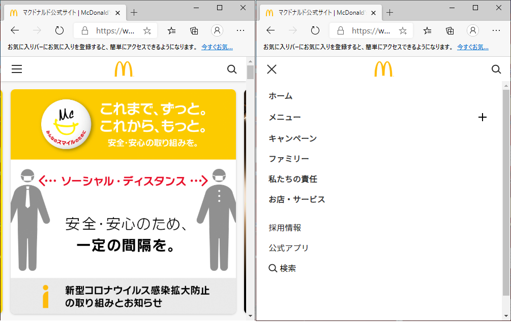
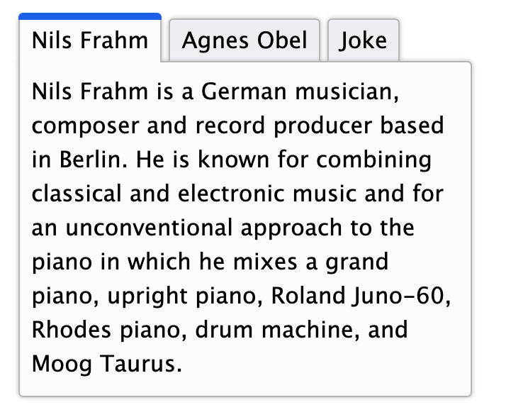
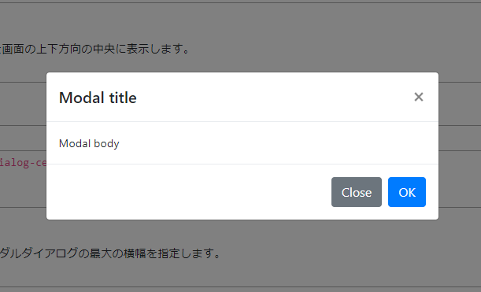
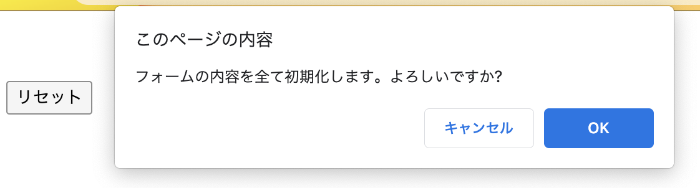

# WAI-ARIAの実践
<!-- class="hidden" のかわりに aria-hiden="true" を使ったらどうかという話。4ページも書くことがあるのかは謎。-->

4-2節ではWAI-ARIAと関連仕様についてとりあげました。この節では、実際にウェブでよく使われる部品の事例を通じて、WAI-ARIAをどのように利用するのか、その検討の過程や考え方について紹介します。より詳しい具体的なコード例については、WAI-ARIA Authoring Practices[^1]などを参照してください。

[^1]: <https://www.w3.org/TR/wai-aria-practices/>

## 事例1. ハンバーガーメニューを改良する

ボタンを押すとメニューが開く、というのはよくあるウィジェットです。特にモバイル用のページでは、メニューボタンに3本の横棒のアイコンがよく利用され、その形状から「ハンバーガーメニュー」と呼ばれます。一般的なハンバーガーメニューは、以下のような機能を持ちます。

- ユーザーがボタンを押すと、メニューが出現する
- メニューにはサイト内の主要なコンテンツへのリンクが含まれる
- メニューはコンテンツに覆いかぶさるような形で現れ、メニューが開いている間はメニューの外のコンテンツは利用できない
- メニューが出現したときに、ハンバーガーボタン自体はメニューを閉じるボタンに変化する
- 閉じるボタンを押すとメニューは消え、元の状態に戻る

<!-- サイトから借りてきたが、実際にはポンチ絵の想定 -->


ウェブ制作者にとってはおなじみのパーツですが、アクセシビリティ上の留意点がいくつかあります。深く考えずに作られたハンバーガーメニューは、たとえば以下のようなマークアップになっていることがあります。

```html
<div class="hamburgerMenu">
  <div class="button">
    <span class="menu-icon"></span>
    <span class="close-icon"></span>
  </div>
  <ul>
      <li><a href="/">ホーム</a></li>
      <!-- メニュー -->
  </ul>
</div>
```

`<div class="button">`がボタンに相当します。中に入っている2つの`span`要素は、それぞれハンバーガーアイコンと閉じるアイコンに相当し、CSSの`background-image`を使ってアイコン画像を表示します。そして、`div`に`click`イベントのイベントハンドラーを付けて動くようにします。

```JavaScript
const hamburgerMenu = document.querySelector('.hamburgerMenu');
const hamburgerMenuButton = hamburgerMenu.querySelector('.button');
hamburgerMenuButton.addEventListener('click', () => {
    hamburgerMenu.classList.toggle('js-opened');
});
```

さまざまなJavaScriptの実装方法が考えられますが、ここでは単純に、外側の`div`要素に`js-opend`クラスを付けたり外したりしています。あとは、CSSで`ul`を非表示にし、`js-opened`クラスが付いたときだけ`ul`が表示されるようにすれば、ひとまずは完成です。

これでメニューボタンは動作しますが、このメニューにはアクセシビリティ上の問題点が複数あります。ここでは、このマークアップで作成されたメニューが既に存在すると仮定して、WAI-ARIAを利用しない方法も含めて、アクセシビリティを向上していく過程の考え方を紹介します。

### キーボード操作を可能にする

このメニューの最大の問題は、キーボード操作できないことです。メニューボタンは`div`要素で実装されています。`click`イベントを付けているため、マウスでのクリックやタップには反応しますが、キーボードではこのボタンを押すことができません。そもそもフォーカスを当てることができないのです。

キーボード操作は、WCAG 2.1の達成基準2.1.1 Keyboard [^2]でも要求されているアクセシビリティ上の重要事項です。まずはこれを行えるようにする必要があります。

ちなみに、スマートフォンなどのモバイル環境では典型的にはタップ操作を行うため、キーボード操作を考慮する必要がないのではという反論も考えられます。しかし、Bluetoothキーボードを接続してキーボード操作を行うことも可能です。モバイル環境でもキーボード操作を考慮する必要があります。

[^2]: <https://www.w3.org/TR/WCAG21/#keyboard>

#### 方法1 `button`要素を使用する

WAI-ARIAを使う上で最も重要なことは、一見矛盾しますがWAI-ARIAを使わないことです。HTMLにはボタンの機能を提供する`button`要素があるのですから、ここでは`button`要素を使うべきです。

```html
<button>
  <span class="menu-icon"></span>
  <span class="close-icon"></span>
</button>
```

これだけでキーボード操作が可能になります。`role`属性も`tabindex`属性も`keypress`イベントも必要ありません。`button`要素はそれらの機能を既に備えているからです。

#### 方法2 `a`要素を使用する

お勧めはしませんが、`a`要素でもフォーカスを受け取ることはできます。`a`要素に`role=button`を指定すると、ボタンであると宣言することができます。

`role`属性の指定は単に役割を宣言するだけです。`role=button`を指定したからといって、ボタンと同じ挙動にはならないことに注意してください。

`a`要素は`button`要素とは細部の動作が異なります。たとえば、`button`要素ではフォーカスした後に<kbd>スペース</kbd>キーでボタンを押すことができますが、`a`要素ではできません。基本的には`button`要素を利用するべきです。

#### 方法3 `div`のままキーボード操作できるようにする

まったくお勧めしませんが、何らかの理由で`button`要素が利用できない場合、`div`のままキーボード操作を可能にすることも可能です。

まずは、フォーカスが当たるようにするために、`tabindex=0`を指定します。そして`role=button`を指定すると、スクリーンリーダーでも「ボタン」と読み上げられるようになります。

<!-- 望ましくない例 -->
```html
<div class="button" role="button" tabindex="0">
  <span class="menu-icon"></span>
  <span class="close-icon"></span>
</div>
```

さらに、キーボード操作に対応するために`keypress`イベントを付けます。

<!-- 望ましくない例 -->
```JavaScript
hamburgerMenuButton.addEventListener('keypress', event => {
  // Enterキーやスペースキーでボタンが押せ、かつTabキーではボタンが押されないような実装...
});
```

このイベント内では、押されたキーを判定して、<kbd>Enter</kbd>キーや<kbd>スペース</kbd>キーならばボタンが押されるように、かつ<kbd>Tab</kbd>キーなどの操作を横取りしないように実装します。

ただし、繰り返しになりますが、この方法はお勧めしません。複雑で労力がかかる上に、考慮すべきことが多数あるために、考慮漏れも生じやすくなります。基本的に`button`要素を使うべきです。

### 何のボタンかわかるようにする

ボタンを`button`要素にすると、スクリーンリーダーを使ってボタンにフォーカスを当てたときに、「ボタン」と読み上げられるようになります。ただし、これだけでは、このボタンが何をするものなのかわかりません。視覚環境であれば、ボタンにハンバーガーのアイコンが付けられていることがわかりますが、スクリーンリーダーなどの支援技術には何のボタンなのかが伝わりません。

何のボタンかわかるようにするには、ボタンにラベルを与えます。たとえば、「メニュー」というラベルを与えると、「メニュー ボタン」などと読み上げられて、何をするボタンか理解できるようになります。

ボタンにラベルを与える方法はいくつかあります。

#### 方法1 画像を`img`要素にして`alt`でテキストを指定する

ひとつは、`button`要素の中にラベルとなるテキストを追加する方法です。最もシンプルな方法は、CSSの背景画像ではなく、`img`要素で画像を指定し`alt`属性を指定する方法です。

```html
<button>
  <span class="menu-icon"></span>
  <span class="close-icon"></span>
</button>
```

このようにすると、スクリーンリーダーで読み上げられることに加え、画像が表示できないケースで代替テキストが利用されることが期待できます。通信速度の問題で画像を表示しないようにしている場合などにも活用できる可能性があるでしょう（実際に代替テキストが表示されるかどうかはブラウザーによります）。

ところで、「メニュー」や「閉じる」アイコンは意味を持つ画像コンテンツと考えられます。意味を持つ画像はアクセシビリティの観点から代替テキストが必要です（WCAG 2.1達成基準1.1.1 Non-text Content[^3]）。代替テキストを提供するシンプルな方法が`img`要素の`alt`属性です。

[^3]: <https://www.w3.org/TR/WCAG21/#non-text-content>

なお、`img`要素を用いるこの方法は、サイトの高速化を意図した「CSSスプライト」と呼ばれる技法と相性が悪いという問題はあります。最近はCSSスプライトが使われることも少なくなってきましたが、とはいえCSSの背景画像を使う実装を避けられないこともあるでしょう。その場合には他の方法を考えることもできます。

#### 方法2 スクリーンリーダー用テキストを入れる

スクリーンリーダーで読み上げさせる専用のテキストを入れる方法もあります。

```html
<button>
  <span class="visually-hidden">メニュー</span>
  <span class="menu-icon"></span>
  <span class="close-icon"></span>
</button>
```

`visually-hidden`は、視覚環境で表示されず、かつスクリーンリーダーでは読み上げられるようなスタイルを定義したクラスです。CSSフレームワークは、このようなクラスをあらかじめ用意していることがあります（クラス名はフレームワークによって異なります。他には`sr-only`などが使われることもあります）。たとえば、Bootstrap 5.0の`visually-hidden`[^4]には、以下のようなスタイルが定義されています。

[^4]: <https://github.com/twbs/bootstrap/blob/main/scss/mixins/_visually-hidden.scss>

```css
.visually-hidden {
  position: absolute !important;
  width: 1px !important;
  height: 1px !important;
  padding: 0 !important;
  margin: -1px !important;
  overflow: hidden !important;
  clip: rect(0, 0, 0, 0) !important;
  white-space: nowrap !important;
  border: 0 !important;
}
```

こうしておくと、テキストはスクリーンリーダーで読み上げられ、かつ視覚環境には影響を与えません。

#### 方法3 `aria-label`を利用する

別の選択肢として、`aria-label`属性も利用できます。

```html
<button aria-label="メニュー">
  <span class="menu-icon"></span>
  <span class="close-icon"></span>
</button>
```

このようにすると、`aria-label`に対応しているスクリーンリーダーでは「メニュー ボタン」と読み上げられることが期待できます。

しかし、この方法はCSS無効時にフォールバックテキストが存在しないという問題があります。ラベルを与えるスマートな方法ではありますが、おすすめはしません。

<!-- さすがに遠すぎると思うのでとりあえずコメントアウト -->
<!-- 
他にも、`aria-labelledby`属性や`label`要素を利用する方法も考えられますが、これらは不可視のラベルを与えるのには向きません。どこかに見えているラベルがある場合は、これらの方法を検討すると良いでしょう。なお、ボタンの外にあるテキストを`label`要素として結び付けた場合、ラベルテキストをクリックしてもボタンが反応するようになるので注意してください。
-->

#### 方法4 `aria-haspopup`を利用する

ボタンのラベルとはまた別の方法として、`aria-haspopup`属性を指定する方法もあります。

```html
<button aria-haspopup="menu">
```

こうすると、`aria-haspopup`に対応したスクリーンリーダーでは、ラベルがなくても「ボタン メニュー ポップアップ」などと読み上げられるようになります。これにより、メニューがポップアップするボタンであることは伝わるようになります。

ボタンにラベルがある場合、それもあわせて読み上げられます。「メニュー」というラベルがある場合、「メニュー ボタン メニュー ポップアップ」と読み上げられることになります。これは冗長ですので、ボタンのラベルだけで動作が十分に伝わる場合は、`aria-haspopup`を指定しないという考え方もあります。

なお、メニューを開いたときにこのボタンが閉じるボタンに変化する場合、これにあわせて`aria-haspopup`属性を削除する必要があります。メニューを閉じるボタンが「メニュー ポップアップ」と読み上げられると、混乱を招いてしまうためです。

最後に、メニューがポップアップなのかという点についてはケースバイケースと考えられます。ポップアップの場合にのみ`aria-haspopup`を使用します。

### メニューの開閉状態がわかるようにする

ここまでで、キーボード操作ができ、ボタンも「メニュー ボタン」と読み上げられるようになりました。これで、メニューボタンを利用できる最低限の条件は満たしていますが、スクリーンリーダーのユーザーにはメニューが開いたことが伝わりにくいという問題がまだ残っています。

これは、視覚的にはメニューが開いたことは一目瞭然ですが、スクリーンリーダーではそのことが伝わらないとも言うことができます。ボタンをもう一度読み上げさせても「メニュー ボタン」と読み上げられるだけですし、何度押しても状況は変わりません。今回はボタンに「メニュー」というラベルを付けましたから、メニューが開いただろうと想像はできるでしょう。しかし、実際にどこがどう変化したかはわからないのです。

現在のメニューの開閉状態がわからない、つまりメニューが開いているのか、閉じているのかがわからない問題について、対応を検討していきます。

#### 方法1 開いたメニューにフォーカスを移す

メニューを開いたことを直接伝える方法は、開いたメニューにキーボードフォーカスを移してしまうことです。メニューにはフォーカスを受け取ることのできる`a`要素が含まれていますから、先頭の`a`要素にフォーカスを移動します。こうすると、ボタンを押した直後にメニューのリンクの内容を読み上げ始めますから、メニューが開いたことは間違いなく伝わるでしょう。

先のスクリプトにあったボタンクリック時のイベントに、フォーカス移動の処理を追加します。

```JavaScript
hamburgerMenuButton.addEventListener('click', () => {
    hamburgerMenu.classList.toggle('js-opened');
    hamburgerMenu.querySelector('ul a').focus(); // この行を追加
});
```

この方法はわかりやすい反面、フォーカスを強制的に移動させてしまう点に注意が必要です。フォーカス移動が予測できなかったり、移動元と移動先が離れていて戻り方がわかりにくいような場合、ユーザーを混乱させることがあります。この例では、「メニュー」というボタンを押すと直後のメニューに移動するという挙動ですから、大きな問題はないでしょう。

なお、HTMLソースコード上で、移動元と移動先が離れている、言いかえればDOM上で親子や隣接する兄弟関係にない場合、WCAG 2達成基準1.3.2 Meaningful Sequence[^5]の問題となってくる点に留意する必要があります。

[^5]: <https://www.w3.org/TR/WCAG21/#meaningful-sequence>

#### 方法2 ボタンのラベルで状態を伝える

フォーカスを移さない場合、ボタンのラベルで現在の状態を伝えるという方法もあります。たとえば、メニューを開いたときに、JavaScriptでボタンのラベルを変更し、「メニューを閉じる」に変えるという方法です。こうすると、ボタンを再度読み上げさせれば「メニューを閉じる ボタン」と読み上げられますから、現在メニューが開いている（だから閉じることができる）と推測できるようになるでしょう。

```html
<button>
  <span class="menu-icon"></span>
  <span class="close-icon"></span>
</button>
```

ただし、これだけでは開いたメニューがページ内のどこに存在するかはわかりません。ボタンの直後にメニューがあれば大きな問題はありませんが、ボタンから離れた場所にメニューが存在する場合に、フォーカスの管理をしなければ、WCAG 2達成基準2.4.3 Focus Order[^6]の問題が生じます。その観点からも、メニューをボタンに隣接する兄弟として提供する必要があります。

[^6]: <https://www.w3.org/TR/WCAG21/#focus-order>

#### 方法3 `aria-expanded`を利用する

WAI-ARIAには開閉状態を通知する`aria-expanded`属性があります。メニューが開いたとき、`button`要素に`aria-expanded=true`を追加するようにします。

```html
<button aria-expanded="true">
```

こうすると「メニュー ボタン 開いています」などと読み上げられます。同様に、`aria-expanded=false`を指定すると「メニュー ボタン 閉じています」などと読み上げられます（「隠されました」などと読み上げるものもあります）。

ボタンのラベルだけで挙動が十分に伝わる場合は、あえて`aria-expanded`を指定しない方が簡潔になる場合もあります。たとえば、メニューが開いた時にボタンのラベル自体を変更して「メニューを閉じる」としている場合、「メニューを閉じる ボタン」だけで伝わるでしょう。「メニューを閉じる ボタン 開いています」と読み上げられても害はありませんが、冗長になります。

初期状態では`aria-expanded`属性を付けないようにしておき、開いた時だけ`aria-expanded=true`を付ける方法もあります。この場合、メニューが閉じている時は「メニュー ボタン」と読み上げられ、開いている時は「メニュー ボタン 開いています」と読み上げられるようになります。ボタンのラベルや他のARIA属性も合わせた状態で実際に読み上げさせて、ボタンの挙動が伝わるかどうかを考えて用いるとよいでしょう。

ただし、`aria-expanded`属性が何に対して開閉しているのかを明示できていないという問題が残ります。これについては、`aria-controls`属性で制御対象を明示します。

##### `aria-controls`を利用する

`aria-controls`は、制御対象の要素を伝えるWAI-ARIA属性です。典型的には`aria-expanded`属性と組み合わせて使用します。属性値には制御対象のIDを指定します。こうすることで、ボタンがメニューを制御していることを明示的に伝えることができます。

```html
<div class="hamburgerMenu">
  <button aria-expanded="true" aria-controls="menu01">
    <span class="menu-icon"></span>
  </button>
  <ul id="menu01">
      <li><a href="/">ホーム</a></li>
      <!-- メニュー -->
  </ul>
</div>
```

なお、`aria-controls`を独自に解釈するスクリーンリーダーでは、制御対象に移動できる機能が提供される場合があります。JAWSの場合、ボタンを読み上げたときにある組み合わせのキーを押すことで、メニューの`ul`要素に移動し、メニュー内のリンクを読み上げていくことができます。

<!--
編集注: これは数年前の状況。当時は対応しているのがJAWSのみで、中根さんに当時のJAWS日本語版での読み上げ内容を確認してもらったところ、このように英語で読むということだった。最新版の挙動や他の支援技術の挙動を要確認

https://github.com/w3c/aria/issues/995
では既にデフォルトでは読み上げられない状況。

に対応していないスクリーンリーダーも存在します。開いたメニューに移動する手段は他にも設けておくほうがよいでしょう。また、`aria-controls`属性に対応していても、移動した後に元いた場所に戻る手段は提供されないことが多いため、戻る手段についても考慮する必要があります。対象の要素をボタンと隣接させることができれば問題ありませんが、それができない場合、先に紹介したように、ボタンを押した際に対象にフォーカスを移動してしまうというのも一つの方法です。
-->

### メニューの裏側にフォーカスが当たらないようにする

メニューを開いたとき、視覚環境ではメニューがコンテンツに覆いかぶさり、メニューに隠れてコンテンツが画面では見えない状態になります。

しかしキーボード操作の場合、メニューが開いた状態でも背後のコンテンツにフォーカスを移せてしまう場合があります。メニューの裏側の要素にフォーカスが移ると、視覚環境のキーボードユーザーはフォーカスを見失い、混乱することがあります（なお、スクリーンリーダーのユーザーの場合、メニューが開いたままであることに気づかず、普通に利用できてしまうことが多いでしょう）。

これは、WCAG 2.1の達成基準2.4.3 Focus Orderの問題となってきます。このようなフォーカス順序の問題を避けるいくつかの方法を検討します。

#### 方法1 メニューの外の要素をすべてフォーカス不可能にする

メニューが開いたときに、メニューの外の要素をすべてフォーカス不可能にするという方法です。実装方法は複数存在します。

- メニューの外側のフォーカス可能な要素すべてに`tabindex=-1`を指定する
- メニューの外側の要素すべてを`display: none;`や`visibility: hidden`などで削除する
- メニューを`dialog`要素として実装し、`showModal()`メソッドで呼び出す

詳細な実装方法はここでは説明しません。`dialog`要素については`dialog`要素の項を参照してください。

なお、`aria-hidden`はこの目的では利用できないことに注意してください。`aria-hidden`を指定してもフォーカス移動には影響しません。スクリーンリーダーのユーザーは読み上げられない要素にフォーカスを奪われて混乱することになります。

#### 方法2 メニューの最後の要素からフォーカス移動するとき、メニューの先頭に戻す

メニューからフォーカスが外に出るのは、メニューの最後の要素からさらにフォーカス移動しようとした時です。そのタイミングで<kbd>Tab</kbd>キーの挙動をフックして、メニューの先頭に戻してしまえば、フォーカスはメニューの外に出られなくなります。

方法のひとつは、メニューの最後の要素に`keypress`イベントを付けることです。<kbd>Tab</kbd>キーが押された時に、メニューの先頭の要素にフォーカスが戻るようにします。

フォーカストラップを利用する方法もあります。たとえば、メニューの前後に`tabindex`属性を指定した`div`を挿入します。

```html
<div tabindex="0"></div>
  <ul id="menu01">
      <li><a href="/">ホーム</a></li>
      <!-- メニュー -->
  </ul>
<div tabindex="0"></div>
```

こうすると、キーボード操作でメニューの外にフォーカスを出そうとしたときに、この`div`にフォーカスが当たることになります。この`div`に`focus`イベントを付けておき、フォーカスが当たった時にフォーカスをメニューの先頭、もしくは末尾に移動します。

いずれの場合も、フォーカスが脱出不能にならないように気をつけてください。メニューを閉じるボタンが押せなくなるとキーボードトラップとなってしまいます。また、ユーザーはブラウザーのアドレスバーにフォーカスしたい場合に<kbd>Shift+Tab</kbd>キーで戻ることもあります。先頭の要素から前に戻ろうとすることは許容してもよいでしょう。

なお、スクリーンリーダーのユーザーは<kbd>Tab</kbd>キーを使用せずにフォーカスを移動できる場合もあります。また、フォーカスを移動せずに外の要素を読み上げる場合もあります。そのため、フォーカスが制御しきれない場合がありますが、スクリーンリーダーのユーザーは視覚的にフォーカスを見失っても困ることはないので、そこまで気にしないという考え方もあるでしょう。

#### 方法3 メニュー末尾からフォーカス移動しようとした場合、メニューを自動的に閉じる

上記と似ていますが、フォーカスをメニューの先頭に戻すのではなく、メニューを閉じることで解決します。メニューの最後の要素に`keypress`イベントを付けるか、フォーカストラップを利用して、メニューの外にフォーカスが出ようとした時にメニューを閉じるようにします。

メニューを閉じたときには、フォーカスを適切な場所に移動する必要があります。メニュー項目にフォーカスしたままメニューが閉じると、フォーカスが行方不明になってしまうためです。通常は、メニューを開く直前にフォーカスがあった場所、すなわちメニューボタンにフォーカスを戻すとよいでしょう。ユーザーが意図せずにメニューを閉じてしまった場合でも、開くボタンにフォーカスがあれば、またすぐに開くことができます。

## 事例2. カルーセルのライブラリを選定する

「カルーセル」（Carousel）とは、回転木馬、メリーゴーランドの意味です。ウェブでは、画像やカードなどが横に並び、左右にスライドして順繰りに表示されるようなコンポーネントを指します。スライドショーと呼ばれたり、イメージローテーターと呼ばれることもあります。

```plaintext
--+ +---+ +--
1 | | 2 | | 3
--+ +---+ +--
```

図4-4-02 左右のスライドが見切れているカルーセルの例

カルーセルにはさまざまなパターンが見られますが、一般的には以下のような機能を持ちます。

- 複数の「スライド」(slide)を持ち、順番に表示することができる。スライドには画像やカードなど、視覚的に提示される項目が含まれる
- 1度に表示するスライドは1つだけ（ただし、左右に見切れた状態で前後のスライドが表示されることはある）
- ユーザーの操作により、次のスライド、前のスライドを表示させることができる。多くの場合、カルーセル領域の左右に矢印状のボタンが表示される
- 表示されているスライドをクリックすると、そのスライドに対応するリンク先に遷移する。

また、これらに加えて以下の機能を持つケースも見られます。

- 「スライドピッカーコントロール」(Slide Picker Controls)を持つ。これはスライドが全部で何枚あり、現在表示中のものが何番目かを示すインジケータであり、インジケータ部分をクリックすると、対応するスライドを直接表示させることもできる。多くの場合、カルーセル領域の下部に、円が横に並んだ形で表示される
- ページが読み込まれると同時に自動的にカルーセルの回転が始まる
- スライドにマウスポインターが乗った場合や、キーボードフォーカスが移った場合に、カルーセルの自動回転を停止する
- 「ローテーションコントロール」(Rotation Control)を持つ。これは、カルーセルの自動回転を停止・再開できる機能で、多くの場合、オーディオ機器の一時停止・再生ボタンを模したボタンで表現される

こうしてみると、カルーセルは多数の機能を持つ複雑なものであると言えます。これらのすべてを自前で実装するのはかなり大変です。実際には、カルーセルを扱う専用のライブラリを利用するケースが多いでしょう。カルーセルのライブラリにはさまざまなものがありますが、アクセシビリティに配慮したものもあれば、そうでないものもあります。ここでは、ライブラリを選定するときに注意したいポイントを見ていくことにしましょう。

もし、すべてを自前で実装する必要がある場合は、WAI-ARIA Authoring Practicesの3.6 Carousel (Slide Show or Image Rotator)[^7]やWeb Accessibility TutorialsのCarousel[^8]を参考にするとよいでしょう。

[^7]: <https://www.w3.org/TR/wai-aria-practices/#carousel>

[^8]: <https://www.w3.org/WAI/tutorials/carousels/>

### キーボード操作が可能か

カルーセルもキーボードで操作できなければなりません。ライブラリ選定時には、動作サンプルをキーボードで実際に操作してみるとよいでしょう。特に問題になりやすいのは以下の点です。

- 現在表示されているスライドにフォーカスし、リンクを辿ることができるか
- 隠れているスライドにフォーカスがあたってしまい、フォーカスが行方不明になることはないか
- 次のスライド/前のスライドボタンにフォーカスし、操作できるか
- スライドピッカーコントロールにフォーカスし、操作できるか
- ローテーションコントロールにフォーカスし、操作できるか

キーボードフォーカスが見えなくなっていて事実上操作できないケースもよく見かけます。フォーカスが明確に見えるかどうかも確認しましょう。

#### フォーカス時の自動停止

カルーセルが自動回転する場合、スライドにフォーカスを移したタイミングでスライドが動くと、フォーカスが行方不明になることがあります。多くのカルーセル実装では、スライドにフォーカスしたときに自動回転を止めることで、これを防いでいます。

同様に、マウスポインタがスライドに乗ったときにも自動回転を止めることが一般的です。スライドをクリックする瞬間にスライドが切り替わると、意図しない遷移先に移動してしまうためです。このような配慮がなされているかどうかも確認しておきましょう。

### スクリーンリーダーで操作できるか

視覚環境だけでなく、スクリーンリーダーで問題なく操作できるかどうかを確認しましょう。

- 現在表示されているスライドが適切に読み上げられるか
- 各種のボタンにラベルが付けられているか
- 隠れているスライドが読み上げられて混乱することはないか

実装方法によっては、隠れているスライドまで読み上げられてしまうことがあります。スライドの内容によっては大きな問題がないケースもありますが、場合によっては混乱を招くこともあるので注意しましょう。自前で実装する場合は、隠れているスライドに`aria-hidden`を適用するのも一つの方法です。ただし、`aria-hidden`だけではキーボードフォーカスは当たってしまうことに注意してください。

#### 他の箇所の読み上げを妨害しないか

カルーセルが自動回転する場合、一つ重要な注意点があります。他の箇所を読み上げている場合にカルーセルの自動回転が起きたとき、どのように読み上げられるかという点です。

カルーセルのライブラリの中には、カルーセル領域をライブリージョンとして実装するものがあります。たとえば、Slick[^9]というライブラリの古いバージョンでは、以下のようにカルーセル領域に`aria-live="polite"`を指定していました。

[^9]: <https://kenwheeler.github.io/slick/>

```html
<div aria-live="polite" class="slick-list draggable">
  <!-- カルーセル領域 -->
</div>
```

カルーセルのスライドが切り替わると、その都度、内容が読み上げられます。カルーセルを手動で操作した時に読み上げられるのは問題ありませんが、ユーザーが他の場所を読んでいる場合でも、カルーセルが自動回転したタイミングで読み上げられることになります。

`aria-live=polite`の指定は、現在の読み上げに即座に割り込むのではなく、読み上げが一段落したところで割り込む指定となります。そのため理論上は、現在の読み上げは妨害されないことになっています。しかし実際には、ライブリージョンが読まれるとき、多くのスクリーンリーダーは単に内容を読み上げるだけで、それがライブリージョンであることは伝えません。ユーザーには、現在の場所と異なる場所が読まれたということがわからない場合があります。たとえば、見出しを読み上げているときにカルーセルが切り替わると、見出しのテキストに続けてそのままカルーセルの内容が読み上げられ、一続きの内容であるように聞こえます。これはユーザーを大いに混乱させることになります。

カルーセルにライブリージョンを採用しているライブラリを使わざるを得ない場合、スライドのテキストを工夫して、これがスライドであると明確にわかるようにするとよいでしょう。たとえば、テキストの頭に「【広告】」と入れるようにする、といった方法です。

カルーセルを自前で実装する場合、ライブリージョンを使う必要があるかどうかは慎重に検討してください。どうしても利用する必要がある場合は、ユーザーがカルーセル領域から離れたときに`aria-live=off`に切り替えるか、カルーセルの自動回転を止めるようにするとよいでしょう。

### ローテーションコントロールがあるか

ローテーションコントロールは、自動回転するカルーセルを停止する機能です。自動でスライドが切り替わり続けるカルーセルは多く見られますが、その一方で、スライドを停止する機能が提供されないことがあります。カルーセルが自動回転する場合、ローテーションコントロールが提供されていること、それがアクセシブルであることを確認しましょう。

WCAG 2.1の達成基準2.2.2 Pause, Stop, Hide[^10]は、動き続けるコンテンツが停止できることを求めています。これはレベルAの要求で、「非干渉」の条件にもなっている重要な基準です。WCAGへの対応が求められる場合には、この基準を必ず満たさなければなりません。

[^10]: <https://www.w3.org/TR/WCAG21/#pause-stop-hide>

## 事例3. タブのマークアップを検討する

「タブ」(Tabs)は、複数のコンテンツを切り替えて表示する機能です。典型的には、パーツ一式の上部に「タブリスト」(Tab List)があり、下部にコンテンツが入る「タブパネル」(Tab Panel)があります。タブリストの中には「タブ」(Tab)が並び、いずれかのタブを選択すると、タブパネルが対応するものに切り替わります。



図4-4-03 タブの例（WAI-ARIA Authoring Practicesより）

タブは以下のような機能を持ちます。

- 複数のタブとタブパネルから構成される。タブとタブパネルは一対一対応している。
- タブリスト内のすべてのタブは見えている状態になっており、初期状態ではいずれか一つのタブが選択されている
- タブパネルは、選択されているタブに対応したものだけが表示され、他のタブパネルは見えない
- 他のタブをクリックすると、そのタブが選択状態になり、選択したタブに対応するタブパネルが表示される。他のタブパネルは表示されなくなる。

タブがキーボード操作を受け付ける場合、以下のような操作になるのが一般的です。

- タブリストにフォーカスを移すと、選択されているタブがアクティブになる
- キーボードの左右キーを押すと、左右にある他のタブを選択することができる

キーボードの左右キーによる操作は、他のウェブコンポーネントではあまり見られない、独自のものとなっています。これは、OSが提供するタブコントロールの操作に合わせたものです。

ウェブコンテンツでは、タブのような見せ方は頻繁に使われます。実際に現場でマークアップを行う機会も多いでしょう。ここでは、タブのマークアップについていくつかのパターンを検討しながら、考え方の過程を見ていきます。

### タブのマークアップと実装

HTMLにはタブを表現する要素がありませんが、WAI-ARIAでは、タブの部品に対応するロールが用意されています。

- タブ : `tab`
- タブリスト : `tablist`
- タブパネル : `tabpanel`

各部品にこれらのロールを適用していくのですが、実際にどのようなマークアップにするべきか検討していきましょう。

#### タブ

タブはユーザーの操作の対象となる要素です。タブをクリックしたとき、タブパネルが切り替わるようにする必要があります。また、キーボードフォーカスを受け取る必要もあります。これらの機能をすべて自前で実装することも不可能ではありませんが、お勧めしません。フォーカスを受け取れる要素、`a`要素か`button`要素のいずれかを使うべきでしょう。WAI-ARIA Authoring Practicesのタブの例[^11]では`button`要素を使用していますが、`a`要素が使われることもあります。

[^11]: <https://www.w3.org/TR/wai-aria-practices/#tabpanel>

タブには `aria-controls`属性を指定して、このタブに対応するタブパネルを示すようにします。一部のスクリーンリーダーでは、対応するタブパネルにジャンプできるようになります。

`id`属性を指定しておくと、タブのラベルを`aria-labelledby`で参照できるようになります。後述のタブパネルで利用します。

また、JavaScriptで以下の属性を付けます。これらの値は、タブが切り替わったときに動的に変化する想定です。

- `aria-selected`属性 : このタブが現在選択されているかどうかを示します。選択されているタブには"true"、そうでないタブには"false"を指定します。
- `tabindex`属性 : 選択されていないタブに `tabindex=-1` を指定します。前述のように、キーボード操作ではタブにフォーカスしてから左右キーでタブを切り替える想定となるため、選択されていないタブには直接フォーカスが当たらないようにします。

タブが3つある場合、たとえば以下のようなマークアップになります。`aria-selected`と`tabindex`はJavaScriptで動的に付けられている想定です。

```html
<button type="button" role="tab" id="tab01" aria-controls="tabpanel01"
 aria-selected="true">タブその1</button>
<button type="button" role="tab" id="tab02" aria-controls="tabpanel02"
 aria-selected="false" tabindex="-1">タブその2</button>
<button type="button" role="tab" id="tab03" aria-controls="tabpanel03"
 aria-selected="false" tabindex="-1">タブその3</button>
```

タブには必ずラベルを付けるようにしてください。上記の例のように、要素の中にラベルテキストが入っていれば問題ありません。タブにテキストを持たせられないような場合は、`aria-label`でラベルを与えることを検討しましょう。タブパネルに見出しが含まれており、その見出しのテキストをそのままタブのラベルにできるならば、その見出しにIDを付けて`aria-labelledby`で参照してもよいでしょう。

#### タブリスト

タブリストは、タブが列挙される部分です。`tablist`ロールを適用しますが、どのHTML要素を採用するかは議論の余地があります。

ARIA in HTMLでは、`menu`、`ol`、`ul`、`nav`要素に`tablist`ロールが適用できることになっています。他にも、すべてのロール（Any role）が適用可能とされている要素には`tablist`ロールを適用できますので、`p`や`div`などが候補になります。なお、`dl`要素には`tablist`ロールを指定することができないため、候補にはなりません。

タブリストにはタブが複数列挙されますし、名前に「リスト」とついていますから、`ul`は有力候補です。しかし、WAI-ARIAの`tablist`ロールは`list`ロールと派生関係になく、`listitem`の親にはなれません。`ul`のロールを`tablist`に変更すると、`li`要素の`listitem`ロールが宙に浮くことになります。`li`に`tab`ロールを指定することも可能ではありますが、先に述べたように、`tab`ロールは`button`か`a`に指定したほうがよいでしょう。そうすると、`li`には`role=presentation`を指定することになります<!--（指定しなくても、ブラウザーによって同等の意味の`role=generic`に上書きされ、`listitem`ロールは失われます）-->。

`ul`を使っても、結局はリストの意味を失わせることになりますので、最初から`div`を使うという考え方も有力です。実際、WAI-ARIA Authoring Practicesのタブの例では`div`要素を使用しています。どちらが正解というわけでもなく、前後の文脈や互換性など、周辺の事情を考えて採用するとよいでしょう。後述の「タブと他の見せ方を切り替える」の項も参照してください。

<!--タブリストには、必要に応じて、`aria-label`を用いてラベルを与えてもよいでしょう。文脈によっては、タブリストに含まれるタブが何であるのか、何を切り替えるのかが伝わらない場合もあります。前後の文脈から十分に伝わるようであれば、`aria-label`は指定しなくてもよいでしょう。

```html
<div role="tablist" aria-label="XX機能の切り替え">
  <button type="button" role="tab" id="tab01" aria-controls="tabpanel01"
  aria-selected="true">タブその1</button>
  <button type="button" role="tab" id="tab02" aria-controls="tabpanel02"
  aria-selected="false" tabindex="-1">タブその2</button>
  <button type="button" role="tab" id="tab03" aria-controls="tabpanel03"
  aria-selected="false" tabindex="-1">タブその3</button>
</div>
```
-->

#### タブパネル

タブパネルは実際に表示される内容を含む部分で、`tabpanel`ロールを適用します。

`tabpanel`ロールは、ARIA in HTMLでは`section`要素に適用可能とされています<!--[^1]-->。そのほか、任意のロールを適用可能な要素で利用できますが、タブパネルの中にさまざまな要素が入る可能性を考えると`p`要素などは使いにくく、事実上`section`要素と`div`要素のどちらかになるでしょう。タブパネルの中に見出しが入ってセクションとして成立しているならば`section`要素、そうでなければ`div`要素を利用するのがよいでしょう。WAI-ARIA Authoring Practicesのタブの例では`div`要素を使用しています。

<!--
[^1]: 当初のARIA in HTMLでは`section`要素に`tabpanel`ロールを指定することは許されていませんでしたが、2016年11月の更新で可能となりました。

抜粋:: ヘイドン・ピカリング  “コーディングWebアクセシビリティ”。 Apple Books  
-->

タブから`aria-controls`で参照するために、タブパネルには`id`属性を指定します。

タブパネルをフォーカス可能にする場合、タブパネルにはラベルを付けるべきです。通常は、タブのラベルをそのまま使えるはずですので、タブにIDを付けて`aria-labelledby`で参照するとよいでしょう。タブパネルの中に見出しが含まれる場合は、見出しにIDを付けて参照してもよいでしょう。ラベルにふさわしいテキストがどこにもない場合は、`aria-label`でラベルを付けることも可能です。

タブパネルはたとえば以下のようなマークアップになります。

```html
<div tabindex="0" role="tabpanel" id="tabpanel01" aria-labelledby="tab01">
<!-- タブパネルの内容 -->
</div>
<div tabindex="0" role="tabpanel" id="tabpanel02" aria-labelledby="tab02" hidden>
<!-- タブパネルの内容 -->
</div>
<div tabindex="0" role="tabpanel" id="tabpanel03" aria-labelledby="tab03" hidden>
<!-- タブパネルの内容 -->
</div>
```

表示されていないタブパネルは、JavaScriptで`hidden`属性を指定して非表示にします。CSSの優先度によっては、`hidden`属性で要素を隠せないこともあるかもしれません。その場合は、`class`属性にクラス名を与えてCSSで非表示にしてもよいでしょう。

通常、`aria-hidden`を利用する必要はありません。非表示のタブパネルは視覚環境からも隠されるべきもので、典型的にはCSSの`display:none`を適用して、視覚環境とスクリーンリーダーの双方から隠されるようにします。演出上の都合など何らかの理由で`display:none`を適用できず、非表示のタブパネルがスクリーンリーダーで読み上げられてしまうような場合には、`aria-hidden`の利用を検討してもよいでしょう。

#### スクリプト実装

これでマークアップは完成です。あとは、JavaScriptを実装して動作するようにします。

具体的なコード例についてはWAI-ARIA Authoring Practicesに譲りますが、タブがクリックされた場合だけでなく、タブにフォーカスしたときのキーボード操作も忘れずに実装します。`keypress`イベントではカーソルキーの操作を取得できないので、`keydown`イベントと`keyup`イベントを利用することになります。

### タブと他の見せ方を切り替える

インターフェイスを導入する大きな目的の一つは、画面スペースの節約です。タブ操作によって表示を切り替える仕組みを導入することで、狭いスペース内で多くの情報を見せることができるようになります。

逆に言えば、画面スペースによっては、必ずしもタブインターフェイスが最適ではないかもしれません。たとえば、レスポンシブデザインを採用して、画面が狭い時にはタブで表現し、広い時にはすべてを展開して見せたいと考えるケースもあるでしょう。

タブインターフェイスを構成する要素は、ページ内リンクの目次と相性がよいことが知られています。タブリストは目次のリスト、タブは目次内のリンク、タブパネルはリンク先のセクションに対応します。

```html
<ul>
  <li><a href="#section01">セクション1</a></li>
  <li><a href="#section02">セクション2</a></li>
  <li><a href="#section03">セクション3</a></li>
</ul>
<section>
  <h2 id="section01">セクション1</h1>
  <p>セクション1の内容...</p>
</section>
<section>
  <h2 id="section02">セクション2</h1>
  <p>セクション2の内容...</p>
</section>
<section>
  <h2 id="section03">セクション3</h1>
  <p>セクション2の内容...</p>
</section>
```

このようなページ内リンクをタブに仕立て上げることができます。JavaScriptで`role`属性を付与して以下のようにします。

```html
<ul role="tablist">
  <li role="none"><a role="tab" href="#section01">セクション1</a></li>
  <li role="none"><a role="tab" href="#section02">セクション2</a></li>
  <li role="none"><a role="tab" href="#section03">セクション3</a></li>
</ul>
<section role="tabpanel" aria-labelledby="section01">
  <h2 id="section01">セクション1</h1>
  <p>セクション1の内容...</p>
</section>
<section role="tabpanel" aria-labelledby="section02">
  <h2 id="section02">セクション2</h1>
  <p>セクション2の内容...</p>
</section>
<section role="tabpanel" aria-labelledby="section03">
  <h2 id="section03">セクション3</h1>
  <p>セクション2の内容...</p>
</section>
```

他にも細かい属性やイベントを付ける必要がありますが、タブとして成立することはわかるでしょう。このようにすると、状況によってページ内リンクの見せ方とタブの見せ方とを切り替えることが可能になります。また、JavaScriptが動作しない環境でも、ページ内リンクとして成立させることができます。

#### タブの操作方法をあえて実装しない選択

上記の例ではページ内リンクをタブの見せ方にするだけでなく、タブ関連のロールと機能を適用して、実際にタブとして動作させることを想定しています。タブになると、キーボードでの操作方法は変化します。ページ内リンクだった場合は、<kbd>Tab</kbd>キーでリンクに次々とフォーカスしていき、希望のリンクを選択するという方法でした。タブになると、現在選択されているタブにフォーカスし、左右キーでタブを選ぶという方法になります。

この操作方法の変更は本当に必要なのでしょうか。見せ方だけ変えて操作は変えず、ロールも変えず、そのままページ内リンクとして操作させるという考え方もあります。タブを提供するコンテンツがウェブアプリケーションである場合は、デスクトップアプリケーションと同じ操作感が求められることがあります。その場合には、タブはタブとして操作できた方がよいでしょう。そうではなく、単に単に省スペースを目的としてタブの見せ方にしているだけであれば、ページ内リンクの操作方法でも問題ないことが多いでしょう。

ただし、リンクをクリックした場合の挙動には注意してください。ページ内リンクの場合、リンクをクリックすると該当箇所までスクロールし、明確に画面が変化するのが基本の動作です。しかし、タブの見せ方にした場合、リンクを押しても画面がスクロールしない場合があります。画面を拡大しているユーザーの場合、タブの部分を画面いっぱいに拡大していると、その外で起きた変化に気づかず、何が起きたかわからないことがあります。リンクを押したときに、対応する見出しにフォーカスを移すなどして対応するとよいでしょう。

## 事例4. モーダルダイアログ

「ダイアログ」(dialog)は、ウェブコンテンツの上に覆いかぶさるように出現するウィンドウ領域です。基本的には、ユーザーに対して注意を促したり、何かを入力させるために用います。ダイアログには、大きく分けて2つのモードがあります。

- 「モーダルダイアログ」(modal dialog): ダイアログが出現するとダイアログに対して操作を行うモードになり、その間、ダイアログ以外の要素を操作できなくなるもの
- 「モードレスダイアログ」(modeless dialog): ダイアログが出ても他のコンテンツを引き続き操作できるもの

モーダルダイアログの場合、他のコンテンツが操作できないことがわかるように、ダイアログの外を暗くする演出が一般的です。



図4-4-04 モーダルダイアログのイメージ図

ウェブではモードレスダイアログはあまり利用されません。他のコンテンツを引き続き操作できる場合、ダイアログではない見せ方をすることが多いでしょう。モーダルダイアログはしばしば利用されます。ここでは、モーダルダイアログの実装についていくつかの方法をとりあげ、内容を見ていくことにします。

### `window.confirm`による簡易なダイアログ

簡易なダイアログであれば、JavaScriptの機能だけで簡単に実装することができます。`window.confirm()`を利用すると、ユーザーにOKかキャンセルかの2択を問うモーダルダイアログを出すことができます。以下は、フォームをリセットする場合に警告のダイアログを出す例です。

```html
<form onreset="return confirm('フォームの内容を全て初期化します。よろしいですか?')">
    <input value="初期値">
    <button>送信</button>
    <button type="reset">リセット</button>
</form>
```

これは例えば以下のように表示されます。



ユーザーがキャンセルボタンを押した場合は`confirm()`の戻り値が`false`となり、`return false`が実行されてリセットの動作がキャンセルされる仕組みになっています。イベントハンドラー属性の項も参照してください。

このダイアログはブラウザーの機能でできているため、ダイアログの見た目を制御することができません。見た目はブラウザーによって異なりますが、ほとんどの場合は非常にシンプルな見た目になります。とはいえユーザーに対して簡潔にYes/Noを問うだけでよいシーンでは機能として十分でしょう。

### `dialog`要素によるダイアログ

HTMLには、ダイアログを表示するための`dialog`要素が用意されています。`showModal()`メソッドを呼ぶとモーダルダイアログとして呼ぶことができます。

```html
<dialog id="dialog1">
  <form method="dialog">
    <p>OKですか?</p>
    <button type="submit" value="OK">OK</button>
    <button type="submit" value="Cancel">Cancel</button>
  </form>
</dialog>
<script>
  const d = document.getElementById('dialog1');
  const dialogOpen = () =>{
      d.showModal();
      d.onclose = () => {alert (d.returnValue)};
  }
</script>
<button type="button" onclick="dialogOpen()">ダイアログを開く</button>
```

単にこれだけで、モーダルダイアログの外にある要素を暗く表示し、操作できないようにするところまで実現します。`dialog`要素にはダイアログとしてのネイティブのセマンティクスもあるため、`role`属性を追加する必要もありません。

なお、初期状態でダイアログを隠す処理も実現されていますが、単にユーザーエージェントのスタイルシートで`dialog:not([open]){display:none;}`というスタイルが与えられているだけです。より強いセレクターで`display`プロパティを上書きすると、ダイアログが表示されてしまうこともあるので注意してください。

`dialog`要素は非常に便利なのですが、残念なことに、`dialog`要素のブラウザーによるサポートはまだ不十分です。2021年8月現在、iOSとmacOSのSafariが`dialog`要素をサポートしていません[^12]。

[^12]: <https://developer.mozilla.org/ja/docs/Web/HTML/Element/dialog>

ブラウザーの種類を限定できる業務アプリでは問題なく利用できるかもしれませんが、そうでない場合、Safariでサポートされていない機能を採用することは難しいでしょう。

### WAI-ARIAを駆使した実装

`dialog`要素をサポートしないブラウザーを想定すると、他の要素とWAI-ARIAを組み合わせて自前でダイアログを実装する選択肢が現実的になります。ダイアログのマークアップは、たとえば以下のようになります。

<!-- https://w3c.github.io/aria-practices/examples/dialog-modal/dialog.html のサンプルのうち、4番目のダイアログを少しシンプルにして、DOM操作で追加される要素を入れたたもの -->
```html
<div id="dialog_layer" class="dialogs">
  <div tabindex="0"></div>
  <div id="dialog4" class="dialog"
    role="dialog"
    aria-labelledby="dialog_label"
    aria-describedby="dialog_desc"
    aria-modal="true">
    <h2 id="dialog_label">ダイアログの見出し</h2>
    <p id="dialog_desc">
      ダイアログのメッセージ...
    </p>
    <!-- その他さまざまな中身が入る -->
    <button type="button"
      id="dialog_close_button">
      
    </button>
  </div>
  <div tabindex="0"></div>
</div>
```

`div`要素に`dialog`ロールを指定して、ダイアログであることを示します。ダイアログが警告やエラーを表示する場合は、かわりに`alertdialog`ロールを指定します。

`aria-labelledby`属性で見出しを、`aria-describedby`属性でメッセージを提供しています。これにより、ダイアログにフォーカスすると、スクリーンリーダーで見出しとメッセージが読み上げられるようになります。この例ではダイアログの内部に見える形で見出しと説明文があるため、それらを利用して結びつけています。見える形のテキストラベルがない場合は、`aria-label`属性などを利用してもよいでしょう。

`aria-modal="true"`により、このダイアログがモーダルであることを示しています。`aria-modal`に対応した支援技術の場合、これだけでモーダルの外の要素を操作できないようにする場合があります。とはいえ、この処理は仕様上必須とはされておらず、対応していない支援技術もあるため、モーダルダイアログの外の要素が読まれないようにしたり、キーボードフォーカスを制御する処理の実装も必要です。
<!--
When a modal element is displayed, assistive technologies SHOULD navigate to the element unless focus has explicitly been set elsewhere. Assistive technologies MAY limit navigation to the modal element's contents. If focus moves to an element outside the modal element, assistive technologies SHOULD NOT limit navigation to the modal element.
-->

キーボードフォーカスの制御のために、ダイアログの前後に `<div tabindex="0"></div>` を挿入しています。これは、ハンバーガーメニューの事例で紹介したフォーカストラップです。JavaScriptによるDOM操作で`div`を挿入して`focus`イベントを付けておき、フォーカスをトラップする制御を行います。

モーダルダイアログの内部には、閉じるボタンを置きます。`aria-modal`を指定するとダイアログの外側にアクセスできなくなることがあるため、ダイアログを開いたボタンをトグルさせたい場合などは、ボタンが必ずダイアログの内部に来るように配慮してください。また、<kbd>Esc</kbd>キーが押されたときにダイアログが閉じるようにしておくとよいでしょう。

あとはJavaScriptで動作を制御するだけですが、コードは長くなるため、ここでは紹介しません。具体的なJavaScriptのコードやその他の細部については、WAI-ARIA Authoring Practicesのdialogの例[^13]を参考にしてください。

[^13]: <https://www.w3.org/TR/wai-aria-practices/examples/dialog-modal/dialog.html>

## 事例5. インラインSVGのアクセシビリティを担保する

SVGは、XML形式のデータでベクター形式の画像を表現する技術です。`img`要素の`src`属性でSVGファイルを参照すれば画像として扱うことができますが、HTMLの`svg`要素を利用すると、HTMLコンテンツにインラインでSVGを埋め込むことが可能になります。こうすると、JavaScriptからのDOM操作でSVGの内容も制御することができます。

このような利用法をする場合、SVGのアクセシビリティについて考える必要があります。ここでは、`svg`要素を利用してSVGをインラインで記述する場合のアクセシビリティの考慮点について見ていきます。

### `svg`要素のロール

SVGの用途は様々ですが、ウェブコンテンツでは、純粋に画像として利用するケースが多いでしょう。`img`要素でSVG画像を埋め込む代わりに、インラインの`svg`要素を利用するという使い方です。

この場合、`svg`要素のロールが`img`要素とは異なるという点に注意が必要です。SVG2の仕様[^14]、およびARIA in HTML仕様では、`svg`要素はデフォルトで`graphics-document`ロールを持つとされています。このロールはWAI-ARIA仕様ではなく、WAI-ARIA Graphics Module仕様[^15]で定義されています。

[^14]: <https://www.w3.org/TR/SVG2/struct.html#implicit-aria-semantics>

[^15]: <https://w3c.github.io/graphics-aria/#graphics-document>

`graphics-document`ロールは文書を表す`document`ロールから派生したもので、画像よりも文書に近い性質を持つものです。SVGにはテキストを含めこともでき、テキストをレイアウトして配置するような使い方も可能で、それ単独でドキュメントとして成立することもあります。つまり、`iframe`要素に近い性質を持つものと捉えられているのです。

ウェブコンテンツでSVGを利用する場合、SVGの用途を確認しましょう。単に画像として扱っている場合は、`role=img`を指定して、明示的に`img`ロールを付与するとよいでしょう。

### 画像の代替テキストと説明を提供する

意味のある画像には代替テキストを与える必要があります。`img`要素の`src`属性でSVGファイルを参照した場合には、`alt`属性で代替テキストを与えます。

`svg`要素を使ってインラインでSVGを記述した場合、`alt`属性を利用することはできません。`svg`要素には`title`属性も指定できません。<!-- svg要素に指定可能なHTMLのコア属性は https://svgwg.org/svg2-draft/struct.html#TermCoreAttribute にある。title属性はない。nu html checkerでもエラーになる。 -->

インラインSVGの場合、`svg`要素直下の`title`要素がアクセシブルな名前として利用されることになっています。

```html
<svg role="img">
  <title>図: XX会社の組織図</title>
  ...
</svg>
```

なお、`svg`要素には、`aria-label`属性や`aria-labelledby`属性を指定することが可能です。それらの属性があれば、そちらが優先されます。SVGにおけるアクセシブルな名前の算出方法については、SVG-AAM仕様の8.special Processing Requiring Additional Computation[^16]を参照してください。

[^16]: <https://w3c.github.io/svg-aam/#mapping_additional>

説明文についても同様です。`aria-describedby`属性が利用できる他、SVG内に`desc`要素があればアクセシブルな説明として利用されます。

```html
<svg role="img">
  <title>図: XX会社の組織図</title>
  <desc>XX会社の組織図です。頂点にはXX組織があり...</desc>
</svg>
```

インラインでSVGを使用するときは、画像の代替テキストと説明文をSVGの中で与えるようにしましょう。それができない場合は、`aria-label`属性や`aria-describedby`属性を利用します。

### 装飾的なSVG画像を無視させる

SVGが意味を持たない、純粋に装飾的な画像である場合は、支援技術に無視させる必要があります。`img`要素の場合は`alt=""`を指定しますが、`svg`要素の場合は`aria-hidden`属性を用います。この場合、`role`属性を指定する必要はありません。

```html
<svg aria-hidden="true">
  <!-- 純粋に装飾的な画像 -->
  ...
</svg>
```

<!-- 以下は残すなら 4-2 の aria-label の説明に入れるべきと考えます。一旦コメントアウト -->
<!--
#### 画像にありがちなアクセシビリティの問題
画像を`img`要素で表す場合は、代替テキストについては単に`alt`を考えるだけでよいのですが、前述のインラインSVGのように`img`要素でない方法で画像を表す場合、代替テキストを用意することを考える必要があります。

`alt`による代替テキストは、何らかの原因で画像が読み込めなかったときに、ブラウザー上で画像の代わりに表示されるという特性があります。代替テキストを提供する場合は、この特性と同等の挙動を実現する必要があります。

例えば、font awesomeのようなフォントアイコンで、`aria-label`属性で代替テキストの代わりにする実装を見かけることがありますが、`aria-label`はラベルであって代替テキストではありません。画面上に見えないラベルであるため、`alt`と同じ挙動にはなりません。

```html
<i class="..." aria-label="開く"></i>
```

このような手法は既存サイトの緊急避難的な改修の場合に留め、新規にサイトを構築する際は避けることが望ましいです。
-->

## テストを行う

ここまで、WAI-ARIAを利用する事例を紹介してきました。HTMLだけでアクセシビリティを担保できない場合に、WAI-ARIAを利用することで、アクセシビリティを向上できることがあります。

しかし、常にWAI-ARIAを利用するのがよいわけではありません。WAI-ARIAの実践例を多数紹介しているWAI-ARIA Authoring Practicesで、2.1節[^17]の見出しに"No ARIA is better than Bad ARIA"とあります。これはARIAを不適切に利用するくらいなら、使わない方がよいという意味です。

[^17]: <https://www.w3.org/TR/wai-aria-practices/#no_aria_better_bad_aria>

この節でも見てきたように、WAI-ARIA以外の手段のほうがよいケースや、WAI-ARIAを無理に使わなくても十分に伝わり、WAI-ARIAによる補足がむしろ冗長になるケースなどもあります。

では、WAI-ARIAの利用が適切かどうかは、どうやって判断すればよいのでしょうか。

筆者は、実際にテストしてみることがほぼ唯一の解であると考えています。

テストといっても、大掛かりなものである必要はありません。実際にスクリーンリーダーなどの支援技術を用いてアクセスしてみればよいのです。近年ではOSに標準でスクリーンリーダーの機能が搭載されていますから、それを利用するだけでもよいでしょう。

そして、もし可能であれば、普段からその支援技術を利用している当事者にアクセスしてもらって、その意見を聞くとよりよいでしょう。説明が冗長であるというような感想は、コンテンツを実装した本人からはなかなか出てこないものです。

アクセシビリティに唯一の正解はありませんが、WAI-ARIAを利用するのは、支援技術でもコンテンツにアクセスしやすくしたいという動機によるものです。当事者に支援技術で実際にコンテンツにアクセスしてもらい、フィードバックを得ることで、品質を向上できるでしょう。
